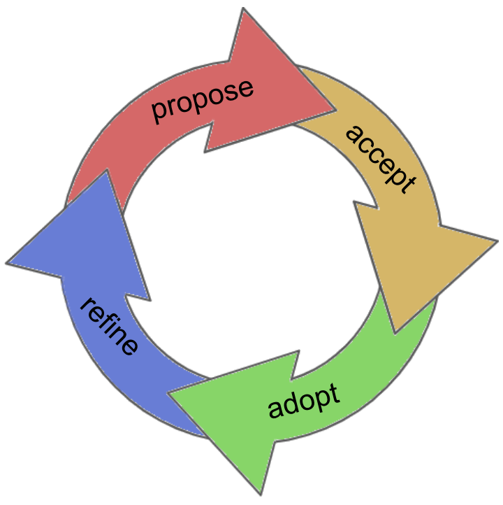

# Indy HIPE

This repo holds RFCs for the Indy project. We call them HIPEs (Hyperledger Indy
Project Enhancements, pronounced like "hype" for short). They describe important
topics ([not minor details](#when-you-need-a-hipe)) that we want to
standardize across the Indy ecosystem. There are 2 types of HIPEs:

* HIPEs that describe individual features (the [/features](./features) folder)
* HIPEs that explain concepts underpinning many features (the [/concepts](./concepts) folder)

HIPEs are for developers *building on* Indy. They don't provide guidance on how
Indy implements features internally; individual Indy repos have
design docs for that. 

HIPEs go through a standard lifecycle:

To __propose__ a HIPE, [raise a PR](#how-to-propose-a-HIPE) against this repo.

To get a HIPE __accepted__ or merged, [build consensus](#how-to-get-a-HIPE-accepted)
for your HIPE on [Rocket Chat](http://chat.hyperledger.org/#indy-agent) and in community meetings. HIPEs are merged as soon as the community
thinks they reasonably embody an idea worth standardizing. A merged
HIPE is incubating on a standards track, and is marked as such in its
status header.

To get a HIPE __adopted__, socialize and implement. Once a HIPE has momentum,
it is formally given the "adopted" status. This happens when implementations
accumulate, or when the mental model it advocates has begun to permeate our
discourse. In other words, adoption is acknowledgment of a _de facto_
standard.

To __refine__ a HIPE, propose changes to it through additional PRs. Typically
these changes are driven by experience that accumlates during or after adoption.
Minor refinements that just improve clarity can happen inline with lightweight
review. Significant refinements require a superseding document; the original HIPE is
marked __superseded__ with a forwarding hyperlink, instead of being replaced.

### When you need a HIPE

Use a HIPE if you intend to make "substantial" changes to
Indy, Indy-SDK, or the HIPE process itself. What constitutes a
"substantial" change is a judgment call.

Some changes do not require a HIPE:

- Rephrasing, reorganizing, refactoring, or otherwise "changing shape but
not meaning."
- Tweaks that strictly improve objective, numerical quality criteria
(warning removal, speedup, better platform coverage, more parallelism, trap
more errors, etc.)
- Things only likely to be noticed by other developers-of-indy,
not users-of-indy.
    
### How to propose a HIPE

#### Preparation

Before writing a HIPE, consider exploring the idea on [Rocket Chat](
http://chat.hyperledger.org/#indy-agent), on community calls (see the 
[Hyperledger Community Calendar](
https://wiki.hyperledger.org/community/calendar-public-meetings)),
or on [indy@lists.hyperledger.org](
mailto:indy@lists.hyperledger.org). Encouraging feedback from maintainers
is a good sign that you're on the right track.

#### Mechanics

  - Fork [the HIPE repo](https://github.com/hyperledger/indy-hipe).
  - Pick a folder name for your HIPE. The name should consist of a zero-padded
    4-digit number plus a descriptive name for the topic. Use lower-kebab-case
    for the descriptive name. Get the HIPE number by finding the number
    of [the most recent pull request](https://github.com/hyperledger/indy-hipe/pulls)
    and incrementing by 1. For example, if the highest numbered PR is 125, your
    HIPE number would be 126. You should end up with a folder name like
    `0026-my-cool-feature`.
  - Create the folder and copy `0000-template.md` to `text/<your folder name>/README.md`.
  - Fill in the HIPE. Put care into the details: HIPEs that do not present
    convincing motivation, demonstrate an understanding of the impact of the
    design, or are disingenuous about the drawbacks or alternatives tend to be
    poorly received. You can add supporting artifacts, such as diagrams and sample
    data, in the HIPE's folder.
  - Submit a pull request.
  
Make sure that all of your commits satisfy the [DCO requirements](
https://github.com/probot/dco#how-it-works) of the repo.
  
### How to get a HIPE accepted

After your HIPE PR is raised, the HIPE will receive feedback from the larger
community, and the author should be prepared to revise it.

When you believe that the HIPE is mature enough (feedback is resolved,
consensus is emerging, and implementation against it makes sense), propose
that the PR be merged. If maintainers agree, the HIPE will be 
accepted and move into the next phase, where adoption is the goal.

### How to get a HIPE adopted
 
An accepted HIPE is a standards-track document. It becomes an acknowledged
standard when there is evidence that the community is deriving meaningful
value from it. So:

- Implement the ideas, and find out who else is implementing.
- Socialize the ideas. Use them in other HIPEs and documentation.
- Update the agent test suite to reflect the ideas.

When you believe a HIPE is a _de facto_ standard, propose that it be given
the __adopted__ status. If the community is friendly to the idea, the doc
will enter a two-week "Final Comment Period" (FCP), after which there will
be a vote on disposition.

## License
[License]: #license

This repository is licensed under an [Apache 2 License](LICENSE).

### Contributions

Unless you explicitly state otherwise, any contribution intentionally submitted
for inclusion in the work by you, as defined in the Apache-2.0 license, shall be
dual licensed as above, without any additional terms or conditions.

### Acknowledgement

The structure and a lot of the initial language of this repository was borrowed from [Rust RFC](https://github.com/rust-lang/rfcs) .
Their good work has made the setup of this repository much quicker and better than it otherwise would have been.
If you are not familiar with the Rust community, you should check them out.