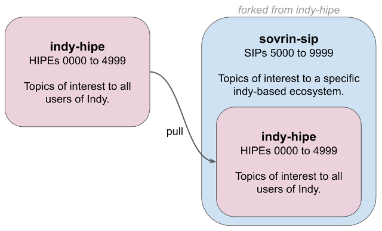

# Enhancement Proposals for Networks Built on Indy

Indy is only a technology stack; putting Indy into production on a live network
is a separate and significant effort of its own. Such work requires thoughtful
answers to questions about deployment, update rules, security hardening, policies
for how identity roles (trustee, steward, trust anchor...) will be used, and such.
These are legitimate topics for improvement proposals, but because they could be
answered differently by different groups standing up an Indy network, they don't
belong in [indy-hipe](https://github.com/hyperledger/indy-hipe).

The [Sovrin Foundation](https://sovrin.org) is an example of a group that uses
Indy technology for its network, and that has this need for supplemental
enhancement proposals that don't fit in indy-hipe. Sovrin has adopted Indy's
enhancement proposal process directly, including this document you're reading.
They've done this by [forking indy-hipe](
https://github.com/sovrin-foundation/sovrin-sip/blob/master/README-sovrin.md
). This is a one-way fork that only _pulls_ from Indy. Sovrin's SIPs are not
contributed back (not being of general Indy interest), but are simply added to
this derivative fork.

This same strategy may be used by any number of similar organizations.

To facilitate this sort of behavior, the numbering strategy for Indy HIPEs
reserves numbers >= 5000 for derivative/layered ecosystems. In this way
Indy docs and layered docs will never have merge conflicts.
