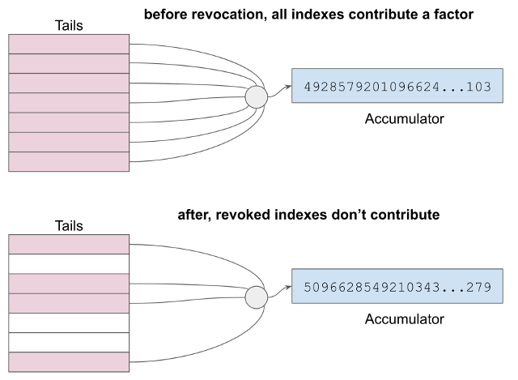

# 0011: Credential Revocation
- Author: Daniel Hardman
- Start Date: 2018-02-01 (approximate, backdated)

## Status
- Status: [ADOPTED](/README.md#hipe-lifecycle)
- Status Date: (date of first submission or last status change)
- Status Note: (explanation of current status; if adopted, 
  links to impls or derivative ideas; if superseded, link to replacement)

## Summary
Credentials in the Indy ecosystem need to be revocable by their issuers. 
Revocation needs to be straightforward and fast.
Testing of revocation needs to preserve privacy (be non-correlating), and
it should be possible to do without contacting the issuer.

## Motivation
This has obvious use cases for professional credentials being revoked for
fraud or misconduct, and for driver's licenses being revoked for criminal
activity. However, it's also important if a credential gets issued in error
(e.g., has a typo in it that misidentifies the subject). The latter case is
important even for immutable and permanent credentials such as a
birth certificate.

In addition, it seems likely that the data inside credentials will change
over time (e.g., a person's mailing address or phone number updates). This
is likely to be quite common, revocation can be used to guarantee currency
of credential data when it happens. In other words, revocation may be used
to force updated data, not just to revoke authorization.

## Tutorial
For an ultra-high-level intro, you might consider watching [this
introductory video](https://youtu.be/QsRu4ZqJpG4).

### Background: Cryptographic Accumulators

Before explaining the mechanism in detail, it's necessary to understand
__cryptographic accumulators__ at a very high level.
We will try to avoid daunting math in our explanation.

You can think of an accumulator as the product of multiplying many numbers
together. In the equation `a * b * c * d = ` __`e`__,
the accumulator would be __`e`__;
it _accumulates_ a value as each new factor is multiplied in. We could
plug in numbers; if `a`=2 and `b`=3 and `c`=5 and `d`=7, then our accumulator
__`e`__ has a value of 210. If `e` has this value, we
say that 3 is "in" `e` because it is a factor. If we want to take 3 out
of the accumulator, we divide 210 by 3 and get 70 (=2\*5\*7); 3 has now been
"removed".

Notice that you can also produce __`e`__ by multiplying any single
factor such as `a` by the product of all the other factors (`b * c * d`).
This is a useful characteristic; it means you can tell someone else
the value of `a` and _the product of all the other inputs to the accumulator,
but not the other inputs themselves_, and they can produce the output.

### Background: Tails Files

In our simple example above, we only have 4 factors, and we are using small
numbers. We are also using standard arithmetic, where you can reverse
multiplication by dividing. In such a system, the contents of an accumulator
can be reverse-engineered by simple prime factorization.

To be useful for revocation, Indy's accumulators can't be reversible; that is,
it must be the case that the only way to derive the accumulator
value is to know the factors.
We accomplish this by using modular arithmetic (where division is undefined),
and by using massive numbers for the factors and accumulators.

A __tails file__ is associated with an accumulator
and its factors. It is a binary file that contains an
array of randomly generated factors for an accumulator. Instead of small
numbers like 2 and 3 and 7, these factors are massive numbers, far too
big to display conveniently on a screen. Typically the quantity of these
numeric factors in a tails file is large--hundreds of thousands to tens of
millions.

A tails file is not secret; it is published as plain text to the world
and freely downloadable by anyone. The contents of this file never change.

Each potential or actual credential issued by a particular issuer is
assigned an index to an accumulator factor in a tails file. However,
only credentials that have not been revoked contribute to the value of the
accumulator. We will see how this works, below.

### Setup

Before revocable credentials can be issued, a number of things must be
true about the ecosystem:

1. A __schema__ for each credential type must be written to the ledger.
   For example, if companies wish to issue proof of employment, then
   a "Employee Credential" schema needs to be published. Similarly,
   before birth certificate credentials can be issued, a "Birth Certificate"
   schema needs to be defined and made available to the public. Any number
   of issuers can reference the same schema. Schemas can be versioned and
   evolved over time. Any individual or institution can write a schema
   to the ledger; it does not require special privileges.

2. Each issuer must publish on the ledger one __credential
   definition__ for each credential type they intend
   to create. The definition announces the issuer's intention to
   create credentials that match a particular schema, and specifies the
   keys that the issuer will use to sign such credentials. (The verkey+
   signing key pair used to authenticate the issuer's DID should be kept
   separate from the keys used to sign credentials, so that each key
   pair can be rotated independently; it would be bad if a sysadmin
   rotated a DID keypair and accidentally invalidated all credentials
   issued by an institution...)

3. Each issuer must also publish on the ledger a __revocation
   registry__. This metadata references a credential definition and
   specifies how revocation for that credential type will be handled.
   The revocation registry tells which cryptographic __accumulator__
   can be used to test revocation, and gives the URI and
   hash of the associated __tails file__.

4. Each issuer must publish on the ledger an accumulator value that
   describes the revocation status for all associated credentials. This
   accumulator must be updated on a periodic or as-needed basis. For
   example, if a driver's license division revokes 3 licenses during a
   given work day, then when they close their doors at 5 pm, they might
   issue a ledger transaction that updates the accumulator value for
   their driver's license credentials, removing the 3 revoked credentials
   from the accumulator. What we mean by "removing" is as described above--
   the factors listed in the tails file for the indexes associated with
   the 3 revoked credentials are no longer multiplied into the accumulator.

### How Revocation Will Be Tested

Let us now skip ahead to think about what needs to happen much later.
When a prover gives proof to a verifier, we normally think about the proof
as focusing on core information demands: _What is your birthdate?_ _Please
disclose your address_. This is __primary proof__.

But there is another dimension of proof that's also necessary: _The prover
must demonstrate that the credentials behind the primary proof have not
been revoked._ This is called __proof of non-revocation__.

In Indy, proof of non-revocation is accomplished by having provers show
that they can derive the value of the accumulator for their credential
using a factor for the accumulator that they know, plus the product of
all other factors.
The verifier can see that the prover produces the right answer (because
the answer is on the ledger), but does not know certain details of how the
prover derived it. The issuer can revoke by changing the answer to the
math problem in a way that defeats the prover.

### Preparing for Revocation at Issuance

When a credential is issued, the actual credential file is transmitted
to the holder (who will later become a prover). In addition, the issuer
communicates two other pieces of vital information:

* The index corresponding to this credential, in the tails file. This
  lets the holder look up their private factor, which we could map to
  `a` in the simple equation from the accumulator background section
  at the top of the doc.
* The product of the _other_ factors contributing to the accumulator (all
  factors except the private one for this credential).
  This value is like `b * c * d` from the simple equation above, and
  is called a __witness__.

### Presenting Proof of Non-Revocation

When the prover needs to demonstrate that her credential is not revoked,
she shows that she can provide math that derives the accumulator
value on the ledger using her private factor times the witness. She does this
without actually disclosing what her private value is; this is important
to avoid correlation.

But there is a complication: what if the accumulator has changed value
since the time the credential was issued? In this case, the private
factor times the witness will not equal the accumulator...

This is handled by requiring accumulator updates to also publish a
__witness delta__ as part of the same transaction. This delta tells provers
how to adjust their witness (referencing other indexes in the public
tails file) to bring it back into harmony with the current value of
the accumulator, such that the updated witness times the private factor
once again equals the accumulator value. If Alice is the prover, and her
witness was correct for update 21 of the accumulator, but the accumulator
has since changed to version 29, then she needs to fetch deltas 22-29, and
apply them to her witness so it is compatible with version 29 of the
accumulator.

For the technically minded, here is a bit more detail about the math.
A "witness delta" is a list of indices in the tail file that are changing
their revocation status in conjunction with the new accumulator value.
By layering all the deltas for a particular credential definition, the prover
can calculate an updated witness __`u`__ by finding the product of all of the
non-revoked entries in the tails file and excluding its own entry. The Prover
also knows its own factor, __`b`__, because it was given its entry's index in the
tails file, and can calculate `u*b = e`, where __`e`__ is the accumulator. The
Prover derives two values (in crypto terms - [commitments](
https://en.wikipedia.org/wiki/Commitment_scheme)) `C``u` and `C``b`
based on `u` and `b`, and then calculates `T` from `C``u` and `C``b`
and sends all three to the verifier. The verifier uses `e` (the accumulator from
the ledger), `C``u` and `C``b` to calculate
its own `T'` and confirms that `T` and `T'` are the same. This is a zero knowledge
proof of non-revocation. For a zero knowledge proof 101 backgrounder, please see
the notes [here](
https://github.com/afroDC/Personal/wiki/Kazui-Sako-Zero-Knowledge-Proof-101-Notes-from-IIW-26)
based on a session presented at IIW 26.

This raises the issue of timing. How does the prover know which version of
the accumulator to test against? The latest version is a natural default,
but it's highly likely that we'll want to prove, sometimes, that we had
a credential that wasn't revoked in the past (e.g., we had a driver's license
at the time of an accident, regardless of whether it's been revoked now).
This is done by expressing an acceptable timeframe (a "freshness criterion") in the proof request.
The timeframe may be open-ended on one side (e.g., "prove that your credential
was still valid any time in the past week"). The more ambitious the currency
goal ("must be true in the last millisecond"), the more burden the proof
request places on the prover and on the network in general, so best practice
would be to pick something reasonable, taking into account how often a
particular issuer updates their revocations. There is no point in asking
for up-to-the-second proof if an issuer only revokes credentials at the end
of every month.

Note, as well, that a freshness criterion may not match the date of the
accumulator. If the accumulator was last updated 6 months ago, but the
verifier wants up-to-the-minute proof of non-revocation, it is still the
6-month-old version of the accumulator that will be used. Both parties can
tell that this version is the latest version by querying the ledger.

Thus, non-revocation is proved by saying to the verifier: "I can show
you that I know a collection of factors that, when multiplied together,
produce the current value of the accumulator." (The prover demonstrates
this without revealing the factors using cryptographic commitments; that's
too deep in the math for the current discussion.) Factoring large numbers
in modulator arithmetic is not practical with brute force methods, and
revoked indexes are not "in" the accumulator--so the only way a prover
could produce such math is if she knows the index of her own credential
in the tails file, and also has enough information from published witness
deltas to combine a witness with her own factor to produce the accumulator.
In other words, she hasn't been revoked, and she can't cheat.

### Putting It All Together

This discussion has suppressed some details. The math has been simplified,
and we haven't discussed how an issuer copes with multiple tails files
and revocation registries, or why that might be desirable. However, the
broad flow of the mechanism should be apparent, and its features are
now easy to summarize:

* Issuers revoke by changing a number on the ledger. They can revoke
  as many credentials as they want in a single transaction, since
  they are just changing the answer to a math problem that either does
  or doesn't include the factors they choose. Issuers do not have to
  contact anybody--provers or verifiers--to revoke. Changes take place
  globally, the instant the accumulator update transaction appears
  on the ledger.
* Revocation is reversible.
* Provers demonstrate proof of non-revocation in a privacy-preserving
  way. They cannot be correlated by something like a credential ID or
  a tails index. This is radically different from a revocation list
  approach, which requires correlation to test.
* Verification of proof of non-revocation is extremely easy and cheap.
  No tails files are needed by verifiers, and computation is trivial.
  Proving non-revocation is somewhat more expensive for provers, but
  is also not overly complex.
* Verifiers do not need to contact issuers or consult a revocation list
  to test revocation.

## Reference
Technical details of the design are available [here](
https://github.com/hyperledger/indy-sdk/blob/23dbaac654256a50c203e97a250d68fd932609ce/doc/design/002-anoncreds/README.md). 

## Drawbacks
* Revocation adds complexity to issuance, proving, and verification.
* Revocation is not a feature of W3C's Verifiable Credentials.

## Rationale and alternatives
* Revocation lists are an obvious solution to the revocation problem. However,
  this technique does not preserve privacy, since credentials have to be presented
  in a way that they can be correlated to the revocation list. By doing so,
  credentials can also be correlated to their presenter, which defeats all the
  privacy-preserving features in Indy's underlying ZKP technology.

## Prior art
See [this paper](https://eprint.iacr.org/2008/539) by Jan Camenisch, a researcher at IBM Zurich
and a member of Sovrin's Technical Governance Board.

## Unresolved questions
- How can the size of tails files be managed so as to be a non-issue? (This would probably
involve caching, prefetch, and similar techniques. Might also involve delegation of some
aspects of non-revocation computation to a cloud agent instead of an agent on a mobile
device.)

- Similarly, how can the time of downloading a tails file be made not to offer a
  temporal correlation point?
- When will we implement revocation with type3 pairings instead of type1 pairings?