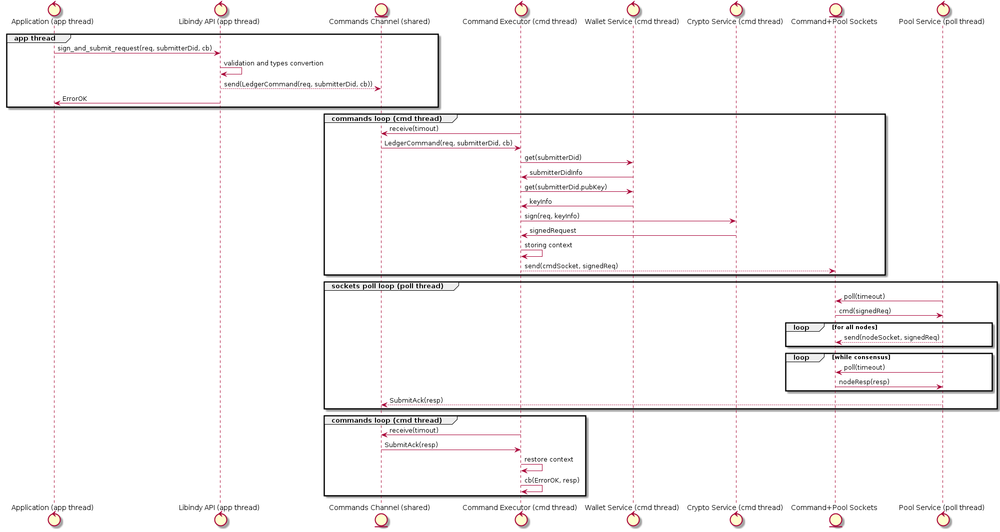

- Name: concurrency-improvement
- Author: Vyacheslav Gudkov <vyacheslav.gudkov@dsr-corporation.com>
- Start Date: 2018-05-31
- PR:
- Jira Issue:

# HIPE 0012-concurrency-improvements
[summary]: #summary

Libindy should provide better requests concurrency and performance in parallel requests
processing environment.

Note that this proposal can look a bit technical for HIPE, but some possible
options can significantly affect community and libindy developer experience.
So i suggest to discuss it this way.

# Motivation
[motivation]: #motivation

We have multiple concurrency-related problems with libindy now.

## Problem 1: Commands processing serialization

Libindy now provides asynchronous interface that gives false confidence
in a good parallelism of commands processing, but in fact we have
noticeable problems with concurrency.

Each API call causes creation of Command object that will be send for processing to single
command executor thread. API commands can cause creation of State Machine that will split
command to parts (reading wallet, doing crypto, connection to pool) and dispatch each part
processing to corresponded asynchronous executor and join results without long blocking of
command executor thread. In general this design allows to get good concurrency,
but for now the only asynchronous executor we have is Pool Service that performs
sockets polling in a dedicated thread.

Some command parts that require io-blocking or CPU-intensive crypto still executed in
command executor thread and cause blocking:

- Wallet Storage IO
- Wallet Crypto
- Signatures/Encoding Crypto
- Anoncreds Crypto
- Tails IO

The diagram below illustrates the API call processing sequence:



Some blocking ops are relatively short, but we also have blocking operations that require significant time:

- Anoncreds keys generation - 30 sec
- Revocation registry generation - 30 sec per 100000
- Witness update if performed from scratch
- Wallet import-export

Calling of ```anoncreds_generate_keys``` will cause that all concurrent operations will
be blocked for 30 sec. It can be acceptable for edge-device agents code, but seems obvious problem
for Agency and Enterprise use cases.

## Problem 2. No way for full usage of multi-core CPU

As libindy is mostly single-threaded we can’t use multiple CPU cores to achieve the maximum cpu utilization for concurrent requests. As result we can process significantly less requests and don't have simple vertical scale option.

## Problem 3. Forcing threading model

There is an opinion that libindy shouldn’t force threading model for applications as it is too low-level for this responsibility. It can be better to provide just blocking API and allow application to use different threading systems to manage concurrent requests.

# Tutorial
[tutorial]: #tutorial

After implementation of this HIPE any developer of applications in Indy infrastructure will be able to do 
the following:

- call ```anoncreds.issuer_create_and_store_credential_def()```
- After this call something less complex ```did.create_and_store_my_did()```

 ```create_and_store_my_did``` operation will be executed in parallel with ```issuer_create_and_store_credential_def``` without blocking and finished the same time as without
 complex anoncreds crypto in parallel. 

 It will allow developers of Agencies and Enterprise apps to avoid blocking of the whole backend
 on some requests without additional complexity.

# Reference
[reference]: #reference

I suggest to divide this problems solving into 2 parts/phases:

- Phase 1: Short-term
- Phase 2: Long-term

Phase 1 can be implemented quickly, but solves only most-critical part of the problem. Phase 2
solves the most of problems, it is more expensive, but still looks feasible.

## Phase 1: Short-term

- Implement usage of thread pool for the most expensive crypto.
- Make size of this pool configurable

The main idea here is provide very small libindy refactoring. Make thread pool for long crypto operations and refactor corresponded commands to be STMs similar to ledger_send command. As result long blocking command will be executed
on this thread pool and normal commands can be executed in parallel.

Pros:

- Allows to noticeable solve problem 1 and problem 2 a bit
- Very simple to implement
- Doesn’t break wrappers and apps

Cons:

- Still incomplete solution
- Doesn’t solve problem 3

## Phase 2: Long-term

In a long therm i suggest to extend Phase 1 approach with the following changes:

- Add configurable dedicated thread pool for inexpensive crypto
- Add configurable dedicated thread pool for expensive crypto
- Add dedicated thread for default wallet storage (we don't need pool as sqlite serializes queries)
- Async interface for pluggable storage (as result threading will be responsibility of storage implementation)
- All commands will be split to parts and each part will be executed on corresponded thread pool. As results
  there will be no command executor thread locking. As each thread pool will allow configuration application
  can create good threads configuration for maximum throughput and concurrency.

As managing of each command as STM will cause significant amount of boilerplate we can consider
switching to more modern async-io approach (Futures, Promises, Async/Await). For example all, internal
interfaces can return tokio.rs Future created with single-shot tokio channel message from thread pool. CommandExecutor will be tokio stream that handles composed Futures.

Pros:

- Mostly solves problem 1 and problem 2
- Can be implemented in 1.5-2 sprints
- Doesn’t break wrappers and apps

Cons:

- Significant code changes and corresponded risks
- Doesn’t solve problem 3

# Drawbacks
[drawbacks]: #drawbacks

The main drawback is that proposed solution doesn't solve Problem 3. We significantly rely
on libindy for thread management. Application will allow to configure amount of threads
and priorities, but it still can be not flexible enough.

Unfortunately all solution to Problem 3 will cause:

- Breaking changes to libindy API
- Breaking changes to API of the most wrappers
- Some wrapper (python, javascript) will be overcomplicated as they will need to provide own thread pooling solutions
- The most of applications will also be overcomplicated for the same reasons.

# Rationale and alternatives
[alternatives]: #alternatives

There are multiple alternatives:

## Alternative 1. Use multiple processes with libindy

In Akka, NodeJS and async-io world it is very common to use multiple processes for better scalability.
So we can have for example 3 parallel processes that handle usual Agency load and one process that
handles long anoncreds tasks.

Pros:

- No libindy changes can be required

Cons:

- Race-conditions related to sharing wallets between processes are possible
- Applications overcomplicating
- Doesn’t solve problem 3

## Alternative 2. Make libindy API synchronous

Make libindy API synchronous with possible long time blocking.

Pros:

- Solves problem 3
- Moves responsibility of solving problems 1 and 2 to wrappers and applications developers

Cons:

- Requires significant changes to libindy
- It will be tricky to avoid race conditions for shared resources like wallets
- It will break all existing applications and wrappers
- It will require low-level threading code for all applications.
- It is uncommon to provide blocking API for operations with unpredictable time without cancellation option
- It will require low-level threading code for NodeJS, python and may be another wrappers

## Alternative 3. Allow to start multiple Command threads

The main idea is to provide the call indy_init() -> indy_handle that will start dedicated thread with command loop. To each libindy endpoint we will add indy_handle to determine what thread should perform processing.

Pros:

- Allows to partially solve problems 1 and 2
- Changes to libindy, wrappers and applications is mostly cosmetic

Cons:

- Still possible race conditions, but they looks easier to resolve than in Alternative 1
- To get real benefits applications must be refactored deeply
- Doesn’t solve problem 3

# Prior art
[prior-art]: #prior-art

TBD

# Unresolved questions
[unresolved]: #unresolved-questions

- Alternative 2 requires detailed design