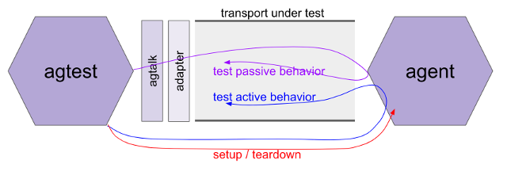

# 0015: Agent Test Suite Interface
- Author: Daniel Hardman
- Start Date: 2018-05-17

## Status
- Status: [SUPERSEDED](/README.md#hipe-lifecycle)
- Status Date: 2019-01-15
- Status Note: We implemented a different version of the test suite
interface in early 2019. That version is now (June 2019) in the `indy-agent`
repo--but the whole repo is being superseded by an Aries repo instead.

## Summary
Defines the interface (behavioral contract, mental model, procedure,
harness) of test suites that evaluate interoperability of Indy agents.

### Related HIPEs

This is a test suite __interface HIPE__. It is intended to specify
the common behavioral contract of one or more test suite __content
HIPEs__ that define actual tests. (These two types of spec are
divided so they can be versioned and standardized separately.)


## Motivation
The need for interoperability in SSI ecosystems is profound--much of the
value of SSI centers on interaction, and interaction requires different
pieces of technology to understand one another.

We will likely write multiple HIPEs that touch on aspects of agent
interaction--but implementers need an oracle against which they can
verify compliance with specs and community practice. This HIPE creates
such an oracle.

## Tutorial
### Background Concepts

An agent is a piece of technology that holds keys and operates on the
digital landscape in behalf of its owner. Agents are not shared
services; they work for a single master. Agents can be embodied in
mobile apps, daemons, hardware, enterprise service buses, and many other
form factors.

Agents interact by sending and receiving messages. They can be viewed as
black boxes--as far as any other party in the ecosystem is concerned,
their implementation details are irrelevant. Only their sending and
receiving can be observed. This suggests that message interactions are
the locus of interoperability concerns, and the major thing to evaluate
in a test suite.

How messages are _transported_ may vary by circumstances--some agents
using http, others using Bluetooth, and still others using raw sockets
or smtp or proprietary protocols. Interoperability does depend to some
extent on intersecting transports, so our test suite needs to probe
that--but we should be more interested in the format of messages, the
semantics around their sending and receiving, and the behaviors they
evoke.

The agent evaluated by a test suite is called the __tested agent__.

### Characterizing Interoperability

Some agents have very modest charters--listen for a signal and take a
single hard-coded action, maybe. Or just emit a single piece of data on
an interval. Other agents may be very rich, with sophisticated AIs and
policy engines, a broad charter, and an array of communication strategies
and partners.

Given this variety, the test suite evaluates compliance in a two-dimensional
matrix. One axis is the __mode of operation__ -- is the agent actively
initiating action, or passively listening, or both? This embodies in
agent space the human experience that many of us know, where it is
possible to speak without listening, or to understand a language
without being able to speak it. The other axis holds different __feature
clusters__ -- which functional areas does the agent target? The set of
feature clusters will likely grow over time.


Any given intersection in this matrix represents an __interop junction__.
Each junction may receive an __interop score__. The possible scores are:

  * __interoperable__: Passes all tests associated with this junction.
    Any two agents that are interoperable at a given junction should be
    able to interact freely within that junction.
  * __constrained__: Passes enough tests to enable a meaningful
    subset of interactions. The word "meaningful" is deliberately vague;
    this score always requires explanation about which subset is possible.
    Two agents that are both constrained at a junction may or may not
    find useful common ground.
  * __divergent__: Doesn't pass enough tests to have meaningful interop
    at this junction. This is the assumed or default score for all agents
    on all junctions, until proved otherwise by the test suite--and when
    results are reported, any junctions not described should be assumed
    to be divergent for that agent.

The set of all interop scores for a given agent constitutes its
__interop profile__.

### Suite Organization

The suite is divided into __feature clusters__, which are further
subdivided into active and passive subsets. Clusters are named in roughly
the same way as namespaces in familiar programming languages, such as:

```
core.active
core.passive
transports.http.active
transports.http.passive
crypto.rsa.active
```

Individual tests within a suite continue to add dot-delimited segments as
needed.

### Versioning

As mentioned in [Related HIPEs](#related-rfcs), this HIPE concerns itself
only with a test suite interface; actual test suite content is defined
separately. Each spec type--interface and content--can evolve. Versions
of HIPEs are given by HIPE number. There is no [semver](
https://semver.org)-style evolution between successive versions of either
type of test suite HIPE.

A test suite _content RFC_ should always reference its underlying test suite
_interface RFC_.

When an interop profile is reported for an agent, it should always be
accompanied by the HIPE number of the test suite content HIPE that the
was used to define the tests.

### Test Tool and Procedure

The suite will be distributed as a test application tool, `agtest`. The tool
will run on a variety of desktop platforms, but it will test a remote agent
with a host platform that is opaque; thus, the same `agtest` package should be
able to evaluate agents on all platforms that we ever build. In essence,
`agtest` is just another agent with which the tested agent must interact.

The test procedure will follow this pattern:

1. Download and/or install the tool.
2. Configure the tool so it knows about its [__harness__](#harness).
3. Launch the tool and allow it to run to completion.
4. Capture the results.

Since agents typically talk on the network, it might be reasonable to wonder
if it's necessary to download and/or install the tool. Couldn't we just build
a web site that people configure to exercise a remote agent?

The answer is yes, in theory--but such a site would not be capable of
talking to agents that use non-http transports. It would also need to be
granted privileged access to an agent development environment that may
need protecting. For this reason, `agtest` is imagined as a command-line
tool, run locally. Perhaps a GUI wrapper will be added later.

### Harness

`agtest` needs to have certain things before it can run:

   * A list of claimed features, so the tool can know which parts of
   the test matrix to explore. For example, a tested agent that
   listens but never talks proactively, that only deals with
   communication over http, and that doesn't support any encryption,
   only lists a few junctions of the matrix where tests are relevant.
   * A standard way to send and receive messages, even though the tested
    agent may use a variety of transport protocols. (See next section,
    [Transport Adapters and `agtalk`](#transport-adapters-and-agtalk).)
   * A backchannel way to ask the tested agent to initiate certain actions.
   (We cannot see what a tested agent's outbound requests look like if all
   it does is sit passively, making responses.) See 
   [Asking for Action](#asking-for-action) below.
   * A backchannel way to invoke setup and teardown logic, so tests can
   satisfy deterministic pre- and post-conditions. We don't want later
   tests to produce invalid results due to accumulated state from previous
   tests. See [Setup and Teardown](#setup-and-teardown) below.
   * A ledger that both it and the tested agent can refer to. This is
   provided by the `agtest` automatically, but must be communicated
   to the tested agent.
   
The harness can be described in config files and/or on the command line.
`agtest` will have command line help to document its configuration.

### Transport Adapters and `agtalk`

Some agents may only speak Bluetooth; others may only speak http; still
others may use IRC. Since agent communication is transport agnostic, it
is desirable to write tests once and then use them unmodified, over as
many transports as are relevant.

`agtest` will address this requirement by implementing an exceedingly
simple transport protocol of its own--`agtalk`--and by providing
pluggable adapters that recast the communication into the transport of
interest.

The agtalk transport works like this:

* To send a message, `agtest` will copy the bytes of the message into a
new file in a folder on disk that has been designated the __outbox__.
An adapter should monitor this folder, and when it sees messages arrive,
it should pick them up and send them over the adapter's target transport
(e.g., by doing an http POST with the message bytes as the body, by
sending the bytes as the body of an email message via smtp, etc).
Messages should be sent in the order that files are created in the folder.
Messages should be deleted immediately after they are sent.

* To receive a message, agtest will monitor a folder on disk that has
been designated the __inbox__. Each file that arrives there is assumed
to be an inbound message, and its bytes will be processed in the order
received. An adapter should therefore receive messages over its target
transport and save them as files to the inbox.

The agtalk transport is slow; a request~response round trip might take
a handful of seconds. It doesn't scale beyond a few messages at a time.
It lacks fancy bells and whistles. It is thus inadequate for scale or
performance testing. But it is very simple to implement and to adapt,
and it reflects a reality of agents that is core to the whole ecosystem--
we have no control over the performance or sophistication of a remote
party, and the comm channels we use may be very limited. It is thus
quite adequate for interoperability testing.

Multiple adapters will be bundled with `agtest`. Mostly, they should work
out of the box. However, some agent authors may need to either tweak an
adapter or write their own (for proprietary protocols or special
environmental constraints).



### Asking for Action

When `agtest` wants to evaluate how an agent behaves as it proactively
makes requests of others, it will invoke the `agact` script. This script
requires configuration or coding by the developers testing their agent;
it cannot work out of the box, because test suite creators can't know
the design parameters of the backchannel that `agact` uses. This is the
blue "test active behavior" line running from `agtest` to `agent` in
the diagram above.

When `agact` is invoked, it copies the desired action and parameters from
its command line. It then takes whatever action is necessary to communicate
this instruction over the backchannel, and returns 0. It does not wait for
any kind of response (that will come indirectly, as behavior is observed on
the transport under test), though it can return 1 on error to abort testing,
if the backchannel breaks.

The set of possible actions that can be taken, and their parameters,
are defined in a test suite content HIPE. All of them are opaque to `agact`--
it simply passes along instructions.

### Setup and Teardown

Two special actions are predefined by `agact`. These are `setup` and
`teardown`.

The `setup` action creates initial conditions for an agent;
for example, it may communicate a ledger configuration for the agent
to use, and ask the agent to prepopulate a wallet so certain state can
be assumed. Specifics of its parameters are defined in individual test
suite content HIPEs.

The 'teardown' action asks the agent state to be erased. It has no
parameters. 

### Agent Extensions

Fancy agents may develop pluggable extension strategies over time. Such
extensions, if present, could change how an agent behaves on certain
feature clusters (e.g., adding support for a new network transport or
a new crypto library). An agent doesn't "own" the interop profiles of
its loaded extensions, but it "borrows" them. Extensions have an interop
profile that can be proved by `agtest`, and may have an extension to the
test suite to go along with their features. They should advertise their
interop profile to host agents. Agents that load such extensions
should advertise their augmented interop profile, not just their core
features with extensions subtracted.

### Profile Data

Agents will need to query one another, in real-time, in production, to decide
if they are interoperable. This will let parties decide what sort of
interactions might be worth attempting.

The standard way to test compatibility in most computing technologies is
to ask whether a remote party supports an interface. COM, for example,
had `QueryInterface()`.
 
An agent's interop profile can provide an objective, crisp way to answer
interop questions. Such queries are encouraged as the interoperable way
to communicate about interoperability.

This leads to a definition of 2 canonical data formats. The first
is the JSON representation of an interop profile. It looks like this:

#### Interop Profile JSON

```JSON
{
  "test_suite": "<url of the HIPE defining the test suite>",
  "profile": {
      "core.passive.data_formats": "interoperable",
      "crypto.rsa.sign": "constrained (10 of 15)",
      "transport.bluetooth": "divergent"
  }
}
```

The structure is extremely simple; it just associates a test suite with
an series of key~value pairs that give results from named tests. This
example suppresses many values from the array, probably. Any test names
known to be members of the set, but not present as keys, are assumed to
have the value "divergent". This allows for sparse results.

The value for any given test name (key) is its interop score. Note the
parenthetical expression after "constrained". This is an extra, optional
enhancement. The regex for testing a valid interop score in this
data is: `(interoperable|divergent|constrained( *\(\d+\s*of\s*\d+\[^)]*\))?`

Note that the format shown here is valid as a JSON _fragment_, not just
a full JSON doc. This allows the communication of multiple profiles
in a larger, containing array, for example.

The second data format of interest is a message that can be sent to an
agent, asking it to report its interoperability profile. This message
is a specific case of the more generic `agent-metadata-request` message.
It is also JSON, and looks like:

#### Agent Metadata Request

```JSON
{
  "what": [
    { "interop-profile": <uri> }
  ]
}
```

Here, `<uri>` is the URI of a test suite content HIPE--the information that's
requested is, _Please tell me your interop profile for suite X_, where X is 
identified by URI.

Again, this is a fragment, allowing it to be put into an array of requests
that are sent as a batch (and replied to as an array/batch as well).
   
## Reference
A reference implementation of `agtest` is attached to this HIPE and
versioned with it. It should act as an oracle for any other implementations.

## Drawbacks
* Building and maintaining this capability will be expensive.
* What else?

## Rationale and alternatives
* We could have a very limited form of agent interop certification
based on written specs and self-attestations of agent developers.
This would impose less work on Indy maintainers, but would probably also
lead to:
    * Much less true interop.
    * Much fuzzier language about what an agent's capabilities are.
    * Less commitment to our agent ecosystem, as it would not differentiate
      itself from competing visions very much.
* We could ignore this problem entirely, and let interop emerge organically
without any formal way to measure it. This would probably sap momentum from
the ecosystem and fragment SSI efforts.

## Prior art
Unit tests and reference agent codebases have been created already. These
give ways to learn about compatibility by inspection, study, and automated
tests. However, it is not clear which tests and which ref agent features are
normative versus incidental.

## Unresolved questions
- What parts of the design do you expect to resolve through the HIPE process before this gets merged?
- What parts of the design do you expect to resolve through the implementation of this feature before stabilization?
- What related issues do you consider out of scope for this HIPE that could be addressed in the future independently of the solution that comes out of this HIPE?
