- Name: Anonymous Credential Protocol
- Author: Mike Lodder and Brent Zundel
- Start Date: January 25, 2019

## Status
- Status: [ADOPTED](/README.md#hipe-lifecycle)
- Status Date: implemented in mid 2018
- Status Note: implemented in libindy

## Summary

Anonymous credentials form the heart of Indy's identity capabilities.
This document describes the protocol for
[Camenisch-Lysyanskaya signatures][CL-signatures] and the anonymous credentials
they enable.

This document is a markdown-formatted version of work by Dmitry Khovratovich,
which is based on [CL signatures][CL-signatures]. The latex source used for the
equations in this version may be found [here.](supporting-docs/anoncreds.tex)

## Motivation

This HIPE is intended as a publication of the protocol behind the code that has
already been implemented in [indy-crypto][indy-crypto-github].

## Tutorial

### Introduction
#### Concept

*Anonymous credentials* allow an identity owner to prove certain properties
about their identity an uncorrelatable way without revealing other identity
details. The properties can be raw identity attributes such as a birth date or
address, or more sophisticated predicates such as "A is older than 20 years
old".

We assume three parties: *issuer*, *holder*, and *verifier*. From the functional
perspective:
* the issuer gives a credential *C* based on identity schema *X*,
which asserts certain properties 𝒫 about *X*, to the holder.
* The credential consists of attributes represented by integers
*m1, m2,..., ml*.
* The holder then presents (𝒫,*C*) to the verifier, which can verify that the
issuer has asserted property 𝒫.

#### Properties

* Credentials are *unforgeable* in the sense that no one can fool the verifier
with a credential not prepared by the issuer.

* Credentials are *unlinkable* in the sense that it is impossible to correlate
the presented credential across multiple presentations. This is implemented by
the holder *proving* with a zero-knowledge proof *that he has a credential*
rather than showing the credential. Unlinkability can be simulated by the issuer
generating a sufficient number of ordinary unrelated credentials.

Note: unlinkability may be turned off to make credentials *one-time use* so that
second and later presentations are detected.

### Generic notation

Attribute *m* is a *la*-bit unsigned integer. Technically it is
possible to support credentials with different *la*, but in Sovrin
it is set *la*=256.

### Protocol Overview

The described protocol supports anonymous credentials given to multiple holders
by various issuers, which are presented to various relying parties.

Various types of anonymous credentials can be supported. In this section, the
combination of [CL-based credentials][CL-signatures] and
[pairing-based revocation][pairing-revocation] is described.

The simplest credential lifecycle, with one credential, single issuer, holder,
and verifier is as follows:
1. Issuer determines a credential schema 𝒮: the type of cryptographic signatures
used to sign the credentials, the number *l* of attributes in a credential, the
indices *Ah ⊂ {1,2,...,l}* of hidden attributes, the public key
*Pk*, the non-revocation credential attribute number *lr*
and non-revocation public key *Pr* (Section~\ref{sec:iss-setup}).
Then he publishes it on the ledger and announces the attribute semantics.
1. Holder retrieves the credential schema from the ledger and sets the hidden
attributes.
1. Holder requests a credential from issuer. He sends hidden attributes in a
blinded form to issuer and agrees on the values of known attributes
*Ak = {1,2,...,l} \ Ah*.
1. Issuer returns a credential pair *(Cp, CNR)* to holder.
The first credential contains the requested *l* attributes. The second
credential asserts the non-revocation status of the first one. Issuer publishes
the non-revoked status of the credential on the ledger.
1. Holder approaches verifier. Verifier sends the Proof Request ℰ to holder. The
Proof Request contains the credential schema *𝒮E* and disclosure
predicates 𝒟. The predicates for attribute *m* and value *V* can be of form
*m=V*, *m<V*, or *m>V*. Some attributes may be asserted to be the same:
*mi=mj*.
1. Holder checks that the credential pair he holds satisfies the schema
*𝒮E*. He retrieves the non-revocation witness from the ledger.
1. Holder creates a proof *P* that he has a non-revoked credential satisfying
the proof request ℰ and sends it to verifier.
1. Verifier verifies the proof.

If there are multiple issuers, the holder obtains credentials from them
independently. To allow credential chaining, issuers reserve one attribute
(usually *m1*) for a secret value hidden by holder. The holder is
supposed then to set it to the same hidden value in all issued credentials.
Relying Parties require them to be the same in all credentials. A proof request
should specify the list of schemas that credentials should satisfy in.

### Schema preparation

Credentials may have limited use to only authorized holder entities called
agents. Agents can prove authorization to use a credential by the holder
including a policy address **_I_** in primary credentials as attribute
*m3*.

#### Attributes
Issuer defines the primary credential schema 𝒮 with *l* attributes
*m1,m2,..., ml* and the set of hidden
attributes *Ah ⊂ {1,2,...,l}*.

By default, *{1,3} ⊂ Ah* whereas *2 ∉ Ah*

Issuer defines the non-revocation credential  with *2* attributes
*m1,m2*.

In Sovrin:
* *Ah = {1}* and *m1* is reserved for the link secret of
the holder,
* *m2* is reserved for the context -- the enumerator for the holders,
* *m3* is reserved for the policy address **_I_**.

### Primary Credential Cryptographic Setup
In Sovrin, issuers use [CL-signatures][CL-signatures] for primary credentials.

For the CL-signature, the issuer generates:
1. Random 1536-bit primes *p',q'* such that  *p ← 2p'+1* and *q ← 2q'+1*
are also prime. Then computes *n ← pq*.
1. A random quadratic residue *S mod n*;
1. Random
![*xZ, xR1,...,xRl ∈ \[2; p'q'-1\]*](supporting-docs/Eq1.png)

Issuer computes:
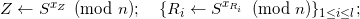

The issuer's public key is
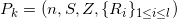
and the private key is *sk = (p, q)*.

#### Issuer Setup Correctness Proof
1. Issuer generates random
![*x~Z, x!R1,...,x~Rl ∈ \[2; p'q'-1\]*](supporting-docs/Eq4.png)
1. Computes:

    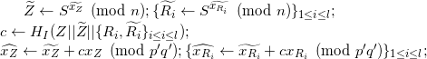

Here *HI* is the issuer-defined hash function, by default SHA2-256.

3. Proof *𝒫I* of correctness is 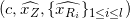

#### Non-revocation Credential Cryptographic Setup
In Sovrin, issuers use [CKS accumulators and signatures][pairing-revocation] to
track revocation status of primary credentials, although other signature types
will be supported too. Each primary credential is given an index from 1 to *L*.

The CKS accumulator is used to track revoked primary credentials, or
equivalently, their indices. The accumulator contains up to *L* indices of
credentials. If issuer has to issue more credentials, another accumulator is
prepared, and so on. Each accumulator *A* has an identifier *IA*.

Issuer chooses:
* Groups *𝔾1,𝔾2,𝔾T* of
    prime order *q*
* Type-3 pairing operation *e: 𝔾1 x 𝔾2 → 𝔾T*.
* Generators: *g* for *𝔾1*, *g'* for
    *𝔾2*.

Issuer:
1. Generates
    1. Random 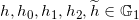
    1. Random 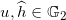
    1. Random *sk, x (mod q)*.
1. Computes 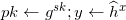

The revocation public key is
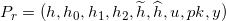 and the secret key is *(x,sk)*.

##### New Accumulator Setup
To create a new accumulator *A*, issuer:
1. Generates random *γ (mod q)*.
1. Computes
   1. 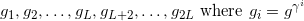
   1. 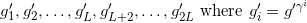
   1. 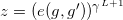
1. Set *V ← ∅, acc ← 1*

The accumulator public key is *Pa = z* and secret key is *γ*.

Issuer publishes *(Pa,V)* on the ledger.
The accumulator identifier is *IDa = z*.

### Issuance of Credentials

#### Holder Setup

Holder:
* Loads credential schema *𝒮*.
* Sets hidden attributes *{ mi }{i ∈ Ah}*.
* Establishes a connection with issuer and gets nonce *n0* either
from issuer or as a precomputed value. Holder is known to issuer with identifier
 *ℋ*.

Holder prepares data for primary credential:
1. Generate random 3152-bit *v'*.
1. Generate random 593-bit *{m̃i}{i ∈ Ah}*,
and random 3488-bit *ṽ'*.
1. Compute, taking *S,Z,Ri* from *Pk*:

    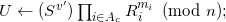

1. Compute

    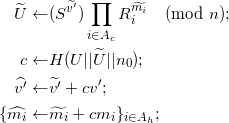

1. Generate random 80-bit nonce *n1*
1. Send to the issuer:

    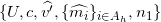

Holder prepares for non-revocation credential:
1. Load issuer's revocation key *PR* and generate
random *s'Rmod q*.
1. Compute *UR ← h2s'R*
taking *h2* from *PR*.
1. Send *UR* to the issuer.

##### Issuer Proof of Setup Correctness
To verify the proof *𝒫i* of correctness, holder computes:

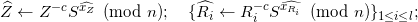

and verifies 

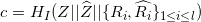

#### Primary Credential Issuance
Issuer verifies the correctness of holder's input:
1. Compute

    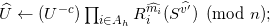

1. Verify
*c = H( U || Û || n0 )*
1. Verify that *v̂'* is a 673-bit number,
*{m̂i r̂i}i ∈ 𝒜c* are 594-bit numbers.

Issuer prepares the credential:
1. Assigns index *i<L* to holder, which is one of not yet taken indices for the
issuer's current accumulator *A*. Compute *m2← H(i||ℋ)* and store
information about holder and the value *i* in a local database.
1. Set, possibly in agreement with holder, the values of disclosed attributes,
i.e. with indices from *Ak*.
1. Generate random 2724-bit number *v''* with most significant bit equal 1 and
random prime *e* such that
*2596≤ e ≤ 2596 + 2119*
1. Compute

    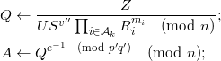
1. Generate random *r < p'q'*;
1. Compute

    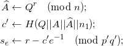
1. Send the primary pre-credential
*( {mi}i ∈ Ak, A, e, v'', se, c' )*
to the holder.

#### Non-Revocation Credential Issuance

Issuer:
1. Generate random numbers *s'', c mod q*.
1. Take *m2* from the primary
credential he is preparing for holder.
1. Take *A* as the accumulator value for which index *i* was taken. Retrieve
current set of non-revoked indices *V*.
1. Compute:

    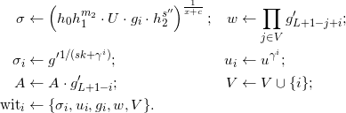
1. Send the non-revocation pre-credential
*( IA, σ, c, s'', witi, gi, gi', i )*
to holder.
1.  Publish updated *V, A* on the ledger.

#### Storing Credentials
Holder works with the primary pre-credential:
1. Compute *v ← v'+v''*.
1. Verify *e* is prime and satisfies
*2596≤ e ≤ 2596 + 2119*
1. Compute

    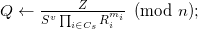
1. Verify *Q = Ae mod n*
1. Compute

*Â ← Ac' + se * emod n*

1. Verify *c' = H( Q || A || Â || n2 ).*
1. Store **primary credential**
*Cp = ( { mi }i ∈ Cs, A, e, v )*.

Holder takes the non-revocation pre-credential
*( IA, σ, c, s'', witi, gi, gi', i)*
computes *sR ← s'+s''* and stores the non-revocation credential
*CNR ← ( IA, σ, c, s, witi, gi,*
*gi', i)*.

#### Non revocation proof of correctness
Holder computes:

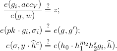

### Revocation
Issuer identifies a credential to be revoked in the database and retrieves its
index *i*, the  accumulator value *A*, and valid index set *V*. Then he
proceeds:
1. Set *V ← V \ {i}*;
1. Compute *A ← A/g'L+1-i*
1. Publish *{V,A}*.
    
### Presentation

#### Proof Request

Verifier sends a proof request, where it specifies the ordered set of *d*
credential schemas *{ 𝒮1, 𝒮2, ..., 𝒮d }*,
so that the holder should provide a set of *d* credential pairs
*( Cp, CNR )* that correspond to these schemas.

Let credentials in these schemas contain *X* attributes in total.
Suppose that the request is made:
* to reveal *x1* attributes,
* to prove *x2* equalities *mi = mj*
(from possibly distinct schemas)
* to prove *x3* predicates of form  *mi > ≥ ≤ < z*.

Then effectively *X - x1* attributes remain hidden (denoted
*Ah*), which form *x4 = (X - x1*
*- x2)* equivalence classes.
* Let ϕ map *Ah* to *{ 1, 2, ..., x4 }* according to this
equivalence.
* Let *Av* denote the set of indices of *x1* attributes
that are disclosed.

The proof request also specifies *Ah, ϕ, Av* and the set
𝒟 of predicates. Along with a proof request, the verifier also generates and
sends an 80-bit nonce *n1*.

#### Proof Preparation
Holder prepares all credential pairs
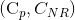 to submit:
1. Generates *x4* random 592-bit values *$ỹ1,*
*ỹ2,...,ỹx4* and set 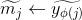
for 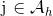.
1. Create empty sets 𝓣 and 𝓒.
1. For all credential pairs 
execute [Proof Preparation](#proof-preparation).
1. Executes [hashing](#hashing) once.
1. For all credential pairs 
execute [Final Preparation](#final-preparation).
1. Executes [Final Preparation](#final-preparation) once.

Verifier:
1. For all credential pairs 
executes [Verification](#verification).
1. Executes [final hashing](#final-hashing) once.

##### Non-revocation proof
Holder:
1. Load issuer's public revocation key
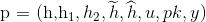.
1. Load the non-revocation credential
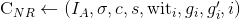;
1. Obtain recent *V, acc* (from verifier, Sovrin link, or elsewhere).
1. Update 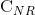:

    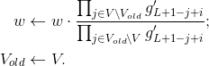

    Here *Vold* is taken from  witi and updated there.

1. Select random 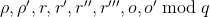;
1. Compute

    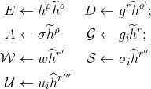

    and adds these values to 𝓒.

1. Compute

    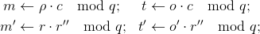

    and adds these values to 𝓒.

1. Generate random 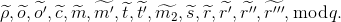

1. Compute

    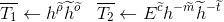

    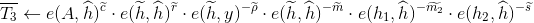

    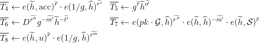

    and add these values to 𝓣.

##### Validity proof
Holder:
1. Generate a random 592-bit number
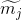 for each
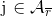.
1. For each credential 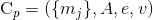
and issuer's public key 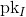:
   1. Choose random 3152-bit r.
   1. Take 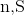 from
    compute

        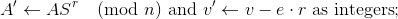

        and add to 𝓒.

   1. Compute 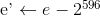.
   1. Generate random 456-bit number 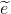.
   1. Generate random 3748-bit number 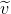.
   1. Compute

    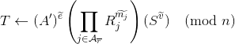

    and add to 𝓣.

1. Load *Z,S* from issuer's public key.
1. For each predicate *p* where the operator * is one of
.
   1. Calculate  such that:

        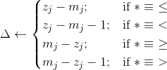

   1. Calculate *a* such that:

        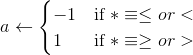

   1. Find (possibly by exhaustive search)
   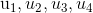 such that:

   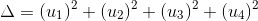

   1. Generate random 2128-bit numbers
   .

   1. Compute

    
    and add these values to 𝓒 in the order
    .

   1. Generate random 592-bit numbers
   .

   1. Generate random 672-bit numbers
   .

   1. Generate random 2787-bit number
   

   1. Compute

    

    and add these values to 𝓣 in the order
    .

##### Hashing

Holder computes challenge hash

and sends *cH* to verifier.

##### Final preparation
Holder:
1. For non-revocation credential *CNR* compute:

    

    and add them to 𝓧.

1. For primary credential *Cp* compute:

    

    The values  are the *sub-proof* for credential
    *Cp*.

1. For each predicate *p* compute:

    

    The values  are the *sub-proof* for
    predicate *p*.

##### Sending
Holder sends (*c*,𝓧, *{PrC}*, *{Prp}*, 𝓒)  to the
verifier.

#### Verification
For the credential pair (*Cp, CNR*), verifier retrieves
relevant variables from 𝓧, *{PrC}*, *{Prp}*, 𝓒.

##### Non-revocation check
 
Verifier computes:

and adds these values to .

##### Validity
Verifier uses all issuer public key  involved
into the credential generation and  the received
. He also uses revealed
. He initiates
 as an empty set.

1. For each credential *Cp*, take each sub-proof *PrC* and
compute:

    

    Add  to
    .

1. For each predicate *p*:

    

    

   1. Using *Prp* and 𝓒 compute

    

    and add these values to
     in the order
    .

##### Final hashing
1. Verifier computes

    

1. If  output VERIFIED else
FAIL.

### A Note About Encoding Attributes
The above protocol shows how a credential issuer may sign an array of attributes,
which are defined as 256-bit integers. In order for the protocol to be used for
credentials that contain attributes which are not integers, such as strings, it
is necessary to encode those attributes as integers.

The current implementation of Indy-SDK allows for two types of values as
attributes in credentials: integers and strings. The integers are used as is.
The strings are hashed using SHA-256, and the resulting 256-bit integers are
signed. While the protocol described in this paper is sufficient to prove that
the integer presented to a verifier is the same one that an issuer signed, it is
left to Indy-SDK to prove that the strings presented to a verifier, when hashed
using SHA-256, are the same as the 256-bit integers which the issuer signed.

## Reference
* [Indy-Crypto library][indy-crypto-github]
* [Camenisch-Lysyanskaya Signatures][CL-signatures]
* [Parirings-based Revocation][pairing-revocation]

[indy-crypto-github]: (https://github.com/hyperledger/indy-crypto/tree/master/libindy-crypto/src/cl)
[CL-signatures]: (https://groups.csail.mit.edu/cis/pubs/lysyanskaya/cl02b.pdf)
[pairing-revocation]: (https://eprint.iacr.org/2008/539.pdf)

## Drawbacks

One drawback to this approach is that the signatures for the primary
credential are RSA-based. This results in keys and proofs that are much
larger than other signature schemes would require for similar levels of
expected security.

Another drawback is that revocation is handled using a different, elliptic-curve
based signature that allows the use of the more-efficient set-membership
proofs and accumulators required by that part of the protocol.

This dual-credential model provides all of the functionality required by
the protocol, but uses two different signature schemes to accomplish it,
one of which is based in outdated technology that requires very large
keys and proofs. Using two signature types results in a more unwieldy
protocol.

## Rationale and alternatives

As this protocol is describes the current implementation, rationale and
alternatives point necessarily to potential future work.

The dual-credential model is not ideal, so possible future anonymous credential
schemes should strive to find a data structure and proof scheme that meets the
required characteristics of selective disclosure of attributes, predicate
proofs, and set membership proofs. It is outside of the scope of this document
to speculate on what form those structures and proofs may take.

## Prior art

It is the understanding of the authors that few production quality
implementations of anonymous credential signature schemes exist.

Two implementations we are aware of are Idemix, implemented by IBM, and IRMA,
implemented by The Privacy by Design Foundation.

## Unresolved questions

This protocol is already implemented in indy-crypto.
