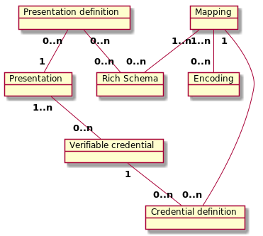

# 0120: Rich Schema Objects Common
- Author: Alexander Shcherbakov <alexander.shcherbakov@evernym.com>, Brent Zundel <brent.zundel@evernym.com>, Ken Ebert <ken@sovrin.org> 
- Start Date: 2020-02-05

## Status
- Status: [PROPOSED](/README.md#hipe-lifecycle)
- Status Date: 2020-02-05
- Status Note: 

## Summary

A low-level description of the components of an anonymous credential ecosystem that supports rich schemas,
W3C Verifiable Credentials and Presentations, and correspondingly rich presentation requests. 

Please see [0119: Rich Schema Objects](https://github.com/hyperledger/indy-hipe/tree/master/text/0119-rich-schemas) 
for high-level description.

This HIPE provides more low-level description of Rich Schema objects defining how they are identified and referenced.
It also defines a general template and common part for all Rich Schema objects. 

## Motivation

Please see [0119: Rich Schema Objects](https://github.com/hyperledger/indy-hipe/tree/master/text/0119-rich-schemas)
for use cases and high-level description of why Rich Schemas are needed.

This HIPE serves as a low-level design of common parts between all Rich Schema objects, and can help developers to 
properly implement Rich Schema transactions on the Ledger and the corresponding client API. 

## Tutorial: General Principles

By Rich Schema objects we mean all objects related to Rich Schema concept
(Context, Rich Schema, Encoding, Mapping, Credential Definition, Presentation Definition)

Let's discuss a number of items common for all Rich Schema objects

### Indy and Aries
The complete architecture for every Rich Schema object involves three separate
repositories:
- `indy-node`: The code run by a validator node participating in an
instance of the indy ledger, e.g., the validators node in the Sovrin
network run `indy-node`. Changes to this code will enable a Rich Schema object
to be written to and retrieved from an instance of indy node.
- `indy-vdr`: code which a client may use to communicate with
validator nodes in an indy network. Changes to this code will enable
a Rich Schema object write and read requests to be sent to validator nodes. 
`indy-vdr` complies with the interface described by the
`aries-data-registry-interface` and is built to plug in to the aries
ecosystem.
- `aries-dri`: This is the location of the `aries-data-registy-interface`.
Changes to this code will enable users of any data registry with an
`aries-dri`-compatible data manager to handle Rich Schema objects.

Only changes to the indy repositories are described here. For a description
of the changes to aries, please see
[Aries RFCs](https://github.com/hyperledger/aries-rfcs).


### Immutability of Rich Schema Objects

The following Rich Schema objects are immutable:
- Context
- Rich Schema
- Encoding
- Mapping

The following Rich Schema objects can be mutable:
- Credential Definition
- Presentation Definition

Credential Definition and Presentation Definition should be immutable in most of the cases,
but some applications may consider them as mutable objects.

Credential Definition can be considered as a mutable object since the Issuer may rotate
keys present there.
However, rotation of Issuer's keys should be done carefully as it will invalidate all
credentials issued for this key.

Presentation Definition can be considered as a mutable object since restrictions to Issuers, Schemas and 
Credential Definitions to be used in proof may evolve. 
For example, Issuer's key for a given Credential Definition may be compromised, so 
Presentation Definition can be updated to exclude this Credential Definition from the list
of recommended ones. 

Please note, that Indy Ledger has configurable auth rules which allow to have restrictions on mutability of particular objects, so that
it can be up to applications and network administrators to decide if Credential Definition and Presentation Definition 
are mutable. 

### Identification of Rich Schema Objects

- Every Rich Schema object is identified by a unique ID
- DID can be used as the ID.
    - The id-string of the DID is the base58 representation of the SHA2-256 hash of the canonical form
 of the `content` field (see [How Rich Schema objects are stored on the Ledger](#how-rich-schema-objects-are-stored-on-the-ledger).
 The canonicalization scheme we recommend is the IETF draft 
 [JSON Canonicalization Scheme (JCS).](https://tools.ietf.org/id/draft-rundgren-json-canonicalization-scheme-16.html) 
- There can be additional metadata (aliases) that can identify Rich Schema objects on the ledger 
in a more user-friendly way.
For Indy the following pair must uniquely identify any Rich Schema object:
   - rs_name 
   - rs_version
   - rs_type 
- Issuer's or Endorser's DID is not part of metadata, which means that Rich Schema objects of a given type
must be unique among all Issuers and Endorsers.      

The suggested Identification scheme allows to have a unique Identifier for any Rich Schema object. 
DID's method name (for example `did:sov`) allows to identify Rich Schema objects with equal content within different 
data registries (ledgers).   

### Referencing Rich Schema Objects
- Any Rich Schema object is referenced by other Rich Schema objects by its ID (DID).
- A Rich Schema object may reference a Rich Schema object from another ledger (as defined by DID's method name).

### Relationship
- A credential definition refers to a single mapping object
- A mapping object refers to a single schema object
- If there is no existent single schema to be referenced by a mapping object,
a new schema must be created potentially referencing or extending existing ones.
- Each attribute in a schema may be included in the mapping one or more times (it is possible to encode a single attribute 
in multiple ways). A mapping may map only a subset of the attributes of a schema.
- A presentation definition refers to 1 or more schema, mapping or credential definition objects.
 A presentation definition may use only a subset of the attributes of a schema.  



### Usage of JSON-LD
The following Rich Schema objects must be in JSON-LD format:
- Schema
- Mapping 
- Presentation Definition

Context object can also be in JSON-LD format.


If a Rich Schema object is a JSON-LD object, the `content`'s `@id` field must be equal to the `id`.

The only thing that we currently expect from json-ld processing is substitution of attributes by a fully-qualified ones.
We may assume that contexts belonging to the current ledger only
are resolved.
We are not going to resolve other Indy Ledger's contexts, other blockchain's contexts, and Internet contexts.


### How Rich Schema objects are stored on the Ledger

Any write request for Rich Schema object has the same fields:
```
'id': <Rich Schema object's ID>                # DID string 
'content': <Rich Schema object as JSON-LD>     # JSON-serialized string
'rsName': <rich schema object name>            # string
'rsVersion': <rich schema object version>      # string
'rsType': <rich schema object type>            # integer
'ver': <format version>                        # integer                              
```
- `id` is a unique ID (for example a DID with a id-string being base58 representation of the SHA2-256 hash of the `content` field)
- The `content` field here contains a Rich Schema object in JSON-LD format (see [0119: Rich Schema Objects](https://github.com/hyperledger/indy-hipe/tree/master/text/0119-rich-schemas)).
It's passed and stored as-is.
The `content` field must be serialized in the canonical form. The canonicalization scheme we recommend is the IETF draft 
 [JSON Canonicalization Scheme (JCS).](https://tools.ietf.org/id/draft-rundgren-json-canonicalization-scheme-16.html)
- `metadata` contains additional fields which can be used for human-readable identification    
- `ver` defines the version of the format. It defines what fields and metadata are there, how `id` is generated, what hash function is used there, etc. 
- Author's and Endorser's DIDs are also passed as a common metadata fields for any Request. 

If a Rich Schema object is a JSON-LD object, the `content`'s `@id` field must be equal to the `id`.

### Rich Schema objects as DID DOCs

We may support storing of Rich Schema objects as DID DOCsn once DID DOC is supported in Indy and DID DOC format is finalized by W3C. 
There are at least two options how it can be done:
-  Resolving of a Rich Schema by a DID will transform Rich Schema as it's stored on the ledger to a DID DOC compatible form.
    - As this transformation doesn't live on the State,
 querying from a single node only will not work due to lack of state proofs, and such requests would always fall to consensus 
 (F+1 equal replies)
        
- Add additional entry in state for every Rich Schema object with a value compatible to DID DOC specification.
The value from the state will be in replies to resolving of a Rich Schema by a DID (as a generic DID resolving approach).

   - Querying from a single node only will be possible due to a presence of state proofs (and BLS signatures).
   - A migration script or some other way to transform all existing Rich Schema objects to DID DOCs will be required.  


### Querying Rich Schema objects from the Ledger
- Any Rich Schema object can be get from the Ledger by its ID (DID).
- It should be possible to get Rich Schema objects by metadata as well: `(rsName, rsVersion, rsType)`.
- Currently it's supposed that every Rich Schema object is queried individually, so it's up to clients and applications
to get, query and cache all dependent Rich Schema objects.
- We may support resolving a Rich Schema object by the DID as a DID DOC object in a standard way once DID DOC is supported in Indy.

The following information is returned from the Ledger in a reply for any get request of a Rich Schema object:
```
'id': <Rich Schema object's ID>              # DID string 
'content': <Rich Schema object as JSON-LD>   # JSON-serialized string
'rsName': <rich schema object name>          # string
'rsVersion': <rich schema object version>    # string
'rsType': <rich schema object type>          # integer
'ver': <format version>                      # integer
'from': <author DID>,                        # DID string
'endorser': <endorser DID>,                  # DID string
```

Common fields such as state proof are also returned as for any reply for a get request. 

### Common validation for all Rich Schema objects on the Ledger
- If the object is supposed to be immutable: 
  - Make sure that no object with the given ID exist on the ledger
  - Make sure that no object with the `(rsName, rsVersion, rsType)` exist on the ledger
- If DID is expected as an ID:
    - Check that ID DID's id-string is the base58 representation of the SHA2-256 hash of the `content` field.  
- There can be additional validation logic depending on the Rich Schema object type such as 
  - Checking that referenced objects are present on the ledger. This validation can be tricky in case of objects belonging to other ledgers.
  - Checking that the content is valid (as a JSON-LD, or content's specific fields and types) 

### Aries Data Registry Interface

We can have a unified API to write and read Rich Schema objects from a Data Registry.
Just two methods are sufficient to handle all Rich Schema types:
- `write_rich_schema_object`
- `read_rich_schema_object_request`

### Indy VDR API

Indy VDR methods for adding and retrieving Rich Schema objects from the ledger 
comply with the interface described in [Aries Data Registry Interface](#aries-data-registry-interface). This means we define two external-facing methods:

These external methods will use internal methods which follow the common pattern for
 methods in Indy-SDK that interact with the ledger.
  
We can have a unified internal API to write and read Rich Schema objects from the Indy Ledger.
Just three internal methods are sufficient to handle all Rich Schema types:

- `indy_build_rich_schema_object_request`
- `indy_build_get_schema_object_by_id_request`
- `indy_build_get_schema_object_by_metadata_request`

## Tutorial: Common data structure 

### Aries Data Registry Interface

##### write_rich_schema_object
```
Writes a Rich Schema object to the ledger.

#Params
submitter: information about submitter
data: {
    id: Rich Schema object's ID (as a DID for example),
    content: Rich Schema object as JSON-LD string,
    rs_name: Rich Schema object name
    rs_version: Rich Schema object version
    rs_type: Rich schema object type
    ver: the version of the generic object template
},
registry: identifier for the registry

#Returns
registry_response: result as json,
error: {
    code: aries common error code,
    description:  aries common error description
}
```

##### read_rich_schema_object
```
Reads a Rich Schema object from the ledger.

#Params
submitter (optional): information about submitter
data: {
    id: Rich Schema object's ID (as a DID for example),
    ver: the version of the generic object template
},
registry: identifier for the registry

#Returns
registry_response: result as json,
error: {
    code: aries common error code,
    description:  aries common error description
}
```

### Indy VDR internal API 

##### indy_build_rich_schema_object_request
```
Builds a request to store a Rich Schema Object of the given type. 

#Params
command_handle: command handle to map callback to execution environment.
submitter_did: Identifier (DID) of the transaction author as base58-encoded string.
               Actual request sender may differ if Endorser is used (look at `indy_append_request_endorser`)
id: Rich Schema object's ID (as a DID for example),
content: Rich Schema object as JSON-LD string,
rs_name: Rich Schema object name
rs_version: Rich Schema object version
rs_type: Rich schema object type
ver: the version of the generic object template
}
cb: Callback that takes command result as parameter.

#Returns
Request result as json.

#Errors
Common*
```

##### indy_build_get_schema_object_by_id_request
```
Builds a request to get a Rich Schema Object of the given type. 

#Params
command_handle: command handle to map callback to execution environment.
submitter_did: (Optional) DID of the read request sender (if not provided then default Libindy DID will be used).
id: Rich Schema object's ID as a DID,
}
cb: Callback that takes command result as parameter.

#Returns
Request result as json.

#Errors
Common*
```

##### indy_build_get_schema_object_by_metadata_request
```
Builds a request to get a Rich Schema Object of the given type. 

#Params
command_handle: command handle to map callback to execution environment.
submitter_did: (Optional) DID of the read request sender (if not provided then default Libindy DID will be used).
rs_type: Rich Schema object's type enum
rs_name: Rich Schema object's name,
rs_version: Rich Schema object's version,
}
cb: Callback that takes command result as parameter.

#Returns
Request result as json.

#Errors
Common*
```

### Common template for all write requests for Rich Schema objects 
Every write request for Rich Schema objects follows the 
[Common write request structure](https://github.com/hyperledger/indy-node/blob/master/docs/source/requests.md#common-write-request-structure)
 and has the following form:
```
{
    'operation': {
        'type': <request type>,
        'ver': <operation version' # integer
                 
        'id': <Rich Schema object's ID>                # DID string 
        'content': <Rich Schema object as JSON-LD>     # JSON-serialized string
        'rsName': <rich schema object name>            # string
        'rsVersion': <rich schema object version>      # string
        'rsType': <rich schema object type>            # integer
    },
    
     # Common fields:
    'identifier': <author DID>,
    'endorser': <endorser DID>, 
    'reqId': <req_id unique integer>,
    'protocolVersion': <protocol version>,
    'signature': <signature_value>,
    'taaAcceptance': <taa acceptance fields>
}
```

### Common template for all read requests for Rich Schema objects 
Every read request for Rich Schema objects follows the 
[Common read request structure](https://github.com/hyperledger/indy-node/blob/master/docs/source/requests.md#common-request-structure).

There are two generic requests to get any Rich Schema objects: `GET_RICH_SCHEMA_OBJECT_BY_ID` and `GET_RICH_SCHEMA_OBJECT_BY_METADATA`: 
```
{
    'operation': {
        'type': GET_RICH_SCHEMA_OBJECT_BY_ID,
        'id': <Rich Schema object's ID>  # DID string 
    },
    
     # Common fields:
    'identifier': <any DID>,
    'reqId': <req_id unique integer>,
    'protocolVersion': <protocol version>,
}
```

```
{
    'operation': {
        'type': GET_RICH_SCHEMA_OBJECT_BY_METADATA,
        'rsName': <rich schema object name>        # string
        'rsVersion': <rich schema object version>  # string
        'rsType': <rich schema object type>        # integer
    },
    
     # Common fields:
    'identifier': <any DID>,
    'reqId': <req_id unique integer>,
    'protocolVersion': <protocol version>,
}
```

### Common template for all Rich Schema objects transactions on the Ledger 
Every Rich Schema object transaction follows the 
[Common transaction structure](https://github.com/hyperledger/indy-node/blob/master/docs/source/transactions.md#common-structure)
 and has the following form:
```
    'ver': <txn version>,
    'txn': {
        'type': <Rich Schema object type as in Request>,
        'protocolVersion': <protocol version>,

        'data': {
            'ver': <Rich Schema object format version>,
            'id': <Rich Schema object's ID>                # DID string 
            'content': <Rich Schema object as JSON-LD>     # JSON-serialized string
            'rsName': <rich schema object name>            # string
            'rsVersion': <rich schema object version>      # string
            'rsType': <rich schema object type>            # integer
        },

        'metadata': {
            'from': <author DID>,
            'endorser': <endorser DID>, 
            ..... # other metadata
        },
    },
    'txnMetadata': {
        ....
    },
    'reqSignature': {
        ....
    }
```

  
### Common template for any Rich Schema object representation in State
Any Rich Schema object is stored in a Patricia Merkle Trie State as key-value pairs.

There are two entries (key-value pairs) associated with every Rich Schema object:
- `id` : `value` 
- `rsType:rsName:rsVersion` : `id`

where
- `id` is a Rich Schema object ID (DID) as `id` field in request
-  is a unique marker for Rich Schema object type
- `rsName`, `rsVersion` and `rsType` are Rich Schema object name, version and type metadata fields (as the corresponding fields in the request)
- `value` has the following form:
    ```
        {
            'id': <Rich Schema object ID>                # DID string 
            'content': <Rich Schema object as JSON-LD>   # JSON-serialized string
            'rsName': <rich schema object name>          # string
            'rsVersion': <rich schema object version>    # string
            'rsType': <rich schema object type>          # integer
            'from': <author DID>,                        # DID string
            'endorser': <endorser DID>,                  # DID string
            'ver': <operation version>                   # integer
        }
    ```
### Common template for Reply to Rich Schema object requests

Reply to write requests for Rich Schema objects follows the 
[Common reply structure for write requests](https://github.com/hyperledger/indy-node/blob/master/docs/source/requests.md#reply-structure-for-write-requests)

Reply to read requests for Rich Schema objects follows the 
[Common reply structure for read requests](https://github.com/hyperledger/indy-node/blob/master/docs/source/requests.md#reply-structure-for-read-requests)
and has the following form:
```
{
    'op': 'REPLY', 
    'result': {
        'data': {
            'id': <Rich Schema object's ID>                # DID string 
            'content': <Rich Schema object as JSON-LD>     # JSON-serialized string
            'rsName': <rich schema object name>            # string
            'rsVersion': <rich schema object version>      # string
            'rsType': <rich schema object type>            # integer
            'from': <author DID>,                          # DID string
            'endorser': <endorser DID>,                    # DID string
            'ver': <operation version>                     # integer
        }
        'state_proof': <state proof and BLS aggregated signature>
        'seqNo': <seq no in ledger>,
        'txnTime': <txn write time>,
        
        # fields from the read request  
        ....
    }
}
```


## Reference
- [0119: Rich Schema Objects](https://github.com/hyperledger/indy-hipe/tree/master/text/0119-rich-schemas) 
- [Common write request structure](https://github.com/hyperledger/indy-node/blob/master/docs/source/requests.md#common-write-request-structure)
- [Common read request structure](https://github.com/hyperledger/indy-node/blob/master/docs/source/requests.md#common-request-structure)
- [Common transaction structure](https://github.com/hyperledger/indy-node/blob/master/docs/source/transactions.md#common-structure)
- [Common reply structure for write requests](https://github.com/hyperledger/indy-node/blob/master/docs/source/requests.md#reply-structure-for-write-requests)
- [Common reply structure for read requests](https://github.com/hyperledger/indy-node/blob/master/docs/source/requests.md#reply-structure-for-read-requests)

## Drawbacks

Rich schema objects introduce more complexity.

Implementing an Indy-Node ledger transaction for schema in a way that follows the existing methodology 
may increase the existing technical debt that is found in those libraries.

## Rationale and alternatives

#### Rich Schema object ID
The following options on how a Rich Schema object can be identified exist:
- DID unique for each Rich Schema
- DID URL with the origin (issuer's) DID as a base
- DID URL with a unique (not issuer-related) DID as a base
- UUID or other unique ID

UUID doesn't provide global resolvability. We can not say what ledger the Rich Schema object belongs to 
by looking at the UUID.

DID and DID URL give persistence, global resolvability and decentralization.
We can resolve the DID and understand what ledger the Rich Schema object belongs to.
Also we can see that the object with the same id-string on different ledger is the same object (if id-string is calculated
against a canonicalized hash of the content).  

However, Rich Schema's DIDs don't have cryptographic verifiability property of common DIDs,
so this is a DID not associated with keys in general case.
This DID belongs neither to person nor organization nor thing.

Using Issuer's DID (origin DID) as a base for DID URL may be too Indy-specific as other ledgers may not have
an Issuer DID. Also it links a Rich Schema object to the Issuer belonging to a particular ledger. 

So, we are proposing to use a unique DID for each Rich Schema object as it gives more natural way to identify 
an entity in the distributed ledger world.  


#### Rich Schema object as DID DOC
If Rich Schema objects are identified by a unique DID, then a natural question is whether each Rich Schema object 
needs to be presented as a DID DOC and resolved by a DID in a generic way.

We are not requiring to define Rich Schema objects as DID DOCs for now. We may re-consider this in future once DID DOC format
is finalized.

## Unresolved questions
- We are not defining Rich Schema objects as DID DOCs for now. We may re-consider this in future once DID DOC format
is finalized.
- Whether we should extend DID to be a standard for Rich Schema object IDs.
- Whether the proposed way to make a Canonicalization form of a content to be used for DID's id-string generation is good enough. 


