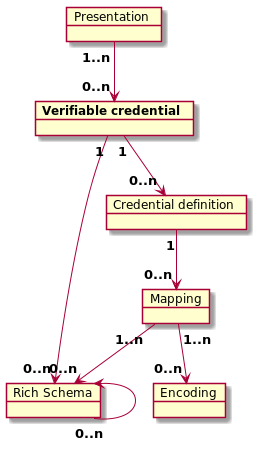

# Indy HIPE 0160: W3C Compatible Verifiable Credentials
- Authors: Alexander Shcherbakov <alexander.shcherbakov@evernym.com>, Brent Zundel <brent.zundel@evernym.com>, Ken Ebert <ken@sovrin.org> 
- Start Date: 2020-03-19

## Status
- Status: [PROPOSED](/README.md#hipe-lifecycle)
- Status Date: 2019-03-19
- Status Note: just proposed


## Summary
[summary]: #summary

A new JSON-LD  format for anonymous (zero-knowledge proof based) verifiable credentials in Indy 
compatible with W3C Verifiable Credential standard. 
It's developed in the context of Rich Schema feature. 

Despite being compatible with W3C, Indy credentials have a number of explicit assumptions about the content and cardinality for 
some of W3C Verifiable Credential properties. 


## Motivation
[motivation]: #motivation

### Standards Compliance
The W3C Verifiable Claims Working Group (VCWG) will soon be releasing a
verifiable credential data model. This proposal brings the format of
Indy's anonymous credentials and presentations into compliance with that
standard.

### Interoperability
Compliance with the VCWG data model introduces the possibility of
interoperability with other credentials that also comply with the
standard. The verifiable credential data model specification is limited to
defining the data structure of verifiable credentials and presentations.
This includes defining extension points, such as "proof" or
"credentialStatus."


## Tutorial
[tutorial]: #tutorial

The proposed credential format follows the W3C specification supporting the extension for zero-knowledge proof:
- [Basic Attrubutes](https://w3c.github.io/vc-data-model/#basic-concepts)
- [Zero-knowledge proof example](https://w3c.github.io/vc-data-model/#zero-knowledge-proofs)

Although in general Indy Credential follows and compatible with W3C Verifiable Credential specification,
there is a number of items where Indy Credentials are very explicit (see the next two sections).

### Properties
Any Indy credential compatible with W3C standard MUST have the following properties:

#### @context 
JSON-LD Context. The value MUST be an ordered set where 
 - the first item MUST be a URI with the value `https://www.w3.org/2018/credentials/v1`.
 - other items MAY be `@id` of contexts used by the corresponding Rich Schema and Mapping 
 (see [Rich Schema Context](https://github.com/hyperledger/indy-hipe/tree/master/text/0149-rich-schema-schema#context)).


#### @id
 A unique ID of the verifiable credential.
 
 DID MAY be used as the ID.
 In this case the id-string of the DID SHOULD be the base58 representation of the SHA2-256 hash of the canonical form
 of the credential JSON (without the `@id` field).
 The canonicalization scheme we recommend is the IETF draft 
 [JSON Canonicalization Scheme (JCS)](https://tools.ietf.org/id/draft-rundgren-json-canonicalization-scheme-16.html). 
  

#### @type
A type of the Verifiable Credential.
It MUST be an unordered set consisting of the following two values:
- `VerifiableCredential` which is a type common for all W3C verifiable Credentials (see `https://www.w3.org/2018/credentials/v1` context).
- `@id` of a Rich Schema the credential is created against. 

A credential  MUST be created against one and only one Rich Schema 
(see [Relationship between Rich Schema objects](https://github.com/hyperledger/indy-hipe/tree/master/text/0120-rich-schemas-common#relationship)). 

#### credentialSchema
Specifies the Credential Definition the credential is created against.
The Credential Definition and the corresponding Mapping
MUST reference the same Rich Schema as specified in the credential's `@type`.

`credentialSchema` has two nested properties:
- `id` equal to the Credential Definition's ID;
- `type` equal to the Credential Definition's type; `cdf` is the only supported value now.

A credential MUST be created against one and only one Credential Definition 
(see [Relationship between Rich Schema objects](https://github.com/hyperledger/indy-hipe/tree/master/text/0120-rich-schemas-common#relationship)). 


#### issuer
A DID of the issuer who is the author of the Credential Definition on the Ledger.

If the Credential Definition transaction was endorsed to the Ledger by a different party, then 
the `issuer` property must point to the real transaction's author (`identifier` or `from` field), not 
the endorser (`endorser` field). 

#### issuanceDate
The value of the `issuanceDate` property MUST be a string value of an 
[RFC3339](https://w3c.github.io/vc-data-model/#bib-rfc3339) combined date and time string
representing the date and time the credential becomes valid, which could be a date and time
in the future. Note that this value represents the earliest point in time
at which the information associated with the `credentialSubject` property becomes valid.

 
#### credentialSubject
The value contains an unordered list of (nested) attributes and the corresponding values. 
The set of attributes MUST match the one defined by the Mapping object.

The value of attributes there are 'raw' values according to the attribute's semantic and type defined
by the corresponding Rich Schema.

The integer representation of the values required by CL (Camenisch-Lysyanskaya) ZKP signature type
and used in the `proof` property 
is defined by the Encoding objects from the corresponding Mapping.  
 
#### proof
An issuer's ZKP signature that can be used to derive verifiable presentations
that present information contained in the original verifiable credential in zero-knowledge.
 
The `proof` MUST contain a `type` property defining a type of the used ZKP math. 
Currently the `type` MUST be equal to either `CL` or `CL2` for Camenisch-Lysyanskaya (Anoncreds 1.0) and
Camenisch-Lysyanskaya 2.0 (Anoncreds 2.0) math correspondingly.  
The corresponding Credential Definition specified in `credentialSchema` property MUST 
have the same value in its `signatureType` property as in the proof's `type`.  
 
Other properties in the `proof` are type-specific and used by the crypto layer only.
End users should not have any assumptions sbout the fields and should not try to parse them.   
 
### Rules and Assumptions
A summary of explicit assumptions for W3C compatible verifiable credentials in Indy: 

- Indy supports zero-knowledge based credentials only. 
 The only supported zero-knowledge signature type for now is Camenisch-Lysyanskaya signature
  (either version 1.0 or 2.0).

- Any credential must be issued against one and only one Rich Schema object. 
If there is no existent single schema to be used for the issuance of a credential,
a new schema must be created potentially referencing or extending existing ones.

- The `id` of the credential's Rich Schema must be specified in the `@type` property in addition to the common `VerifiableCredential`.

- Any credential must be issued against one and only one Credential Definition object, which, in turn,
must reference one and only one Mapping and Rich Schema objects.
The corresponding Mapping object must reference one and only one Rich Schema object.
The same Rich Schema object must be referenced by the credential, corresponding Credential Definition and Mapping.   

- The `id` of the credential's Credential Definition must be specified in the `credentialSchema`'s `id` property.

- Indy credentials use DIDs for identification and referencing. 
In particular, the following values are expected to be a DID:
  - Rich Schema's Contexts (part of `@context` property)
  - Credential's `@id` (`@id` property)
  - Rich Schema's `id` (part of `@type`)
  - Credential Definition's `id` (`credentialSchema`'s `id` property)
  - Issuer (`issuer` property)

- If the `id` of a credential or a rich schema object is defined as a DID, then the corresponding
DID's id-string should be the base58 representation of the SHA2-256 hash of the canonical form
 of the credential or rich schema `content`'s JSON.
 The canonicalization scheme we recommend is the IETF draft 
 [JSON Canonicalization Scheme (JCS)](https://tools.ietf.org/id/draft-rundgren-json-canonicalization-scheme-16.html).

- The set of attributes in `credentialSubject` must match the one defined by the Mapping object.
  
- Currently Indy supports only the following values for some of the `type` properties:
  - The `proof`'s `type` must be equal to either `CL` or `CL2` for Camenisch-Lysyanskaya (Anoncreds 1.0) and
Camenisch-Lysyanskaya 2.0 (Anoncreds 2.0) math correspondingly.
  - The `credentialSchema`'s `type` must be equal to `cdf`.     

The following diagram summarizes the relationship between W3C compatible verifiable credentilas in Indy and
the corresponding Rich Schema objects: 




### Example
Let's consider a **Rich Schema** object with the following `content`: 
```
{
    "@id": "did:sov:4e9F8ZmxuvDqRiqqY29x6dx9oU4qwFTkPbDpWtwGbdUsrCD",
    "@context": "did:sov:2f9F8ZmxuvDqRiqqY29x6dx9oU4qwFTkPbDpWtwGbdUsrCD",
    "@type": "rdfs:Class",
    "rdfs:comment": "ISO18013 International Driver License",
    "rdfs:label": "Driver License",
    "rdfs:subClassOf": {
        "@id": "sch:Thing"
    },
    "driver": "Driver",
    "dateOfIssue": "Date",
    "dateOfExpiry": "Date",
    "issuingAuthority": "Text",
    "licenseNumber": "Text",
    "categoriesOfVehicles": {
        "vehicleType": "Text",
        "dateOfIssue": "Date",
        "dateOfExpiry": "Date",
        "restrictions": "Text",
    },
    "administrativeNumber": "Text"
```

Let's consider the corresponding **Mapping** object with the following `content`:
```
    '@id': "did:sov:5e9F8ZmxuvDqRiqqY29x6dx9oU4qwFTkPbDpWtwGbdUsrCD",
    '@context': "did:sov:2f9F8ZmxuvDqRiqqY29x6dx9oU4qwFTkPbDpWtwGbdUsrCD",
    '@type': "rdfs:Class",
    "schema": "did:sov:4e9F8ZmxuvDqRiqqY29x6dx9oU4qwFTkPbDpWtwGbdUsrCD",
    "attribuites" : {
        "driver": [{
            "enc": "did:sov:1x9F8ZmxuvDqRiqqY29x6dx9oU4qwFTkPbDpWtwGbdUsrCD",
            "rank": 5
        }],
        "dateOfIssue": [{
            "enc": "did:sov:2x9F8ZmxuvDqRiqqY29x6dx9oU4qwFTkPbDpWtwGbdUsrCD",
            "rank": 4
        }],
        "issuingAuthority": [{
            "enc": "did:sov:3x9F8ZmxuvDqRiqqY29x6dx9oU4qwFTkPbDpWtwGbdUsrCD",
            "rank": 3
        }],
        "licenseNumber": [
            {
                "enc": "did:sov:4x9F8ZmxuvDqRiqqY29x6dx9oU4qwFTkPbDpWtwGbdUsrCD",
                "rank": 1
            },
            {
                "enc": "did:sov:5x9F8ZmxuvDqRiqqY29x6dx9oU4qwFTkPbDpWtwGbdUsrCD",
                "rank": 2
            },
        ],
        "categoriesOfVehicles": {
            "vehicleType": [{
                "enc": "did:sov:6x9F8ZmxuvDqRiqqY29x6dx9oU4qwFTkPbDpWtwGbdUsrCD",
                "rank": 6
            }],
            "dateOfIssue": [{
             "enc": "did:sov:7x9F8ZmxuvDqRiqqY29x6dx9oU4qwFTkPbDpWtwGbdUsrCD",
                "rank": 7
            }],
        },
        "administrativeNumber": [{
            "enc": "did:sov:8x9F8ZmxuvDqRiqqY29x6dx9oU4qwFTkPbDpWtwGbdUsrCD",
            "rank": 8
        }]
    }
```
Finally, let's consider the corresponding **Credential Definition** object with `id=did:sov:9F9F8ZmxuvDqRiqqY29x6dx9oU4qwFTkPbDpWtwGbdUsrCD` 
and the following `content`:
```
"signatureType": "CL",
"mapping": "did:sov:5e9F8ZmxuvDqRiqqY29x6dx9oU4qwFTkPbDpWtwGbdUsrCD",
"schema": "did:sov:4e9F8ZmxuvDqRiqqY29x6dx9oU4qwFTkPbDpWtwGbdUsrCD",
"publicKey": {
    "primary": "...",
    "revocation": "..."
}
```

Then the corresponding **W3C Credential** for CL signature scheme may look as follows: 
```
{
  "@context": [
    "did:sov:2f9F8ZmxuvDqRiqqY29x6dx9oU4qwFTkPbDpWtwGbdUsrCD",
    "https://www.w3.org/2018/credentials/v1"
  ]
  "@id": "did:sov:zWFF7g7SetGfaUVCn8U9d62oDYrUJLuUtcy619",
  "@type": ["VerifiableCredential", "did:sov:4e9F8ZmxuvDqRiqqY29x6dx9oU4qwFTkPbDpWtwGbdUsrCD"],
  "credentialSchema": {
    "id": "id:sov:9F9F8ZmxuvDqRiqqY29x6dx9oU4qwFTkPbDpWtwGbdUsrCD",
    "type": "cdf"
  },
  "issuer": "did:sov:Wz4eUg7SetGfaUVCn8U9d62oDYrUJLuUtcy619",
  "issuanceDate": "2020-03-01T19:23:24Z",
  "credentialSubject": {
    "driver": "Jane Doe",
    "dateOfIssue": "2020-03-01",
    "issuingAuthority": "State of Utah",
    "licenseNumber": "ABC1234",
    "categoriesOfVehicles": {
      "vehicleType": "passenger",
      "dateOfIssue": "2018-06-03",
    },
    "administrativeNumber": "1234"
  },
  "proof": {
    "type": "CL2",
    "signature": "8eGWSiTiWtEA8WnBwX4T259STpxpRKuk...kpFnikqqSP3GMW7mVxC4chxFhVs",
    "signatureCorrectnessProof": "SNQbW3u1QV5q89qhxA1xyVqFa6jCrKwv...dsRypyuGGK3RhhBUvH1tPEL8orH",
    "revocationData": "...."
  }
}
```

Let's consider every field in details:
- `@content` points to two contexts: one common for all W3C Credentials,
 and one used by the corresponding Rich Schema and Mapping objects.
 - `@id` is a unique DID of the credential.
 - `@type` is an array of two values: common for all W3C Credentils `VerifiableCredential` type 
 (see `https://www.w3.org/2018/credentials/v1` context), and ID of a Rich Schema the credential is created against.
 - `credentialSchema` points to the corresponding Credential Definition. 
 `cdf` is the type of Credential Definition object among Rich Schema objects.
 -  `issuer` has a DID of the issuer who is the author of the Credential Definition on the Ledger.
 - `issuanceDate`is the date of the issuance.
 - `credentialSubject` contains a list of (nested) attributes and the corresponding values. The set of attributes 
 matches the one defined by the Mapping object.
 -  `proof` contains a ZKP signature (of `CL2` type in this example). The content is specific to the signature type 
 and should not be parsed by applications. 

### Indy Node API
As Indy credentials are never stored on the Ledger, no changes in `indy-node` repository are required 
besides a general Rich Schema support (see [Rich Schema Objects Common](https://github.com/hyperledger/indy-hipe/tree/master/text/0120-rich-schemas-common)).

### Indy VDR API
As Indy credentials are never stored on the Ledger, no changes in `indy-vdr` repository are required 
besides a general Rich Schema support (see [Rich Schema Objects Common](https://github.com/hyperledger/indy-hipe/tree/master/text/0120-rich-schemas-common)).

### Indy Credx API

The W3C and Rich Schema compatible protocol will be implemented in `indy-credx` under the following assumptions:
- `indy-credx` already has a set of API calls for credential issuance and proof presentation protocols. 
These calls work with the "old" (non-W3C-compatible) credential format and the "old" (non-Rich) Schema objects. 
- W3C and Rich Schema compatible protocols will be implemented as a set of new API calls.
- The new W3C compatible API calls can be almost the same as for the current ("old") approach
 since issuance and presentation protocols are not changed. However, there is the following difference:
  - The expected format of credentials and presentations is the W3C compatible one.
  - All calls expect Rich Schema objects instead of "old" Schema objects.
  - The encoding of claim's attributes to integers is done according to the Encoding objects specified by the corresponding Mapping object.
- The new W3C compatible API calls have `w3c` prefix to be distinguished from non-W3C ("old") ones. 
      
#### Compatiblity with non-W3C credentials
The compatibility between "old" format of credentials and schemas and a "new" W3C one is **not** 
assumed on libindy layer. It means that
  - W3C compatible versions of issuance and presentation protocols will work with Rich Schema objects only.
  - W3C compatible presentation definitions (proof requests) expect W3C presentations, so that only W3C 
  compatible credentials can be used to generate a presentation.
  - We assume that on libindy level non-W3C compatible proof requests ("old" proof requests) will work with non-W3C compatible
  credentials only. Applications using libindy can, in theory, use W3C compatible credentials with "old" proof requests,
  but this is out-of-scope for the current HIPE.

|               | W3C compatible credentials | Non-W3C compatible credentials |
| ------------- | ------------- | --- |
| **W3C compatible proof request**  | Yes  | No  |
| **Non-W3C compatible proof request**  | No  | Yes |
  

  

#### Relationship with Rich Schema
libindy API will have the following assumptions:
- W3C compatible credentials will work with Rich Schema objects only.
- Non-W3C compatible ("old") credentials will work with the "old" Schema only.

Applications using libindy can, in theory, use Rich Schema for non-W3C compatible credentials,
  but this is out-of-scope for the current HIPE.  

|               | W3C compatible credentials | Non-W3C compatible credentials |
| ------------- | ------------- | --- |
| **Rich Schema**  | Yes  | No  |
| **Old Schema**  | No  | Yes |
  
#### Relationship with Anoncreds version   
Both W3C compatible and non-W3C compatible issuance and presentation protocols can work with either Anoncreds 1.0 (`CL`)
math or Anoncreds 2.0 (`CL2`) math, so that Anoncreds math version is orthogonal to the Schema and credentials format.
 - Anoncreds 1.0 is already working with the Old Schema approach.
 - Both Anoncreds 1.0 and 2.0 must work the with Rich Schema approach.
 - It's questionable whether Anoncreds 2.0 should work with the old Schema approach.

|               | W3C compatible credentials  and Rich Schema | Non-W3C compatible credentials and Old Schema |
| ------------- | ------------- | --- |
| **Anoncreds 1.0**  | In Progress  | Already supported  |
| **Anoncreds 2.0**  | TBD  |  Questionable  |

## Reference
[reference]: #reference

- [W3C Verifiable Credentials Specification](https://w3c.github.io/vc-data-model)
- [0119: Rich Schema Objects](https://github.com/hyperledger/indy-hipe/tree/master/text/0119-rich-schemas)
- [0120: Rich Schema Objects Common](https://github.com/hyperledger/indy-hipe/tree/master/text/0120-rich-schemas-common) 

## Drawbacks
[drawbacks]: #drawbacks

- The credential object formats introduced here will not be backwards
compatible with the current set of credential objects.
- Rich schemas introduce greater complexity.
- The new formats rely largely on JSON-LD serialization and may be
dependent on full or limited JSON-LD processing.


## Unresolved questions and future work
[unresolved]: #unresolved-questions

- We may consider using old credentials for W3C compatible proof requets as well as using
of W3C compatilbe credentials for old proof requests.
- It may make sense to extend DID specification to include using DID as a credential ID.
- It may make sense to extend DID specification to include using DID for referencing Rich Schema objects.
- The proposed canonicalization form of a content to be used for DID's id-string generation is in a Draft version,
 so we may find a better way to do it.