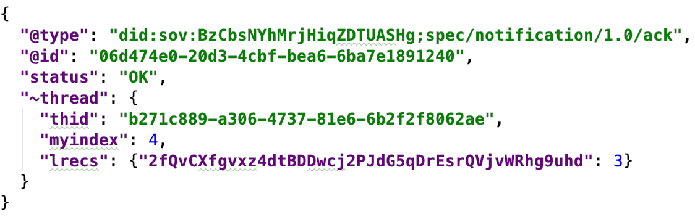
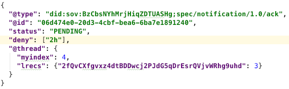

- Name: acks
- Author: Daniel Hardman <daniel.hardman@gmail.com>
- Start Date: 2018-12-26
- PR: (leave this empty)

# Summary
[summary]: #summary

Explains how one party can request, and another party can send, acknowledgment
messages (ACKs) to confirm receipt and clarify the status of complex processes.

# Motivation
[motivation]: #motivation

An __acknowledgment__ or __ACK__ is one of the most common procedures in protocols
of all types. We need a flexible, powerful, and easy way to request and send such
messages in agent-to-agent interactions.

# Tutorial
[tutorial]: #tutorial

Confirming a shared understanding matters whenever independent parties interact.
We buy something on Amazon; moments later, our email client chimes to tell us of
a new message with subject "Thank you for your recent order." We verbally accept
a new job, but don't rest easy until we've also faxed the signed offer letter
back to our new boss. We change a password on an online account, and get a text
at our recovery phone number so both parties know the change truly originated
with the account's owner.

When formal acknowledments are missing, we get nervous. And rightfully so; most
of us have a story of a package that was lost in the mail, or a web form
that didn't submit the way we expected.

Agents interact in very complex ways. They may use multiple transport mechanisms,
across varied protocols, through long stretches of time. While we expect messages
to arrive as sent, and to be processed as expected, the vast majority of the
time, a fundamental tool in the agent communication repertoire is the abililty
to request and receive acknowledgments to confirm a shared understanding.

### Implicit ACKs

[A2A message threading](https://github.com/hyperledger/indy-hipe/pull/30) includes
a lightweight, automatic sort of ACK in the form of the `@thread.lrecs` field.
This allows Alice to report that she has received Bob's recent message with
`@thread.myindex` = N. We expect threading to be best practice in many use cases,
and we expect interactions to often happen reliably enough and quickly enough that
implicit ACKs provide high value.

### Explicit ACKs

However, the natural end for most finite interactions is the point at which work
is finished: a credential has been issued, a proof has been received, a payment
has been made. This meets the needs of the party who received the final message,
but the other party cannot know with confidence that this is the case unless they
receive an ACK.

Rather than inventing a new "interaction has been completed successfully" message
for each protocol, an all-purpose ACK is recommended. It looks like this:

[](ack1.json)

It may also be appropriate to send an ACK at other key points in an interaction
(e.g., when a key rotation notice is received).

### Requesting an ACK (`@please_ack`)

A protocol may stipulate that an ACK is always necessary in certain circumstances.
Launch mechanics for spacecraft do this, because the stakes for a miscommunication
are so high. In such cases, there is no need to request an ACK, because it is
hard-wired into the protocol definition. However, ACKs make a channel more chatty,
and in doing so they may lead to more predictability and correlation for
point-to-point communications. Requiring an ACK is not always the right choice.
An ACK should probably be optional at the end of credential issuance ("I've
received your credential. Thanks.") or proving ("I've received your proof, and
it satisfied me. Thanks."), for example.

In addition, circumstances at a given moment may make an ad hoc ACK desirable even
when it would normally NOT be needed. Suppose Alice likes to bid at online auctions.
Normally she may submit a bid and be willing to wait for the auction to unfold
organically to see the effect. But if she's bidding on a high-value item and
is about to put her phone in airplane mode because her plane's ready to take off,
she may want an immediate ACK that the bid was accepted.

The dynamic need for ACKs is expressed with the `@please_ack` message [decorator](
https://github.com/hyperledger/indy-hipe/pull/71). In its simplest form, it looks
like this:

```JSON
"@please_ack": {}
```

This says, "Please send me an ACK as soon as you process this message."

A fancier version might look like this:

```JSON
"@please_ack": {
  "message_id": "b271c889-a306-4737-81e6-6b2f2f8062ae",
  "on": ["receipt", "6h", "outcome"]
}
```

This says, "For the message that I already sent you, with 
@id=b271c889-a306-4737-81e6-6b2f2f8062ae,
please acknowledge that you've seen it as soon as you get this new message, and
please send me a new ACK every 2 hours as long as status is still pending. Then
send me a final ACK clarifying the outcome of the message once its outcome is
known."

This sort of `@please_ack` might make sense when Alice expected a quick resolution,
but got silence from Bob. She refers back to the message that she thought would
finalize their interaction, and she asks for ongoing status every 2 hours until
there's closure. A `message_id` is optional; normally it's omitted since the message
needing an ACK is the same message where ACK is requested. But including `message_id`
allows Alice to change her mind about an ACK after she's sent a message.

The concept of "outcome" is relevant for interactions with a meaningful
delay between the final actions of one actor, and the time when the product of
those actions is known. Imagine Alice uses A2A messages to make an offer on a
house, and Bob, the homeowner, has 72 hours to accept or reject. The default ACK
event, *message processing*, happens when Alice's offer arrives. The *outcome*
event happens when the offer is accepted or rejected, and may be delayed up to
72 hours. Similar situations apply to protocols where an application is submitted.

The notion of "on receipt" matters if a message requesting an ACK is not the same
as the message that needs acknowledgment.

### When an ACK doesn't come

A party that requests an explicit ACK cannot reason strongly about status when the
ACK doesn't come. The other party may be offline, may be unable or unwilling to
support fancy ACKs (or even simple ones), or may be communicating through a channel
that's unreliable.

However, a party that receives a `@please_ack` can, in an ACK response, indicate that
it is not going to comply with everything that was requested. This is best practice if
a misalignment is known in advance, as it allows the ACK requester to adjust
expectations. For example, the fancier `@please_ack` shown above could trigger the
following ACK on receipt:

[](ack2.json)

Here, `deny` tells the recipient that, although the `receipt` request in the
previous `@please_ack.on` was honored, and the `outcome` request will probably be
honored as well, the recipient cannot expect an ACK every 2 hours. (The sender may
still send ACKs at their discretion; the denial just says that this behavior can't
be counted on.)

### ACK status

The `status` field tells whether an ACK is final or not. It has 3 predefined
values: `OK` (which means an outcome has occurred, and it was positive); `FAIL`
(an outcome has occurred, and it was negative); and `PENDING`, which acknowledges
that no outcome is yet known. In addition, more advanced usage is possible.
See the Reference section, next.

# Reference
[reference]: #reference

### `@please_ack` decorator

* __`message_id`__: asks for an acknowledgment of a message other than the one
that's decorated.
* __`on`__: describes the circumstances under which an ACK is desired. Possible
values in this array include `receipt`, `outcome`, and strings that express a
time interval:  


# Drawbacks
[drawbacks]: #drawbacks

Why should we *not* do this?

# Rationale and alternatives
[alternatives]: #alternatives

- Why is this design the best in the space of possible designs?
- What other designs have been considered and what is the rationale for not
choosing them?
- What is the impact of not doing this?

# Prior art
[prior-art]: #prior-art

Discuss prior art, both the good and the bad, in relation to this proposal.
A few examples of what this can include are:

- Does this feature exist in other SSI ecosystems and what experience have
their community had?
- For other teams: What lessons can we learn from other attempts?
- Papers: Are there any published papers or great posts that discuss this?
If you have some relevant papers to refer to, this can serve as a more detailed
theoretical background.

This section is intended to encourage you as an author to think about the
lessons from other implementers, provide readers of your proposal with a
fuller picture. If there is no prior art, that is fine - your ideas are
interesting to us whether they are brand new or if they are an adaptation
from other communities.

Note that while precedent set by other communities is some motivation, it
does not on its own motivate an enhancement proposal here. Please also take
into consideration that Indy sometimes intentionally diverges from common
identity features.

# Unresolved questions
[unresolved]: #unresolved-questions

- What parts of the design do you expect to resolve through the
enhancement proposal process before this gets merged?
- What parts of the design do you expect to resolve through the
implementation of this feature before stabilization?
- What related issues do you consider out of scope for this 
proposal that could be addressed in the future independently of the
solution that comes out of this doc?
