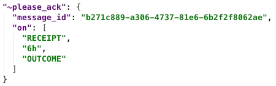
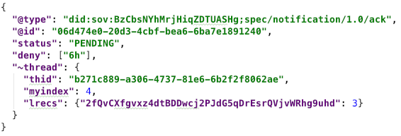

- Name: acks
- Author: Daniel Hardman <daniel.hardman@gmail.com>
- Start Date: 2018-12-26
- PR: (leave this empty)

# Summary
[summary]: #summary

Explains how one party can request, and another party can send, acknowledgment
messages (ACKs) to confirm receipt and clarify the status of complex processes.

# Motivation
[motivation]: #motivation

An __acknowledgment__ or __ACK__ is one of the most common procedures in protocols
of all types. We need a flexible, powerful, and easy way to request and send such
messages in agent-to-agent interactions.

# Tutorial
[tutorial]: #tutorial

Confirming a shared understanding matters whenever independent parties interact.
We buy something on Amazon; moments later, our email client chimes to tell us of
a new message with subject "Thank you for your recent order." We verbally accept
a new job, but don't rest easy until we've also faxed the signed offer letter
back to our new boss. We change a password on an online account, and get a text
at our recovery phone number so both parties know the change truly originated
with the account's owner.

When formal acknowledments are missing, we get nervous. And rightfully so; most
of us have a story of a package that was lost in the mail, or a web form
that didn't submit the way we expected.

Agents interact in very complex ways. They may use multiple transport mechanisms,
across varied protocols, through long stretches of time. While we usually expect
messages to arrive as sent, and to be processed as expected, a vital tool in the
agent communication repertoire is the ability to request and receive
acknowledgments to confirm a shared understanding.

### Implicit ACKs

[A2A message threading](https://github.com/hyperledger/indy-hipe/pull/30) includes
a lightweight, automatic sort of ACK in the form of the `@thread.lrecs` field.
This allows Alice to report that she has received Bob's recent message that had
`@thread.myindex` = N. We expect threading to be best practice in many use cases,
and we expect interactions to often happen reliably enough and quickly enough that
implicit ACKs provide high value. If you are considering ACKs but are not familiar
with that mechanism, make sure you understand it, first. This HIPE offers a
supplement, not an alternative.

### Explicit ACKs

Despite the goodness of implicit ACKs, the natural end for most finite interactions
is the point at which work is finished: a credential has been issued, a proof has
been received, a payment has been made. In such a flow, an implicit ACK meets the
needs of the party who received the final message, but the other party may want
something explicit. Otherwise they can't know with confidence about the final
outcome of the flow.

Rather than inventing a new "interaction has been completed successfully" message
for each protocol, an all-purpose ACK is recommended. It looks like this:

[](ack1.json)

It may also be appropriate to send an ACK at other key points in an interaction
(e.g., when a key rotation notice is received).

### Requesting an ACK (`@please_ack`)

A protocol may stipulate that an ACK is always necessary in certain circumstances.
Launch mechanics for spacecraft do this, because the stakes for a miscommunication
are so high. In such cases, there is no need to request an ACK, because it is
hard-wired into the protocol definition. However, ACKs make a channel more chatty,
and in doing so they may lead to more predictability and correlation for
point-to-point communications. Requiring an ACK is not always the right choice.
For example, an ACK should probably be optional at the end of credential issuance
("I've received your credential. Thanks.") or proving ("I've received your proof,
and it satisfied me. Thanks.").

In addition, circumstances at a given moment may make an ad hoc ACK desirable even
when it would normally NOT be needed. Suppose Alice likes to bid at online auctions.
Normally she may submit a bid and be willing to wait for the auction to unfold
organically to see the effect. But if she's bidding on a high-value item and
is about to put her phone in airplane mode because her plane's ready to take off,
she may want an immediate ACK that the bid was accepted.

The dynamic need for ACKs is expressed with the `@please_ack` message [decorator](
https://github.com/hyperledger/indy-hipe/pull/71). In its simplest form, it looks
like this: `"@please_ack": {}`.

This says, "Please send me an ACK as soon as you process this message."

A fancier version might look like this:

[](please_ack.json)

This says, "For the message that I already sent you, with 
@id=b271c889-a306-4737-81e6-6b2f2f8062ae,
please acknowledge that you've seen it as soon as you get this new message, and
please send me a new ACK every 2 hours as long as status is still pending. Then
send me a final ACK clarifying the outcome of the message once its outcome is
known."

This sort of `@please_ack` might make sense when Alice expected a quick resolution,
but got silence from Bob. She refers back to the message that she thought would
finalize their interaction, and she asks for ongoing status every 2 hours until
there's closure. A `message_id` is optional; normally it's omitted since the message
needing an ACK is the same message where ACK is requested. But including `message_id`
allows Alice to change her mind about an ACK after she's sent a message.

The concept of "outcome" is relevant for interactions with a meaningful
delay between the final actions of one actor, and the time when the product of
those actions is known. Imagine Alice uses A2A messages to make an offer on a
house, and Bob, the homeowner, has 72 hours to accept or reject. The default ACK
event, *message processing*, happens when Alice's offer arrives. The *outcome*
event for Alice's offer happens when the offer is accepted or rejected, and may
be delayed up to 72 hours. Similar situations apply to protocols where an
application is submitted, and probably to many other use cases.

The notion of "on receipt" matters if the message requesting the ACK is not the same
as the message that needs acknowledgment. This type of ACK may help compensate for
transmission errors, among other things.

### When an ACK doesn't come

All ACK behaviors are best effort unless a protocol stipulates otherwise. This is
why the decorator name begins with `please`. A party that requests an explicit ACK
cannot reason strongly about status when the ACK doesn't come. The other party may
be offline, may be unable or unwilling to support fancy ACKs (or even simple ones),
or may be communicating through a channel that's unreliable.

However, a party that receives a `@please_ack` can, in an ACK response, indicate that
it is not going to comply with everything that was requested. This is best practice if
a misalignment is known in advance, as it allows the ACK requester to adjust
expectations. For example, the fancier `@please_ack` shown above could trigger the
following ACK on receipt:

[](ack2.json)

Here, `deny` tells the recipient that, although the `receipt` request in the
previous `@please_ack.on` was honored, and the `outcome` request will probably be
honored as well, the recipient cannot expect an ACK every 2 hours. (The sender may
still send ACKs at their discretion; the denial just says that this behavior can't
be counted on.)

### ACK status

The `status` field in an ACK tells whether the ACK is final or not with respect to
the message being acknowledged. It has 3 predefined values: `OK` (which means an
outcome has occurred, and it was positive); `FAIL` (an outcome has occurred, and
it was negative); and `PENDING`, which acknowledges that no outcome is yet known.
In addition, more advanced usage is possible. See the [details in the Reference
section](#status).

### Relationship to `problem-report`

Negative outcomes do not necessarily mean that something bad happened; perhaps
Alice comes to hope that Bob rejects her offer to buy his house because she's
found something better--and Bob does that, without any error occurring. This
is not a FAIL in a problem sense; it's a FAIL in the sense that the offer to
buy did not lead to the outcome Alice intended when she sent it.

This raises the question of errors. Any time an unexpected *problem*
arises, best practice is to report it to the sender of the message that
triggered the problem. This is the subject of the [Error Reporting HIPE](
https://github.com/hyperledger/indy-hipe/pull/65), and its `problem-report`
message family.

A `problem-report` is inherently a sort of ACK. In fact, the `ack` message type
and the `problem-report` message type are both members of the same `notification`
message family. Both help a sender learn about status. Therefore, a request or
requirement for an ACK can *often* be satisfied by a `problem-report` message.
Where this is truly the case, it is recommended, as it decreases chattiness.

But notice the hedge word "often." First, some ACKs may be sent before a final
outcome, so a final `problem-report` may not satisfy all ACK obligations.
Second, some `problem-report`s are warnings that do not report a definitive
outcome; messages like this don't satisfy the `on: [OUTCOME]` ACK. Third, an ACK
request may be sent after a previous `ack` or `problem-report` was lost in
transit. Because of these caveats, developers whose code creates or consumes
ACKs should be thoughtful about where the two message types overlap, and where
they do not. Carelessness here is likely to cause subtle, hard-to-duplicate
surprises from time to time.

### Signed (Non-repudiable) ACKs
[TODO: how do you ask for an ACK that commits its sender to the acknowledgment in
a way that's provable to third parties? Open email to Mike Lodder...]

### Muliplexed ACKs
[TODO: how do you ask for, and supply, an ACK to all of Alice's agents instead
of just to the one who sent the ACK? Does each agent need to request the ACK
separately? Are there denial-of-service or other security issues?]

### Custom ACKs

This mechanism cannot address all possible ACK use cases. Some ACKs may
require custom data to be sent, and some acknowledgment schemes may be more
sophisticated or fine-grained that the simple settings offered here.
In such cases, developers should write their own ACK message type(s) and
maybe their own decorators. However, reusing the field names and conventions
in this HIPE may still be desirable, if there is significant overlap in the
concepts. 

# Reference
[reference]: #reference

### `@please_ack` decorator

##### __`message_id`__
Asks for an acknowledgment of a message other than the one
that's decorated. Usually omitted, since most requests for an
ACK happen in the same message that wants acknowledgment.

##### __`on`__
Describes the circumstances under which an ACK is desired. Possible
values in this array include `RECEIPT`, `OUTCOME`, and strings that express a
time interval, as [documented in the HIPE about date- and time-related conventions](
https://github.com/hyperledger/indy-hipe/blob/72d2bc1f380b51ba72bdfe9857518a500e9f0990/text/date-time-conventions/README.md#_elapsed).
Support for ACKs on a time interval is an advanced feature and should not be
depended upon. 

In addition, it is possible to name protocol states in this array. To understand this, let's
return to the example of Alice making an offer on a house. Suppose that the `home-buy`
protocol names and defines the following states for the owner who receives an offer:
`waiting-for-other-offers`, `evaluating-all-offers`, `picking-best-offer`. All of
these states would be passed through by Bob after Alice sends her message, and
she could request an ACK to be sent with each state, or with just some of them:

```JSON
"on": ["evaluating-all-offers", "OUTCOME"]
```
  
The order of items in the `on` array is not significant, and any unrecognized
values in it should be ignored.
  
### `ack` message

##### __`status`__

Required. As discussed [above](#ack-status), this tells whether the ACK is final
or not with respect to the message being acknowledged. Besides the 3 predefined
values, protocol states may be named, with the same semantics as used in the
`on` array of an `@please_ack` decorator (see just above). That is, the status
may contain 'evaluating-all-offers' to tell Alice that Bob has now entered that
phase.

##### __`@thread.thid`__

Required. This links the ACK back to the message that requested it.

All other fields in an ACK are present or absent per requirements of ordinary
messages.

# Drawbacks and Alternatives
[drawbacks]: #drawbacks

This ACK mechanism is more complex than what developers might assume
at first glance. Isn't an ACK just a dirt-simple message that says "Your
message is acknowledged"?

It could be. However, if we left it that simple, then we would not have a
standard way to ask for fancier ACK semantics. This would probably not
be fatal to the ecosystem, but it would lead to a proliferation of message
types that all do more or less the same thing. A [pattern would be
ungeneralized](https://codecraft.co/2015/09/02/on-forests-and-trees/),
causing lots of wasted code and documentation and learning time.

# Prior art
[prior-art]: #prior-art

See notes above about the [implicit ACK mechanism in `@thread.lrecs`](#implicit-acks).

# Unresolved questions
[unresolved]: #unresolved-questions

- Security and privacy implications of ACKs. Could they be used to mount
a denial-of-service attack or to sniff info that's undesirable?