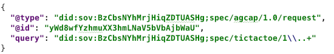
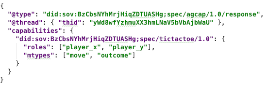
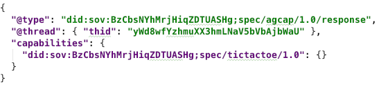

- Name: agent-capabilities
- Author: Daniel Hardman
- Start Date: 2018-12-17

# HIPE 00??-agent-capabilities
[summary]: #summary

Describes how agents can query one another to find out what features
they support.

# Motivation
[motivation]: #motivation

Though some agents will support just one protocol and will be
statically configured to interact with just one other party, many
exciting uses of agents are more dynamic and unpredictable. When
Alice and Bob meet, they won't know in advance what features are
supported by one another's agents. They need a way to find out.

# Tutorial
[tutorial]: #tutorial

This HIPE introduces a protocol for discussing agent capabilities.
The identifier for the message family used by this protocol is `agcap`,
and the fully qualified URI for its definition is:

    did:sov:BzCbsNYhMrjHiqZDTUASHg;spec/agcap/1.0

### Roles

There are two roles in the `agcap` protocol: `requester` and
`responder`. The requester asks the responder about its capabilities,
and the responder answers. Each role uses a single message type.
This is a classic two-step request~response interaction.

### `request` Message Type

An `agcap/request` message looks like this:

The `query` field is a regular expression and could be quite complex.
Often, however, it will be used as shown here, to identify a message
family with just the version portion wildcarded. The regex must match
the entire name of a protocol family, from beginning to end. In other
words, what you put in the regex has an implicit `^` at the beginning
and `$` at the end.

Reuqest messages say, "Please tell me what your capabilities are with
respect to the protocols embodied in message families that match this
regex." This particular example asks if another agent knows any 1.x
versions of the [tictactoe protocol](x).

Any agent may send another agent this message type at any time.
Implementers of agents that intend to support dynamic relationships
and rich features are *strongly* encouraged to implement support
for this message, as it is likely to be among the first messages
exchanged with a stranger.

### `response` Message Type

An `agcap/response` message looks like this:

The `capabilities` field is a JSON object that contains zero or more keys that
match the query. Each key is a protocol version (fully qualified message
family identifier such as `did:sov:BzCbsNYhMrjHiqZDTUASHg;spec/tictactoe/1.0`).
Its value is a JSON object that enumerates the roles the responding agent
can play in the associated protocol, and the message types it can receive.

Response messages say, "Here are some protocols I know about that matched
your query, and some things I can do with each one."

##### Sparse Responses

Responses do not have to contain exhaustive detail. For example, the following
response is probably just as good:

The reason why less detail probably suffices is that agents do not need to
know everything about one another's implementations in order to start an
interaction--usually the flow will organically reveal what's needed. For
example, the `outcome` message in the `tictactoe` protocol isn't needed
until the end, and is optional anyway. Alice can start a tictactoe game
with Bob and will eventually see whether he sends an `outcome` message.

The empty `{}` in this response does not say, "I support no roles and no
message types in this protocol." It says, "I support the protocol but
I'm providing no detail about which roles and messages."

Even an empty `capabilities` map does not say, "I support no protocols
that match your query." It says, "I'm not telling that I support any
protocols that match your query." An agent might not tell another that
it supports a protocol for various reasons, including the trust that
it imputes to the other party based on cumulative interactions so far,
whether it's in the middle of upgrading a plugin, whether it's currently
under high load, and so forth. And responses to an `agcap` request are
not guaranteed to be true forever; agents can be upgraded or downgraded,
although they probably won't churn in their capabilities from moment
to moment.

### Privacy Considerations

Because the regex in a `request` message can be very inclusive, the `agcap`
protocol could be used to mine information suitable for agent fingerprinting,
in much the same way that browser fingerprinting works. This is antithetical
to the ethos of our ecosystem, and represents bad behavior. Agents should
use `agcap` to answer legitimate questions, and not to build detailed
profiles of one another. However, fingerprinting may be attempted
anyway.

For agents that want to maintain privacy, several best practices are
recommended:

##### Do not always provide exhaustive detail in a response.

Patterns are easier to see in larger data samples. However, a pattern
of ultra-minimal data is also a problem, so be more forthcoming sometimes,
and less, others.

##### Consider adding some spurious details.

If a regex in a query allows multiple message families, then occasionally
you might use some made-up message family names as matches. If a regex
allows multiple versions of a protocol, then sometimes you might use some
made-up versions. And sometimes not.

##### Vary the format of responses.

Sometimes, you might prettify your agent plaintext message one way,
sometimes another.

##### Vary the order of keys in the `capabilities` object.

If more than one key matches a query, do not always return them in
alphabetical order or version order. If you do return them in order,
do not always return them in ascending order.

##### Vary how you query, too.

How you ask questions may also be fingerprintable.
 
### Message Catalog

Neither of the message types in this protocol contain localized data.
However, we define the following message catalog for `problem-report`
messages.

`unsupported-protocol-version`
`bad-regex`
`query-too-intrusive`

# Reference

# Drawbacks

# Rationale and alternatives

# Prior art

# Unresolved questions

- Do we need to support a human comment in a query? (I think not, but just checking.)
- Do we need to support a quid-pro-quo (requesting agent also discloses)? Or
  would we say that what/how the requesting agent queries is an implicit
  disclosure? If the latter, does this need to be considered in privacy 
  best practices?