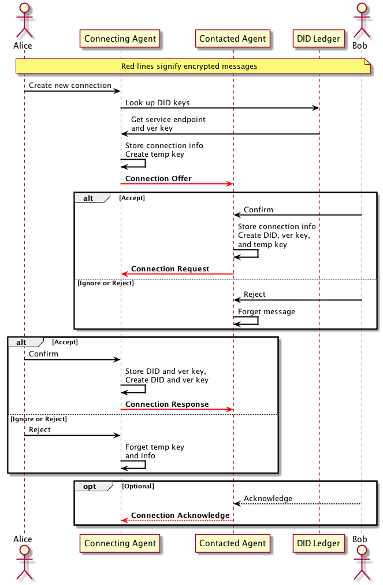

- Name: Agent Connection Protocol
- Author: Michael Lodder <mike@sovrin.org>
- Start Date: 2018-Oct-11
- PR:
- Jira Issue:

# Summary
[summary]: #summary

This HIPE intends to supercede the existing HIPE for describing the agent connection protocol.
It is intended to be a much simplier and secure method for connecting agents.

# Motivation
[motivation]: #motivation

Existing protocols for connecting agents all seem to be complicated and use rudimentary methods for insuring confidentiality and integrity of the setup. Complicated protocols are prone to error due to misunderstandings and implementation problems.

This protocol aims to be as simple and secure as possible to facilitate adoption and mitigate potential implemenation issues.

# Tutorial
[tutorial]: #tutorial

Agents connect by means of introductory messages. These messages only need to contain information to identify and authenticate each other for subsequent interactions, where to send the message, and the version of the message format. Security parameters and algorithms should be captured in the version of the message format to limit cryptographic algorithm agility that causes many problems with programmers.

### Overview

One of the agents initiates the protocol by means of a discovery mechanism. This is done by either looking up at some public service how to communicate with the corresponding agent or out-of-band methods. Out-of-band introductions could be two parties communicating face to face, via email, text message, phone calls, etc.

Public services should include enough information for an agent to send the initial contact message by retrieving the information from a known source like a website, database, ledger, or whatever. Out-of-band methods can include QR codes, word sequences, or URNs.

Before iterating further it is important to cover other terms that will be used throughout the remainder of this HIPE.

**Connecting Agent**: The agent that wants to create a connection.

**Contacted Agent**: The agent that is contacted by new agents.

### Message Types

The following message formats are used by the connection protocol.

**Connection Offer Unencrypted**
```json
{
    "@type": "did:sov:1234567890;spec/connection/1.0/offerunencrypted",
    "content": {
        "public_key": "<base58 encoded key>",
        "message": {
            "return_path": ["<url for each hop to return>"]
        }
    }
}
```

**Connection Offer Encrypted**

The contents of this `message` are the same as the unencrypted offer, just authenticated encrypted.
```json
{
    "@type": "did:sov:1234567890;spec/connection/1.0/offerencrypted",
    "content": {
        "public_key": "<base58 encoded key>",
        "message": "<authenticated encrypted message>"
    }
}
```

**Connection Request**
```json
{
    "@type": "did:sov:1234567890;spec/connection/1.0/request",
    "content": {
        "public_key": "<base58 encoded key>",
        "message": "<authenticated encrypted message>"
    }
}
```

**Connection Response**
```json
{
    "@type": "did:sov:1234567890;spec/connection/1.0/response",
    "content": {
        "message": "<authenticated encrypted message>"
    }
}
```

**Connection Message**

These are the contents of the `message` in both the connection request and response messages. The contents of this
message are somewhat arbitrary; this protocol will work as long as the information needed to establish the pairwise
relationship (whether that is a DID to be looked up on the ledger or just a DID and a verification key) are
transmitted.
```json
{
    "did": "did:sov:98765432e123456789",
    "ver_key": "<base58 encoded key>"
}
```

The acknowledge message is completely optional and indicates to the connecting agent that the process has been completed
by the contacted agent. The format is identical to a connection response but is included here for reference.


**Connection Acknowledge Message**
```json
{
    "@type": "did:sov:1234567890;spec/connection/1.0/acknowledge",
    "content": {
        "message": "<authenticated encrypted message>"
    }
}
```

# Reference
[reference]: #reference
Authenticated encryption will use the *public_key* from the received messages and the receiver's private key.

The "@type" field should be included as part of the *Associated Data*.

The initialization vector must be a cryptographically secure generated random number that is 192 bits.

*Libindy* currently provides the cryptographic apis to create new keys:
```rust
indy_create_key
```

*Libindy* will need to expose key exchange, encryption, and random number methods. Most of these are already written.

*Libindy* can have interfaces to create and process these messages.

### Sequences
Out of band connection


Using a public DID



# Drawbacks
[drawbacks]: #drawbacks

The messages used here are unique to the connection protocol. Perhaps as more messages
are created these could be made more abstract.

# Rationale and alternatives
[alternatives]: #alternatives

There have been other connection protocols proposed using anoncrypt and
authcrypt. While those crypto algorithms appear simpler, they do not
offer the security that users think and are more complex.

Anoncrypt only offers forward secrecy for the sender and keeps the sender
anonymous. Prior protocols used anoncrypt. This is not desirable when
connecting. It is important for both sides to know who sent connection
requests. Authcrypt could be used to fix that, but authcrypt and anoncrypt do not
currently support associated data to be included as part of the packet nor
does it make sense to modify then to do so since they use a custom design
of libsodium. Anoncrypt and Authcrypt have become confusing for engineers
and have been applied incorrectly in the previous connection protocol proposal.

# Prior art
[prior-art]: #prior-art

Most prior solutions require centralized fully or semi trusted solutions
to handle connections. This protocol assumes decentralized zero trust solutions.

# Unresolved questions
[unresolved]: #unresolved-questions
N/A
