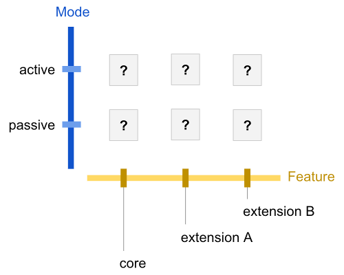

- Name: agent-test-suite-interface
- Author: Daniel Hardman
- Start Date: 2018-05-17
- RFC PR: (leave this empty)
- Jira Issue: (leave this empty)

# Summary
[summary]: #summary

Defines the interface (behavioral contract, mental model, procedure,
harness) of test suites that evaluate interoperability of Indy agents.

##### Related RFCs

This is a test suite __interface RFC__. It is intended to specify
the common behavioral contract of one or more test suite __content
RFCs__ that define actual tests. (These two types of spec are
divided so they can be versioned and standardized separately.)


# Motivation
[motivation]: #motivation

The need for interoperability in SSI ecosystems is profound--much of the
value of SSI centers on interaction, and interaction requires different
pieces of technology to understand one another.

We will likely write multiple RFCs that touch on aspects of agent
interaction--but implementers need an oracle against which they can
verify compliance with specs and community practice. This RFC creates
such an oracle.

# Tutorial
[tutorial]: #tutorial

### Background Concepts

An agent is a piece of technology that holds keys and operates on the
digital landscape in behalf of its owner. Agents are not shared
services; they work for a single master. Agents can be embodied in
mobile apps, daemons, hardware, enterprise service buses, and many other
form factors.

Agents interact by sending and receiving messages. They can be viewed as
black boxes--as far as any other party in the ecosystem is concerned,
their implementation details are irrelevant. Only their sending and
receiving can be observed. This suggests that message interactions are
the locus of interoperability concerns, and the major thing to evaluate
in a test suite.

How messages are _transported_ may vary by circumstances--some agents
using http, others using Bluetooth, and still others using raw sockets
or smtp or proprietary protocols. Interoperability does depend to some
extent on intersecting transports, so our test suite needs to probe
that--but we should be more interested in the format of messages, the
semantics around their sending and receiving, and the behaviors they
evoke.

### Characterizing Interoperability

Some agents have very modest charters--listen for a signal and take a
single hard-coded action, maybe. Or just emit a single piece of data on
an interval. Other agents may be very rich, with sophisticated AIs and
policy engines, a broad charter, and an array of communication strategies
and partners.

Given this variety, the test suite evaluates compliance in a two-dimensional
matrix. One axis is the __mode of operation__ -- is the agent actively
initiating action, or passively listening, or both? This embodies in
agent space the human experience that many of us know, where it is
possible to speak without listening, or to understand a language
without being able to speak it. The other axis holds different __feature
clusters__ -- which functional areas does the agent target? The set of
feature clusters will likely grow over time.



Any given intersection in this matrix represents an __interop junction__.
Each junction may receive an __interop score__. The possible scores are:

  * __interoperable__: Passes all tests associated with this junction.
    Any two agents that are interoperable at a given junction should be
    able to interact freely within that junction.
  * __constrained__: Passes enough tests to enable a meaningful
    subset of interactions. The word "meaningful" is deliberately vague;
    this score always requires explanation about which subset is possible.
    Two agents that are both constrained at a junction may or may not
    find useful common ground.
  * __divergent__: Doesn't pass enough tests to have meaningful interop
    at this junction. This is the assumed or default score for all agents
    on all junctions, until proved otherwise by the test suite--and when
    results are reported, any junctions not described should be assumed
    to be divergent for that agent.

The set of all interop scores for a given agent constitutes its
__interop profile__.

### Suite Organization

The suite is divided into __feature clusters__, which are further
subdivided into active and passive subsets. Clusters are named in roughly
the same way as namespaces in familiar programming languages, such as:

```
core.active
core.passive
transports.http.active
transports.http.passive
crypto.rsa.active
```

### Versioning

As mentioned in the [summary](#summary), this RFC limits itself to test suite
semantics; actual test suite content is defined in a separate RFC. Each spec--
the one for an interface and the one for actual test content--can evolve
separately.

A test content RFC should always reference its underlying test interface RFC.

There is no [semver](https://semver.org)-style evolution between successive
versions of a test content RFC.

When an interop profile is reported for an agent, it should always be accompanied
by the RFC number of the test content RFC that the test suite implements.

### Test Procedure

The suite will be distributed as a test application tool, `agtest`. The tool
will run on a variety of desktop platforms, but it will test a remote agent
with a host platform that is opaque; thus, the same `agtest` package should be
able to evaluate agents on all platforms that we ever build.

The test procedure will follow this pattern:

1. Download and/or install the tool.
2. Configure the tool so it knows about its __harness__ (see next section).
3. Launch the tool and allow it to run to completion.
4. Capture the results.

Since agents typically talk on the network, it might be reasonable to wonder
if it's necessary to download and/or install the tool. Couldn't we just build
a web site that people configure to exercise a remote agent?

The answer is yes, in theory--but such a site would not be capable of
talking to agents that use non-http transports. It would also need to be
granted privileged access to an agent development environment that may
need protecting. For this reason, `agtest` is imagined as a command-line
tool, run locally. Perhaps a GUI wrapper will be added later.

### Harness

`agtest` needs to have certain things before it can run:

   * A list of claimed features, so the tool can know which parts of
   the test matrix to explore. For example, an agent that
   listens but never talks proactively, and that only deals with
   communication over http, and that doesn't support any encryption,
   only needs tests in a few junctions of the matrix.
   * A standard way to send and receive messages, even though the agent
    under test may use a variety of transport protocols. (See next section,
    [Transport Adapters and `agtalk`](#transport-adapters-and-agtalk).)
   * A backchannel way to ask the agent to initiate certain actions. (We
   cannot see what an agent's outbound requests look like if all it does
   is sit passively, making responses.) See [Asking for Action](#asking-for-action)
   below.
   * A backchannel way to invoke setup and teardown logic, so tests can
   satisfy deterministic pre- and post-conditions. We don't want later
   tests to produce invalid results due to accumulated state from previous
   tests. See [Setup and Teardown](#setup-and-teardown) below.
   
The harness can be described in config files and/or on the command line.

### Transport Adapters and `agtalk`

Some agents may only speak Bluetooth; others may only speak http; still
others may use IRC. Since agent communication is transport agnostic, it
is desirable to write tests once and then use them unmodified, over as
many transports as are relevant.

`agtest` will address this requirement by implementing an exceedingly
simple transport protocol of its own--`agtalk`--and by providing
pluggable adapters that recast the communication into the transport of
interest.

The agtalk transport works like this:

* To send a message, agtest will copy the bytes of the message into a
new file in a folder on disk that has been designated the __outbox__.
An adapter should monitor this folder, and when it sees messages arrive,
it should pick them up and send them over the adapter's target transport
(e.g., by doing an http POST with the message bytes as the body, by
sending the bytes as the body of an email message via smpt, etc).
Messages should be sent in the order that files are created in the folder.
Messages should be deleted after they have been sent.

* To receive a message, agtest will monitor a folder on disk that has
been designated the __inbox__. Each file that arrives there is assumed
to be an inbound message, and its bytes will be processed in the order
received. An adapter should therefore receive messages over its target
transport and save them as files to the inbox.

The agtalk transport is slow (a request~response round trip might take
a handful of seconds). It doesn't scale beyond a few messages at a time.
It lacks fancy bells and whistles. It is thus inadequate for scale or
performance testing. But it is very simple to implement and to adapt,
and it reflects a reality of agents that is core to the whole ecosystem--
we have no control over the performance or sophistication of a remote
party, and the comm channels we use may be very limited. It is thus
quite adequate for interoperability testing.

Multiple adapters will be shipped with `agtest`. Mostly, they should work
out of the box. However, some agent authors may 

### Asking for Action

When `agtest` wants to evaluate how an agent behaves when it is proactively
requesting things of other parties, 
   
# Reference
[reference]: #reference

Provide guidance for implementers, procedures to inform testing,
interface definitions, formal function prototypes, error codes,
diagrams, and other technical details that might be looked up.
Strive to guarantee that:

- Interactions with other features are clear.
- Implementation trajectory is well defined.
- Corner cases are dissected by example.

# Drawbacks
[drawbacks]: #drawbacks

Why should we *not* do this?

# Rationale and alternatives
[alternatives]: #alternatives

- Why is this design the best in the space of possible designs?
- What other designs have been considered and what is the rationale for not choosing them?
- What is the impact of not doing this?

# Prior art
[prior-art]: #prior-art

Discuss prior art, both the good and the bad, in relation to this proposal.
A few examples of what this can include are:

- Does this feature exist in other SSI ecosystems and what experience have their community had?
- For other teams: What lessons can we learn from other attempts?
- Papers: Are there any published papers or great posts that discuss this? If you have some relevant papers to refer to, this can serve as a more detailed theoretical background.

This section is intended to encourage you as an author to think about the lessons from other 
implementers, provide readers of your RFC with a fuller picture.
If there is no prior art, that is fine - your ideas are interesting to us whether they are brand new or if it is an adaptation from other languages.

Note that while precedent set by other ecosystems is some motivation, it does not on its own motivate an RFC.
Please also take into consideration that Indy sometimes intentionally diverges from common identity features.

# Unresolved questions
[unresolved]: #unresolved-questions

- What parts of the design do you expect to resolve through the RFC process before this gets merged?
- What parts of the design do you expect to resolve through the implementation of this feature before stabilization?
- What related issues do you consider out of scope for this RFC that could be addressed in the future independently of the solution that comes out of this RFC?
