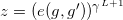
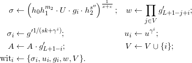

- Name: Anonymous Credential Protocol
- Author: Mike Lodder and Brent Zundel
- Start Date: January 25, 2019
- PR:
- Jira Issue:

# Summary
[summary]: #summary

Anonymous credentials form the heart of Indy's identity capabilities.
This document describes the protocol for Camenisch-Lysyanskaya signatures and the anonymous
credentials they enable.

# Motivation
[motivation]: #motivation

This HIPE is intended as a publication of the protocol behind the code that has already been implemented in
[indy-crypto][indy-crypto-github].

# Tutorial
[tutorial]: #tutorial

## Introduction
[intro]: #intro
### Concept

The concept of *anonymous credentials* allows users to prove that their identity satisfies certain properties in an uncorrelated way without revealing other identity details.  The properties can be raw identity attributes  such as
the birth date or the address, or more sophisticated predicates such as ``A is older than 20 years old''.

We assume three parties: *issuer*, *holder*, and *verifier*. From the functional perspective, the issuer gives a credential *C* based on identity schema *X*, which asserts certain properties 𝒫 about *X*, to the holder. The credential consists of attributes represented by integers *m1, m2,..., ml*. The holder then presents (𝒫,*C*) to the Verifier, which can verify that the issuer has asserted that holder's identity has property 𝒫.

### Properties

Credentials are *unforgeable* in the sense that no one can fool the Verifier with a credential not prepared by the issuer.

We say that credentials are  *unlinkable* if it is impossible to correlate the presented credential across multiple presentations. This is implemented by the holder *proving* with a zero-knowledge proof *that he has a credential* rather than showing the credential.

Unlinkability can be simulated by the issuer generating a sufficient number of ordinary unrelated credentials. Also unlinkability can be turned off to make credentials *one-time use* so that second and later presentations are detected.

### Pseudonyms
Typically a credential is bound to a certain pseudonym *nym*. It is supposed that holder has been registered as *nym* at the issuer, and communicated (part of) his identity *X* to him. After  that the issuer can issue a credential that couples *nym* and *X*.

The holder may have a pseudonym at the Verifier, but not necessarily. If there is no pseudonym then the Verifier provides the service to users who did not register. If the pseudonym *nym*V is required, it can be generated from a link secret *m1* together with *nym* in a way that *nym* can not be linked to *nymV*. However, holder is supposed to prove that the credential presented was issued to a pseudonym derived from the same link secret as used to produce *nymV*.

An identity owner also can create a policy address **_I_** that is used for managing agent proving authorization. The address are tied to credentials issued to holders such that agents cannot use these credentials without authorization.

## Generic notation

Attribute *m* is a *la*-bit unsigned integer. Technically it is possible to support credentials with different *la*, but in Sovrin for simplicity it is set *la*=256.

## Protocol Overview

The described protocol supports anonymous credentials given to multiple holders  by various issuers, which are presented to various relying parties.

Various types of anonymous credentials can be supported. In this section, the combination of [CL-based credentials][CL-signatures] and [pairing-based revocation][pairing-revocation] is described.

The simplest credential lifecycle with one credential, single issuer, holder, and verifier is as follows:
1. Issuer determines a credential schema 𝒮: the type of cryptographic signatures used to sign the credentials, the number *l* of attributes in a credential, the indices *Ah ⊂ {1,2,...,l}* of hidden attributes, the public key *Pk*, the non-revocation credential attribute number *lr* and non-revocation public key *Pr* (Section~\ref{sec:iss-setup}). Then he publishes it on the ledger and announces the attribute semantics.
1. Holder retrieves the credential schema from the ledger and sets the hidden attributes.
1. Holder requests a credential from issuer. He sends hidden attributes in a blinded form to issuer and agrees on the values of known attributes *Ak = {1,2,...,l} \ Ah*.
1. Issuer returns a credential pair *(Cp, CNR)* to holder. The first credential contains the requested *l* attributes. The second credential asserts the non-revocation status of the first one. Issuer publishes the non-revoked status of the credential on the ledger.
1. Holder approaches verifier. Verifier sends the Proof Request ℰ
    to holder. The Proof Request contains the credential schema *𝒮E* and disclosure predicates 𝒟. The predicates for attribute *m* and value *V* can be of form *m=V*, *m<V*, or *m>V*. Some attributes may be asserted to be the same: *mi=mj*.
1. Holder checks that the credential pair he holds satisfy the schema *𝒮E*.
    He retrieves the non-revocation witness from the ledger.
1. Holder creates a proof *P* that he has a non-revoked credential satisfying the proof request ℰ and sends it to verifier.
1. Verifier verifies the proof.

If there are multiple issuers, the holder obtains  credentials from them independently. To allow credential chaining, issuers reserve one attribute (usually *m1*)  for a secret value hidden by holder. Holder is supposed then to set it to the same value in all credentials,
whereas Relying Parties require them to be equal along all credentials. A proof request should specify then a list of schemas that credentials should satisfy in certain order. 

## Schema preparation

Credentials should have limited use to only authorized holder entities called agents. Agents can prove authorization to use a credential by including a policy address **_I_** in primary credentials as attribute *m3*.

### Attributes
Issuer defines the primary credential schema 𝒮 with *l* attributes *m1,m2,..., ml* and the set of hidden attributes *Ah ⊂ {1,2,...,l}*. In Sovrin, *m1* is reserved for the link secret of the holder, *m2* is reserved for the context -- the enumerator for the holders, *m3* is reserved for the policy address **_I_**. By default, *{1,3} ⊂ Ah* whereas *2 ∉ Ah*..

Issuer defines the non-revocation credential  with *2* attributes *m1,m2*. In Sovrin, *Ah = {1}* and *m1* is reserved for the link secret of the holder, *m2* is reserved for the context -- the enumerator for the holders.

### Primary Credential Cryptographic Setup
In Sovrin, issuers use [CL-signatures][CL-signatures] for primary credentials, although other signature types will be supported too.

For the CL-signatures issuer generates:
1. Random 1536-bit primes *p',q'* such that  *p ← 2p'+1* and *q ← 2q'+1* are primes too. Then compute *n ← pq*.
1. A random quadratic residue  *S mod n*;
1. Random ![*xZ, xR1,...,xRl ∈ \[2; p'q'-1\]*](Eq1.png)

Issuer computes

The issuer's public key is  and the private key is *sk = (p, q)*.

### Issuer Setup Correctness Proof
1. Issuer generates random ![*x~Z, x!R1,...,x~Rl ∈ \[2; p'q'-1\]*](Eq4.png)
1. Computes

    

Here *HI* is the issuer-defined hash function, by default SHA2-256.

3. Proof *𝒫I* of correctness is 

### Non-revocation Credential Cryptographic Setup
In Sovrin, issuers use [CKS accumulators and signatures][pairing-revocation] to track revocation status of primary credentials, although other signature types will be supported too. Each primary credential is given an index from 1 to *L*.

The CKS  accumulator is used to track revoked primary credentials, or equivalently, their indices. The accumulator contains up to $L$ indices of credentials. If issuer has to issue more credentials, another accumulator is prepared, and so on. Each accumulator *A* has an identifier *IA*.

Issuer chooses
* Groups *𝔾1,𝔾2,𝔾T* of
    prime order *q*
* Type-3 pairing operation *e: 𝔾1 x 𝔾2 → 𝔾T*.
* Generators: *g* for *𝔾1*, *g'* for
    *𝔾2*.

Issuer:
1. Generates
    1. Random 
    1. Random 
    1. Random *sk, x (mod q)*.
1. Computes 

The revocation public key is
 and the secret key is *(x,sk)*.

#### New Accumulator Setup
To create a new accumulator *A*, issuer:
1. Generates random *γ (mod q)*.
1. Computes
   1. 
   1. 
   1. 
1. Set *V ← ∅, acc ← 1*

The accumulator public key is *Pa = z* and secret key is *γ*.

Issuer publishes *(Pa,V)* on the ledger. The accumulator identifier is *IDa = z*.

## Issuance of Credentials

### Holder Setup

Holder:
* Loads credential schema *𝒮*.
* Sets hidden attributes *{ mi }{i ∈ Ah}*.
* Establishes a connection with issuer and gets nonce *n0* either from issuer or as a precomputed value. Holder is known to issuer with identifier *ℋ*.

Holder prepares data for primary credential:
1. Generate random 3152-bit *v'*.
1. Generate random 593-bit *{m̃i}{i ∈ Ah}*, and random 3488-bit *ṽ'*.
1. Compute taking *S,Z,Ri* from *Pk*:

    
1. Compute

    
1. Generate random 80-bit nonce *n1*
1. Send to the issuer:

    

Holder prepares for non-revocation credential:
1. Load issuer's revocation key *PR* and generate random *s'Rmod q*.
1. Compute *UR ← h2s'R*
taking *h2* from *PR*.
1. Send *UR* to the issuer.

#### Issuer Proof of Setup Correctness
To verify the proof *𝒫i* of correctness, holder
computes

and verifies 

### Primary Credential Issuance
Issuer verifies the correctness of holder's input:
1. Compute

    

1. Verify
*c = H( U || Û || n0 )*
1. Verify that *v̂'* is a 673-bit number, *{m̂i r̂i}i ∈ 𝒜c* are 594-bit numbers.

Issuer prepares the credential:
1. Assigns index *i<L* to holder, which is one of not yet taken indices for the issuer's current accumulator *A*. Compute *m2← H(i||ℋ)* and store information about holder and the value *i* in a local database.
1. Set, possibly in agreement with holder, the values of disclosed attributes, i.e. with indices from *Ak*.
1. Generate random 2724-bit number *v''* with most significant bit equal 1 and random prime *e* such that
*2596≤ e ≤ 2596 + 2119*
1. Compute

    
1. Generate random *r < p'q'*;
1. Compute

    
1. Send the primary pre-credential  *( {mi}i ∈ Ak, A, e, v'', se, c' )* to the holder.

### Non-Revocation Credential Issuance

Issuer:
1. Generate random numbers *s'', c mod q*.
1. Take *m2* from the primary
credential he is preparing for holder.
1. Take *A* as the accumulator value for which index *i* was taken. Retrieve current set of non-revoked indices *V*.
1. Compute:

    
1. Send the non-revocation pre-credential  *( IA, σ, c, s'', witi, gi, gi', i )* to holder.
1.  Publish updated *V, A* on the ledger.

### Storing Credentials
Holder works with the primary pre-credential:
1. Compute *v ← v'+v''*.
1. Verify *e* is prime and satisfies *2596≤ e ≤ 2596 + 2119*
1. Compute

    
1. Verify *Q = Ae mod n*
1. Compute

**NOTE:** We have removed factor *Sv'se* here from computing of *Â* as it seems to be a typo in the Idemix spec.

*Â ← Ac' + se * emod n*

1. Verify *c' = H( Q || A || Â || n2 ).*
1. Store **primary credential** *Cp = ( { mi }i ∈ Cs, A, e, v )*.

Holder takes the non-revocation pre-credential *( IA, σ, c, s'', witi, gi, gi', i )* computes *sR ← s'+s''* and stores the non-revocation credential *CNR ← ( IA, σ, c, s, witi, gi, gi', i)*.
### Non revocation proof of correctness
Holder computes

    

## Revocation
Issuer identifies a credential to be revoked in the database and retrieves its index *i*, the  accumulator value *A*, and valid index set *V*. Then he proceeds:
1. Set *V ← V \ {i}*;
1. Compute *A ← A/g'L+1-i*
1. Publish *{V,A}*.
    
## Presentation

### Proof Request

Verifier sends a proof request, where it specifies the ordered set of *d* credential schemas
${ 𝒮1, 𝒮2, ..., 𝒮d }$, so that the holder should provide a set of *d* credential pairs *( Cp, CNR )* that correspond to these schemas.

Let credentials in these schemas contain *X* attributes in total. Suppose that the request makes to open *x1* attributes, makes to prove *x2* equalities *mi = mj* (from possibly distinct schemas) and makes to prove *x3* predicates of form  *mi > ≥ ≤ < z*. Then effectively *X - x1* attributes are unknown (denote them *Ah*), which form *x4 = (X - x1 - x2)* equivalence classes. Let ϕ map *Ah* to *{ 1, 2, ..., x4 }* according to this equivalence.  Let *Av* denote the set of indices of *x1* attributes that are disclosed.

The proof request also specifies *Ah, ϕ, Av* and the set 𝒟 of predicates. Along with a proof request, Verifier also generates and sends 80-bit nonce *n1*.

### Proof Preparation
Holder prepares all credential pairs *(Cp,CNR)* to submit:
1. Generates *x4* random 592-bit values *$ỹ1,ỹ2,
...,ỹx4* and set $\widetilde{m_j} \leftarrow \widetilde{y_{\phi(j)}} $ for  $j \in \mathcal{A}_{h}$.
1. Create empty sets $\mathcal{T}$ and $\mathcal{C}$.
1. For all credential pairs $(C_p,C_{NR})$ executes Section~\ref{sec:prepare}.
1. Executes Section~\ref{sec:hash} once.
1. For all credential pairs $(C_p,C_{NR})$ executes Section~\ref{sec:final}.
1. Executes Section~\ref{sec:final} once.

Verifier:
1. For all credential pairs $(C_p,C_{NR})$ executes Section~\ref{sec:verify}.
1. Executes Section~\ref{sec:finalhash} once.

\label{sec:prepare}

\textbf{Non-revocation proof}
Holder:
1. Load issuer's public revocation key $p = (h,h_1,h_2,\widetilde{h},\widehat{h},u,pk,y)$.
1. Load the non-revocation credential $C_{NR}\leftarrow(I_A,\sigma,c,s,\mathrm{wit}_i,g_i,g_i',i)$;
1. Obtain recent $V,\mathrm{acc}$ (from Verifier, Sovrin link, or elsewhere).
1. Update $C_{NR}$:
\begin{align*}
w&\leftarrow w\cdot \frac{\prod_{j\in V\setminus V_{old}}g'_{L+1-j+i}}{\prod_{j\in V_{old}\setminus V}g'_{L+1-j+i}};\\
V_{old}&\leftarrow V.
\end{align*}
Here $ V_{old}$ is taken from $\mathrm{wit}_i$ and updated there.
1. Select random $\rho,\rho',r,r',r'',r''',o,o'\bmod{q}$;
1. Compute
\begin{align}
E &\leftarrow h^{\rho} \widetilde{h}^o &
D & \leftarrow g^r\widetilde{h}^{o'};\\
A &\leftarrow \sigma \widetilde{h}^{\rho}&
\mathcal{G} &\leftarrow g_i\widetilde{h}^r;\\
\mathcal{W} &\leftarrow w\widehat{h}^{r'} &
\mathcal{S}&\leftarrow \sigma_i \widehat{h}^{r''}\\
\mathcal{U}&\leftarrow u_i \widehat{h}^{r'''}
\end{align}
and adds these values to $\mathcal{C}$.
1. Compute
\begin{align}
m&\leftarrow \rho \cdot c \mod{q}; & t&\leftarrow o\cdot c \mod{q};\\
m'&\leftarrow r\cdot r''\mod{q}; & t'&\leftarrow o'\cdot r'' \mod{q};
\end{align}
and adds these values to $\mathcal{C}$.
1. Generate random $\widetilde{\rho},\widetilde{o},\widetilde{o'},\widetilde{c},
\widetilde{m},\widetilde{m'},\widetilde{t},\widetilde{t'},
\widetilde{m_2},\widetilde{s},
\widetilde{r},\widetilde{r'},\widetilde{r''},\widetilde{r'''},
\bmod{q}$.
1. Compute
\begin{align}
\overline{T_1}&\leftarrow h^{\widetilde{\rho}} \widetilde{h}^{\widetilde{o}} &
\overline{T_2}&\leftarrow E^{\widetilde{c}}h^{-\widetilde{m}}\widetilde{h}^{-\widetilde{t}}
\end{align}
\begin{equation}
\overline{T_3}\leftarrow e(A,\widehat{h})^{\widetilde{c}}\cdot e(\widetilde{h},\widehat{h})^{\widetilde{r}}\cdot
e(\widetilde{h},y)^{-\widetilde{\rho}}\cdot
e(\widetilde{h},\widehat{h})^{-\widetilde{m}}\cdot
e(h_1,\widehat{h})^{-\widetilde{m_2}}\cdot e(h_2,\widehat{h})^{-\widetilde{s}}\\
\end{equation}
\begin{align}
\overline{T_4}&\leftarrow e(\widetilde{h},\mathrm{acc})^{\widetilde{r}}\cdot
e(1/g,\widehat{h})^{\widetilde{r'}}&
\overline{T_5}&\leftarrow g^{\widetilde{r}}\widetilde{h}^{\widetilde{o'}}\\
\overline{T_6}&\leftarrow D^{\widetilde{r''}}g^{-\widetilde{m'}}
\widetilde{h}^{-\widetilde{t'}}&
\overline{T_7}&\leftarrow e(pk\cdot \mathcal{G},\widehat{h})^{\widetilde{r''}}\cdot 
e(\widetilde{h},\widehat{h})^{-\widetilde{m'}}\cdot
e(\widetilde{h},\mathcal{S})^{\widetilde{r}}\\
\overline{T_8}&\leftarrow e(\widetilde{h},u)^{\widetilde{r}}
\cdot e(1/g,\widehat{h})^{\widetilde{r'''}}
\end{align}
and add these values to $\mathcal{T}$.

\textbf{Validity proof}

Holder:
1. Generate a random 592-bit number $\widetilde{m_j}$ for each $j \in \mathcal{A}_{\overline{r}}$.
1. For each credential $C_p = (\{m_j\},A,e,v)$ and issuer's
public key $pk_I$:
   1. Choose random 3152-bit $r$.
   1. Take $n,S$ from $pk_I$ compute
\begin{equation}\label{eq:aprime}
A' \leftarrow A S^{r}\pmod{n}
\text{ and } v' \leftarrow v - e\cdot r\text{ as integers};
\end{equation}
and add to $\mathcal{C}$.
   1. Compute $e' \leftarrow e - 2^{596}$.
   1. Generate random 456-bit number $\widetilde{e}$.
   1. Generate random 3748-bit number $\widetilde{v}$.
   1. Compute
\begin{align}
T \leftarrow (A')^{\widetilde{e}}\left(\prod_{j\in \mathcal{A}_{\overline{r}}} R_j^{\widetilde{m_j}}\right)(S^{\widetilde{v}})\pmod{n}
\end{align}
and add to $\mathcal{T}$.
1. Load $Z,S$ from issuer's public key.
1. For each predicate $p$ where the operator $*$ is one of $>, \geq, <, \leq$.
   1. Calculate $\Delta$ such that:
$$
\Delta \leftarrow \begin{cases}
z_j-m_j; & \mbox{if } * \equiv\ \leq\\
z_j-m_j-1; & \mbox{if } * \equiv\ <\\
m_j-z_j; & \mbox{if } * \equiv\ \geq\\
m_j-z_j-1; & \mbox{if } * \equiv\ >
\end{cases}
$$
   1. Calculate $a$ such that:
$$
a \leftarrow \begin{cases}
-1 & \mbox{if } * \equiv \leq or <\\
1  & \mbox{if } * \equiv \geq or >
\end{cases}
$$
   1. Find (possibly by exhaustive search) $u_1, u_2,u_3, u_4$ such that:
 \begin{align}
\Delta = (u_1)^2+ (u_2)^2+ (u_3)^2+ (u_4)^2
\end{align}
   1. Generate random 2128-bit numbers $r_1,r_2,r_3,r_4, r_{\Delta}$.
   1. Compute
\begin{align}
\{T_i &\leftarrow Z^{u_i}S^{r_i} \pmod{n}\}_{1 \leq i \leq 4};\\
T_{\Delta} &\leftarrow  Z^{\Delta}S^{r_{\Delta}} \pmod{n};
\end{align}
and add these values to $\mathcal{C}$ in the order $T_1,T_2,T_3,T_4,T_{\Delta}$.
   1. Generate random 592-bit numbers $\widetilde{u_1},\widetilde{u_2},\widetilde{u_3},\widetilde{u_4}$.
   1. Generate random 672-bit numbers $\widetilde{r_1},\widetilde{r_2},\widetilde{r_3},\widetilde{r_4},\widetilde{r_{\Delta}}$.
   1. Generate random 2787-bit number $\widetilde{\alpha}$
   1. Compute
\begin{align}
\{\overline{T_i} &\leftarrow Z^{\widetilde{u_i}}S^{\widetilde{r_i}}\pmod{n}\}_{1 \leq i \leq 4};\\
\overline{T_{\Delta}} &\leftarrow  Z^{\widetilde{m_j}}S^{a \widetilde{r_{\Delta}}} \pmod{n};\\
Q &\leftarrow (S^{\widetilde{\alpha}})\prod_{i=1}^{4}{T_i^{\widetilde{u_i}}}\pmod{n};
\end{align}
and add these values to $\mathcal{T}$ in the order $\overline{T_1},\overline{T_2},\overline{T_3},\overline{T_4}, \overline{T_{\Delta}},Q$.

#### Hashing

Holder computes challenge hash
\begin{align}
c_H \leftarrow H(\mathcal{T},\mathcal{C},n_1);
\end{align}
and sends $c_H$ to Verifier. 

#### Final preparation
Holder:
1. For non-revocation credential $C_{NR}$ compute:
\begin{align*}
\widehat{\rho} &\leftarrow \widetilde{\rho} - c_H\rho\bmod{q} &
\widehat{o} &\leftarrow \widetilde{o} - c_H\cdot o\bmod{q}\\
\widehat{c} &\leftarrow \widetilde{c} - c_H\cdot c\bmod{q} &
\widehat{o'} &\leftarrow \widetilde{o'} - c_H\cdot o'\bmod{q}\\
\widehat{m} &\leftarrow \widetilde{m} - c_H m\bmod{q} &
\widehat{m'} &\leftarrow \widetilde{m'} - c_H m'\bmod{q}\\
\widehat{t} &\leftarrow \widetilde{t} - c_H t\bmod{q} &
\widehat{t'} &\leftarrow \widetilde{t'} - c_H t'\bmod{q}\\
\widehat{m_2} &\leftarrow \widetilde{m_2} - c_H m_2\bmod{q} &
\widehat{s} &\leftarrow \widetilde{s} - c_H s\bmod{q}\\
\widehat{r} &\leftarrow \widetilde{r} - c_H r\bmod{q} &
\widehat{r'} &\leftarrow \widetilde{r'} - c_H r'\bmod{q}\\
\widehat{r''} &\leftarrow \widetilde{r''} - c_H r''\bmod{q} &
\widehat{r'''} &\leftarrow \widetilde{r'''} - c_H r'''\bmod{q}.
\end{align*}
and add them to $\mathcal{X}$.
1. For primary credential $C_p$ compute:
\begin{align}
\widehat{e}& \leftarrow \widetilde{e}+c_H e';\\
\widehat{v}& \leftarrow \widetilde{v}+c_H v';\\
\{\widehat{m}_j& \leftarrow \widetilde{m_j} + c_H m_j\}_{j \in \mathcal{A}_{\overline{r}}};
\end{align}
The values $Pr_C=(\widehat{e},\widehat{v},\{\widehat{m_j}\}_{j \in \mathcal{A}_{\overline{r}}},A')$ are the *sub-proof*
for credential $C_p$.
1. For each predicate $p$ compute:
\begin{align}
\{\widehat{u_i}& \leftarrow \widetilde{u_i}+c_H u_i\}_{1\leq i \leq 4};\\
\{\widehat{r_i}& \leftarrow \widetilde{r_i}+c_H r_i\}_{1\leq i \leq 4};\\
\widehat{r_{\Delta}}& \leftarrow \widetilde{r_{\Delta}}+c_H r_{\Delta};\\
\widehat{\alpha}& \leftarrow \widetilde{\alpha}+c_H (r_{\Delta}- u_1r_1 - u_2r_2 - u_3r_3 - u_4r_4); 
\end{align}
The values $Pr_p =( \{\widehat{u_i}\}, \{\widehat{r_i}\},\widehat{r_{\Delta}},\widehat{\alpha},\widehat{m_j})$ are the sub-proof for predicate $p$.

#### Sending
Holder sends $(c,\mathcal{X},\{Pr_C\},\{Pr_p\},\mathcal{C})$  to the Verifier.

### Verification
For the credential pair $(C_p,C_{NR})$, Verifier retrieves relevant variables from $\mathcal{X},\{Pr_C\},\{Pr_p\},\mathcal{C}$. 

#### Non-revocation check
 
Verifier computes
\begin{align}
\widehat{T_1}&\leftarrow E^{c_H}\cdot h^{\widehat{\rho}} \cdot \widetilde{h}^{\widehat{o}} &
\widehat{T_2}&\leftarrow E^{\widehat{c}}\cdot h^{-\widehat{m}}\cdot\widetilde{h}^{-\widehat{t}}
\end{align}
\begin{equation}
\widehat{T_3}\leftarrow\left(\frac{e(h_0\mathcal{G},\widehat{h})}{e(A,y)} \right)^{c_H} \cdot e(A,\widehat{h})^{\widehat{c}}\cdot e(\widetilde{h},\widehat{h})^{\widehat{r}}\cdot
e(\widetilde{h},y)^{-\widehat{\rho}}\cdot
e(\widetilde{h},\widehat{h})^{-\widehat{m}}\cdot
e(h_1,\widehat{h})^{-\widehat{m_2}}\cdot e(h_2,\widehat{h})^{-\widehat{s}}\\
\end{equation}
\begin{align}
\widehat{T_4}&\leftarrow\left(\frac{e(\mathcal{G},\mathrm{acc})}{e(g,\mathcal{W})z}\right)^{c_H} \cdot e(\widetilde{h},\mathrm{acc})^{\widehat{r}}\cdot
e(1/g,\widehat{h})^{\widehat{r'}}
&
\widehat{T_5}&\leftarrow D^{c_H}\cdot g^{\widehat{r}}\widetilde{h}^{\widehat{o'}}\\
\widehat{T_6}&\leftarrow  D^{\widehat{r''}}\cdot g^{-\widehat{m'}}
\widetilde{h}^{-\widehat{t'}}&
\widehat{T_7}&\leftarrow
\left(\frac{e(pk\cdot\mathcal{G},\mathcal{S})}{e(g,g')}\right)^{c_H}\cdot e(pk\cdot \mathcal{G},\widehat{h})^{\widehat{r''}}\cdot 
e(\widetilde{h},\widehat{h})^{-\widehat{m'}}\cdot
e(\widetilde{h},\mathcal{S})^{\widehat{r}}\\
\widehat{T_8}&\leftarrow \left(\frac{e(\mathcal{G},u)}{e(g,\mathcal{U})}\right)^{c_H}\cdot e(\widetilde{h},u)^{\widehat{r}}
\cdot e(1/g,\widehat{h})^{\widehat{r'''}}
\end{align}
and adds these values to $\widehat{T}$.

#### Validity
Verifier uses all issuer public key $pk_I$ involved into the credential generation and  the received $(c,\widehat{e},\widehat{v},\{\widehat{m_j}\},A')$. He also uses revealed 
$\{m_j\}_{j \in \mathcal{A}_r}$. He initiates $\widehat{\mathcal{T}}$ as empty set.

\begin{legal}
1. For each credential $C_p$, take each sub-proof $Pr_C$ and compute
\begin{equation}\label{eq:that}
 \widehat{T} \leftarrow \left(
    \frac{Z}
    { \left(
        \prod_{j \in \mathcal{A}_r}{R_j}^{m_j}
    \right)
    (A')^{2^{596}}
    }\right)^{-c}
    (A')^{\widehat{e}}
    \left(\prod_{j\in (\mathcal{A}_{\widetilde{r}})}{R_j}^{\widehat{m_j}}\right)
    (S^{\widehat{v}})\pmod{n}.
\end{equation}
Add $\widehat{T}$ to $\widehat{\mathcal{T}}$.
1. For each predicate $p$:
$$
\Delta' \leftarrow \begin{cases}
z_j; & \mbox{if } * \equiv\ \leq\\
z_j-1; & \mbox{if } * \equiv\ <\\
z_j; & \mbox{if } * \equiv\ \geq\\
z_j+1; & \mbox{if } * \equiv\ >
\end{cases}
$$
$$
a \leftarrow \begin{cases}
-1 & \mbox{if } * \equiv \leq or <\\
1  & \mbox{if } * \equiv \geq or >
\end{cases}
$$
   1. Using $Pr_p$ and $\mathcal{C}$ compute
\begin{align}
\{\widehat{T_i} &\leftarrow T_i^{-c}Z^{\widehat{u_i}} S^{\widehat{r_i}}\pmod{n}\}_{1\leq i \leq 4};\label{eq:pr2}\\
\widehat{T_{\Delta}} &\leftarrow \left(T_{\Delta}^{a}Z^{\Delta'}\right)^{-c}Z^{\widehat{m_j}}S^{a\widehat{r_{\Delta}}}\pmod{n};\label{eq:pr1}\\
\widehat{Q}&\leftarrow (T_{\Delta}^{-c})\prod_{i=1}^{4}T_i^{\widehat{u_i}}(S^{\widehat{\alpha}})\pmod{n}\label{eq:pr3},
\end{align}
and add these values to  $\widehat{\mathcal{T}}$ in the order $\widehat{T_1},\widehat{T_2} ,\widehat{T_3},\widehat{T_4},\widehat{T_{\Delta}},\widehat{Q}$.

#### Final hashing
1. Verifier computes
$$
\widehat{c_H}\leftarrow H(\widehat{\mathcal{T}},\mathcal{C},n_1).
$$
1. If $c=\widehat{c}$ output VERIFIED else FAIL.

 

# Reference
[reference]: #reference
* [Indy-Crypto library][indy-crypto-github]
* [Camenisch-Lysyanskaya Signatures][CL-signatures]
* [Parirings-based Revocation][pairing-revocation]

[indy-crypto-github]: (https://github.com/hyperledger/indy-crypto/tree/master/libindy-crypto/src/cl)
[CL-signatures]: (https://groups.csail.mit.edu/cis/pubs/lysyanskaya/cl02b.pdf)
[pairing-revocation]: (https://eprint.iacr.org/2008/539.pdf)

# Drawbacks
[drawbacks]: #drawbacks

One drawback to this approach is that the signatures for the primary
credential are RSA-based. This results in keys and proofs that are much
larger than other signature schemes would require for similar levels of
expected security.

Another drawback is that revocation must be handled using elliptic-curve
based signatures that allow for the use of the set-membership proofs
required by that part of the protocol.

This dual-credential model provides all of the functionality required by
the protocol, but uses two different signature schemes to accomplish it,
one of which is based in outdated technology that requires very large
keys and proofs. Using two signature types results in a more unwieldy
protocol.

# Rationale and alternatives
[alternatives]: #alternatives

- What other designs have been considered and what is the rationale for not
choosing them?
- What is the impact of not doing this?

# Prior art
[prior-art]: #prior-art

Discuss prior art, both the good and the bad, in relation to this proposal.
A few examples of what this can include are:

- Does this feature exist in other SSI ecosystems and what experience have
their community had?
- For other teams: What lessons can we learn from other attempts?
- Papers: Are there any published papers or great posts that discuss this?
If you have some relevant papers to refer to, this can serve as a more detailed
theoretical background.

This section is intended to encourage you as an author to think about the
lessons from other implementers, provide readers of your proposal with a
fuller picture. If there is no prior art, that is fine - your ideas are
interesting to us whether they are brand new or if they are an adaptation
from other communities.

Note that while precedent set by other communities is some motivation, it
does not on its own motivate an enhancement proposal here. Please also take
into consideration that Indy sometimes intentionally diverges from common
identity features.

# Unresolved questions
[unresolved]: #unresolved-questions

This protocol is already implemented in indy-crypto.
- What related issues do you consider out of scope for this 
proposal that could be addressed in the future independently of the
solution that comes out of this doc?
