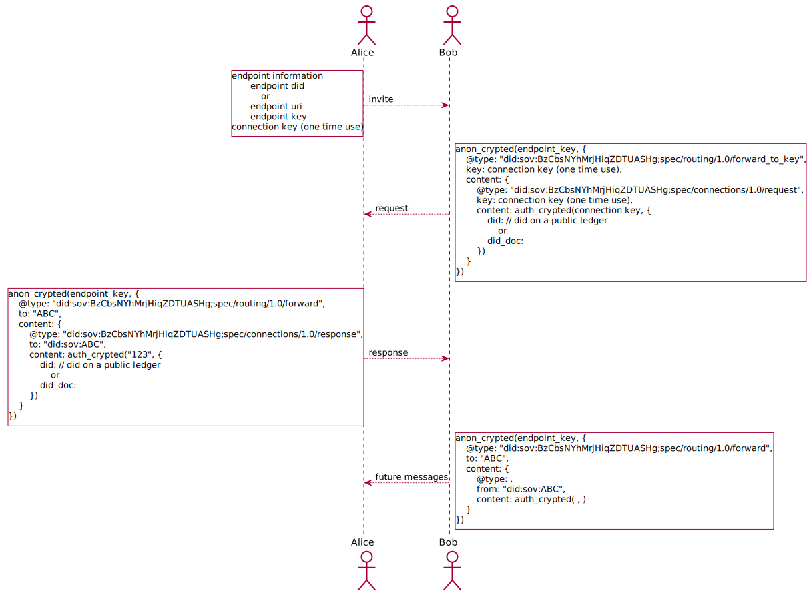

- Name: Messaging Protocol
- Authors: Ryan West ryan.west@sovrin.org & Daniel Bluhm daniel.bluhm@sovrin.org
- Start Date: 2018-6-29
- PR:
- Jira Issue: https://jira.hyperledger.org/browse/IA-18

# Summary
[summary]: #summary

This HIPE describes the protocol to establish connections between agents with the assumption that message transportation is [solved](https://github.com/hyperledger/indy-hipe/pull/21).

# Motivation
[motivation]: #motivation

Indy agent developers want to create agents that are able to establish connections with each other and exchange secure
information over those connections. For this to happen there must be a clear connection protocol.

# Tutorial
[tutorial]: #tutorial

We present the scenario in which Alice and Bob wish to communicate. The following interactions and messages that must be sent between them to
establish a secure, persistent channel for communication:

1. [Invitation to connect](#1-invitation) (optional; dependent on scenario as explained later)
2. [Connection Request](#2-connection-request)
3. [Connection Response](#3-connection-response)
4. [Bob's Acknowledgement](#4-bobs-acknowledgement)
5. [Alice's Acknowledgement](#5-alices-acknowledgement)

Each of these steps is explored in detail below.

## 1. Invitation to Connect
[1-invitation]: #1-invitation

An invitation to connect may be implemented in any proprietary way. The result of an invitation to connect must result in
the essential data necessary to initiate a [Connection Request](#2.-connection-request) message. An invitation to connect
is an **out-of-band communication** and not a true agent [message type](https://github.com/hyperledger/indy-hipe/pull/19).
The necessary data that an invitation to connect must result in is:
* endpoint did
* connection key (one time use)

or

  * endpoint uri
  * endpoint key
* connection key (one time use)

If an endpoint DID is used, it is assumed that the endpoint uri and endpoint key can be looked up in the DID Document that
the DID references. Otherwise, the endpoint uri and endpoint key are explicitly provided.

The market will provide many diverse "invitation to connect" implementations. Some potential ways are:

|  | In-Person | Remote |
| :---: | --- | --- |
| **Online** | Bump phones<br>QR Codes<br>Text message | Being introduced by a common friend<br>Text message |
| **Offline** | Bump phones<br>Bluetooth |  |


#### Example
Alice first creates an invitation to connect, which gives Bob the necessary information to initiate a connect request with her.
This can be done in person (perhaps using a QR code), or remotely using a previously established secure connection.

After receiving Alice's invitation to connect, Bob may generate the DID and keys that will be used in the Alice to
Bob (`A:B`) relationship and create a connection request message.


## 2. Connection Request
[2-connection-request]: #2-connection-request

The connection request message is used to communicate the DID and Verification key generated for a pairwise relationship
from one of the connecting parties to the other.

#### Example
When Bob receives Alice's invitation to connect, he initiates establishing the connection by sending a connection request message.
Bob sends Alice a message containing the following:

```
{
  "@type": "did:sov:BzCbsNYhMrjHiqZDTUASHg;spec/connections/1.0/request",
  "key": "connection key (one time use)",
  "content": auth_crypted(connection key, {
    "did": "B.did@B:A" // did on a public ledger
      or
    "did_doc": "..."
  })}
}
```
#### Attributes
* The `@type` attribute is a required string value (following the structure outlined by a HIPE on message
  types) and denotes that the received message is a connection request.
* The `key` attribute is a required string value and denotes the key used to [auth encrypt](https://github.com/hyperledger/indy-hipe/pull/22) the content intended for the verification key associated to the DID at the agent.
* The `content` attribute of the base message is required, is auth encrypted, and is an object containing the following
  attributes:
    * `did`: the DID created by the sender for the relationship that can be located on the public ledger.
    
    or
    
    * `did_doc`: a [DID Document](https://w3c-ccg.github.io/did-spec/#did-documents) that contains at least the following:
      * `did`:  the DID generated by the sender for the pairwise relationship.
      * `verkey`: the verification key created by the sender for the pairwise relationship. 
      * `endpoint uri`: URI of the endpoint to which a connection request and future messages will be sent.
      * `endpoint key`: verification key used to encrypt traffic to this endpoint.

#### Alice Receives the Request
After receiving the connection request, Alice stores the DID, verification key, and endpoint information sent by Bob in
her wallet. Alice then prepares to send a connection response be generating her DID and key for the relationship.

## 3. Connection Response
[3-connection-response]: #3-connection-response

The connection response message is used to communicate the DID and Verification key generated for a pairwise relationship
from the remaining connecting party to the other.

#### Example
If Alice still wants to communicate with Bob, she sends a connection response.

```
{
  "@type": "did:sov:BzCbsNYhMrjHiqZDTUASHg;spec/connections/1.0/response",
  "to": "did:sov:ABC",
  "content": auth_crypted("123", {
    "did": "A.did@A:B" // did on a public ledger
        or
    "did_doc": "..."
  })
}
```

#### Attributes

* The `@type` attribute is a required string value (following the structure outlined by a HIPE on message
  types) and denotes that the received message is a connection request.
* The `to` attribute is a required string value and denotes the intended DID to whom the message is sent.
* The `content` attribute of the base message is required, is auth encrypted, and is an object containing the following attributes:
    * `did`: the DID created by the sender for the relationship that can be located on the public ledger.
    
    or
    
    * `did_doc`: a [DID Document](https://w3c-ccg.github.io/did-spec/#did-documents) that contains at least the following:
      * `did`:  the DID generated by the sender for the pairwise relationship.
      * `verkey`: the verification key created by the sender for the pairwise relationship. 
      * `endpoint uri`: URI of the endpoint to which a connection request and future messages will be sent.
      * `endpoint key`: verification key used to encrypt traffic to this endpoint.

#### Connection Established
The connection between Alice and Bob is now established and any subsequent messages in the relationship can be
auth-encrypted from the sender to the receiver. The remaining steps of the connection process are intended to verify not
only connectivity but also that the key exchange was successful.


The next step of establishing a connection could be exchanging credentials to prove both Alice's and Bob's identities.

# Diagram


# Reference
[reference]: #reference

* https://docs.google.com/document/d/1mRLPOK4VmU9YYdxHJSxgqBp19gNh3fT7Qk4Q069VPY8/edit#heading=h.7sxkr7hbou5i
* [Agent to Agent Communication Video](https://drive.google.com/file/d/1PHAy8dMefZG9JNg87Zi33SfKkZvUvXvx/view)
* [Agent to Agent Communication Presentation](https://docs.google.com/presentation/d/1H7KKccqYB-2l8iknnSlGt7T_sBPLb9rfTkL-waSCux0/edit#slide=id.p)

# Drawbacks
[drawbacks]: #drawbacks

* In a connection request message, because the pairwise DIDs have not yet been created, Bob cannot auth-encrypt the
  content of his message. Thus, if an agency were to decrypt the overall message and forward it to Alice's edge agent,
  the agency would see the connection request's content in plaintext. This could potentially be a security concern.
  However, we have chosen to discuss agents and agencies in a future hipe rather than combine them.

# Rationale and alternatives
[alternatives]: #alternatives

- The acknowledgement steps are not necessarily vital to the connection process as all the necessary keys and DIDs
  needed for secure communication are transmitted to both parties by the end of the connection response step.

# Prior art
[prior-art]: #prior-art

- This process is similar to other key exchange protocols.

# Unresolved questions
[unresolved]: #unresolved-questions

- This HIPE makes some assumptions about the underlying secure transport protocol in the absence of an official HIPE
  detailing the specifics of that protocol. In general, this HIPE assumes that message transportation has been solved.

  These assumptions were made to somewhat simplify the process for explanation in this HIPE but also show that no
  information is ever sent in plaintext over the wire. Suggestions are welcome on how to better word these aspects of
  this HIPE.

- Is the `negotiate_msg` flow outlined
  [here](https://github.com/sovrin-foundation/ssi-protocol/tree/master/flow/std/negotiate_msg) applicable and should
  terminology used here be altered to match those used in this flow?
