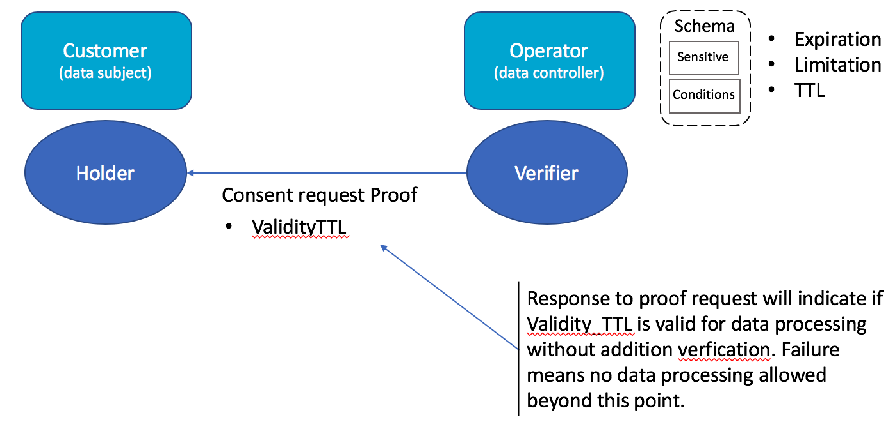
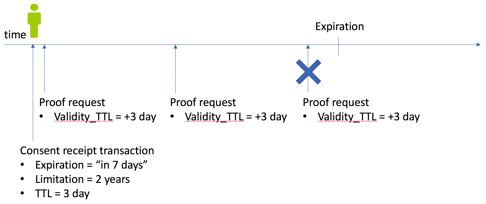
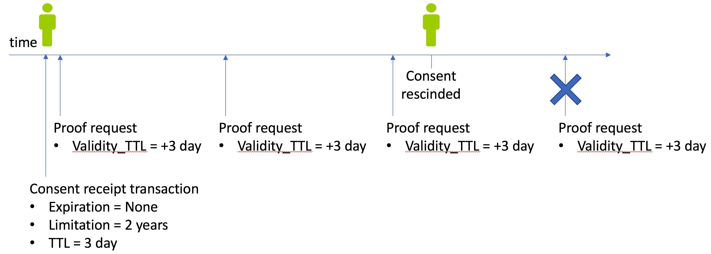
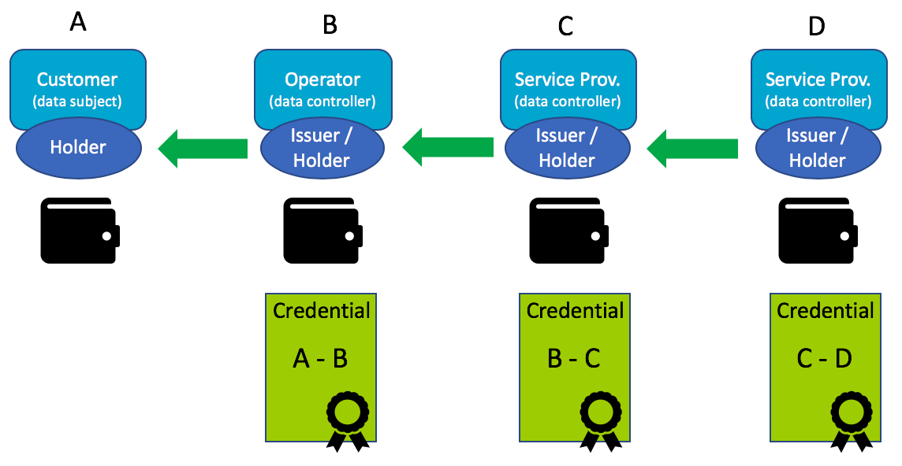
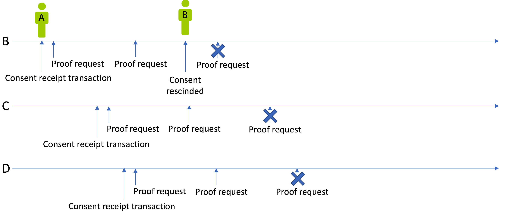
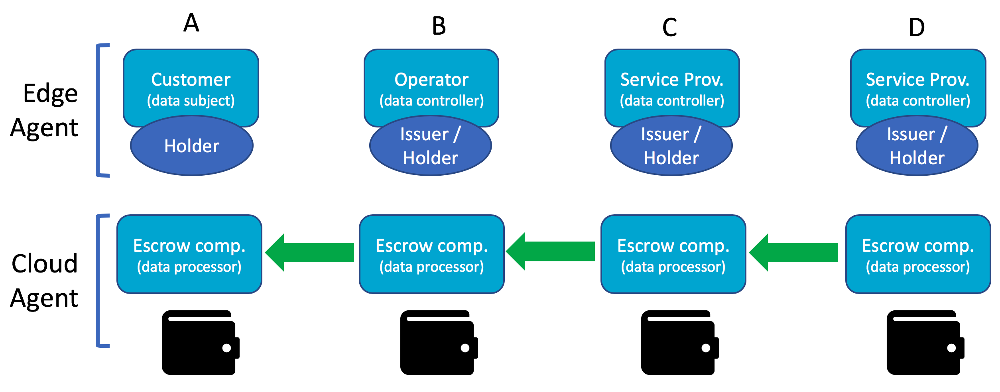
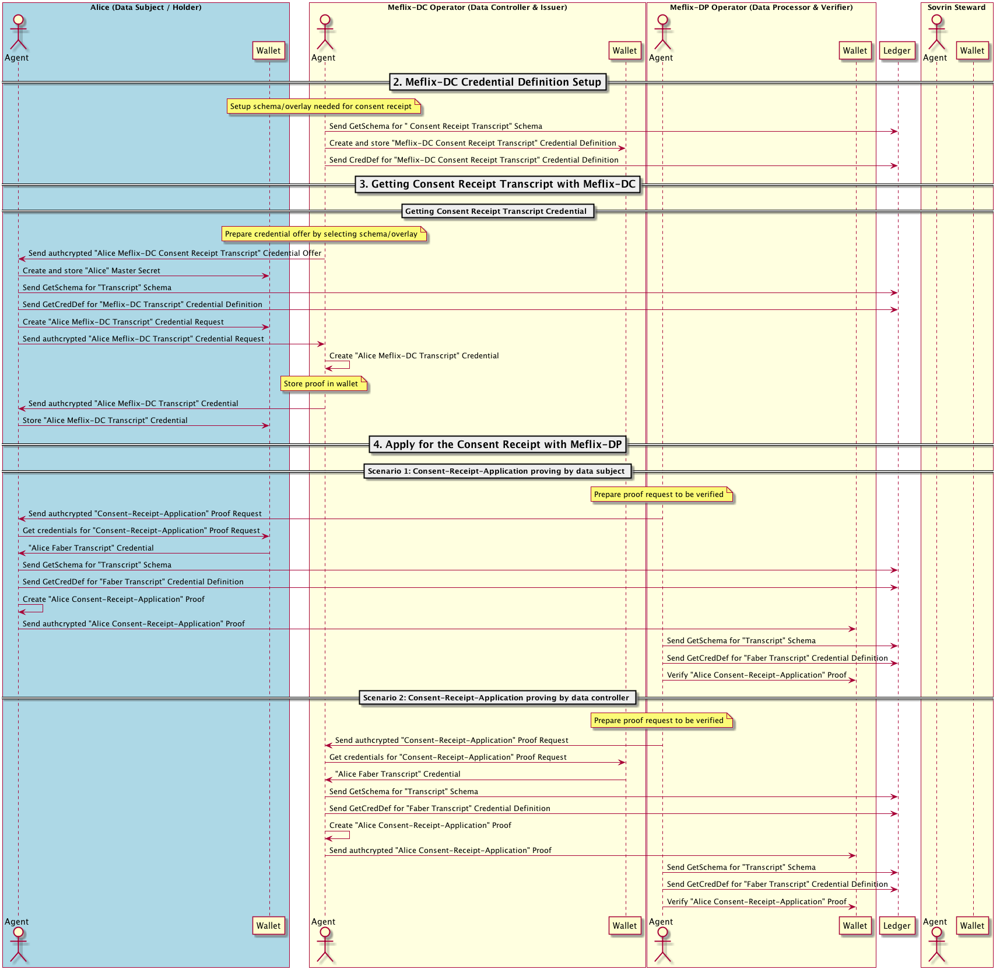

- Name: consent-receipt
- Author: Jan Lindquist
- Start Date: 2018-11-08
- PR: (leave this empty)
- Jira Issue: (leave this empty)

# Summary
[summary]: #summary

The support of consent receipt is not fully developed in Indy and this HIPE proposes changes to clarify the support of consent receipt certificate. The consent receipt is fundamental to create more accountability during data processing associated with the privacy policy specially in the area of data sharing.

*Note:
This HIPE is work in progress and will be completed based on feedback.*

# Motivation
[motivation]: #motivation

Indy provides the perfect framework for managing personal data or PII. When necessary data is restricted to protect the identity of the individual or data subject. Currently the privacy policy that is agreed to when signing up for a new service dictates how PII data is managed and for which purpose. Currently there is no clear technology to hold a company accountable for the privacy policy. By using blockchain the consent receipt increases accountability. The consent is not limited to a single Issuer and Holder but to a series of institutions that process the data from the original data subject. The beauty of this HIPE proposal is that the accountability is extended to ALL parties that are using the data subject's PII data. When the data subject opt out from a consent so is the consent receipt across all institutions.

GDPR promotes "privacy by design" but there is no technology behind it. To address the technological gap Indy can cover a number of principals in GDPR.

# Tutorial
[tutorial]: #tutorial

## Concepts

These are some concepts that are important to understand when reviewing this HIPE.

**Data Sub-Controller**: The terms data subject and data controller should be well understood. What is important to understand is that data controller is responsible for the data even if shared beyond their control. If data is shared to a 3rd party to provide an independent service the original data controller is also responsible for the data under GDPR. The 3rd party becomes a sub-controller under the responsibility of the original data controller.

**Opt-in / Opt-out**: There are 2 different forms of consent. One is based on accepting the privacy policy that explains legitimate reasons for data processing. The other form of consent is when an institution requests to use PII data beyond the limits of legitimate reasons for conducting a service. If for example the data is shared with a 3rd party a consent or **opt-in** is required. At any point the data subject may withdraw the consent through an **opt-out**.

**Expiration**: The consent may specify time limitations for how long data is kept on a data subject that may require renewal. The renewal cannot be automatic with agreement by the data subject. The data subject may have a yearly subscription or one month trial. There needs to be a mechanism to ensure the consent is limited to the duration of the service.

**Storage limitation**: PII data should not be stored indefinitely and need to have a clear storage limitation. Storage limitation as defined by GDPR limits how long PII data is kept to fulfill the legitimate reasons for providing a service.

**Processing TTL**: Indy currently supports proof only limited to a specific point in time. For companies that collect data over time to check for proof every minute is not a viable solution. The **processing Time To Live (TTL)** gives allowances for data ingestion to be done for an extended period without requiring performing new proof request. Further down examples will be given that explain the usage of the term.

**Data minimisation**:
*to be completed*

## Use cases

These are the use cases to be covered by this HIPE. The use cases are broken down into 3 areas:
* Consent receipt credential: to understand relation between data subject and data controller
* Data Sub-controller: how sharing of data is supported
* Introduction of edge and cloud agents: use case is included to better understand implementation.

### One Data Controller

These use cases are based on a single data controller.

1. Consent receipt credential


2. Consent receipt proof



3. Consent receipt expiration

Proof request shall be done without requesting date but simply to check if valid before a specific date with a True/False response. Reason is that a lot can be revealed if knowledge of when consent expires or is rescinded.



4. Consent receipt rescinded



5. Update to consent (data minimisation)

*to be completed*

### Data Sub-controller

1. Consent receipt between data controllers



2. Consent receipt rescinded and management across data controllers



### Introduction of edge and cloud agents

The term edge and cloud agent represents how not every data subject or institution will have their own wallet. The cloud agent is the custodian for the edge agent in managing the wallet and ensuring GDPR compliance. The diagram depicts the relation between customer, operator, and service providers when sharing data. This is a different representation of the diagram shown for data sub-controllers.



A wallet depicted for the data subject may not be required and depend on the level of sensitivity of the keys and other data that is collected. Wallet is only needed when there is a bigger risk. Refer to this [HIPE](https://github.com/hyperledger/indy-hipe/blob/master/text/0013-wallets/README.md) for a better understanding of when to have a wallet or not.

## Example: Sequence diagram

The following sequence diagram provides an overview of the sequence diagram between  agents.



For a more complete sequence from setting up steward to onboarding refer to [this sequence](consent-receipt.png). Note it is very detailed.

## Example: schemas

When defining a schema there will be a consent schema associated with it.
```
SCHEMA = {
      did: "did:sov:3214abcd",
    name: 'Demographics',
    description: "Created by Meflix",
    version: '1.0',
    # MANDATORY KEYS
    attr_names: {
      brthd: Date,
      ageic: Integer
    },
    consent: did:schema:27312381238123  # reference to consent schema
    # Attributes flagged according to the Blinding Identity Taxonomy
    # by the issuer of the schema
    # OPTIONAL KEYS
    frmsrc: "DEM"
}
```

The original schema will have a consent schema reference.

```
CONSENT_SCHEMA = {
    did: "did:schema:27312381238123",
    name: 'Consent schema for consumer behaviour data',
    description: "Created by Meflix",
    version: '1.0',
    # MANDATORY KEYS
    attr_names: {
      expiration: Date,
      limitation: Date,
      dictatedBy: String,
      validityTTL: Integer
    }
}
```
The consent schema will have specific attributes for managing data.

Attribute | Purpose | Type
--- | --- | ---
expiration | How long consent valid for | Date
limitation | How long is data kept | Date
dictatedBy | Who sets expiration and limitation | String
validityTTL | Duration proof is valid for purposes of data processing | Integer

The issuer may optionally define an overlay that sets the consent schema values without input from the data subject.

```
CONSENT_RECEIPT_OVERLAY = {
  did: "did:sov:5678abcd",
  type: "spec/overlay/1.0/consent_entry",
  name: "Consent receipt entry overlay for clinical trial",
  default_values: [
    :expiration => 3 years,
    :limitation => 2 years,
    :dictatedBy = <reference to issuer> # ??? Should the DID of the issuer's DID be used?
    :validityTTL => 1 month
    ]
}
```

If some attributes are identified as sensitive based on the Blinding Identity Taxonomy when a sensitivity overlay is created.
```
SENSITIVE_OVERLAY = {
	did: "did:sov:12idksjabcd",
  type: "spec/overlay/1.0/bit",
  name: "Sensitive data for private entity",
  attributes: [
      :ageic
  ]
}
```

To finalise a consent a proof schema has to be created which lists which schemas and overlays applied and values. The proof is kept off ledger in the wallet.

```
PROOF_SCHEMA = {
    did: "did:schema:12341dasd",
    name: 'Credential Proof schema',
    description: "Created by Rosche",
    version: '1.0',
    # MANDATORY KEYS
    attr_names: {
      createdAt: DateTime,           # How long consent valid for.
      proof_key: "<crypto asset>",   # How long data is kept.
      # Include all the schema did that were agreed upon
      proof_of: [ "did:sov:3214abcd", "did:sov:1234abcd"]
    }
}
```

# Reference
[reference]: #reference

[Is Self-Sovereign Identity the ultimate GDPR compliance tool? (1 of 3)](https://medium.com/evernym/is-self-sovereign-identity-ssi-the-ultimate-gdpr-compliance-tool-9d8110752f89)
An excellent article on how self-sovereign identity (SSI) complies with GDPR.

[customercommons.org](http://customercommons.org/) provides a benchmark of the work being proposed by this HIPE draft. A reference is included in the eventuality that what is being proposed by this HIPE requires some external validation.


# Drawbacks
[drawbacks]: #drawbacks

*Why should we not do this?*

# Rationale and alternatives
[alternatives]: #alternatives


# Prior art
[prior-art]: #prior-art

## ETL process
Current data processing of PII date is not based on blockchain. Data is processed through ETL routines (ex. AWS API Gateway and Lambda) with a data warehouse (ex. AWS Redshift). The enforcement of GDPR is based on adding configuration routines to enforce storage limitations. Most data warehouses do not implement pseudonymization and may instead opt to have a very short storage limitation of a couple of months. The current practice is to collect as much data as possible which goes against data minimisation.

## Personal Data Terms and Conditions
The Customer Commons iniative ([customercommons.org](customerocmmons.org)) has developed a [terms and conditions](https://docs.google.com/document/d/1Wf7kaXRn85pSEy8kKiX7GsVmZ295x_HbX5M0Ddu7D1s/edit) for personal data usage. The implementation of these terms and conditions will be tied to the schema and overlay definitions. The overlay will specify the conditions of sharing. For more broader conditions the schema will have new attributes for actual consent for data sharing. The work by Hypeledger Indy and Customer Commons complement each other.

# Unresolved questions
[unresolved]: #unresolved-questions
These are open questions that are being worked on.

## Terminology

These are some terms that need to be double checked.

### Consent receipt transcript credential

Consider creating new term that better represents credential. For example "consent agreement credential". Reason for new term is to avoid possible misconceptions with transcript.

## Schema questions

### Schema overview

There is a regular schema, consent schema, proof schema, consent receipt overlay, sensitivity overlay, entry overlay... Need to possible list all types and their relation.

### Proof sample needs to be elaborated

 Schema proof has been proposed but need to agree on content of proof that will be stored in wallet.

 Questions to be answered by proof
 - SchemaVersion: Proof of will point at specific schemas but new versions may be created using the same DID. Consequence is that new attributes may be introduced. The version of the schema may be required to avoid failing to get new proof when new attributes are added.


### Review Resource Consent from hl7.org and how it matches Hyperledger Indy

 Sample fields from hl7 being reviewed
 - ConsentForm explaining purpose
 - Period instead of expiration??      AP: add to proof
 - Organisation who is Data Controller
 - PolicyRule which reflects conditions of usage

References to hl7.org

Explanation
https://www.hl7.org/fhir/2018Sep/consent.html

Examples
https://www.hl7.org/fhir/consent-examples.html

## Data processing

Describe what data is collected and where it is stored.

## Consensus model

Describe consensus model used for creating credential and performing proof.
