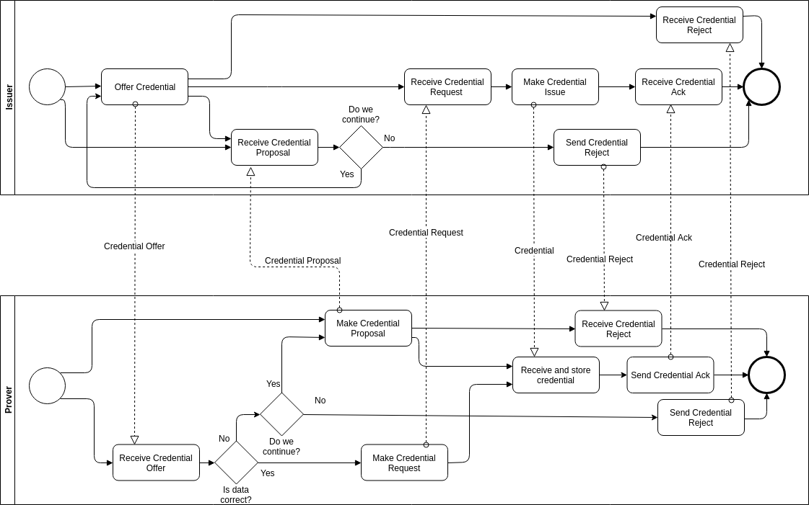
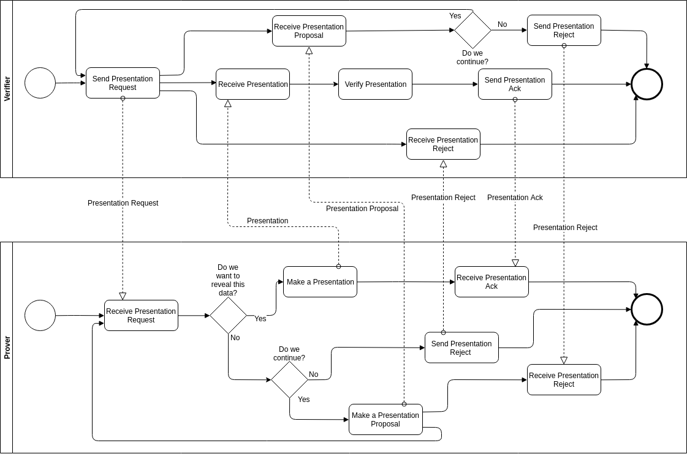

- Name: credential-exchange-message-family
- Author: Nikita Khateev
- Start Date: 2019-01-30
- PR: (leave this empty)
- Jira Issue: (leave this empty)

# Summary
[summary]: #summary

Formalization and generalization of existing message formats used for credential
exchange according to existing HIPEs about message formats.

# Motivation
[motivation]: #motivation

We need to define standard protocols for credential issuance and presentation.

# Tutorial
[tutorial]: #tutorial

Credential exchange consists of two processes connected by data. Therefore, we need 2 message families -- one for credential issuance and another one for credential presentation.

## Credential Issuance

The Credential Issuance Message Family consists of these messages:

* Credential Offer
* Credential Request
* Credential Issue
* Credential Ack
* Credential Reject

#### Choreography Diagram:



#### Credential Offer
This message is sent by Issuer to Prover to initiate credential issuance. Schema:
```json
{
    "@type": "did:sov:BzCbsNYhMrjHiqZDTUASHg;spec/credential-issuance/1.0/credential-offer",
    "@id": "<uuid-offer>",
    "cred_def_id": "KTwaKJkvyjKKf55uc6U8ZB:3:CL:59:tag1",
    "comment": "some comment",
    "credential_preview": <json-ld object>,
    "~attach": [
        {
            "nickname": "libindy-offer",
            "mime-type": "application/json",
            "content": {
                "base64": "<bytes for base64>"
            }
        }
    ]
}
```

Description of fields:
* `comment` -- a field that provide some human readable information about this Credential Offer;
* `cred_def_id` -- id cof credential definition for offered credential
* `credential_preview` -- a JSON-LD object that represents the credential data that Issuer is willing to issue. It should follow the schema of [Credential Preview](#credential-preview);
* attachment `libindy-offer` -- data for libindy about credential offer. It is base64 encoded. Here is an example of what lies inside, more information is in [Libindy API](https://github.com/hyperledger/indy-sdk/blob/57dcdae74164d1c7aa06f2cccecaae121cefac25/libindy/src/api/anoncreds.rs#L280) :
```json
{
   "schema_id": string,
   "cred_def_id": string,
   "nonce": string,
   "key_correctness_proof" : <key_correctness_proof>
}
```

#### Credential Proposal

This message is sent by Prover in response to Credential Offer when Prover wants some fixes or changes in credential offered by Issuer. Schema:
```json
{
    "@type": "did:sov:BzCbsNYhMrjHiqZDTUASHg;spec/credential-issuance/1.0/credential-proposal",
    "@id": "<uuid-credential-proposal>",
    "credential_proposal": <json-ld object>,
    "schema_id": "Schema ID string",
    "cred_def_id": "Credential Definition ID string"
}
```

Description of attributes:
* `credential_proposal` -- a JSON-LD object that represents the credential data that Proverwants to receive. It should follow the schema of [Credential Preview](#credential-preview);
* `schema_id` -- optional filter to request credential based on particular Schema
* `cred_def_id` -- optional filter to request credential based on particular Credential Definition

#### Credential Request
This message is sent in response to Credential Offer by Prover to give needed details for credential issuance. Schema:
```json
{
    "@type": "did:sov:BzCbsNYhMrjHiqZDTUASHg;spec/credential-issuance/1.0/credential-request",
    "@id": "<uuid-request>",
    "cred_def_id": "2hoqvcwupRTUNkXn6ArYzs:3:CL:1766",
    "comment": "some comment",
    "~attach": [
        {
            "nickname": "libindy_cred_req",
            "mime-type": "application/json",
            "content": {
                "base64": "<bytes for base64>"
            }
        },
    ]
}
```

Description of Fields:
* `cred_def_id` -- Credential Definition ID for requested credential
* `comment` -- a field that provide some human readable information about this Credential Offer.
* attachment `libindy_cred_req` -- an attachment with data that is needed to Issuer to generate a credential. It is base64 encoded. Here is an example of what lies inside, more information is in [Libindy API](https://github.com/hyperledger/indy-sdk/blob/57dcdae74164d1c7aa06f2cccecaae121cefac25/libindy/src/api/anoncreds.rs#L658):
```json
{
  "prover_did" : string,
  "cred_def_id" : string,
  "blinded_ms" : <blinded_master_secret>,
  "blinded_ms_correctness_proof" : <blinded_ms_correctness_proof>,
  "nonce": string
}
```


#### Credential Issue
This message contains the credential and sent in responce to Credential Request. Schema:
```json
{
    "@type": "did:sov:BzCbsNYhMrjHiqZDTUASHg;spec/credential-issuance/1.0/credential",
    "@id": "<uuid-credential>",
    "rev_reg_def_id": "<rev_reg_def_id>",
    "cred_def_id": "2hoqvcwupRTUNkXn6ArYzs:3:CL:1766",
    "~attach": [
        {
            "nickname": "libindy-cred",
            "mime-type": "application/json",
            "content": {
                "base64": "<bytes for base64>"  
            }
        }
    ]
}
```

Description of fields:

* `rev_reg_def_id` -- an ID of Revocation Registry Definition for this credential
* `cred_def_id` -- ID of Credential Definition this credential were issued to
* attachment `libindy-cred` -- an actual credential to store, it is a json encoded in base64. Here is the schema of what lies in it and you can find more information in [Libindy API](https://github.com/hyperledger/indy-sdk/blob/57dcdae74164d1c7aa06f2cccecaae121cefac25/libindy/src/api/anoncreds.rs#L338):
```json
{
    "schema_id": string,
    "cred_def_id": string,
    "rev_reg_def_id": Optional<string>,
    "values": <see cred_values_json above>,
    "signature": <signature>,
    "signature_correctness_proof": <signature_correctness_proof>
}
```

#### Credential Preview

This is not a message but an inner object for other messages in this message family. It is used to make a preview of credential that is going to be issued. Schema:

```json
{
    "@type": "did:sov:BzCbsNYhMrjHiqZDTUASHg;spec/credential-issuance/1.0/credential-preview",
    "attributes": [
        {
            "name": "attribute name",
            "mime-type": "type",
            "value": "value"
        },
        ...
    ]
}
```

The main field here is `attributes`. It is an array of objects with three fields in it:
* `name` -- string with atribute name;
* `mime-type` -- type of attribute
* `value` -- value of credential

## Credential Presentation

The Credential Presentation Message Family consists of 4 messages:

* Presentation Request
* Presentation
* Presentation Ack
* Presentation Reject

#### Choreography Diagram:



#### Presentation Request
Presentation Request is a message from Verifier to Prover that describes values that need to be revealed and predicates that need to be fulfilled. Schema:
```json
{
    "@type": "did:sov:BzCbsNYhMrjHiqZDTUASHg;spec/credential-presentation/1.0/presentation-request",
    "@id": "<uuid-request>",
    "comment": "some comment",
    "~attach": [
        {
            "nickname": "libindy-presentation-request",
            "mime-type": "application/json",
            "content":  {
                "base64": "<bytes for base64>"
            }
        }
    ]
}
```

Description of fields:

* `comment` -- a field that provide some human readable information about this Credential Offer.
* attachment `libindy-presentation-request` -- base64-encoded data needed for libindy to process presentation request. Here is the schema of what lies in it and you can find more information in [Libindy API](https://github.com/hyperledger/indy-sdk/blob/57dcdae74164d1c7aa06f2cccecaae121cefac25/libindy/src/api/anoncreds.rs#L1214):
```json
{
     "name": string,
     "version": string,
     "nonce": string,
     "requested_attributes": {
          "<attr_referent>": <attr_info>,
     },
     "requested_predicates": {
          "<predicate_referent>": <predicate_info>,
     },
     "non_revoked": Optional<<non_revoc_interval>>,
}
```

#### Presentation
This message is a response to a Presentation Request message and contains signed presentations. Schema:
```json
{
    "@type": "did:sov:BzCbsNYhMrjHiqZDTUASHg;spec/credential-presentation/1.0/presentation",
    "@id": "<uuid-presentation>",
    "comment": "some comment",
    "~attach": [
        {
            "nickname": "libindy-presentation",
            "mime-type": "application/json",
            "content": {
                "base64": "<bytes for base64>"
            }
        },
    ]
}
```

Decription of fields:

* `comment` -- a field that provide some human readable information about this Credential Offer.
* attachment `libindy-presentation` -- actual presentation for presentation request, represented by base64-encoded json. Here is the schema of what lies in it and you can find more information in [Libindy API](https://github.com/hyperledger/indy-sdk/blob/57dcdae74164d1c7aa06f2cccecaae121cefac25/libindy/src/api/anoncreds.rs#L1404):
```json
{
     "requested_proof": {
         "revealed_attrs": {
             "requested_attr1_id": {sub_proof_index: number, raw: string, encoded: string},
             "requested_attr4_id": {sub_proof_index: number: string, encoded: string},
         },
         "unrevealed_attrs": {
             "requested_attr3_id": {sub_proof_index: number}
         },
         "self_attested_attrs": {
             "requested_attr2_id": self_attested_value,
         },
         "requested_predicates": {
             "requested_predicate_1_referent": {sub_proof_index: int},
             "requested_predicate_2_referent": {sub_proof_index: int},
         }
     }
     "proof": {
         "proofs": [ <credential_proof>, <credential_proof>, <credential_proof> ],
         "aggregated_proof": <aggregated_proof>
     }
     "identifiers": [{schema_id, cred_def_id, Optional<rev_reg_id>, Optional<timestamp>}]
}
```

#### Presentation Proposal

This message is sent by Prover to offer another set of attributes for Verifier. Schema:

```json
{
    "@type": "did:sov:BzCbsNYhMrjHiqZDTUASHg;spec/credential-presentation/1.0/presentation-proposal",
    "@id": "<uuid-presentation-proposal>",
    "presentation_proposal": <json-ld object>
}
```
Description of attributes:
* `presentation_proposal` -- a JSON-LD object that represents the presentation example that Prover wants to provide. It should follow the schema of [Presentation Preview](#presentation-preview);

#### Presentation Preview

This is again not a message but an inner object. It is used to negotiate a presentation request sent by Verifier. Schema:

```json
{
    "@type": "did:sov:BzCbsNYhMrjHiqZDTUASHg;spec/credential-presentation/1.0/presentation-request-preview",
    "name": "request name",
    "requested_attributes": {
        "attr_name": {
            "name": "attribute name",
            "restrictions": <json object>,
            "non_revoked": {
                "from": <u64>,
                "to": <u64>
            }
        },
    },
    "requested_predicates": {
        "pred_name": {
            "name": "attribute name",
            "p_type": ">=",
            "p_value": <u64>,
            "restrictions": <json object>,
            "non_revoked": {
                "from": <u64>,
                "to": <u64>
            }
        },
    },
    "non_revoc_interval": {
        "from": <u64>,
        "to": <u64>
    }
}
```

Description of fields:
* `name` -- a name of presentation request;
* `requested_attributes` -- a json object, where keys contain identifier for a requested attribute, and value is an object that describes an attribute.
Fields of this object: 
    * `name` -- name of needed attribute
    * `restrictions` -- restriction on a credential to get attribute from. The language for this restrictions is WQL -- wallet query language. It is described in [this document](https://github.com/hyperledger/indy-sdk/tree/5f47aaf3713abff4ace2d69822f3c0644c0efa5e/docs/design/011-wallet-query-language). Optional field.
    * `non-revoked` -- JSON object with to fields `from` and `to`. It describes precise time interval in which credential with this attribute should not be revoked. Optional field.
* requested_predicates` -- a json object, where keys contain identifier for a requested predicate, and value is an object that describes an predicate.
Fields of this object:
    * `name` -- name of needed predicate;
    * `restrictions` -- same restrictions, as in `requested_attributes`;
    * `non-revoked` -- same as in `requested_attributes`;
    * `p_type` -- predicate type. Can be ">=", "<=", ">", "<", "="
    * `p_value` -- value to compare to.
* `non_revoc_interval` -- default revocation interval for all predicates and attributes. It has `from` and `to` fields as well, both are optional.

#### Presentation Reject
This message can be sent by any side of the conversation to finish credential issuance without any proof provided. Schema:
```json
{
    "@type": "did:sov:BzCbsNYhMrjHiqZDTUASHg;spec/credential-presentation/1.0/reject",
    "@id": "id"
}
```

#### Presentation Ack
This message is sent by Verifier as he confirms that he had received the proof and validated it. Schema:
```json
{
    "@type": "did:sov:BzCbsNYhMrjHiqZDTUASHg;spec/credential-presentation/1.0/ack",
    "@id": "id"
}
```

## Threading

All of the messages require threading to be connected into a chain of messages. Using it we can mark what message we are responding to.
If you send a Credential Offer / Presentation Request, it is a start of a thread.
If you send some other message in this process, it should have a thread decorator with `thid` field having the value of `@id` of Credential Offer / Presentation request.

More details about threading you can find in the [threading and message id HIPE](https://github.com/hyperledger/indy-hipe/blob/master/text/0027-message-id-and-threading/README.md)

## Previews and negotiation

All of the messages (except Credential and Ack/Reject) can be negotiated. For these purposes you should use these fields: `credential_preview` in Credential Offer and Credential Request, `libindy_presentation_request` for Presentation Request and `presentation_request_preview` for Presentation.

# Reference
[reference]: #reference

* [VCX](https://github.com/hyperledger/indy-sdk/tree/master/vcx/libvcx/src/api) -- this implementation might not be perfect and needs to be improved, you can gather some info on parameters purpose from it

# Drawbacks
[drawbacks]: #drawbacks

Why should we *not* do this?

# Prior art
[prior-art]: #prior-art

Similar (but simplified) credential exchanged was already implemented in [von-anchor](https://von-anchor.readthedocs.io/en/latest/). 

# Unresolved questions
[unresolved]: #unresolved-questions

- We might need to propose a new MIME type for credential (the same way as .docx is not processed as generic xml). The issue in W3C/vc-data-model: https://github.com/w3c/vc-data-model/issues/421
- We might need to have an extra message to inform Prover about revocation of his credential.
- It is a common practise when the change of some attributes in credential we revoke the old credential and issue a new one. It might be useful to have in Credential Offer message to have at least some connection between revocation and new offer.
- We might need some explicit documentation for nested `@type` fields.
- We need to provide a way to ask for some payment with Credential Offer and send payment receipt with Credential Request. It may be described generically in separate HIPE and this HIPE will be updated.