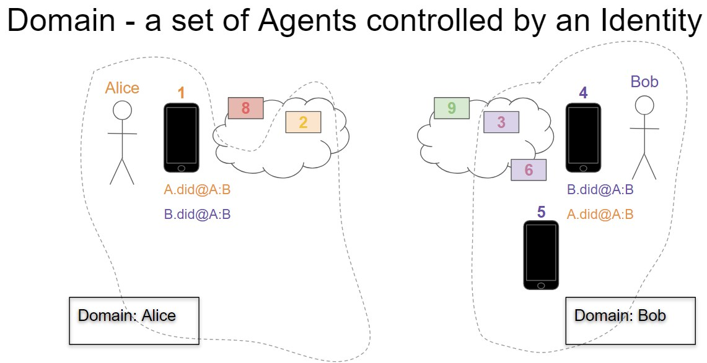
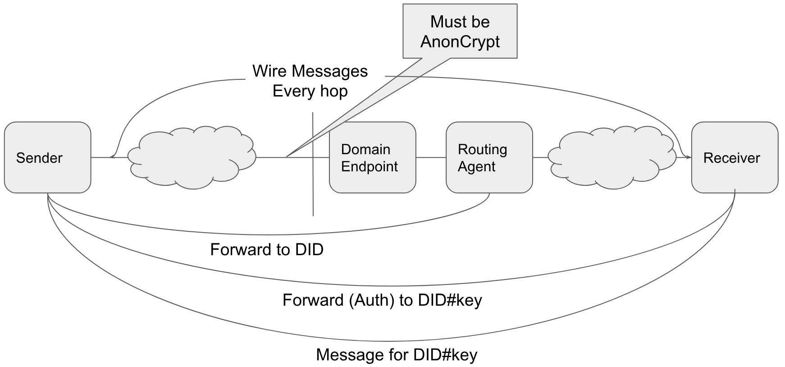

- Name: cross-domain-messaging
- Author: Stephen Curran (swcurran@gmail.com)
- Start Date: 2018-08-13
- PR:
- Jira Issue:

# Summary
[summary]: #summary

There are two layers of messages that combine to enable **interoperable** self-sovereign identity Agent-to-Agent communication. At the highest level are Agent Messages - messages sent between Identities to accomplish some shared goal. For example, establishing a connection between identities, issuing a Verifiable Credential from an Issuer to a Holder or even the simple delivery of a text Instant Message from one person to another. Agent Messages are delivered via the second, lower layer of messaging - Wire. A Wire Message is a wrapper (envelope) around an Agent Message to permit sending the message from one Agent directly to another Agent. An Agent Message going from its Sender to its Receiver may be passed through a number of Agents, and a Wire Message is used for each hop of the journey.

This HIPE addresses Cross Domain messaging to enable interoperability. This is one of a series of related HIPEs that address interoperability, including DIDDoc Conventions, Agent Messages and Wire Messages. Those HIPEs should be considered together in understanding Agent-to-Agent messaging.

In order to send a message from one Identity to another, the sending Identity must know something about the Receiver's domain - the Receiver's configuration of Agents. This HIPE outlines how a domain MUST present itself to enable the Sender to know enough to be able to send a message to an Agent in the domain.  In support of that, a family of Agent Messages (currently consisting of just one Message Type) is introduced to route messages through a network of Agents in both the Sender and Receiver's domain. This HIPE provides the specification of the "Forward" Agent Message Type - an envelope that indicates the destination of the Message without revealing anything about the message.

The goal of this HIPE is to define the rules that domains MUST follow to enable the delivery of Agent messages from a Sending Agent to a Receiver Agent in a secure and privacy-preserving manner.

# Motivation
[motivation]: #motivation

The purpose of this HIPE and its related HIPEs is to define a layered Messaging protocol such that we can ignore the transport of messages as we discuss the much richer Agent Messaging types and interactions. That is, we can assume that there is no need to include in an Agent message anything about how to route the message to the Receiver - it just magically happens. Alice (via her App Agent) sends a message to Bob, and (because of implementations based on this series of HIPEs) we can ignore how the actual message got to Bob's App Agent.

Put another way - these HIPEs are about envelopes. They define a way to put a message - any message - into an envelope, put it into an outbound mailbox and have it magically appear in the Receiver's inbound mailbox in a secure and privacy-preserving manner. Once we have that, we can focus on letters and not how letters are sent.

Most importantly for Agent to Agent interoperability, this HIPE clearly defines the assumptions necessary to deliver a message from one domain to another - e.g. what exactly does Alice have to know about Bob's domain to send Bob a message?

# Tutorial
[tutorial]: #tutorial

## Core Messaging Goals

These are vital design goals for this HIPE:

1. **Sender Encapsulation**: We SHOULD minimize what the Receiver has to know about the domain (routing tree or agent infrastructure) of the Sender in order for them to communicate.
2. **Receiver Encapsulation**: We SHOULD minimize what the Sender has to know about the domain (routing tree or agent infrastructure) of the Receiver in order for them to communicate.
3. **Independent Keys**: Private signing keys SHOULD NOT be shared between agents; each agent SHOULD be separately identifiable for accounting and authorization/revocation purposes.
4. ***Need To Know* Information Sharing**: Information made available to intermediary agents between the Sender and Receiver SHOULD be minimized to what is needed to perform the agents role in the process.

## Assumptions

The following are assumptions upon which this HIPE is predicated.

### Terminology

The following terms are used in this HIPE with the following meanings:

- Domain - a set of Agents collaborating on behalf of an Identity
  - It's assumed that the Agents of a Domain were developed by a single vendor and so MAY have implementation-specific mechanisms for tracking extra information one another.
  - An example of two Domains is provided in the image below.
- Edge Agents - the Agents involved in sending (creating) and receiving (processing) an Agent Message
  - Sender - the Agent sending an Agent Message
  - Receiver - the Agent receiving an Agent Message
  - **Note**: A message MAY pass through many Agents between the Sender and Receiver
- Domain Endpoint - a physical endpoint for messages into domains that MUST be assumed to be shared across many Identities
  - Shared by many identities (e.g. https://endpoint.agentsRus.com)
  - Agency - the handler for messages sent to the Domain Endpoint.
- Routing Agent - the single identity-controlled entry point for a Domain per relationship (DID)
  - A message addressed to a DID and delivered to a Domain Endpoint is passed directly to the Routing Agent for that DID
- DID - reference to the literal Decentralized ID text
  - e.g. did:sov:1234abcd
- DID#keyname - reference to the DID appended with "#" and a specific key from the DIDDoc
  - e.g. did:sov:1234abcd#1 references key "1" of the "did:sov:1234abcd" DIDDoc.
  - **Note**: The #keyname is NOT the actual Public Key - it's a reference to an entry in the DIDDoc that contains the Public Key.

#### DIDDoc

The term "DIDDoc" is used in this HIPE as it is defined in the [DID Specification](https://w3c-ccg.github.io/did-spec/):

- a collection of public keys and endpoints,
- controlled by an identity,
- associated with a DID, and
- used for a relationship.

A DID can be resolved to get its corresponding DIDDoc by any Agent that needs access to the DIDDoc. This is true whether talking about a DID on the Public Ledger, or a DID persisted to a microledger. In the case of a microledger, it's the (implementation specific) domain's responsibility to ensure such resolution is available to all Agents requiring it.

### Messages are Private

Agent Messages sent from a Sender to a Receiver SHOULD be private. That is, the Sender SHOULD encrypt the message with a public key for the Receiver. Any agent in between the Sender and Receiver will know only to whom the message is intended (by DID and possibly keyname within the DID), not anything about the message.

### The Sender Knows The Receiver

This HIPE assumes that the Sender knows the Receiver's DID and, within the DIDDoc for that DID, the keyname to use for the Receiver's Agent. How the Sender knows the DID and keyname to send the message is not defined within this HIPE - that is a higher level concern.

The Receiver's DID MAY be a public or pairwise DID, and MAY be on a Public Ledger or a microledger.

## Example: Domain and DIDDoc

The following is an example of an arbitrary pair of domains that will be helpful in defining the requirements in this HIPE.



In the diagram above:

- Alice has
  - 1 Edge Agent - "1"
  - 1 Routing Agent - "2"
  - 1 Domain Endpoint - "8"
- Bob has
  - 3 Edge Agents - "4", "5" and "6"
    - "6" is an Edge Agent in the cloud, "4" and "5" are physical devices.
  - 1 Routing Agent - "3"
  - 1 Domain Endpoint - "9"

### Bob's DID for his Relationship with Alice

Bob’s domain has 3 devices he uses for processing messages - two phones (4 and 5) and a cloud-based agent (6). However, in Bob's relationship with Alice, he ONLY uses one phone (4) and the cloud-based agent (6). Thus the key for device 5 is left out of the DIDDoc (see below).

Note that the keyname for the Routing Agent (3) is called "routing". This is an example of the kind of convention needed to allow the Sender's agents to know the keys for Agents with a designated role in the receiving domain - as defined in the `DIDDoc Conventions` HIPE.

```json
{
  "@context": "https://w3id.org/did/v1",
  "id": "did:sov:1234abcd",
  "publicKey": [
    {"id": "routing", "type": "RsaVerificationKey2018",  "owner": "did:sov:1234abcd","publicKeyPem": "-----BEGIN PUBLIC X…”}",
    {"id": "4", "type": "RsaVerificationKey2018",  "owner": "did:sov:1234abcd","publicKeyPem": "-----BEGIN PUBLIC 9…”}",
    {"id": "6", "type": "RsaVerificationKey2018",  "owner": "did:sov:1234abcd","publicKeyPem": "-----BEGIN PUBLIC A…”}
  ],
  "authentication": [
    {"type": "RsaSignatureAuthentication2018", "publicKey": "did:sov:1234abcd#4"}
  ],
  "service": [
    {"type": "Agency", "serviceEndpoint": "did:sov:fghi8377464" }
    // or "serviceEndpoint": "https://example.com/endpoint/8377464" and add the #domain key (above)
  ]
}
```

For the purposes of this discussion we are defining the message flow to be:

> 1 --> 2 --> 8 --> 9 --> 3 --> 4

However, that flow is arbitrary. Even so, some Wire Message hops are required:

- 1 is the Sender in this case and so must send the first message.
- 9 is the Domain Endpoint of Bob's domain and so must receive the message
- 4 is the Receiver in this case and so must receive the message.

In the section below on Domain Configuration, we will also declare that:

- The Routing Agent for Bob's Domain (3) must receive the message from 9

## Wire Messages

A Wire Message is used to transport any Agent Message from one Agent directly to another. In our example message flow above, there are five Wire Messages sent, one for each hop in the flow. The separate `Wire Messages` HIPE (*reference to be added*) covers those details.

## Agent Message Format

An Agent Message defines the format of messages processed by Agents. Details about the general form of Agent Messages can be found in the `Agent Message` HIPE (*reference to be added*). A list of specific Agent Message types is being assembled (*reference to be added*).

This HIPE specifies (below) the "Forward" message type, a part of the "Routing" family of Agent Messages.

## DID and DIDDoc

A DID owned by the Receiver is resolvable by the Sender as a DIDDoc using either a Public Ledger or a microledger. The related `DIDDoc Conventions` HIPE defines the required contents of a DIDDoc for receiving Agent to Agent messages (*reference to be added*) that supports the conventions defined in this document.

## Cross Domain Interoperability

A key goal for interoperability is that we want other domains to know just enough about the configuration of a domain to which they are delivering a message, but no more. The following walks through those minimum requirements.

### Required: The DID and DIDDoc

As noted above, the Sender of an Agent to Agent Message has the DID of the Receiver, and knows the key from the DIDDoc to use for the Receiver's Agents.

> Example: Alice wants to send a message from her phone (1) to Bob's phone (4). She has Bob's B:did@A:B, the DID/DIDDoc Bob created and gave to Alice to use for their relationship. Alice created A:did@A:B and gave that to Bob, but we don't need to use that in this example. The contents of the DIDDoc for B:did@A:B are presented above.

### Required: End-to-End encryption of the Agent Message

The Agent Message from the Sender SHOULD be hidden from all Agents other than the Receiver. Thus, it SHOULD be encrypted with the Public Key of the Receiver. Based on our assumptions, the Sender can get the Public Key of the Receiver because they know the DID#keyname string, can resolve the DID to the DIDDoc and find the public key associated with DID#keyname. In our example above, that is the key associated with "did:sov:1234abcd#4".

Most Sender-to-Receiver messages will be sent between parties that have shared pairwise DIDs. When that is true, the Sender will (usually) AuthCrypt the message. If that is not the case, or for some other reason the Sender does not want to AuthCrypt the message, AnonCrypt will be used. In either case, the Indy-SDK `pack()` function that is used for the encryption inserts in the JOSEhdr part of its output the type of encryption used.

To route the message to the Receiver, the Sender sends a 'Forward' message with the 'to' address being the DID#keyname of the Receiver. It is assumed that the Receiver can determine the from `did` based on the `to` DID using their pairwise relationship.

```json
{
  "@type" : "did:sov:BzCbsNYhMrjHiqZDTUASHg;spec/routing/1.0/forward"
  "to"   : "did:sov:1234abcd#4"
  "msg"  : "<pack(AgentMessage,valueOf(did:sov:1234abcd#4), privKey(A.did@A:B#1))>"
}
```

**Notes**

- the *type* value is in the precise URI format for the "forward" message type
- Indy-SDK's "pack" function is used to AuthCrypt the message using the Receiver's public key and the Sender's private key.
  - If the Sender wishes to remain anonymous or knows the Receiver does not know the Sender's public key, AnonCrypt is used.
  - More details about the Indy-SDK `pack()` function can be found in the `Wire Messages` HIPE (*reference to be provided*).
- The Indy-SDK's "unpack()" function MUST return the public key of the private key used to sign the message. See the note below for the background on this.

> The bullet above about the unpack() function returning the signer's public key deserves some additional attention. The Receiver of the message knows from the "to" field the DID to which the message was sent. From that, the Receiver is expected to be able to determine the DID of the Sender, and from that, access the Sender's DIDDoc. However, knowing the DIDDoc is not enough to know from whom the message was sent - which key was used to send the message, and hence, which Agent controls the Sending private key. This information MUST be made known to the Receiver (from unpack()) when AuthCrypt is so that the Receiver knows which key was used to the send the message and can, for example, use that key in responding to the arriving Message.

### Required: Minimize information available to the Shared Domain Endpoint

We want to minimize the knowledge about the Receiver of the Agent Message for minimally trusted agents. In this case, "minimally trusted" are all agents before the designated "Routing Agent" for the Receiver. The "Routing Agent" must know the exact destination (B:did@A:B#keyname) of the Receiver, but Agents handling the message prior to the Routing Agent do not - they just need the DID (B:did@A:B) of the Receiver.

To hide other than the minimum information, the Sender wraps the "Forward" message in a second forward message, this time for the Routing Agent of the Receiver (`3` in our example). The Sender must be able to get the public key of the Routing Agent from the DIDDoc.

The Sender prepares the following message:

```json
{
  "type" : "did:sov:BzCbsNYhMrjHiqZDTUASHg;spec/routing/1.0/forward"
  "to"   : "did:sov:1234abcd"
  "msg"  : "<pack(ForwardMessage,valueOf(did:sov:1234abcd#routing))>"
}
```

**Notes**

- Indy-SDK's "`pack()`" function is used to Anon encrypt the message using the Routing Agent's public key.
  - Since AnonCrypt is used for the message, the unpack() function does not have the Sender's public key to provide to the Routing Agent.

The Sender can now send the Forward Agent Message on its way via the first of the Wire messages. In our example, the Sender sends the Agent Message to 2, who in turn sends it to 8. That of course, is arbitrary - the Sender's Domain could have any configuration of Agents. The Agent Message above is passed unchanged, with each Agent able to see the "type", "to" and "msg" fields as described above. This continues until the outer `forward` message gets to the Receiver's Routing Agent, where it is processed (to expose the inner `forward` message). Per the Wire Message HIPE (*reference to be added*), between Agents the Agent Message is pack()'d and unpack()'d as appropriate or required.

The diagram below shows the required use of the 'forward' messages to encrypt the message all the way to the Receiver, and again all the way to the Routing Agent.



### Required: Cross Domain Wire Message Encryption

While within a domain the Agents MAY choose to use encryption or not when sending Wire Messages from Agent to Agent, encryption MUST be used when sending a Wire Message into the Receiver's domain. The Domain Endpoint (Agency) unpack()'s the encrypted Wire Message and based on the "To" field value (the DID), sends the message to a designated Agent for that DID. How the Domain Endpoint knows where to send the message is implementation specific - likely some sort of dynamic DID-to-Agent routing table. Typically the message will be sent directly to the Routing Agent, although it doesn't have to be. However, the message MUST get to the Routing Agent (3 in our example) as the messaging being forwarded has been encrypted for it.

### Required: The Routing Agent Processes the Outer Forward

When the Routing Agent (eventually) receives the message, it determines it is the target of the outer forward Agent Message and so decrypts the message's `msg` value to reveal the inner "Forward" message. Recall that this inner Forward includes the full "DID#keyname" necessary to route the message to the intended Receiver agent. The Routing Agent uses its (implementation specific) knowledge to map from the DID#keyname to the Receiver, possibly via intermediary Agents. Note that the Routing Agent could itself be the Receiver and thus, have to decrypt and process the embedded message without further routing.

### Required: The Receiver App Agent Decrypts/Processes the Agent Message

When the intended Receiver Agent receives the message, it determines it is the target of the Forward and decrypts the payload and processes the message.

### Exposed Data

The following summarizes the information needed by the Sender's agents:

- The DID to use for the relationship, and its related DIDDoc
- From the DIDDoc:
  - The Domain Endpoint's physical endpoint and public key
  - The Routing Agent's public key
  - The Receiver of the Agent Message's public key

Thus, every Messaging DIDDoc is assumed to have at least one endpoint and three keys:

- The endpoint for the Domain Endpoint
- The public key for the Domain Endpoint
- The public key for the Routing Agent
- The public key for the Receiver Agent

The DIDDoc will have an additional key for each additional Agent Message Receiver.

As defined in the DIDDoc Conventions HIPE, the endpoint and public key for the Domain Endpoint are found by resolving the Domain Endpoint's DID that is a service endpoint in the Receiver's DIDDoc.

#### Degenerate Cases

The sequence above requires there are at least three Agents within every domain, and there could be many more. However, what if there are only 2 or even 1 Agent in a domain?

The HIPE requirement in those degenerate cases is that the DIDDoc MUST contain the same data (one endpoint, three public keys), and so the implementation MUST handle this as an "Agents with multiple roles" use case. The DIDDoc SHOULD be implemented such that Agents have different keys for different purposes to mask the simplified Agent structure.

### Data Not Exposed

Given the sequence specified above, following data is **NOT** exposed to the Sender's agents:

- Routing-only Agents within the Receiver's domain
- Agents the identity chooses not to include in a given DIDDoc
- The physical endpoints of Agents within the Receiver's domain (other than the Domain Endpoint)
  - The physical endpoints and, as required, associated public keys, are shared as needed within the Receiver's domain.

# Message Types

The following Message Types are defined in this HIPE.

## Core:Routing:1.0:Forward

The core message type "forward", version 1.0 of the "routing" family is defined in this HIPE. An example of the message is the following:

```json
{
  "type" : "did:sov:BzCbsNYhMrjHiqZDTUASHg;spec/routing/1.0/forward"
  "to"   : "did:sov:1234abcd#4"
  "msg"  : "<pack(AgentMessage,valueOf(did:sov:1234abcd#4), privKey(A.did@A:B#1))>"
}
```

The `to` field is required and takes one of two forms:

- A DID without a key reference (e.g. `did:sov:1234abcd`)
- A DID with a key reference (e.g. `did:sov:1234abcd#4`)

The first form is used when sending forward messages across one or more agents that do not need to know the details of a domain. The Receiver of the message is the designated `Routing Agent` in the Receiver Domain, as it controls the key used to decrypt messages sent to the domain, but not to a specific Agent.

The second form is used when the precise key (and hence, the Agent controlling that key) is used to encrypt the Agent Message placed in the `msg` field.

The `msg` field calls the Indy-SDK `pack()` function to encrypt the Agent Message to be forwarded. The Sender calls the `pack()` with the suitable arguments to AnonCrypt or AuthCrypt the message. The `pack()` and `unpack()` functions are described in more detail in the `Wire Messages` HIPE (*reference to be added*).

# Reference
[reference]: #reference

See the other HIPEs referenced in this document:

- Wire Messages
- Agent Messages
- DIDDoc Conventions

(*References to be added*)

# Drawbacks
[drawbacks]: #drawbacks

The extra privacy gained from double-encrypting the message (as outlined in the second diagram above) to hide from the shared Domain Endpoint what seems to be a fairly limited amount of data (the `#keyname` fragment of the `to` field) seems onerous. A challenge will be to be able to explain to others implementing the protocol why this requirement is included. Only those that have a sufficient background in privacy are qualified to determine if the extra layer of encryption is necessary. For now we'll leave it in.

# Rationale and alternatives
[alternatives]: #alternatives

A number of discussions were held about this HIPE. In those discussions, the rationale for the HIPE evolved into the text, and the alternatives were eliminated. See prior versions of the HIPE for details.

A suggestion was made that the following optional parameters could be defined in the "routing/1.0/forward" message type:

- **forward-after**: specify that the message should not be forwarded until the system clock shows a particular time, or until a particular interval has elapsed. This could be useful to defeat timing correlations. Particular agents might not support it.
- **mix-config**: artificially introduce extra hops to obscure path (use a mix network like TOR)

The optional parameters have been left off for now, but could be added in this HIPE or to a later version of the message type.

# Prior art
[prior-art]: #prior-art

N/A

# Unresolved questions
[unresolved]: #unresolved-questions

N/A