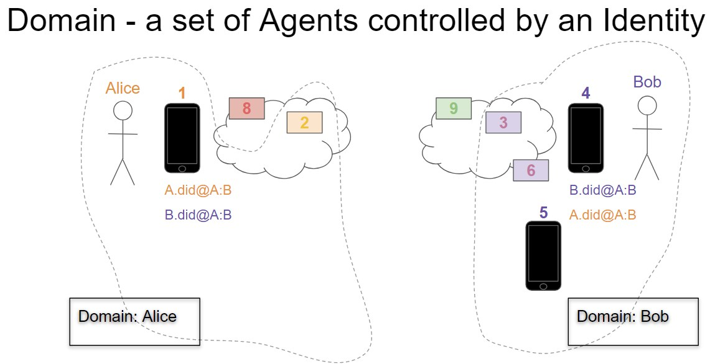

- Name: diddoc-conventions
- Author: Stephen Curran (swcurran@gmail.com)
- Start Date: 2018-08-14
- PR: 
- Jira Issue: 

# Summary
[summary]: #summary

This is one of a series of HIPEs that together enable interoperability across implementations of Hyperledger Indy Agents, and ideally in the future, Agents rooted in other self-sovereign identity ecosystems. In this HIPE the use of the DID Doc is considered and conventions defined that if followed will aid in accomplishing the interoperability goal.

In order to send a message from one Identity to another, the sending Identity must know something about the Receiver's domain - the Receiver's configuration of Agents. This HIPE outlines some aspects of how a domain MUST populate a DIDDoc it shares with other entities either on a Public Ledger or via a microledger. In both cases, the other identity resolving and viewing the DIDDoc must be able to use the information in the DIDDoc to communicate with the owning Identity.

The goal of these related HIPEs is to define the rules that domains MUST follow to enable the delivery of Agent Messages from a Sending Agent to a Receiver Agent in a secure and privacy-preserving manner.

# Motivation
[motivation]: #motivation

The purpose of this HIPE and its related HIPEs is to define a layered Messaging protocol such that we can ignore the transport of messages as we discuss the much richer Agent Messaging types and interactions. That is, we can assume that there is no need to include in an Agent message anything about how to route the message to the Receiver - it just magically happens. Alice (via her Agent) sends a message to Bob, and (because of implementations based on this series of HIPEs) we can ignore how the actual message got to Bob's Agent.

Put another way - these HIPEs are about envelopes. They define a way to put a message - any message - into an envelope, put it into an outbound mailbox and have it magically appear in the Receiver's inbound mailbox in a secure and privacy-preserving manner. Once we have that, we can focus on letters and not how letters are sent.

In particular, this HIPE is about addresses - information in the DIDDoc that lets a sending Identity communicate with another Identity.

# Tutorial
[tutorial]: #tutorial

## Core Messaging Goals

These are vital design goals for this HIPE:

1. **Sender Encapsulation**: We SHOULD minimize what the Receiver has to know about the domain (routing tree or agent infrastructure) of the Sender in order for them to communicate.
2. **Receiver Encapsulation**: We SHOULD minimize what the Sender has to know about the domain (routing tree or agent infrastructure) of the Receiver in order for them to communicate.
3. **Independent Keys**: Private signing keys SHOULD NOT be shared between agents; each agent SHOULD be separately identifiable for accounting and authorization/revocation purposes.
4. ***Prevent correlation based on DIDDoc Contents**: The information in the set of DIDDocs owned by an Identity SHOULD NOT be so precise as to represent a fingerprint for that Identity suitable for correlation.

## Assumptions

The following are assumptions upon which this HIPE is predicated.

### Terminology

The following terms are used in this HIPE with the following meanings:

- [Sovereign] Domain - a set of Agents collaborating on behalf of an Identity
  - It's assumed that the Agents of a Domain were developed by a single vendor and so may use implementation-specific mechanisms for tracking extra information one another.
  - An example of two Domains is provided in the image below.
- Domain Endpoint - a shared physical endpoint for messages into domains
  - Shared by many identities (e.g. https://endpoint.agentsRus.com)
  - Agency - the handler for messages sent to the Domain Endpoint.
- Routing Agent - the single identity-controlled entry point for a Domain per relationship
  - A message delivered to a Domain Endpoint is **always** passed directly to the Routing Agent for a Domain
- Sender Agent - the Agent that creates an Agent Message for the Receiver that is in another Domain.
- Receiver Agent - the Agent that ultimately receives and can decrypt and process the Agent Message from the Sender.
- DID - reference to the literal Decentralized ID text
  - e.g. did:sov:1234abcd
- DID#keyname - reference to the DID appended with "#" and a specific key from the DIDDoc
  - e.g. did:sov:1234abcd#1 references key "1" of the "did:sov:1234abcd" DIDDoc.
  - **Note**: The #keyname is NOT the actual Public Key - it's a reference to an entry in the DIDDoc that contains the Public Key.

#### DIDDoc

The term "DIDDoc" is used in this HIPE as it is defined in the [DID Specification](https://w3c-ccg.github.io/did-spec/):

- a collection of public keys and endpoints,
- controlled by an identity,
- associated with a DID, and
- used for a relationship.

A DID can be resolved to get its corresponding DIDDoc by any Agent that needs access to the DIDDoc. This is true whether talking about a DID on the Public Ledger, or a DID persisted to a microledger. In the case of a microledger, it's the (implementation specific) domain's responsibility to ensure such resolution is available to all Agents requiring it.

## Example: Domain and DIDDoc

The following is an example of an arbitrary pair of domains that will be helpful in defining the requirements in this HIPE.



In the diagram above:

- Alice has
  - 1 Edge Agent - "1"
  - 1 Routing Agent - "2"
  - 1 Domain Endpoint - "8"
- Bob has
  - 3 Edge Agents - "4", "5" and "6"
    - "6" is an Edge Agent in the cloud, "4" and "5" are physical devices.
  - 1 Routing Agent - "3"
  - 1 Domain Endpoint - "9"

### Bob's DIDDoc for his Relationship with Alice

Bob’s domain has 3 devices he uses for processing messages - two phones (4 and 5) and a cloud-based agent (6). However, in Bob's relationship with Alice, he ONLY uses one phone (4) and the cloud-based agent (6). Thus the key for device 5 is left out of the DIDDoc (see below).

Note that the key for the Routing Agent (3) is called "routing". This is an example of the kind of convention needed to allow the Sender's agents to know the keys for Agents with a designated role in the receiving domain.

```json
{
  "@context": "https://w3id.org/did/v1",
  "id": "did:sov:1234abcd",
  "publicKey": [
    {"id": "routing", "type": "RsaVerificationKey2018",  "owner": "did:sov:1234abcd","publicKeyPem": "-----BEGIN PUBLIC X…”}",
    {"id": "4", "type": "RsaVerificationKey2018",  "owner": "did:sov:1234abcd","publicKeyPem": "-----BEGIN PUBLIC 9…”}",
    {"id": "6", "type": "RsaVerificationKey2018",  "owner": "did:sov:1234abcd","publicKeyPem": "-----BEGIN PUBLIC A…”}
  ],
  "authentication": [
    {"type": "RsaSignatureAuthentication2018", "publicKey": "did:sov:1234abcd#4"}
  ],
  "service": [
    {"type": "Agency", "serviceEndpoint": "did:sov:fghi8377464" }
    // or "serviceEndpoint": "https://example.com/endpoint/8377464" and add the #domain key (above)
  ]
}
```

## Cross Domain Messaging Interoperability

A key goal for interoperability is that we want other domains to know just enough about the configuration of a domain to which they are delivering a message, but no more. The Cross Domain Messaging HIPE (*reference to be added*), outlines the details of sending the message. Briefly:

- The Sender creates the message (m[1]) to be processed by the Receiver.
- The Sender encrypts m[1] into a `Forward` message (m[2]) addressed to the Receiver, providing in the `to` the DID#keyname of the Receiver (e.g. did#1)
- The Sender encrypts m[2] into a `Forward` message (m[3]) implicitly addressed to the Receiver's Routing Agent, providing in the `to` the DID of the Receiver (e.g. did).
  - "implicit" in that the Receiver's shared Domain Endpoint handler MUST be implemented to proxy any message to "did" to the Routing Agent
- An Agent of the Sender sends m[3] as a Wire Message to the shared Domain Endpoint of the Receiver.

## Necessary DIDDoc Information

To accomplish the Cross Domain Messaging sequence listed in the previous section, the Sending Agent MUST be able to elicit from the DIDDoc:

- the public key and endpoint of the shared Domain Endpoint for the Receiver
- the public key of the Receiver's Routing Agent
- the public key and the "address" (e.g. #keyname fragment) of the Receiver.

In addition, a holder of a DIDDoc replica MUST also know be able to determine from the DIDDoc the public key needed to update the DIDDoc for the DID. A holder of a DIDDoc replica could be the Public Ledger for a publicly resolvable DID or the manager of a microledger on which the state of the DIDDoc is persisted.

We'll consider how that information is known for each.

### The *Shared* Domain Endpoint

In the model we've defined for interoperability, the Domain Endpoint for the Receiver is assumed to be a shared endpoint that handles incoming messages for many Identities and for each, many DIDs. This definition works for the expected common case, where Domain Endpoints are Agencies operated by Cloud Vendors, but can also work in the degenerate case of an Identity (person or enterprise) hosting its own Agents. The expected case is preferred as it is seen as more privacy preserving, as Identities can "hide in the crowd". There are so many almost identical messages coming to the physical endpoint for so many different Identities that it is extremely difficult to associate an individual message to a specific Identity. This is not possible if each Identity has it's own physical endpoint.

As such, in the expected case, the Domain Endpoint is owned and controlled by a different Identity (the Agency) from the Receiver. That in turn suggests that the Domain Endpoint should not be just a pair of values (public key and physical endpoint) in many pairwise DIDDocs, but rather a separate DID controlled by the Agency. Since a DID is a URI, the Domain Endpoint DID can be put into the pairwise DIDDoc of the Receiver as a `service_endpoint`. Since the Domain Endpoint is a well-known address (e.g. https://endpoint.AgentsRUs.com), the DID should be public and resolvable on a public ledger.

This approach allows the Agency to rotate the keys for the endpoint when necessary without requiring updates be made to the DIDDocs created by the users of the Agency. If the DIDDocs of every Agency user contain the actual endpoint and public key of the Domain Endpoint, every DIDDoc created in the Agency would have to be updated when the Domain Endpoint public key is rotated (or the endpoint is changed).

By referencing a DID as the endpoint, the DIDDocs of DIDs owned by users of the Agency would only need to be updated when changing the Domain Endpoint for a relationship - such as when changing Agencies. Such events are likely to be far rarer than rotating the key of the Domain Endpoint.

This approach requires that Agents know that when an endpoint in a DIDDoc is a DID, they MUST resolve that DID to retrieve the actual endpoint and public key.

### The Routing Agent

For the Routing Agent, we don't need a physical address of the endpoint of the agent in a DIDDoc since no cross domain messages will ever be directly addressed to the Routing Agent. Further, any Agents within the domain that need to send messages to the Routing Agent (including the shared Domain Endpoint) will know the physical address of the Routing Agent. All we need is for the Sender to know the public key of the Routing Agent.

As such, **all** DIDDocs to be used for receiving Agent Messages MUST have an identifiable key that is the Routing Agent. By convention, this HIPE defines that the name of the Routing Agent key in the DIDDoc MUST be "`routing`". The JSON snippet for that key will look like this:

```
{
  "id": "routing", "type": "RsaVerificationKey2018",
  "owner": "did:sov:1234abcd","publicKeyPem": "-----BEGIN PUBLIC X…”
}",...
```

#### Routing Agent Public Keys

To prevent correlation, the Routing Agent SHOULD generate a new public key for each DID that is to be used for receiving Agent Messages.

### Agent Message Receiver

Based on the previous two sections, a Sending Domain knows how deliver a `Forward` message addressed to the Receiver's Routing Agent to the shared Domain Endpoint using a Wire Message. The Routing Agent can decrypt the message addressed to it, and then determine where to deliver the message contained within it (also a `Forward`) intended for the Receiver. That message can be addressed to any #keyname in the DIDDoc, including the `#routing` that is controlled by the Routing Agent.

How the Sender determines to which #keyname (and hence Agent/device) in the DIDDoc to send the message is a topic for a separate HIPE. In many cases, a Sender will simply be replying to a message sent from a specific #keyname address, and so the same #keyname would be used. However, when the Sender is initiating a conversation, it is not as obvious to whom the message should be sent. Other scenarios like changing the Agent handling a conversation mid-stream will also need to be addressed.

### DIDDoc Update Authorization

The ability to update a DIDDoc requires the Identity owner prove control of the DID. A public key in the DIDDoc is used to prove ownership to support updating the DIDDoc. The choice of Agent(s) within a domain that are empowered to send DIDDoc updates is an implementation-specific tactic. For example, an implementation might require Agents within the Domain send their updates to an empowered Agent to aggregate the changes and replicate those changes to the published copies of the DIDDoc on a public ledger or a microledger.

It is not clear in the DID Spec or in this HIPE (yet) what keys empower an Agent to make updates to the manifestation of the DIDDoc.

### Degenerate Cases

As discussed above, the DIDDoc for a domain MUST look as if there are at least four Agents in the domain, and there could be many more. However, what if there are only 2 or even 1 Agent in a domain?

The HIPE requirement in those degenerate cases is that the DIDDoc still contain the same data (one endpoint, one `routing` key, one authentication key and at least one Receiver key). The domain implementation then handles the case of "Agents with multiple roles". The DIDDoc SHOULD have the Agents use different keys for different purposes to mask the simplified Agent structure.

# Reference
[reference]: #reference

# Drawbacks
[drawbacks]: #drawbacks

As noted in the `Unresolved Questions` section below, this HIPE is not complete. Further conventions need to be formalized to achieve reliable interoperability.

# Rationale and alternatives
[alternatives]: #alternatives

# Prior art
[prior-art]: #prior-art

N/A

# Unresolved questions
[unresolved]: #unresolved-questions

The following remain unresolved:

- The use of "routing" for the key name of the Routing Agent seems arbitrary. Is there a good reason to use that name vs. any other?
  - Since all DIDDocs should have a "routing" key, it does not expose anything about the domain so it would appear to be as good as any other name.
- If "DID as endpoint" convention is NOT used, the endpoint and key for the shared Domain Endpoint must be explicitly placed into the Receiver's DIDDoc, and a clear convention is needed for determining which key is for the Domain Endpoint.
- If there are multiple endpoints in the DIDDoc, the Sender must know which endpoint is for the shared Domain Endpoint. Should a convention like that for the "routing" key be used?
- It may be appropriate to have a convention in the DIDDoc to designate which keys (and potentially, endpoints) are used for different roles in the Domain.  For example:
  - A defined list of roles.
  - A convention for determining the roles associated with a key.
- As noted in the DIDDoc Update Authorization section (above) for example, it is not clear in the DID Spec or in this HIPE (yet) what keys empower an Agent to make updates to the manifestation of the DIDDoc.