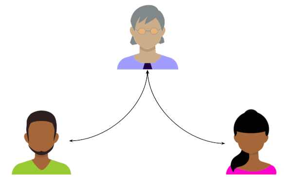
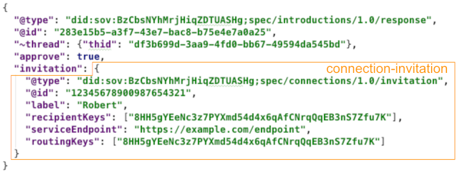

# HIPE 00??: Introductions 1.0

- Authors: Daniel Hardman, Sam Curren, Stephen Curran, Tobias Looker
- Start Date: 2019-03-27
- PR: (leave this empty)
- Jira Issue: (leave this empty)

## Summary

Describes how a go-between can introduce two parties that
it already knows, but that do not know each other.

## Motivation
[motivation]: #motivation

Introductions are a fundamental activity in human relationships. They allow
us to bootstrap contact information and trust. We need a standard way to
do introductions in an SSI ecosystem, and it needs to be flexible, secure,
privacy-respecting, and well documented.

## Tutorial
[tutorial]: #tutorial

### Name and Version

This is the Introductions 1.0 protocol. It is uniquely identified by the URI:

    "did:sov:BzCbsNYhMrjHiqZDTUASHg;spec/introductions/1.0"

### Key Concepts

##### Basic Use Case

Introductions target scenarios like this:

>Alice has a pairwise DID-based connection with Bob. She also has some type
of connection (either DID-based or via a website, email, or similar) with
Carol. Alice believes that Bob and Carol do not know each other, and she
wants to introduce them in a way that allows a relationship to form.

This use case is worded carefully; it is more adaptable than it may
appear at first glance. The [Advanced Use Cases](#advanced-use-cases)
section later in the doc explores many variations. But the early part
of this document focuses on the simplest reading of the use case.

##### Goal

When we introduce two friends, we may hope that a new friendship ensues.
But technically, the introduction is complete when we provide the
opportunity for a relationship--what the parties do with that opportunity
is a separate question.

Likewise, the goal of our formal introduction protocol should be crisply
constrained. Alice wants to gather consent and contact information
from Bob and Carol; then she wants to invite them to connect. What they
do with her invitation after that is not under her control, and is outside
the scope of the introduction.

This suggests an important insight about the relationship between the
introduction protocol and the [connection protocol](
https://github.com/hyperledger/indy-hipe/blob/master/text/0031-connection-protocol/README.md):
*they overlap*. The invitation to connect, which begins the connection
protocol, is also the final step in an introduction.

Said differently, *the goal of the introduction protocol is to start the
connection protocol*.

### Roles

There are three participants in the protocol.

The __introducer__ begins the process and must know the other two parties.
Alice is the introducer in the diagram above.

The other two participants are both __introducees__. This means there are
three participants but only two roles. However, the `introducee` role has two variants: one where the connection with introducer
is DID-based (`introducee<did>`), and one where it is based on some other
form of connection (`introducee<other>`). In the diagram above, Bob is an
`introducee<did>`, and Carol is an `introducee<other>`. This distinction
does not alter the basic flow, but it may change how communication happens,
and it affects how the `connection-invitation` is sent when the connection
protocol is triggered at the end of the introduction.

### States

### Messages

##### `proposal`

This message informs an introducee that an introducer wants to perform
an introduction, and requests approval to do so. It looks like this:

This matches the way an introduction is proposed in [double-opt-in
introductions](https://avc.com/2009/11/the-double-optin-introduction/) in the
non-agent world:

The `to` field contains an __introducee descriptor__ that helps the
party receiving the proposal to evaluate whether they wish to accept
it. Depending on how much context is available between introducer and
introducee, this can be as simple as a name, or something fancier (see
[Advanced Use Cases](#advanced-use-cases) below). 

##### `response`

Depending on whether the introducee is capable of DID-based communication
or not, the response might look like this:

Or like this:

Note that the second form contains a fully valid `connection-invitation`
message. At least one of these messages must be received by an introducer
to successfully complete the introduction, because the final step in
the protocol is to begin the [connection protocol](
https://github.com/hyperledger/indy-hipe/blob/master/text/0031-connection-protocol/README.md)
by forwarding the `connection-invitation` message from one introducee
to the other.

##### `connection-invitation`

This message is no different
from the message that two parties would generate when one invites the
other with no intermediary, except that:

* It is delivered by the introducer, not by either of the introducees.
* It has a `~thread` decorator that identifies the introduction as
its parent thread.
* If both introducees already have DID-based connections with the
introducer, it can be delivered over standard DIDComm channels, authcrypted,
to either one of them. (If one of the introducees does NOT have a DID-based
channel with the introducer, then the invitation must be delivered to that
introducee/invitee, using the non-DIDComm channel.)

### Advanced Use Cases

* Using acks to report status of introduction efforts.
* Timeouts.
* Introducing multiple parties at the same time?
* Errors
* Both parties have DIDs
* Public DIDs and standing invitations
* Fancy settings in introducee descriptors.

Any of the parties can be an organization or thing instead of a person. 
Bob and Carol may actually know each other already, without Alice realizing
it. The introduction may be rejected. It may create a new pairwise
relationship between Bob and Carol that is entirely invisible to Alice.
Or it may create an n-wise relationship in which Alice, Bob, and Carol know
one another by the same identifiers.

The protocol can even be adapted to a case where Alice has no DID-based
connection to either party, by her simply going through the connection
protocol first with at least one party, and then beginning the introduction
protocol described here.

[TODO: What if Alice is introducing Bob, a public entity with no connection to
her, to Carol, a private person? Can she just relay Bob's invitation that
he published on his website? Are there security or privacy implications?
What if she is introducing 2 public entities and has a connection to neither?]

## Reference
[reference]: #reference

Provide guidance for implementers, procedures to inform testing,
interface definitions, formal function prototypes, error codes,
diagrams, and other technical details that might be looked up.
Strive to guarantee that:

- Interactions with other features are clear.
- Implementation trajectory is well defined.
- Corner cases are dissected by example.

## Drawbacks
[drawbacks]: #drawbacks

Why should we *not* do this?

## Rationale and alternatives
[alternatives]: #alternatives

- Why is this design the best in the space of possible designs?
- What other designs have been considered and what is the rationale for not
choosing them?
- What is the impact of not doing this?

## Prior art
[prior-art]: #prior-art

Discuss prior art, both the good and the bad, in relation to this proposal.
A few examples of what this can include are:

- Does this feature exist in other SSI ecosystems and what experience have
their community had?
- For other teams: What lessons can we learn from other attempts?
- Papers: Are there any published papers or great posts that discuss this?
If you have some relevant papers to refer to, this can serve as a more detailed
theoretical background.

This section is intended to encourage you as an author to think about the
lessons from other implementers, provide readers of your proposal with a
fuller picture. If there is no prior art, that is fine - your ideas are
interesting to us whether they are brand new or if they are an adaptation
from other communities.

Note that while precedent set by other communities is some motivation, it
does not on its own motivate an enhancement proposal here. Please also take
into consideration that Indy sometimes intentionally diverges from common
identity features.

## Unresolved questions
[unresolved]: #unresolved-questions

- What parts of the design do you expect to resolve through the
enhancement proposal process before this gets merged?
- What parts of the design do you expect to resolve through the
implementation of this feature before stabilization?
- What related issues do you consider out of scope for this 
proposal that could be addressed in the future independently of the
solution that comes out of this doc?
