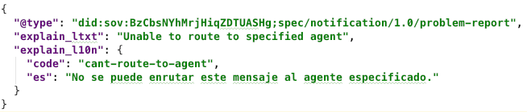
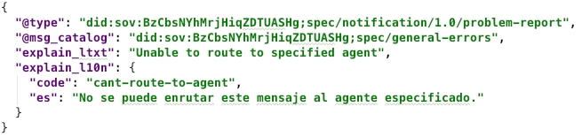
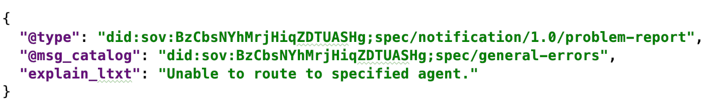

- Name: localized_messages
- Author: Daniel Hardman
- Start Date: 2018-11-30
- HIPE PR:

# Localized Messages
[summary]: #summary

Defines how to send an agent message in a way that facilitates interoperable
localization, so humans communicating through agents can interact without
natural language barriers.

# Motivation
[motivation]: #motivation

The primary use case for agent messages is to support automated processing,
as with messages that lead to credential issuance, proof exchange, and so
forth. Automated processing may be the *only* way that certain agents can
process messages, if they are IoT devices or pieces of software run by
organizations with no human intervention.

However, humans are also a crucial component of the agent ecosystem, and
many interactions have them as either a primary or a secondary audience. In
credential issuance, a human may need to accept terms and conditions from the
issuer, even if their agent navigates the protocol. Some protocols, like a
chat between friends, may be entirely human-centric. And in any protocol
between agents, a human may have to interpret errors.

When humans are involved, locale and potential translation into various
natural languages becomes important. Normally, localization is the concern
of individual software packages. However, in agent-to-agent communication,
the participants may be using different software, and the localization may
be a cross-cutting concern--Alice's software may need to send a localized
message to Bob, who's running different software. It therefore becomes useful
to explore a way to facilitate localization that allows interoperability
without imposing undue burdens on any implementer or participant.

# Tutorial
[tutorial]: #tutorial

Here we introduce some flexible and easy-to-use conventions. Software that
uses these conventions should be able to add localization value in several ways,
depending on needs.

### `@locale`

The default assumption about locale with respect to all agent-to-agent messages
is that they are locale-independent, because they are going to be processed
entirely by automation. Dates should be in ISO 8601 format, typically in UTC.
Numbers should use JSON formatting rules (or, if embedded in strings, the "C"
locale). Booleans and null values use JSON keywords.

But strings are somewhat more interesting. An agent message may contain many strings.
Some will be keys; others may be values. We assume that *keys* do not need to be
localized, as they will be interpreted by software. Among string *values*, some
may be locale-sensitive, while others may not. For example, consider the following
fictional message that proposes a meeting between Alice and Bob:

Here, the string value named `proposed_location` need not be changed, no matter what
language Bob speaks. But `note` might be worth localizing, in case Bob speaks
French instead of English.

The `@locale` decorator may be added at any scope within a message. When present,
it defines the locale of any locale-sensitive data at or below the level of
the decorator. The value of `@locale` is a code that uses the same format as [Posix locales](
https://www.gnu.org/software/gettext/manual/html_node/Locale-Names.html#Locale-Names).
However, region codes are optional--`"fr"` is good enough unless `"fr_FR"`
and `"fr_CA"` are both needed. Also, charset is not specified, since JSON is always
UTF-8. And [ISO 639-2](https://en.wikipedia.org/wiki/ISO_639-2)
or [ISO 639-3](https://en.wikipedia.org/wiki/ISO_639-3) language codes may be used
if the [ISO 639-1 language code](https://en.wikipedia.org/wiki/ISO_639-1) code is
inadequate.

If a `@locale` decorator is not present but must be inferred, it may be inherited
from the language of a message family's documentation, or, if documentation is
multilingual, the language of a message's schema on the ledger. Thus, message
families defined by Klingons are assumed to be in Klingon, if all else fails.

### Signaling Localizable Fields

The `@locale` decorator has NO EFFECT on the interpretation of fields that are
locale-independent. Dates and number values should be immune, for example. So how
do we know which string fields are affected by `@locale`? There are two ways:

1. We signal this by changing how we name the field; fields having a name that
ends in the `_ltxt` suffix acquire localizable status and are called __localizable
fields__.

2. We may specify that a field is localizable in the documentation for its message
family.

Of these 2 mechanisms, the first is STRONGLY preferred, because it allows messages
that are unfamiliar to a receiver to still have known semantics. The second mechanism
is only supported so message family definitions can be updated to fix localization
naivete (failure to use mechanism 1) in a later revision, while leaving a field name
unchanged.

In our example above, `note` should be renamed to `note_ltxt`.
And we change its data type to be a JSON object that maps
locale codes to alternative string values. Locale codes  This gives us the following modified JSON:

Now, when Bob's agent receives this message, it can detect that the `note_ltxt` field
is localizable, and submit the string value `"Let's have a picnic."` to a machine
translation service, with source language = English, to translate the message to French.

Localizable fields automatically support a sibling field with the same root name but
a `_l10n` suffix. This field is a map of __localized alternatives__ for the value in
the localizable field:

### Message Codes and Catalogs 

In advanced usage, it may be desirable to identify a piece of text by a code that describes
its meaning, and to publish an inventory of these codes and their localized alternatives.
This may be helpful, for example, to track a list of common errors (think of symbolic constants
like `EBADF` and `EBUSY`, and the short explanatory strings associated with them, in Posix's
&lt;errno.h&gt;). By publishing in this way, software can provide rich localization support
for high-value messages it doesn't write. Also, the meaning of a message can
be searched on the web, even when no localized alternatives exist for a particular language.
And the message text in a default language can undergo minor variation without invalidating
translations or searches.

If this usage is desired, a special subfield named `code` may be included inside the map
of localized alternatives:

Note, however, that a code for a localized message is not useful unless it's accompanied
by context (a namespace, for example) that tells where that code is defined. The default
context for any codes used by a message family is the message family definition itself.
That is, message families definitions that support localized text should consider
including or referencing an official catalog of codes for those messages. If this is
not done, or if a particular instance of the message needs to draw from a different
catalog than the one for the message family, then the context can be specified inside a
message using the `@msg_catalog` decorator. The decorator may appear at any level
in a message; wherever it appears, it overrides any message catalog specified at a more
general level. The value of `@msg_catalog` is a URI (ideally, a DID reference):

Seeing a message like the one above, a recipient could browse to the catalog's URI and
search for `cant-route-to-agent` to learn more. A dynamic set of localized alternatives
for the message might be offered. Defining automated lookup against message catalogs
is not defined here, but may be explored in a separate HIPE.

    IMPORTANT SECURITY NOTE: Message catalogs are an attack vector. If a hacker is
    able to change the content of a catalog, she or he may be able to
    change how a message is interpreted by a human that's using localization
    support. This suggests several best practices:
    
    1. Owners of message catalogs should carefully secure them from hacking.
    
    2. Especially when displaying localized error text, software should also display
    the underlying code. (This is desirable anyway, as it allows searching the web
    for hints and discussion about the code.)
    
    3. Software that regularly deals with localizable fields of key messages should
    download a catalog of localizable alternatives in advance, rather than fetching
    it just in time.
    
### Fallback Lookup

If a localizable field exists but no `code` is present in its `_l10n` localized
alternatives sibling field, then the textual value of the localizable field itself
should be used as an alternative lookup key. For example, if the message is:

...then "Unable to route to specified agent." should be looked up in the message
catalog as if it were a code.

# Drawbacks
[drawbacks]: #drawbacks

* The notion of an undeclared sibling field to a localizable field may cause
  certain parsing and validation challenges.

# Rationale and alternatives
[alternatives]: #alternatives

We could choose not to support this feature.

# Prior art
[prior-art]: #prior-art

Java's property bundle mechanism, Posix's gettext() function, and many other localization
techniques are well known. They are not directly applicable, mostly because they don't address
the need to communicate with software that may or may not be using the same underlying
mapping/localization mechanism.

# Unresolved questions
[unresolved]: #unresolved-questions

- Is there any need to support localization of numeric or date values, in addition to
  strings?