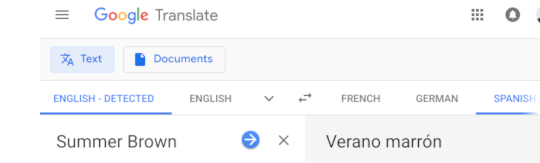
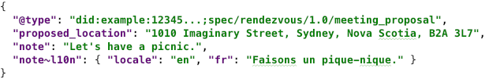
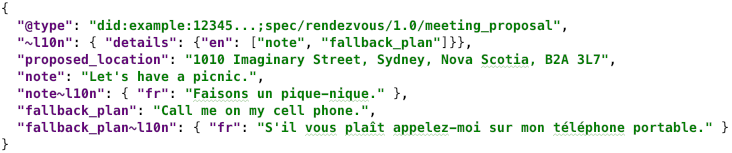
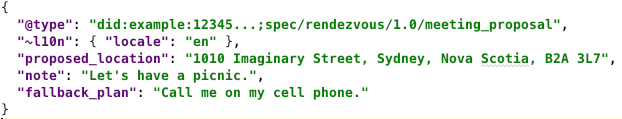
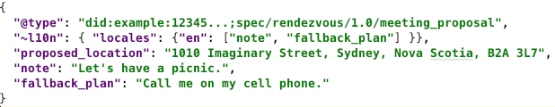
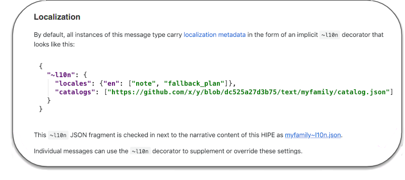
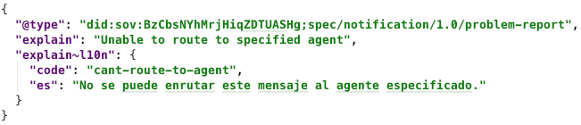
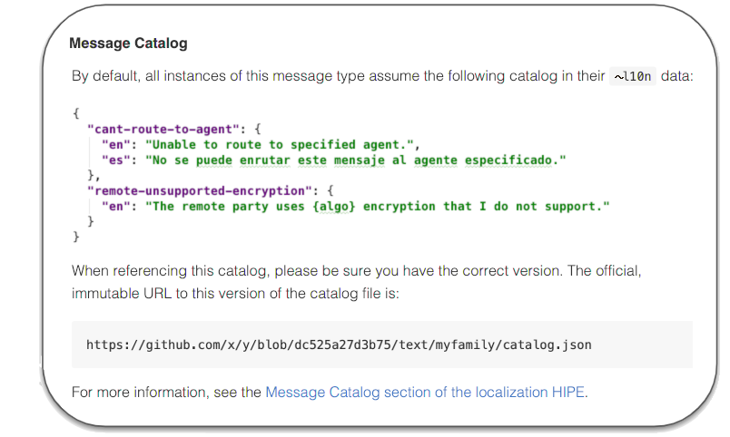
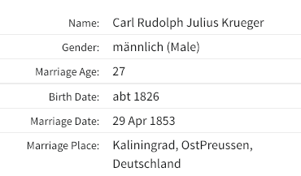

# HIPE 00?? - Localized Messages

- Author: Daniel Hardman
- Start Date: 2018-11-30
- HIPE PR: https://github.com/hyperledger/indy-hipe/pull/64

## Summary

Defines how to send a [DIDComm](https://github.com/hyperledger/indy-hipe/pull/98)
message in a way that facilitates interoperable
localization, so humans communicating through agents can interact without
natural language barriers.

## Motivation

The primary use case for DIDComm is to support automated processing,
as with messages that lead to credential issuance, proof exchange, and so
forth. Automated processing may be the *only* way that certain [agents](
https://github.com/hyperledger/indy-hipe/pull/86) can
process messages, if they are devices or pieces of software run by
organizations with no human intervention.

However, humans are also a crucial component of the DIDComm ecosystem, and
many interactions have them as either a primary or a secondary audience. In
credential issuance, a human may need to accept terms and conditions from the
issuer, even if their agent navigates the protocol. Some protocols, like a
chat between friends, may be entirely human-centric. And in any protocol
between agents, a human may have to interpret errors.

When humans are involved, locale and potential translation into various
natural languages becomes important. Normally, localization is the concern
of individual software packages. However, in DIDComm,
the participants may be using different software, and the localization may
be a cross-cutting concern--Alice's software may need to send a localized
message to Bob, who's running different software. It therefore becomes useful
to explore a way to facilitate localization that allows interoperability
without imposing undue burdens on any implementer or participant.

>NOTE: JSON-LD also describes a localization mechanism. We have chosen not
to use it, for reasons [enumerated in the DIDComm HIPE about JSON-LD
compatibility](https://github.com/hyperledger/indy-hipe/blob/64e16d3b/text/json-ld-compatibility/README.md#internationalization-and-localization).

# Tutorial
[tutorial]: #tutorial

Here we introduce some flexible and easy-to-use conventions. Software that
uses these conventions should be able to add localization value in several ways,
depending on needs.

### Introducing `~l10n`

The default assumption about locale with respect to all DIDComm messages
is that they are locale-independent, because they are going to be processed
entirely by automation. [Dates should be in ISO 8601 format, typically in UTC](
https://github.com/hyperledger/indy-hipe/blob/f459ee79/text/0029-date-time-conventions/README.md).
Numbers should use JSON formatting rules (or, if embedded in strings, the "C"
locale). Booleans and null values use JSON keywords.

Strings tend to be somewhat more interesting. An agent message may contain many
strings. Some will be keys; others may be values. Usually, *keys* do not need to
be localized, as they will be interpreted by software (though see [
Advanced Use Case](#advanced-use-case) for an example that *does*). Among string
*values*, some may be locale-sensitive, while others may not. For example, consider
the following fictional message that proposes a meeting between Alice and Bob:

Here, the string value named `proposed_location` need not be changed, no matter what
language Bob speaks. But `note` might be worth localizing, in case Bob speaks
French instead of English.

We can't assume all text is localizable. This would result in silly processing,
such as trying to translate the `first_name` field in a driver's license:

The `~l10n` [decorator](https://github.com/hyperledger/indy-hipe/blob/57b8efb7/text/decorators/README.md)
 (so-named because "localization" has 10 letters between "l" and "n") may be added
 to the `note` field to meet this need:

>If you are not familiar with this notion of *field decorators*, please review
the [section about scope in the HIPE on decorators](
https://github.com/hyperledger/indy-hipe/blob/57b8efb7/text/decorators/README.md#decorator-scope
).

### Decorator at Message Scope

The example above is minimal. It shows a French __localized alternative__ for
the string value of `note` in the `note~l10n.fr` field. Any number of these
alternatives may be provided, for any set of locales. Deciding whether to use
one depends on knowing the locale of the content that's already in `note`, so
`note~l10n.locale` is also provided.

But suppose we evolved our message type, and it ended up having 2 fields that
were localization-worthy. Both would likely use the same locale in their values,
but we don't really want to repeat that locale twice. The preferred way to handle
this is to decorate the *message* with semantics that apply message-wide, and to
decorate *fields* with semantics that apply just to fields. Following this pattern
puts our example message into a more canonical form:

### Decorator at Message Type Scope

What if the sender of a message doesn't have the ability to send French alternatives?
Or what if the receiver speaks Spanish, not French?

If we know which fields are localizable, and we know the source locale of the content,
we could submit content to a machine translation service. But there's a problem: *If
the sender doesn't have any localized equivalents to offer, we could end up with no
way to know which fields need localization, because the* `*~l10n` *decorators would
be missing*. Our message would look like this:

Remember, the default assumption is that fields contain no localizable data. By that
rule, `note` and `fallback_plan` are not localizable.

We fix this by explicitly declaring their localizable status in the message-level
`~l10n.localizable` array:

Problem solved. But we have a new problem: we don't really want to declare that
`note` and `fallback_plan` are localizable, in every instance of every message
of this type. It would be redundant and needlessly verbose.

The solution is to declare localization semantics in the HIPE that documents
the message type or protocol. By convention, this is done in a section of the HIPE named
*Localization* (or "Localisation", for folks that like a different locale's
spelling rules :-). In our example, the relevant section of the HIPE might
look like this:

This snippet contains one unfamiliar construct, `catalogs`, which will be discussed
below. Ignore that for a moment and focus on the rest of the content.
As this snippet mentions, the JSON fragment for `~l10n` that's displayed in the
running text of the HIPE should also be checked in to github with the HIPE's
markdown as `<message type name>~l10n.json`, so automated tools can consume
the content without parsing markdown.

Notice that the markdown section is hyperlinked back to this HIPE so developers
unfamiliar with the mechanism will end up reading *this* HIPE for more details.

With this decorator on the message type, we can now send our original message,
with no message or field decorators, and localization is still fully defined:

Despite the terse message, its locale is known to be English, and the `note`
field is known to be localizable, with current content also in English.

One benefit of defining a `~l10n` decorator for a message family is that
developers can add localization support to their messages without changing
field names or schema, and with only a minor semver revision to a message's
version.

We expect most message types to use localization features in more or less this
form. In fact, if localization settings have much in common across a message
family, the `Localization` section of a HIPE may be defined not just for a
message *type*, but for a whole message *family*.

### Message Codes and Catalogs 

When the same text values are used over and over again (as opposed to the sort of
unpredictable, human-provided text that we've seen in the `note` field thus far),
it may be desirable to identify a piece of text by a code that describes its meaning,
and to publish an inventory of these codes and their localized alternatives. By
doing this, a message can avoid having to include a huge inventory of localized
alternatives every time it is sent.

We call this inventory of message codes and their localized alternatives a **message
catalog**. Catalogs may be helpful to track a list of common errors (think of
symbolic constants like `EBADF` and `EBUSY`, and the short explanatory strings
associated with them, in Posix's &lt;errno.h&gt;). Catalogs let translation be done
once, and reused globally. Also, the code for a message can be searched on the web,
even when no localized alternative exists for a particular language. And the message
text in a default language can undergo minor variation without invalidating
translations or searches.

If this usage is desired, a special subfield named `code` may be included inside the map
of localized alternatives:

Note, however, that a code for a localized message is not useful unless we know what
that code means. To do that, we need to know where the code is defined. In other words,
codes need a namespace or context. Usually, this namespace or context comes from the
message family where the code is used, and codes are defined in the same HIPE where the
message family is defined.

Message families that support localized text with predictable values should thus
include or reference an official catalog of codes for those messages. A catalog
is a dictionary of `code` --> localized alternatives mappings. For example:

To associate this catalog with a message type, the HIPE defining the message type
should contain a "Message Catalog" section that looks like this:

 
Note the verbiage about an official, immutable URL. This is important because
localized alternatives for a message code could be an attack vector if the
message catalog isn't handled correctly. If a hacker is able to change the
content of a catalog, they may be able to change how a message is interpreted
by a human that's using localization support. For example, they could suggest
that the `en` localized alternative for code "warn-suspicious-key-in-use` is
"Key has been properly verified and is trustworthy." By having a tamper-evident
version of the catalog (e.g., in github or published on a blockchain), devlopers
can write software that only deals with canonical text or dynamically translated
text, never with something the hacker can manipulate.

In addition, the following best practices are recommended to maximize catalog
usefulness:

1. Especially when displaying localized error text, software should also display
the underlying code. (This is desirable anyway, as it allows searching the web
for hints and discussion about the code.)

2. Software that regularly deals with localizable fields of key messages should
download a catalog of localizable alternatives in advance, rather than fetching
it just in time.

##### Connecting `code` with its catalog

We've described a catalog's structure and definition, but we haven't
yet explained how it's referenced. This is done through the `catalogs`
field inside a `~l10n` decorator. There was an example above, in the
example of a "Localization" section for a HIPE. The field name, `catalogs`, is
plural; its value is an array of URIs that reference specific
catalog versions. Any catalogs listed in this URI are searched, in the
order given, to find the definition and corresponding localized
alternatives for a given `code`.
 
A `catalogs` field can be placed in a `~l10n` decorator at various scopes.
If it appears at the message or field level, the catalogs it lists are
searched before the more general catalogs.

### Advanced Use Case

Let's consider a scenario that pushes the localization features to their
limit. Suppose we have a family of DIDComm messages that's designed to
exchange genealogical records. The main message type, `record`, has a
fairly simple schema: it just contains `record_type`, `record_date`, and
`content`. But `content` is designed to hold arbitrary sub-records from
various archives: probate paperwork from France, military
discharge records from Japan, christening certificates from Germany.

Imagine that the UX we want to build on top of these messages is similar
to the one at Ancestry.com:

Notice that the names of fields in this UX are all given in English.
But how likely is it that a christening certificate from Germany
will have English field names like "Birth Data" and "Marriage Date"
in its JSON?

The `record` message behind data like this might be:

In order to translate this data, not just *values* but also *keys* need to have
associated `~l10n` data. We do this with a 
 

# Drawbacks
[drawbacks]: #drawbacks

# Rationale and alternatives
[alternatives]: #alternatives

We could choose not to support this feature.

# Prior art
[prior-art]: #prior-art

Java's property bundle mechanism, Posix's gettext() function, and many other localization
techniques are well known. They are not directly applicable, mostly because they don't address
the need to communicate with software that may or may not be using the same underlying
mapping/localization mechanism.

# Unresolved questions
[unresolved]: #unresolved-questions

- Is there any need to support localization of numeric or date values, in addition to
  strings?
  
  
  
whole with an `~l10n.locale`, and only use the field level It would be inefficient to repeat the locale of the values 3 times   
at any scope within a message. When present,
it defines the locale of any locale-sensitive data at or below the level of
the decorator. The value of `@locale` is a code that uses the same format as [Posix locales](
https://www.gnu.org/software/gettext/manual/html_node/Locale-Names.html#Locale-Names).
However, region codes are optional--`"fr"` is good enough unless `"fr_FR"`
and `"fr_CA"` are both needed. Also, charset is not specified, since JSON is always
UTF-8. And [ISO 639-2](https://en.wikipedia.org/wiki/ISO_639-2)
or [ISO 639-3](https://en.wikipedia.org/wiki/ISO_639-3) language codes may be used
if the [ISO 639-1 language code](https://en.wikipedia.org/wiki/ISO_639-1) code is
inadequate.

If a `@locale` decorator is not present but must be inferred, it may be inherited
from the language of a message family's documentation, or, if documentation is
multilingual, the language of a message's schema on the ledger. Thus, message
families defined by Klingons are assumed to be in Klingon, if all else fails.

### Signaling Localizable Fields

The `@locale` decorator has NO EFFECT on the interpretation of fields that are
locale-independent. Dates and number values should be immune, for example. So how
do we know which string fields are affected by `@locale`? There are two ways:

1. We signal this by changing how we name the field; fields having a name that
ends in the `_ltxt` suffix acquire localizable status and are called __localizable
fields__.

2. We may specify that a field is localizable in the documentation for its message
family.

Of these 2 mechanisms, the first is STRONGLY preferred, because it allows messages
that are unfamiliar to a receiver to still have known semantics. The second mechanism
is only supported so message family definitions can be updated to fix localization
naivete (failure to use mechanism 1) in a later revision, while leaving a field name
unchanged.

In our example above, `note` should be renamed to `note_ltxt`.
And we change its data type to be a JSON object that maps
locale codes to alternative string values. Locale codes  This gives us the following modified JSON:

Now, when Bob's agent receives this message, it can detect that the `note_ltxt` field
is localizable, and submit the string value `"Let's have a picnic."` to a machine
translation service, with source language = English, to translate the message to French.

Localizable fields automatically support a sibling field with the same root name but
a `_l10n` suffix. This field is a map of __localized alternatives__ for the value in
the localizable field:

