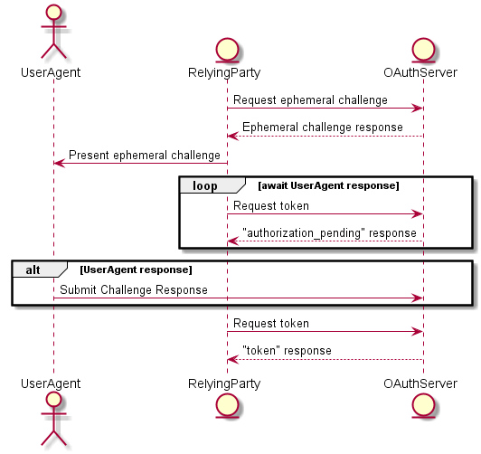

# HIPE 0030: OAuth integration of ephemeral challenge protocol
- Authors: Tobias Looker <tplooker@gmail.com>
- Start Date: 2018-02-23
- PR:

## Summary
[summary]: #summary

Explains an application of the `ephemeral challenge protocol` using oauth.

## Motivation
[motivation]: #motivation

This approach is inspired by the oauth `device flow` (add reference) 

## Use Case Description

### Alice purchasing an age restricted product online

Alice has reached checkout with an online retailer `wine-to-go`, where she wishes to complete purchase for alcohol which is age restricted. Alice has already got a mobile wallet and has obtained a credential (such as a driver licence) from a trusted issuer. Alice has no connection with `wine-to-go` nor does she hold an account with the retailer and wishes to remain without one.

1. On the checkout page of `wine-to-go`, Alice clicks the `Verify age with mobile wallet` button.
2. A QR code appears with instructions for Alice to scan it using her mobile wallet.
3. Using her mobile wallet Alice scans the code and a prompt in the app appears saying `Verification required` with the information indicating that `wine-to-go` is requesting proof of her age.
4. Alice accepts this request on her mobile app and notices that the `wine-to-go` website has updated with a status indicating that her age has been verified. 

## Definitions 

`RelyingParty` - This is the party awaiting an outcome to a challenge

`UserAgent` - This is the agent that is serving as the challenge responder in the ephemeral challenge protocol

`OAuthServer` - This is serving as the challenger in the ephemeral challenge protocol

## Tutorial
[tutorial]: #tutorial

This approach is inspired by the oauth `device flow` (add reference)

**Obtain Challenge**

An ephemeral challenge is requested by forming the following request to the `OAuthServer`.

```
POST connect/agent/challenge HTTP/1.1
Host: authorization-server.com
Content-Type: application/x-www-form-urlencoded

client_id=s6BhdRkqt3
&response_type=authorization_code
&challenge_type=presentation
&challenge_uri=did:sov:123Abs37dhnvnsk
```

- `client_id` - Identifies the `RelyingParty` to `OAuthServer` i.e a website requesting login.
- `response_type` - Identifies the response type that should be returned upon sucessful resolutiuon of the challenge, valid values include `authorization_code` and `access_token`. The two possible types here indicate how the resulting token generated from the channel is recieved, please refer to [implicit flow](https://tools.ietf.org/html/rfc6749#section-4.2) and [OpenID flows](https://medium.com/@darutk/diagrams-of-all-the-openid-connect-flows-6968e3990660)
- `challenge_type` - Identifies the type of challenge to return, valid values include `libindy-proof-request`.
- `challenge_uri` - Identifies the challenge being requested.

Which yields the following response

```
HTTP/1.1 200 OK
Content-Type: application/json;charset=UTF-8
Cache-Control: no-store
Pragma: no-cache

{
    "challenge_code" : "74tq5miHKB",
    "challenge" : "<ephemeral-challenge-message>",
    "interval" : 5
}
```

- `challenge_code` a code used by the RelyingParty to seek a resolution to the challenge.
- `challenge` is an agent challenge message defined in the `ephemeral challenge protocol`.
- `interval` the interval in seconds defined by the OAuthServer that the RelyingParty should poll the token endpoint when seeking a resolution.

The `RelyingParty` presents the embedded challenge to the `UserAgent` and then begins a long poll of the token endpoint in accordance with the interval specified in the following form.

```
POST /token HTTP/1.1
Host: authorization-server.com
Content-Type: application/x-www-form-urlencoded

grant_type=agent_challenge
&client_id=s6BhdRkqt3
&code=74tq5miHKB
```

- `grant_type` defined [here](https://tools.ietf.org/html/rfc6749#appendix-A.10)
- `client_id` defined [here](https://tools.ietf.org/html/rfc6749#appendix-A.1)
- `code` defined [here](https://tools.ietf.org/html/rfc6749#appendix-A.11) this is the `challenge_code` obtained by relying party in the previous request

If the polling interval is not being obeyed, i.e the endpoint is being polled too often, then the following response will be issued.

```
HTTP/1.1 400 Bad Request
Content-Type: application/json;charset=UTF-8
Cache-Control: no-store
Pragma: no-cache

{
	"error":"slow_down"
}
```

If the polling interval is being obeyed, then the endpoint will respond with the following until an outcome is reached.

```
HTTP/1.1 400 Bad Request
Content-Type: application/json;charset=UTF-8
Cache-Control: no-store
Pragma: no-cache

{
	"error":"authorization_pending"
}
```
 
If the response to the challenge by the `UserAgent` is to deny the request, then the outcome is the following.

```
HTTP/1.1 400 Bad Request
Content-Type: application/json;charset=UTF-8
Cache-Control: no-store
Pragma: no-cache

{
    "error":"access_denied"
}
```

If the challenge is accepted by `UserAgent` and a valid challenge response is sent back to the `OAuthServer`, depending on the the type of the original request, the resolved response at the token endpoint is either of the following.

If the original request by the client set `response_type=access_token`

```
HTTP/1.1 200 OK
Content-Type: application/json;charset=UTF-8
Cache-Control: no-store
Pragma: no-cache

{
    "access_token": "2YotnFZFEjr1zCsicMWpAA",
    "token_type": "bearer",
    "expires_in": 3600
}
```

- `access_token` `token_type` and `expires_in` defined [here](https://tools.ietf.org/html/rfc6749#appendix-A.12)

If the original request set `response_type=authorization_code`

```
HTTP/1.1 200 OK
Content-Type: application/json;charset=UTF-8
Cache-Control: no-store
Pragma: no-cache

{
    "code" = "abH39vajeah38j"
}
```

- `code` defined [here](https://tools.ietf.org/html/rfc6749#appendix-A.11) this is the authorization code that can be used to seek an `access_token`



## Reference
[reference]: #reference