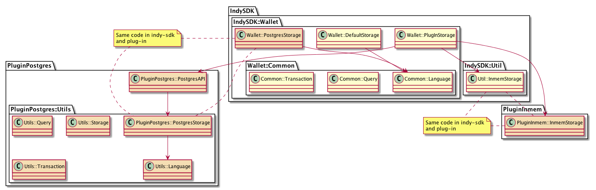

- Name: postgres-storage-plugin
- Author: Ian Costanzo iancostanzo@gmail.com
- Start Date: 2018-10-18
- PR: https://github.com/hyperledger/indy-sdk/pull/1247
- Jira Issue(s):
    - IS-1045 - plugged wallet return error codes (related - IS-804?)
                https://github.com/hyperledger/indy-sdk/pull/1273
    - IS-1046 - marshall/un-marshall for query arguements for wallet storage search
    - IS-1047 - shared code for plugged wallets (rust)
    - IS-1048 - add register_wallet_storage to python wrapper
    - IS-1049 - update CLI to be able to register/load new plugged wallet types (related IS-1041?, IS-947 for VCX)
    - IS-1050 - re-factor in-mem plugged storage example to shared library
    - IS-1051 - test harness for plugged wallets (e.g. unit test "shim", stand-alone test harness, CLI integration) (related - IS-881)
    - IS-1052 - document how to build plugged wallet (libindy api, rust wrapper, shared code, etc.) (related IS-1037, IS-1032, IS-1031, IS-1030?)
    - IS-1053 - implement plugged storage for Postgres database

# Summary
[summary]: #summary

This HIPE describes a common set of tools and framework for developing wallet storage plug-ins, including:

- Standard rust software components to facilitate building new plug-ins (in rust)
- Standard test suite for verifying correct implementation of the plug-in
- Standard interfaces and constants exposed from the Indy-sdk shared library

A Postgres plug-in has been developed to illustrate the proposed framework, and to be used to facilitate discussion of how the above points will be implemented.  The initial codebase for the Postgres plug-in is available at https://github.com/ianco/indy-sdk/tree/postgres_plugin

This document contains the following sections:

- "Motivation" - Experience building the Postgres plug-in
- "Tutorial" - How to install, test and integrate the initial implementation of the Postgres storage plug-in
- "Reference" - Design and initial implementation of the initial Postgres plug-in
- "Drawbacks (and outstanding questions)".  Outstanding issues and questions (including "hacks" that had to be made to get the Postgres plug-in working)

# Motivation
[motivation]: #motivation

The default wallet as delivered with the Indy-sdk is based on SQLite, a file-based database platform.  Although this database can provide excellent performance with large data volumes, testing with the BC Government applications demonstrated that this platform is not scalable on the OpenShift platform.  The decision was made by the BC Government team to migrate to a Postgres-based wallet.  In addition, other organizations have expressed interest in alternate database platforms for wallet storage.

The Indy-sdk provides an API definition for developing new wallet storage plug-ins, and an example "in-memory" storage plug-in, which has some limitations:

- The in-memory sample is not implemented in a shared library, does not implement a back-end database, and does not fully implement the storage API (for example wallet search is not implemented)
- Rust code is available for supporting functionality (e.g. search operations, error codes, other utilities) however these are not implemented in a manner to allow the code to be shared with plug-ins, resulting in duplicated code
- A common test/certification suite is not provided

These issues were all encountered when developing a new Postgres plug-in.  Work-arounds and other solutions were implemented specifically for the Postgres plug-in, however it is desired to surface these issues with the Indy community and confirm the desired approach.

Ideally, new wallet plug-ins should be easy to develop and test, and common functionality should be implemented in a single codebase, shared between the plug-ins and Indy-sdk codebase.

# Tutorial
[tutorial]: #tutorial

This section describes how to install and run the initial implementation of the Postgres wallet storage plug-in.

The Postgres storage plug-in is based on the indy-sdk wallet plug-in storage design:

- https://github.com/hyperledger/indy-sdk/tree/master/doc/design/003-wallet-storage

This plug-in is implemented for a Postgres database, and the codebase is available in the following repository:

- https://github.com/ianco/indy-sdk/tree/postgres_plugin

## Installing and Testing the Postgres Plug-in

Before you can test the Postgres plug-in you need to have an Indy network running, as well as a local Postgres database.

You can startup an Indy network in many ways, for example as documented in the Indy-sdk README (https://github.com/hyperledger/indy-sdk#1-starting-the-test-pool-on-localhost)

```
cd indy-sdk
docker build -f ci/indy-pool.dockerfile -t indy_pool .
docker run -itd -p 9701-9708:9701-9708 indy_pool
```

You can startup a local Postgres database with the following command:

```
docker run --name some-postgres -e POSTGRES_PASSWORD=mysecretpassword -d -p 5432:5432 postgres -c 'log_statement=all' -c 'logging_collector=on' -c 'log_destination=stderr'
```

You should have two docker containers running - one for the Indy network and one for the Postgres database.

Note that with the above command (it starts the Postgres database in debug mode) you can monitor database command activity as follows:

```
# first get the id of the Postgres docker container
docker ps
# then connect to the Postgres container and watch the log file:
docker exec -it <container id> bash
# in the Postgres docker container run the following:
cd /var/lib/postgresql/data/log
tail -f <the latest postgres log file>
# you will see each SQL command executed
```

This is useful to see when the Indy-sdk unit tests are actually connecting to Postgres.

To build and run the Postgres plug-in:

- Clone (or fork and clone) the above repository
- Build each project (indy-sdk/libindy, indy-sdk/cli, indy-sdk/samples/storage/storage-postgres):

```
git clone https://github.com/ianco/indy-sdk.git
git checkout postgres_plugin
cd <to each project directory>
cargo build
```

To run the unit tests for the Postgres storage plug-in:

```
cd indy-sdk/samples/storage/storage-postgres
RUST_BACKTRACE=1 cargo test -- --nocapture --test-threads=1
```

## Running Indy-sdk Tests with the Postgres Plug-in

Note that the Postgres shared library is built in the "indy-sdk/samples/storage/storage-postgres/target/debug" directory - this directory needs to be added to the LD_LIBRARY_PATH environment variable in order to load this shared library.  You can set this variable globally ("export LD_LIBRARY_PATH=<path to shared lib>"), or it can be set when running each command.

Several environment variables have been setup to specify when the non-default wallet storage is to be used for unit tests:

| Variable | Value (e.g.) | Description |
|-|-|-|
| STG_CONFIG | {"url":"http://localhost:5432"} | Json configuration string to be passed to the plug-in |
| STG_CREDS | {"account":"posgres","password":"secret"} | Json credentials to be passed to the plug-in |
| STG_TYPE | postgres | Name of the storage plug-in type within Indy |
| STG_LIB | libindystrgpostgres.dylib | Name of the C-callable shared library to load |
| STG_FN_PREFIX | postgreswallet_fn_ | Prefix for all wallet API functions within the shared library |

Alternately, a shortcut is also available to default all of these parameters for the Postgres plug-in:

| Variable | Value (e.g.) | Description |
|-|-|-|
| STG_USE | postgres | Set all the above variables for the Postgres plug-in |

If none of these variables are specified, the tests will run against the default storage.

For example to run indy-sdk unit tests using the postgres wallet storage:

```
cd indy-sdk/libindy
export LD_LIBRARY_PATH=<path to shared lib>
RUST_BACKTRACE=1 STG_USE=postgres cargo test <test to run> -- --nocapture --test-threads=1
```

Sample test targets, that have been "shimmed" to understand plug-ins, include the following:

- dynamic_storage_cases - Tests that plug-ins can be loaded and executed
- wallet_tests - Unit tests for the wallet service, includes a large test suite for wallet search (which is currently not implemented within the plug-in unit tests)
- high_cases - Specifically for anoncreds and wallet - These are high-level tests within the "libindy/tests" directory

You can specify one of the above, or just run "STG_USE=postgres cargo test" to run *all* the tests.  If you monitor the Postgres database (as described above) you will see when a unit test interacts with the Postgres database.

Note that STG_USE in the above example is a shortcut for Postgres, you can also individually specify STG_CONFIG, STG_CREDS, STG_TYPE, etc.

## Running CLI with the Postgres Plug-in

The CLI in this repository has an additional command to load an external plug-in, and extra parameters to specify configuration and credentials when creating, opening and deleting a wallet:

```
indy> wallet register help
Command:
	wallet register - Register a new wallet storage type

Usage:
	wallet register <name-value> so_file=<so_file-value> [prefix=<prefix-value>]

Parameters are:
	name - The name of new wallet storage type
	so_file - Path to shared library file containing the storage plug-in
	prefix - (optional) Prefix for all exported functions within this plug-in

Examples:
	wallet register inmem so_file=inmem.so
	wallet register postgres so_file=postgres.so prefix=postgres_fn_

indy> wallet create help
Command:
	wallet create - Create new wallet and attach to Indy CLI

Usage:
	wallet create <name-value> key[=<key-value>] [key_derivation_method=<key_derivation_method-value>] [storage_type=<storage_type-value>] [storage_config=<storage_config-value>] [storage_credentials=<storage_credentials-value>]

Parameters are:
	name - Identifier of the wallet
	key - (leave empty for deferred input) Key or passphrase used for wallet key derivation.
                                               Look to key_derivation_method param for information about supported key derivation methods.
	key_derivation_method - (optional) Algorithm to use for wallet key derivation. One of:
                                    argon2m - derive secured wallet key (used by default)
                                    argon2i - derive secured wallet key (less secured but faster)
                                    raw - raw wallet key provided (skip derivation)
	storage_type - (optional) Type of the wallet storage.
	storage_config - (optional) The list of key:value pairs defined by storage type.
	storage_credentials - (optional) The list of key:value pairs defined by storage type.

Examples:
	wallet create wallet1 key
	wallet create wallet1 key storage_type=default
	wallet create wallet1 key storage_type=default storage_config={"key1":"value1","key2":"value2"}

indy>
```

To run a CLI demo using hte Postgres plug-in, there is a batch script which illustrates these commands:

```
cd indy-sdk/cli
RUST_BACKTRACE=1 LD_LIBRARY_PATH=../samples/storage/storage-postgres/target/debug/ cargo run ../samples/storage/storage-postgres/cli_ps_test.txt
```

This script dynamically loads the Postgres storage, creates and opens a wallet, creates a DID, and then closes and deletes the wallet.

# Reference
[reference]: #reference

<blockquote>
Provide guidance for implementers, procedures to inform testing,
interface definitions, formal function prototypes, error codes,
diagrams, and other technical details that might be looked up.
Strive to guarantee that:

- Interactions with other features are clear.
- Implementation trajectory is well defined.
- Corner cases are dissected by example.
</blockquote>

## Postgres Plug-in Design and Implementation

The Postgres plug-in was developed in two stages:

1. Copy the existing default plug-in and convert from SQLite to Postgres (within the indy-sdk)
1. "Wrap" the Postgres plug-in with a separate API class to handle marshalling and unmarshalling the API parameters and responses

In this manner the same code can run both the Indy-sdk and plug-in versions of the Postgres storage:



In the above diagram:

- The in-memory plug-in is the sample provided in the Indy-sdk - the above repository includes an example bundling this plug-in into a dynamically shared library (the code is essentially unchanged)
- The Postgres storage within the Indy-sdk is a copy of the existing "default" SQLite storage, modified to connect to a Postgres database
- The Postgres storage in the plug-in is essentially the same code, wrapped in a "shim" to support conversion between the c-callable API's and the rust functions

(Note that only the plug-in version is included in the initial implementation.)

There are some changes required to code running in the plug-in vs statically linked in the Indy-sdk:

- Postgres database connections cannot be shared between threads, so the r2d2 connection pool was included to manage pooled connections (https://docs.rs/r2d2/0.8.2/r2d2/ and https://docs.rs/r2d2_postgres/0.14.0/r2d2_postgres/)
- Because database connections can't be shared, the StorageIterator wasn't implemented, and search results are cached as record sets (the full set of records is loaded and stored in a memory cache) - this is discussed below as an "outstanding issue"
- Some code is duplicated between the Indy-sdk and storage plug-in - this is illustrated in the above diagram

In addition a few changes were required to the Indy-sdk code, and there are some existing dependencies on Indy-sdk:

- Dependencies on api::ErrorCode, errors::common, errors::wallet (e.g. https://github.com/ianco/indy-sdk/blob/postgres_plugin/samples/storage/storage-postgres/src/postgres_wallet.rs#L13, https://github.com/ianco/indy-sdk/blob/postgres_plugin/samples/storage/storage-postgres/src/postgres_storage/mod.rs#L18)
- Changed "mod errors" to "pub mod errors" (https://github.com/ianco/indy-sdk/blob/postgres_plugin/libindy/src/lib.rs#L48)
- Added "impl From<postgres::error::Error> for WalletStorageError" to errors/wallet.rs (https://github.com/ianco/indy-sdk/blob/postgres_plugin/libindy/src/errors/wallet.rs#L205)
- Added error code mapping to plugged/mod.rs for ItemAlreadyExists, ItemNotFound (e.g. https://github.com/ianco/indy-sdk/blob/postgres_plugin/libindy/src/services/wallet/storage/plugged/mod.rs#L407, https://github.com/ianco/indy-sdk/blob/postgres_plugin/libindy/src/services/wallet/storage/plugged/mod.rs#L478)
- Added a new method in language.rs (code is duplicated in the plug-in) "parse_from_json_encrypted" to convert from json as passed to the plug-in (encrypted and base64-encoded) to the Operator data structure (https://github.com/ianco/indy-sdk/blob/postgres_plugin/samples/storage/storage-postgres/src/postgres_storage/language.rs#L172) - this is called to un-marshall the API parameter for a wallet search (https://github.com/ianco/indy-sdk/blob/postgres_plugin/samples/storage/storage-postgres/src/postgres_wallet.rs#L599)

## Indy-sdk Testing Integration

In order to leverage the existing set of unit tests for the Postgres storage plug-in (as well as for any future storage plug-ins as well) a set of "shims" were developed to insert the plugin into the existing Indy-sdk unit testing progress.

As described previously, the storage plug-in is specified by a set of environment variables when running the tests.  Based on the presence of these variables, a "shim" will load the specified wallet plug=in, rather than the default SQLite storage.

There are two (2) places where this "shim" is enabled, supporting three (3) collections of unit tests:


This can be used with any new wallet storage (plug-in or not), and provides an acceptance suite that validates that the storage correctly implements the design.

## CLI Integration

As described above, a new command has been added to the CLI to register a new plug-in storage.  Once registered, this can be used to create and open a new wallet, and supports all wallet functions.

This implementation follows the standard CLI architecture.  A new utility function is added to load the new storage plug-ins dynamically.

# Drawbacks (and outstanding questions)
[drawbacks]: #drawbacks

There are some issues and outstanding questions with the current implementation.  These are identified for further discussion:

1. Shared codebase to facilitate development of storage plug-ins.  As mentioned there is a lot of duplicated code between Indy-sdk and the Postgres plug-in, for example:
    - Many utility classes - https://github.com/ianco/indy-sdk/tree/postgres_plugin/samples/storage/storage-postgres/src/utils
    - Tag search - https://github.com/ianco/indy-sdk/blob/postgres_plugin/samples/storage/storage-postgres/src/postgres_storage/language.rs
    - Search to sql - https://github.com/ianco/indy-sdk/blob/postgres_plugin/samples/storage/storage-postgres/src/postgres_storage/query.rs
    - Encrypted value and storage records - https://github.com/ianco/indy-sdk/blob/postgres_plugin/samples/storage/storage-postgres/src/postgres_storage/storage.rs
    - Transaction management - https://github.com/ianco/indy-sdk/blob/postgres_plugin/samples/storage/storage-postgres/src/postgres_storage/transaction.rs
1. Updates to indy-sdk core code - these are all identified in the Reference section above
1. Sharing database connections in a multi-threaded environment - Postgres connections cannot be shared between threads (in rust), so in the Postgres plug-in they are wrapped in a connection pool.  This has not been fully tested, and there are potential stability issues (testing is on-going)
1. Because of the Postgres Connection sharing issue, the StorageIterator could not be implemented in a shared library (as it has to maintain an active sql statement and result set).  The plug-in currently fetches the entire result sect and caches this between calls to "next_search_record()", which is not an ideal implementation:
    - Store search results:  https://github.com/ianco/indy-sdk/blob/postgres_plugin/samples/storage/storage-postgres/src/postgres_wallet.rs#L609
    - Fetch next record: https://github.com/ianco/indy-sdk/blob/postgres_plugin/samples/storage/storage-postgres/src/postgres_wallet.rs#L732

# Rationale and alternatives
[alternatives]: #alternatives

<blockquote>
- Why is this design the best in the space of possible designs?
- What other designs have been considered and what is the rationale for not
choosing them?
- What is the impact of not doing this?
</blockquote>

- TODO pending discussion of drawbacks/outstanding questions
- Currently there is not a lot of support for developing storage plug-ins

# Prior art
[prior-art]: #prior-art

<blockquote>
Discuss prior art, both the good and the bad, in relation to this proposal.
A few examples of what this can include are:

- Does this feature exist in other SSI ecosystems and what experience have
their community had?
- For other teams: What lessons can we learn from other attempts?
- Papers: Are there any published papers or great posts that discuss this?
If you have some relevant papers to refer to, this can serve as a more detailed
theoretical background.

This section is intended to encourage you as an author to think about the
lessons from other implementers, provide readers of your proposal with a
fuller picture. If there is no prior art, that is fine - your ideas are
interesting to us whether they are brand new or if they are an adaptation
from other communities.

Note that while precedent set by other communities is some motivation, it
does not on its own motivate an enhancement proposal here. Please also take
into consideration that Indy sometimes intentionally diverges from common
identity features.
</blockquote>

- This implementation follows and builds on the existing storage plug-in design
- Existing plug-in is inmem-storage example, but it is not complete
   - Not in shared library (has been re-factored)
   - Does not implement search
   - No back-end database
   - Many unit tests fail ("STG_USE=inmem cargo test")
   - Etc.

# Unresolved questions
[unresolved]: #unresolved-questions

<blockquote>
- What parts of the design do you expect to resolve through the
enhancement proposal process before this gets merged?
- What parts of the design do you expect to resolve through the
implementation of this feature before stabilization?
- What related issues do you consider out of scope for this
proposal that could be addressed in the future independently of the
solution that comes out of this doc?
</blockquote>

- General review of the implementation
- Source code review
- Approach to shared code between Indy-sdk and plug-ins (and what is exposed publicly from Indy-sdk)
- Specific implementation issues:
    - StorageIterator
    - Database connections
- Indy-sdk updates (language.rs, plug-in/mod.rs)
- Review of unit testing approach
