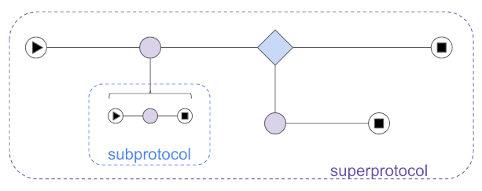
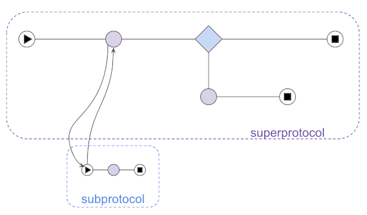
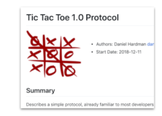

# 00??: Protocols

- Name: protocols
- Authors: Daniel Hardman <daniel.hardman@gmail.com>
- Start Date: 2018-12-28
- PR: https://github.com/hyperledger/indy-hipe/pull/69

## Summary

Defines protocols (and the closely related concept of message families)
in the context of agent-to-agent interactions,
and shows how they should be designed and documented.

## Motivation

When we began exploring agent-to-agent interactions, we imagined that
interoperability would be achieved by formally defining message families.
We have since learned that message family definitions must define more 
than simply the attributes that are a part of each message. We also need 
to formally define the roles in an interaction, the possible states those roles 
can have, the way state changes in response to messages, and the errors 
that may arise.


In addition, we realized that we need clear examples of how to define all
these things, so designs are consistent and robust.

## Tutorial

### What is a protocol?

A __protocol__ is a recipe for a stateful interaction. Protocols are all
around us, and are so ordinary that we take them for granted. Each of the
following interactions is stateful, and has conventions that constitute
a sort of "recipe":

* Ordering food at a restaurant
* Buying a house
* Playing a game of chess, checkers, tic-tac-toe, etc.
* Bidding on an item in an online auction.
* Going through security at the airport when we fly
* Applying for a loan

Protocols are a major concern for SSI agents. Agents need a recipe for
stateful interactions like:

* Connecting with one another
* Requesting and issuing credentials
* Proving things using credentials
* Putting things in escrow (and taking them out again)
* Paying
* Reporting errors
* Negotiating
* Cooperative debugging

### Agent Design

Protocols are the key unit of interoperable extensibility in agents. To add a
new interoperable feature to an agent, give it the ability to handle a
new protocol.

When agents receive messages, they map the messages to a __protocol handler__
and possibly to an __interaction state__. The protocol handler is code that
knows the rules of a particular protocol; the interaction state tracks
progress through an interaction. For more information, see the [agents explainer HIPE](
https://github.com/hyperledger/indy-hipe/blob/36913b80/text/0002-agents/README.md#general-patterns)
and the [DIDComm explainer HIPE](
https://github.com/hyperledger/indy-hipe/blob/b0708395/text/0003-did-comm/README.md).

### Composable

Protocols are *composable*--meaning that you can nest one inside another.
The protocol for asking someone to repeat their last sentence can occur
inside the protocol for ordering food at a restaurant. The protocols for
reporting an error or arranging payment can occur inside a protocol for
issuing credentials.

When we invoke one protocol inside another, we call the inner protocol a
__subprotocol__, and the outer protocol a __superprotocol__. A given protocol
may be a subprotocol in some contexts, and a standalone protocol in others.
In some contexts, a protocol may be a subprotocol from one perspective, and
a superprotocol from another (as when protocols are nested at least 3 deep).



Commonly, protocols wait for subprotocols to complete, and then they continue.
A good example of this is [ACKs](https://github.com/hyperledger/indy-hipe/blob/518b5a9a/text/acks/README.md),
which are often used as a discrete step in a larger flow.

In other cases, a subprotocol is not "contained" inside its superprotocol.
Rather, the superprotocol triggers the subprotocol, then continues in parallel,
without waiting for the subprotocol to complete. In the [introduction protocol](
https://github.com/hyperledger/indy-hipe/blob/790987b9/text/introductions/README.md),
the final step is to begin a connection protocol between the two introducees--
but [the introduction superprotocol completes when the connection subprotocol
*starts*, not when it *completes*](
https://github.com/hyperledger/indy-hipe/blob/790987b9/text/introductions/README.md#goal).


 

### Message Families

A message family is a collection of messages that share a common theme, goal, or
usage pattern. The messages used by a protocol
may be a subset of a particular message family; for example, the [connection
establishment protocol](../0031-connection-protocol/README.md) uses one subset
of the messages in the `connections` message family, and the [connection management
protocol](https://github.com/hyperledger/indy-hipe/blob/baa1ead5/text/conn-mgmt-protocols/README.md)
a different subset.

Collectively, the message types of a protocol serve as its _interface_. Each protocol
has a primary message family, and the name of the protocol is often the name of the
primary message family. 

### Ingredients

A protocol has the following ingredients:

* [_name and version_](#name-and-version-under-tutorial)
* [_messages (primary message family)_](#messages-under-tutorial)
* [_adopted messages_](#adopted-messages)
* [_roles_](#roles-under-tutorial)
* [_state_ and _sequencing rules_](#state-under-tutorial)
* _events that can change state_ -- notably, _messages_, but also _errors_, _timeouts_, and so forth
* _constraints that provide trust and incentives_

### How to define a protocol or message family

To define a protocol, write a HIPE. The [tictactoe 1.0 protocol](
tictactoe-1.0/README.md) is attached to this HIPE as an example.

[](tictactoe-1.0/README.md)

A protocol HIPE conforms to general HIPE patterns, but includes some
specific substructure:

#### "Name and Version" under "Tutorial"

The first section of a protocol HIPE, under "Tutorial", should be called
"Name and Version". It should specify the official name of the protocol
and its version.

Protocol names are conventionally lower_snake_case (especially in URIs),
but are compared case-insensitively and ignoring punctuation. This means
that all of the following protocol names are considered identical in
comparison, and can be used interchangeably, depending on what's appropriate
for a given context (a user-friendly doc vs. CSS vs. python class vs. java class):

* `Let's Do Lunch!`
* `lets-do-lunch`
* `lets_do_lunch`
* `LetsDoLunch`

##### URI representation

The name of the protocol and its version must be encoded in a __message type
URI__ (MTURI) that identifies message types unambiguously. The format of the
MTURI is important because it is is parsed by agents that will map messages to
handlers--basically, code will look at this string and say, "Do I have
something that can handle this message type inside protocol X version Y?"
Therefore, it is a critical consideration for interoperability. The URI MUST
be built as follows:

```ABNF
message-type-uri  = doc-uri delim protocol-name 
    "/" protocol-version "/" message-type-name
delim             = "?" / "/" / "&" / ":" / ";" / "="
protocol-name     = identifier
protocol-version  = semver
message-type-name = identifier
identifier        = alpha *(*(alphanumeric / "_" / "-" / ".") alphanumeric)
```

It can be loosely matched and parsed with the following regex:

    (.*?)([a-z0-9._-]+)/(\d[^/]*)/[a-z0-9._-]+$

A match will have captures groups of (1) = `doc-uri`, (2) = `protocol-name`,
(3) = `protocol-version`, and (4) = `message-type-name`.

The goals of this URI are, in descending priority:

* Code can use the URI to route messages to protocol
handlers using semver rules.

* The definition of a protocol should be tied to the URI such
that it is semantically stable. This means that once version 1.0
of a protocol is defined, its definition should not change in
ways that would break implementations. (See the [semver](#semver)
section for more on this.)

* Developers can discover information about novel protocols, using
the URI to browse or search the web.

The `doc-uri` portion is any URI that exposes documentation about
protocols. A developer should be able to browse to that URI and use human intelligence
to look up the named and versioned protocol. Optionally and preferably, the
full URI may produce a page of documentation about the specific message type,
with no human mediation involved.

A shorter URI that follows the same conventions but lacks the
`message-type-name` portion is called a __protocol identifier URI__
(PIURI). Its loose matcher regex is:

    (.*?)([a-z0-9._-]+)/(\d[^/]*)/?$
    
Some examples of valid MTURIs and PIURIs include:

* `http://example.com/protocols?which=lets_do_lunch/1.0/` (PIURI with fully automated lookup of protocol docs)
* `http://example.com/message_types?which=lets_do_lunch/1.0/proposal` (MTURI)
* `https://github.com/hyperledger/indy-hipe/tree/d7879f5e/text:trust_ping/1.0/ping`
   (MTURI). Note that this URI returns a 404 error if followed directly--but
   per rules described above, the developer should browse to the doc root
   ([https://github.com/hyperledger/indy-hipe/tree/d7879f5e/text](
   https://github.com/hyperledger/indy-hipe/tree/d7879f5e/text
   )) and look for documentation on the `trust_ping/1.0` protocol.
* `did:sov:BzCbsNYhMrjHiqZDTUASHg;spec/trust_ping/1.0/ping` (MTURI) This
   uses a DID reference to look up an endpoint named `spec` that serves
   information about protocols. (The exact syntax of DID references--URIs
   where the DID functions like a domain name, and additional info is
   fetched from a DID Doc in much the same way IP address and hostname
   definitions are fetched from a DNS record--is still being finalized.
   See the latest [DID Spec](https://w3c-ccg.github.io/did-spec) for details.)

##### Semver Rules

[Semver](http://semver.org) rules apply in cascading fashion to versions
of protocols and individual message types. Individual
message types are versioned as part of a coherent protocol, which
constitutes a [public API in the semver sense](https://semver.org/#spec-item-1).
An individual message type can add new optional fields, or deprecate
existing fields, [with only a change to its message family's minor
version](https://semver.org/#spec-item-7).
Similarly, a protocol can add new message types (or [adopted
ones](#adopted-messages)) with only a change
to the minor version. It can announce deprecated fields. It can add additional
semantics around optional decorators. These are all backwards-compatible
changes, also requiring only a minor version update.

Changes that remove fields or message types, that make formerly optional
things required, or that alter the state machine in incompatible
ways, must result in an [increase of the major version of the protocol/primary
message family](https://semver.org/#spec-item-8).

#### "Key Concepts" under "Tutorial"

This is the first subsection under "Tutorial". It is short--a paragraph or
two. It defines terms and describes the flow of the interaction at a very
high level. Key preconditions should be noted (e.g., "You can't issue a
credential until you have completed the _connection_ protocol first"), as
well as ways the protocol can start and end, and what can go wrong. The
section might also talk about timing constraints and other assumptions.
After reading this section, a developer should know what problem your
protocol solves, and should have a rough idea of how the protocol works in
its simpler variants.

#### "Roles" under "Tutorial"

This is the next subsection. It gives a formal name to the roles in the
protocol, says who and how many can play each role, and describes constraints
associated with those roles (e.g., "You can only issue a credential if you
have a DID on the public ledger"). The issue of qualification for roles can
also be explored (e.g., "The holder of the credential must be known to the
issuer").

The formal names for each role are important because they are used when
[agents discover one another's capabilities](
https://github.com/hyperledger/indy-hipe/pull/73); an agent doesn't
just claim that it supports a protocol; it makes a claim about which
*roles* in the protocol it supports. An agent that supports credential
issuance and an agent that supports credential holding may have very
different features, but they both use the _credential-issuance_ protocol.
By convention, role names use lower-kebab-case but are compared
case-insensitively and ignoring punctuation.

#### "States" under "Tutorial"

This section lists the possible states that exist for each role. It also
enumerates the events (often but not always messages) that can occur,
including errors, and what should happen to state as a result. A formal
representation of this information is provided in a _state machine matrix_.
It lists events as columns, and states as rows; a cell answers the
question, "If I am in state X (=row), and event Y (=column) occurs,
what happens to my state?" The [Tic Tac Toe example](tictactoe-1.0/README.md#states)
is typical.

[Choreography Diagrams](
https://www.visual-paradigm.com/guide/bpmn/bpmn-orchestration-vs-choreography-vs-collaboration/#bpmn-choreography)
from [BPMN](#bpmn) are good artifacts here, as are [PUML sequence diagrams](
http://plantuml.com/sequence-diagram) and [UML-style state machine diagrams](http://agilemodeling.com/artifacts/stateMachineDiagram.htm).
The matrix form is nice because it forces an exhaustive analysis of every
possible event. The diagram styles are often simpler to create and consume,
and the PUML and BPMN forms have the virtue that they can support line-by-line
diffs when checked in with source code. However, they don't offer an
easy way to see if all possible flows have been considered; what they may
NOT describe isn't obvious. This--and the freedom from fancy tools--is why
the matrix form is used in many early HIPEs. We leave it up to
the community to settle on whether it wants to strongly recommend specific
diagram types.

The formal names for each state are important, as they are used in [`ack`s]( https://github.com/hyperledger/indy-hipe/pull/77)
and [`problem-report`s](https://github.com/hyperledger/indy-hipe/pull/65)).
For example, a `problem-report` message declares which state the sender
arrived at because of the problem. This helps other parties in an interaction
to react to errors with confidence. Formal state names are also used in the
agent test suite, in log messages, and so forth.

By convention, state names use lower-kebab-case but are compared
case-insensitively and ignoring punctuation.

Some protocols have only one role, and thus only one state machine.
But in many protocols, different participants may have different state
machines. This section has been neglected in many early efforts at protocol
definition, and its omission is a big miss. Analyzing all possible states
and events for all roles leads to robustness; skipping the analysis leads
to fragility.

##### State machines

Writing a formal state machine to accompany the state matrix of a protocol
is not required, but it is a best practice. For developers who have not worked
with state machines before, this may sound intimidating, but it is actually
quite easy, and it provides a clean encapsulation of logic that would otherwise
be a bunch of conditionals scattered throughout the code. It also provides a
convenient way to load state later, when a message arrives for an interaction
that is only partly complete. And it makes formal testing for completeness and
security much easier.

The introduction HIPE includes a sample state machine. [TODO: get link]

For an extended example of how state machines can be used, including in nested
protocols, and with hooks that let custom processing happen at each point in
a flow, see [https://github.com/dhh1128/distributed-state-machine](
https://github.com/dhh1128/distributed-state-machine/blob/master/README.md).

##### Processing Points

A protocol definition describes key points in the flow where business logic
can attach. Some of these __processing points__ are obvious, because the
protocol calls for a decision to be made. Others are implicit. Some examples
include:

* The _beginning_ and _end_.
* The _launch of a subprotocol_.
* The _completion of a subprotocol_, or the _subprotocol changing state_.
* _Sending a message_. (For each send, the sender could choose to go silent
and abandon the interaction instead, though many
protocols would ask for notification to be emitted as best practice.)
* (Receiving a message_. (Requires validation, then integration
with policy and processes internal to the agent and its sovereign domain,
to move the interaction forward.)

When a protocol is modeled with a state machine, each of these processing
points can be hooked without cluttering the state machine itself. This is
a nice encapsulation pattern.

#### "Messages" under "Tutorial"

If there is a message family associated with this protocol, this
section describes each member of it. It should also note the names and
versions of messages from other message families that are used by the
protocol (e.g., an [`ack`]( https://github.com/hyperledger/indy-hipe/pull/77)
or a [`problem-report`](https://github.com/hyperledger/indy-hipe/pull/65)).
Typically this section is written as a narrative, showing each message
type in the context of an end-to-end sample interaction. All possible
fields may not appear; an exhaustive catalog is saved for the "Reference"
section.

Sample messages that are presented in the narrative should also be checked
in next to the markdown of the HIPE, in [DIDComm Plaintext format](
https://github.com/hyperledger/indy-hipe/blob/master/text/0026-agent-file-format/README.md#agent-plaintext-messages-ap).

##### Adopted Messages

Many protocols should use general-purpose messages such as [`ack`](
https://github.com/hyperledger/indy-hipe/pull/77) and [`problem-report`](
https://github.com/hyperledger/indy-hipe/pull/65)) at certain points in
an interaction. This reuse is strongly encouraged because it helps us avoid
defining redundant message types--and the code to handle them--over and
over again (see [DRY principle](https://en.wikipedia.org/wiki/Don't_repeat_yourself)).

However, using messages with generic values of `@type` (e.g., `"@type":
"did:sov:BzCbsNYhMrjHiqZDTUASHg;spec/notification/1.0/ack"`)
introduces a challenge for agents as they route messages to their internal
routines for handling. We expect internal handlers to be organized around
protocols, since a protocol is a discrete unit of business value as well
as a unit of testing in our agent test suite. Early work on agents has
gravitated towards pluggable, routable protocols as a unit of code
encapsulation and dependency as well. Thus the natural routing question
inside an agent, when it sees a message, is "Which protocol handler should
I route this message to, based on its @type?" A generic `ack` can't be
routed this way.

Therefore, we allow a protocol to __adopt__ messages into its namespace.
This works very much like python's `from module import symbol` syntax.
It changes the `@type` attribute of the adopted message. Suppose a `rendezvous`
protocol is identified by the URI `did:sov:mYhnRbzCbsjhiQzDAstHgU;spec/rendezvous/2.0`,
and its definition announces that it has adopted generic 1.x `ack`
messages. When such `ack` messages are sent, the `@type` should now use
the alias defined inside the namespace of the `rendezvous` protocol:


Adoption should be declared in an "Adopted" subsection of "Messages" in
a protocol HIPE. When adoption is specified, it should include a __minimum
adopted version__ of the adopted message type: "This protocol adopts
`ack` with version >= 1.4". All versions of the adopted message that share
the same major number should be compatible, given the [semver rules](#semver-rules)
noted above.

#### "Constraints" under "Tutorial"

Many protocols have constraints that help parties build trust.
For example, in buying a house, the protocol includes such things as
commission paid to realtors to guarantee their incentives, title insurance,
earnest money, and a phase of the process where a home inspection takes
place. If you are documenting a protocol that has attributes like
these, explain them here. If not, the section can be omitted.

#### "Messages" under "Reference"

Unless the "Messages" section under "Tutorial" covered everything that
needs to be known about all message fields, this is where the data type,
validation rules, and semantics of each field in each message type are
details. Enumerating possible values, or providing ABNF or regexes is
encouraged. Following conventions such as [those for date-
and time-related fields](https://github.com/hyperledger/indy-hipe/pull/76)
can save a lot of time here.

Each message type should be associated with one or more roles in the 
protocol. That is, it should be clear which roles can send and receive
which message types.

#### "Examples" under "Reference"

This section is optional. It can be used to show alternate flows through
the protocol.

#### "Collateral" under "Reference"

This section is optional. It could be used to reference files, code,
relevant standards, oracles, test suites, or other artifacts that would
be useful to an implementer. In general, collateral should be checked in
with the HIPE.

#### "Localization" under "Reference"

If communication in the protocol involves humans, then localization of
message content may be relevant. Default settings for localization of
all messages in the protocol can be specified in an `l10n.json` file
described here and checked in with the HIPE. See ["Decorators at Message
Type Scope"](https://github.com/hyperledger/indy-hipe/blob/318f265d508a3ddf1da7d91c79ae4ae27ab9142b/text/localized-messages/README.md#decorator-at-message-type-scope)
in the [Localization HIPE](https://github.com/hyperledger/indy-hipe/pull/64).

#### "Message Catalog" under "Reference"

If the protocol has a formally defined catalog of codes (e.g., for errors
or for statuses), define them in this section. See ["Message Codes and
Catalogs"](https://github.com/hyperledger/indy-hipe/blob/318f265d508a3ddf1da7d91c79ae4ae27ab9142b/text/localized-messages/README.md#message-codes-and-catalogs)
in the [Localization HIPE](https://github.com/hyperledger/indy-hipe/pull/64).

## Reference

The [Tic-Tac-Toe 1.0 protocol](
tictactoe-1.0/README.md) is attached to this HIPE as an example of a good
definition.

## Drawbacks

This HIPE creates some formalism around defining protocols. It doesn't go
nearly as far as SOAP or CORBA/COM did, but it is slightly more demanding
of a protocol author than the familiar world of RESTful [Swagger/OpenAPI](
https://swagger.io/docs/specification/about/).

The extra complexity is justified by the greater demands that agent-to-agent
communications place on the protocol definition. (See notes in [Prior Art](#prior-art)
section for details.)

## Rationale and alternatives

Some of the simplest DIDComm protocols could be specified in a Swagger/OpenAPI
style. This would give some nice tooling. However, not all fit into that
mold. It may be desirable to create conversion tools that allow Swagger
interop.   

## Prior art

[bpmn]: #bpmn
* [BPMN](https://en.wikipedia.org/wiki/Business_Process_Model_and_Notation): A
 graphical language for modeling flows of all types (plus things less like
 our protocols as well). BPMN is a mature standard sponsored by [OMG](
 https://en.wikipedia.org/wiki/Object_Management_Group). It has a nice
 [tool ecosystem](https://camunda.com/bpmn/tool/). It also has an XML file
 format, so the visual diagrams have a two-way transformation to and from
 formal written language. It also has a code generation mode, where BPMN
 can be used to drive executable behavior if diagrams are sufficiently
 detailed and sufficiently standard. (Since BPMN supports various extensions
 and is often used at various levels of formality, execution is not its most
 common application.) BPMN began with a focus on centralized processes
 (those driven by a business entity), with diagrams organized around the goal
 of the point-of-view entity and what they experience in the interaction. This
 is somewhat different from an A2A protocol where any given entity may experience
 the goal and the scope of interaction differently; the state machine for a
 home inspector in the "buy a home" protocol is _quite_ different, and somewhat
 separable, from the state machine of the buyer, and that of the title insurance
 company. BPMN 2.0 introduced the notion of a [choreography](
 https://www.visual-paradigm.com/guide/bpmn/bpmn-orchestration-vs-choreography-vs-collaboration/#bpmn-choreography),
 which is much closer to the concept of an A2A protocol, and which has quite
 an elegent and intuitive visual representation. However, even a BPMN
 choreography doesn't have a way to discuss interactions with decorators,
 adoption of generic messages, and other A2A-specific concerns. Thus, we may
 lean on BPMN for some diagramming tasks, but it is not a substitute for the
 HIPE definition procedure described here. 
* [WSDL](https://www.w3.org/TR/2001/NOTE-wsdl-20010315): A web-centric
 evolution of earlier, RPC-style interface definition languages like
 [IDL in all its varieties](https://en.wikipedia.org/wiki/Interface_description_language)
 and [CORBA](https://en.wikipedia.org/wiki/Common_Object_Request_Broker_Architecture).
 These technologies describe a *called* interface, but they don't describe
 the caller, and they lack a formalism for capturing state changes, especiall
 by the caller. They are also out of favor in the programmer community at
 present, as being too heavy, [too fragile](
 https://codecraft.co/2008/07/29/decoupling-interfaces-as-versions-evolve-part-1/),
 or poorly supported by current tools.
* [Swagger/OpenAPI](https://swagger.io/docs/specification/about/): Overlaps
 about 60% with the concerns of protocol definition in agent-to-agent
 interactions. We like the tools and the convenience of the paradigm
 offered by OpenAPI, but where these two do not overlap, we have impedance.
 Agent-to-agent protocols must support more than 2 roles, or
 two roles that are peers, whereas RESTful web services assume just client
 and server--and only the server has a documented API.
 Agent-to-agent protocols are fundamentally asynchronous,
 whereas RESTful web services mostly assume synchronous request~response.
 Agent-to-agent protocols have complex considerations for diffuse trust, 
 whereas RESTful web services centralize trust in the web server.
 Agent-to-agent protocols need to support transports beyond HTTP, whereas
 RESTful web services do not. Agent-to-agent protocols are nestable, while
 RESTful web services don't provide any special support for that construct.
* [Pdef (Protocol Definition Language)](https://github.com/pdef/pdef): An alternative to Swagger.
* [JSON RPC](https://www.jsonrpc.org/specification): Defines how invocation of
 remote methods can be accomplished by passing JSON messages. However, the
 RPC paradigm assumes request/response pairs, and does not provide a way
 to describe state and roles carefully.
* [IPC Protocol Definition Language (IPDL)](https://developer.mozilla.org/en-US/docs/Mozilla/IPDL):
 This is much closer to agent protocols in terms of its scope of concerns
 than OpenAPI. However, it is C++ only, and intended for use within browser
 plugins. 

# Unresolved questions

- Should we write a Swagger translator?
- If not swagger, what formal definition format should we use in the future?

