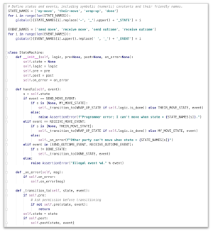

# State Details and State Machines

Some protocols have only one role, and thus only one state machine.
But in many protocols, different participants may have different state
machines. This section has been neglected in many early efforts at protocol
definition, and its omission is a big miss. Analyzing all possible states
and events for all roles leads to robustness; skipping the analysis leads
to fragility.

### State machines

Writing a formal state machine to accompany the state matrix of a protocol
is not required, but it is a best practice. For developers who have not worked
with state machines before, this may sound intimidating, but it is actually
quite easy, and it provides a clean encapsulation of logic that would otherwise
be a bunch of conditionals scattered throughout the code. It also provides a
convenient way to load state later, when a message arrives for an interaction
that is only partly complete. And it makes formal testing for completeness and
security much easier.

The tictactoe example includes a complete state machine in less than 50
lines of code. See [state-machine.py](tictactoe-1.0/state_machine.py).

For an extended example of how state machines can be used, including in nested
protocols, and with hooks that let custom processing happen at each point in
a flow, see [https://github.com/dhh1128/distributed-state-machine](
https://github.com/dhh1128/distributed-state-machine/blob/master/README.md).

### Processing Points

A protocol definition describes key points in the flow where business logic
can attach. Some of these __processing points__ are obvious, because the
protocol calls for a decision to be made. Others are implicit. Some examples
include:

* The _beginning_ and _end_.
* The _launch of a subprotocol_.
* The _completion of a subprotocol_, or the _subprotocol changing state_.
* _Sending a message_. (For each send, the sender could choose to go silent
and abandon the interaction instead, though many
protocols would ask for notification to be emitted as best practice.)
* (Receiving a message_. (Requires validation, then integration
with policy and processes internal to the agent and its sovereign domain,
to move the interaction forward.)

When a protocol is modeled with a state machine, each of these processing
points can be hooked without cluttering the state machine itself. This is
a nice encapsulation pattern.

### State Machine Scope

If you study the state machine example in the tictactoe protocol, you will
see that the state machine only concerns itself with *interacting* correctly;
it doesn't deal with implementing game logic such as deciding what a valid move
is. This is the job of an entirely different object, [game.py](tictactoe-1.0/game.py).

Agents building protocol support are going to see a similar pattern. The state
machine guarantees that rules about interacting with other parties are followed
correctly; other logic is needed to implement business rules, make decisions,
and so forth. Notice how the tictactoe state machine includes hooks (its `pre`
and `post` and `on_error` members) that allow it to be connected to other
code at processing points.

