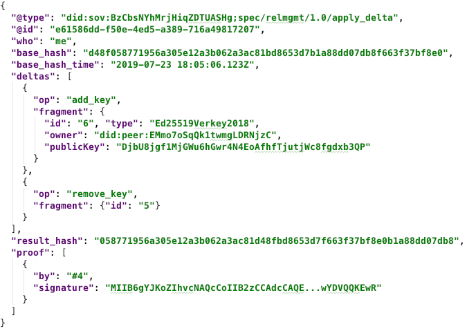

# 00??: Relationship Management Protocol
- Authors: Daniel Hardman <daniel.hardman@gmail.com>, Devin Fisher <devin.fisher@evernym.com>, Sam Curren <sam@sovrin.org>
- Start Date: 2018-10-01
- PR: 

## Summary

Define a non-centralized protocol (that is, one that does not involve a common
store of state like a blockchain), whereby parties synchronize the state of
their shared relationship by direct communication with one another.

## Motivation

For Alice and Bob to interact, they must establish and maintain state.
This state includes all the information in a DID Document: endpoint, keys, and
associated authorizations.

The [Connection Protocol](https://github.com/hyperledger/indy-hipe/blob/b3f5c388/text/connection-protocol/README.md)
describes how these DID Docs are initially exchanged as a relationship is
built. However, its mandate ends when a connection is established. The
protocol described here focuses on how peers maintain their relationship
thereafter, as DID Docs evolve.

# Tutorial
[tutorial]: #tutorial

### Background Concepts

##### Setting Expectations

It is possible to have perfect synchronization of relationship state, both
within and across domains. However, doing so requires a central source of
truth. That is how traditional databases and source code control tools like
Subversion/CVS/Perforce work--everybody who wants to make a state change submits the change
to the central authority, and the central authority applies the change and requires
all clients to cope with it before they submit more changes. But it is not reasonable
to require everybody who has a self-sovereign identity to centralize their
own management of that identity in a cloud. There are excellent cybersecurity
reasons why centralization is dangerous, and there are privacy and robustness
and scale and cost reasons to avoid it as well.

This protocol takes a different path. It is inherently decentralized. This
means its behavior and outcomes are much more like git. All participants
in a relationship--all the agents owned by Alice and Bob--effectively have
their own state "repo", and each change is commited locally and then "pushed"
to a broader audience. As with git, it is possible to detect and silently,
automatically, and confidently merge divergent states. And as with git, it is
also possible to end up with a merge conflict. The potential for merge conflicts
is an unavoidable consequence of decentralization.

We could attempt to manage relationship state with byzantine consensus, as
some blockchains do. This route is fraught with problems, since the agents
owned by Alice and Bob are not guaranteed to be highly or reliably connected,
and they may not have the numbers required by certain algorithms. We could
do proof-of-work-based consensus--but this would burden the protocol with
time and computational load that we can ill afford.

Besides, any consensus protocol or blockchain-like mechanism arbitrating
between different views of state really represents a new centralization.
If we are really serious about decentralization, we accept its drawbacks
along with its advantages, and we find a way to be robust, efficient, easy
to implement, and compatible with great UX. That is the goal, and this
protocol achieves it, just as git solves problems for millions of
developers every day. Merge conflicts should be quite rare, in practice
(see the [Best Practices](#best-practices) section), and even when they do
occur, they have straightforward resolutions.

##### Relationship versus Non-Relationship State

The state that's managed by this protocol is only the state that embodies
relationship knowledge in a DID Doc. Plenty of other state may exist, such
as a history of credentials presented in both directions, a history of
other messages and interactions, rich policy configured in either
direction, and so forth. Such things are not managed in this protocol.
(TODO: see [this note](#applying-this-protocol-to-other-state) about
reusing the protocol for other problems.)

A particular type of state that may cause confusion is authorization
state. The authorization state that's present in DID Docs and that's
covered by this protocol is authorization to manage DID Doc operations
(see "[Types of Changes](#types-of-changes)" below for a list).
But there may be other types of authorization state as well. For
example, Alice may ask Bob to help her enforce spending limits on
her devices, and she may express these limits as authorizations. Maybe
her phone is only authorized to spend money up to $10 per day, whereas
her laptop can spend up to $1000, and three of her agents must agree to
spend any amount greater than $1000. This sort of authorization is not
encoded in a DID Doc. Therefore, it is out of scope.

##### Authentication versus Authorization

A manager, a teller, and a vice president may all be legitimate employees
of a bank. However, the actions that each is authorized to perform on
behalf of their employer may be different.

The `authentication` section of a DID Doc enumerates keys that can act as
the DID subject (what the DID identifies). When such a key is used, it is
like proving that they are an employee of the bank. A key from the
`authentication` section of a DID Doc
is able to exercise the identity of the DID subject.

_But what is that key authorized to do?_
Bank tellers can transact business, but probably not announce the appointment
of a new manager. Bank vice presidents may be able to appoint managers or
tellers, but for safety reasons may not be allowed to handle money
directly.

Delegating specific privileges is the job of the `authorization` section.

##### Types of Changes

All of the following operations can be performed on a DID Doc, and must be
supported by the relationship management protocol:

* Adding, removing, or rotating keys
* Adding and removing key references from the `authentication` or
  `authorization` section
* Adding, removing, or reconfiguring endpoints

##### DID Doc Deltas

In traditional databases, the concept of a _transaction_ exists to
bundle changes in a way that guarantees that the whole set of changes either
succeeds or fails, as an indivisible unit. This allows funds to be
transferred out of one account, and into another--but never to be
lost in limbo with only one of the two transfers complete.

This same requirement exists in relationship management. Several
relationship __operations__ may need to be performed as a unit on a DID Doc.
For example, an old key may need to be retired, a new key may need to be
announced, and the new key may need to be given authorizations, all as
an atomic unit of change.

To facilitate this, the relationship management protocol deals in 
a larger unit of change than an individual operation. This is a
DID Doc __delta__, and it consists of a list of operations that must
be applied in order. For security reasons, all operations in a delta
must share a common authorization. This means that it is illegal for
key 1 to authorize part of the list, and for key 2 to authorize another
part. All keys must authorize the complete delta, so each authorizer
knows the full scope of the change.

##### Across Domains Versus Within A Domain

Most protocols between identity owners deal only with messages that cross
a domain boundary--what Alice sends to Bob, or vice versa. What Alice
does internally is none of Bob's business. In other words, interoperability
is only a function of messages that get passed to external parties, not
things that happen inside one's own domain.

However, this protocol has some special requirements. Alice may have
multiple agents, and Bob's behavior must account for the possibility that
each of them has a different view of current relationship state. Alice
has a responsibility to share and harmonize the view of state
among her agents. Bob doesn't need to know exactly how she does it--but
he _does_ need to know that she's doing it, somehow--and he may need to
cooperate with Alice to intelligently resolve divergences.

For this reason, we are going to describe this protocol as if it involved
message passing _within_ a domain in addition to
message passing _across_ domains. This is a simplification. The true, precise
requirement for compliance with the protocol is that implementers must pass
messages _across_ domains as described here, and they must _appear to an
outside observer_ as if they were passing messages within their domain as
the protocol stipulates--but if they achieve the within-domain results
using some other mechanism besides DID Comm message passing, that is fine.

### Message Family

The messages used to establish, maintain, and end a relationship are members of
the `connection` message family. This family is identified by the following DID
reference (a form of URI [TODO: hyperlink to def of DID reference in DID spec]):

    did:sov:BzCbsNYhMrjHiqZDTUASHg;spec/connection/1.0

Of course, subsequent evolutions of the message family will replace `1.0` with
an appropriate update per [semver](https://semver.org) rules.

Note that this is the same message family used in the [Connection Protocol](
https://github.com/hyperledger/indy-hipe/blob/b3f5c388/text/connection-protocol/README.md).

The following messages are defined within this family: `apply_delta`, `sync_state`,
and `leave` The
[Reference](#reference) section of this HIPE contains a detailed explanation
of each field of each message; here in the Tutorial, we will focus on just
a rough description.
 
##### `apply_delta`

This message announces that the sender wants to synchronize state with the
recipient. The recipient can be another agent within the same sovereign
domain, or it can be an agent on the other side of the relationship. A
sample looks like this:

[](apply_delta1.json)

The properties in this message include:

*`who`: Identifies which state is being synchronized. If the value of this
  property is "me", then the target is the state of the sender's domain; if it
  "you", then it is the state of the recipient's domain.
* `base_hash`: Identifies a __state hash__ that provides a reference against
  which deltas can be applied. The sender should select a state hash that
  it expects the recipient to recognized. For example, if this is the first
  change that Alice is making to her DID Doc since the relationship was
  established, then this is the hash of the normalized version of the DID
  Doc that she gave Bob at the end of the connection protocol. If this the
  hundredth change to Alice's state in a relationship that is years old, it
  may be a state hash from an hour or a day ago. This value is much like a 
  a commit hash in git. See [State Hashes](#state-hashes) for
  details about state hashes are computed.
* `base_hash_time`: When the sender believes that the base hash became the
  current state. This value need not be highly accurate, and different agents in
  Alice and Bob's ecosystem may have different opinions about an appropriate
  value for the selected base hash. Like timestamps in email headers, it merely
  provides a rough approximation of timeframe.
* `deltas`: Gives an ordered list of operations that should be applied to the
  DID Doc, beginning at the specified state. Each operation has an `op` code
  such as "add_key", and a `fragment` that provides the added data, or the key
  for removed data, or the key + new value for modified data.
* `result_hash`: A hash of the state that is expected when the deltas are
  applied. This is a like a checksum, verifying that both parties agree on the
  outcome.
* `proof`: A signature over `result_hash` that shows that the change is properly
  authorized. In this example, the key referenced by `#4` is apparently authorized
  to add and remove keys, so key 4 signs the result hash.

When this message is received, the following processing happens:

* The `base_hash`, `deltas`, `result_hash`, and `proof` are checked for
consistency. If any errors are detected, a [`problem_report` message](
https://github.com/hyperledger/indy-hipe/blob/9bc98bb3/text/error-reporting/README.md) 
is returned, using message threading to pinpoint the message that triggered
the problem. No further processing occurs.
* If the recipient already has the same state, it sends an [ACK](
https://github.com/hyperledger/indy-hipe/blob/518b5a9a/text/acks/README.md).
* If the recipient knew about a subset of the delta, but not all of it, it
applies what is left of the delta, and sends an ACK.
* If the recipient has a more evolved state, the recipient sends a reply
that is a new `sync_state` message informing the sender of new information.
* If the recipient does not recognize the `base_hash`, it selects a hash from
a point in time earlier than `base_hash_time` and sends back a new `sync_state`
message with that earlier base.
* If the recipient detects a conflict, it attempts to merge states. If the
merge is successful, it sends a new `sync_state` that shows the merge. If the
merge is not successful, then a merge conflict exists, and the merge conflict
policy for the sovereign domain of the associated DID is invoked. See "[Merges
and Merge Conflicts](#merges-and-merge-conflicts)".

##### `leave`

This message is used to announce that a party is abandoning the relationship. In a self-sovereign
paradigm, abandoning a relationship can be done unilaterally, and does not require formal
announcement. Indeed, sometimes a formal announcement is impossible, if one of the parties
is offline. So while using this message is encouraged and best practice, it is not mandatory.

A `leave` message from Alice to Bob looks like this:

```JSON
{
  "@type": "did:sov:BzCbsNYhMrjHiqZDTUASHg;spec/connection/1.0/leave",
  "@id": "c17147d2-ada6-4d3c-a489-dc1e1bf778ab"
}
```

If Bob receives a message like this, he should assume that Alice no longer considers
herself part of "us", and take appropriate action. This could include destroying
data about Alice that he has accumulated over the course of their relationship,
removing her peer DID and its public key(s) and endpoints from his wallet, and so
forth. The nature of the relationship, the need for a historical audit trail, regulatory
requirements, and many other factors may influence what's appropriate; the protocol
simply requires that the message be understood to have permanent termination semantics.

It may be desirable to use the [`~please_ack` decorator](
 https://github.com/hyperledger/indy-hipe/blob/518b5a9a/text/acks/README.md#requesting-an-ack-please_ack)
to request acknowledgment that the severance has been processed.

### State Hashes

To reliably describe the state of a DID Doc at any given moment, we need a
quick way to characterize its content. We do this with a SHA256 hash of the
doc. However, we have to normalize the doc first, so irrelevant changes do
not cause an inaccurate view of differences. We normalize the DID Doc
according to the [JSON Canonicalization Scheme (draft RFC)](https://tools.ietf.org/id/draft-rundgren-json-canonicalization-scheme-00.html).

There is no requirement that DID Docs need to be stored in normalized form--
only that when they are hashed, the input to the hash must be normalized first.

### Merges and Merge Conflicts

The main challenge with a protocol like this is that Alice and Bob may not have an internally
consistent view of their own domains. For example, if Alice has 3 agents (A.1, A.2, and A.3),
A.1 may be a phone that is only powered on about half the time. A.1 may change its key and
report that fact to Bob's agents, then get lost in the couch cushions. Meanwhile, A.3 may
rotate its key as well, without learning about the update from A.1.

In such a case, Bob's agents see two claims about Alice's current state. Let's use the notation
A.state[A.1] to represent the state asserted by A.1, and A.state[A.3] to represent the state
asserted by A.3.

Now, key rotations are relatively independent operations, and they do not interfere with one
another. They do not have any ordering constraints. Therefore, Bob's agents attempt to prove
the validity of a merge with the following algorithm:

1. Verify that A.state[A.1] and A.state[A.3] share a common base hash, and that
A.state[base] + A.state[A.1] and A.state[base] + A.state[A.3] are each valid
sequences.
2. Perform the synthesized sequence: A.state[base] + A.state[A.1~A.3] and see
what state hash results. Here, the ~ operator represents the idea that the deltas from A.3
are applied, but instead of being applied to A.state[base] (as they would be in normal
processing of `apply_delta`), they are applied to A.state[A.1].
3. Perform the opposite synthesized sequence: A.state[base] + A.state[A.3~A.1] and see
what state hash results.
4. Compare A.state[A.3~A.1] and A.state[A.1~A.3].
5. If they are equal, then the order of
the two changes doesn't matter, and they do not conflict. Generate a new `sync_state`
message conveying A.state[A.1~A.3] and send it back so the other agent can also do the
merge.
6. If they are not equal, then the order of the two changes matters, and/or the changes
conflict in some way. This could happen if one of the deltas revoked an authorization
upon which the other delta depends. In such a case, invoke the __merge conflict resolution
policy__ of the identity owner.

The _merge conflict resolution policy_ is something that each identity owner can specify.
Some possible policies might be:

* Designate one agent (or a small quorum of agents ) that acts as a judge to decide how to
resolve the merge conflict.
* Hold a popular election, in which each agent submits its preferred view of the state to
all peers, and the peers all vote on which view they want. Whichever view gets the most
votes wins.
* Pick whichever hash is smaller.
* Leave the agents in stalemate until the relationship is abandoned.

### Best Practices

##### The `~relstate` decorator

Agents should attach the `~relstate` decorator to messages to help each other discover when
state synchronization is needed. This decorator has the following format:

```JSON
"~relstate": {
```

##### Pending Commits

One best practice that will significantly reduce merge conflicts is that agents should never
commit to a change of state until they know that at least one other agent (on either side
of the relationship) agrees to the change. For example, an agent that wants to rotate a key
should report the key rotation to _someone_, and receive an ACK, before it commits to use
the new key. This guarantees that there will be gravitas and confirmation of the change,
and is a reasonable requirement, since a change that nobody knows about is useless, anyway.

### Routing (Cloud) Agents

Another best practice is for routing agents (typically in the cloud) to enforce certain
rules:

* Never deliver a message to a key (agent) that it doesn't see represented in its current
state. If 

# Reference
[reference]: #reference

### State and Sequence Rules

[TODO: create state machine matrices that show which messages can be sent in
which states, causing which transitions]

### Message Type Detail

[TODO: explain every possible field of every possible message type]

### Localized Message Catalog

[TODO: define some localized strings that could be used with these messages,
in errors or at other generally useful points?]
