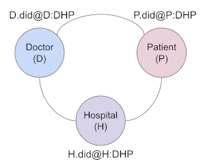
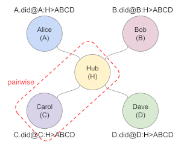

- Name: message-types
- Authors: Daniel Hardman <daniel.hardman@gmail.com>, Sam Curren <sam@sovrin.org>
- Start Date: 2018-12-05
- PR: 

# Relationship Protocol
[summary]: #summary

Define a non-centralized protocol (that is, one that does not involve a common
store of state like a blockchain), whereby parties synchronize the state of
their shared relationship by direct communication with one another.

# Motivation
[motivation]: #motivation

In order for Alice and Bob to interact, they must establish and maintain state.
This state includes all the information in a DID Document: endpoint, keys, and
associated authorizations.

The earliest approaches to this problem--in Indy, and in all other blockchain
ecosystems we know--involved Alice and Bob each writing a DID Doc to
a blockchain. They could then share DIDs with one another, and resolve those DIDs
to blockchain data that supplied the needed context.

For [anywise](https://docs.google.com/document/d/1gfIz5TT0cNp2kxGMLFXr19x1uoZsruUe_0glHst2fZ8/edit#heading=h.kp8mg3kwe5qz">anywise</a>)
use cases, this makes a lot of sense. An [anywise DID is usually public by intent](
https://docs.google.com/presentation/d/1UnC_nfOUK40WS5TD_EhyDuFe5cStX-u0Z7wjoae_PqQ/edit#slide=id.g46da93b149_0_287).
However, in relationships between private, self-sovereign individuals (an
incredibly common and important use case for SSI), the DIDs are [pairwise](
https://docs.google.com/document/d/1gfIz5TT0cNp2kxGMLFXr19x1uoZsruUe_0glHst2fZ8/edit#heading=h.eurb6x3u0443)
or [n-wise](https://docs.google.com/document/d/1gfIz5TT0cNp2kxGMLFXr19x1uoZsruUe_0glHst2fZ8/edit#heading=h.cn50pi7diqgj).
The only people in the whole world who care about the DIDs and their associated
endpoints and keys are the participants in the relationship. Why, then, would we
use a global public resource such as a blockchain, with its attendant cost and
scale/performance challenges, and its security and privacy challenges, to write
what is inherently private information?

This has led to the notion of __peer DIDs__. Such DIDs are not rooted in any
particular blockchain; rather, their trust is based upon the flow of information
between the participants in a relationship. This is exactly how relationships
commonly work in "real life"--Alice and Bob meet, share names and contact info,
and then update one another directly if their information changes.

This HIPE focuses on the messages that Alice and Bob, or their agents, send to one
another to create, maintain, and end a relationship. As such, it is not particularly
specific to Indy. Alice might be using Indy technology, and Bob might be using
something quite different; we'd still expect these messages to be exchanged.
The only strong technology assumptions we make are that Alice and Bob will
describe their relationship in terms of DIDs and the constructs from DID Docs.

The issue of peer DID format and resolution is explored in the
[Peer DID Method Spec](https://github.com/dhh1128/peer-did-method-spec).

The persistence mechanism and Indy APIs that support this protocol are
covered in a [different HIPE about relationship state in Indy](
https://github.com/hyperledger/indy-hipe/blob/5128e13bffaba57d4d63d2f3cd9430a529156930/text/relationship-state-machine/README.md
).

# Tutorial
[tutorial]: #tutorial

### Prerequisites

##### Peers, Pairs, and Groups

If you are not familiar with the
[pairwise](
https://docs.google.com/document/d/1gfIz5TT0cNp2kxGMLFXr19x1uoZsruUe_0glHst2fZ8/edit#heading=h.eurb6x3u0443)
and [n-wise](https://docs.google.com/document/d/1gfIz5TT0cNp2kxGMLFXr19x1uoZsruUe_0glHst2fZ8/edit#heading=h.cn50pi7diqgj)
concepts, please take a moment to review their definitions.

Most of this doc can be read with a pairwise Alice~Bob context. This sort of
pair (no matter whether its members are people, IoT devices, or institutions)
will be the most common peer relationship in the SSI landscape.

Groups larger than 2 can also have a peer-style relationship--but not all
groups will be modeled that way. Some groups, such as Doctor~Patient~Hospital,
are clearly n-wise. Each party can enumerate all the other parties, and each party uses
the same identifier in all directions within the group. N-wise groups are also peer
groups, and they use the protocol described here. (See [INDY HIPE 0014](
https://github.com/hyperledger/indy-hipe/blob/master/text/0014-ssi-notation/README.md)
for notation help on this diagram...):



But groups can also be modeled with a hub-and-spoke model. That model is commonly used
in group chats, for example: each member of the group chat sends and receives via a
central service, which in turn broadcasts to all other members of the
group. This hub-and-spoke model is actually just a pairwise variant,
because the relationship is between a member and the hub; all other
relationships are only indirect:



Because hub-oriented groups can be re-analyzed as pairwise, we do not cover them
explicitly below.

##### Defining a peer protocol

In computer science, "protocol" feels like a heavy concept, with lots of formalism.
But don't be intimidated. Roughly, a protocol is just a convention about communication
and related behavior. We use protocols when we order a meal at a restaurant, buy a
home, and apply to college.

To understand a protocol, we only need to know a few things:

* What roles exist in an interaction?
* What messages are possible, and what do they mean?
* What rules about state and sequencing apply?
* What contextual constraints provide guarantees? 

This tutorial aims to answer those questions for a *Peer Relationship Management Protocol*.

### Message Family

The messages used to establish, maintain, and end a relationship are members of
the `relmgmt` message family. This family is identified by the following DID
reference (a form of URI):

    did:sov:BzCbsNYhMrjHiqZDTUASHg;spec/relmgmt/1.0

Of course, subsequent evolutions of the message family will replace `1.0` with
an appropriate update per semver rules.

The following messages are defined within this family: `join_us`, `leave_us`
 `update_us`, `my_view`, `query_view`, `introduce`. [TODO: should connections
 move into this family too?] An overview of each message type follows. The
[Reference](#reference) section of this HIPE contains a detailed explanation
of each field of each message; here in the Tutorial, we will focus on just
a rough description.
 
##### `join_us`

This message announces that the sender is now modeling an interaction in terms
of a peer relationship. In other words, the sender is joining a group called
"us". A `join_us` message is sent by each party, to all other parties that are
part of "us". In a pairwise relationship, that means from Alice to Bob--and,
to complete the relationship, from Bob back to Alice. In an n-wise relationship
such as between Doctor~Patient~Hospital, each party sends to all the other
parties.

    [TODO: This message needs to be reconciled against the connection protocol.
    Connecting is a subset of relationship management, but it has specialized
    requirements that the rest of the relationship management task doesn't need
    to worry about. What's described here would only work for cases where there's
    a connection point, but not a relationship. Would that apply, for example,
    to how we contact an institution's anywise DID and propose a relationship?
    Or to an n-wise case where only parts of the graph are connected, and these
    messages need to be sent to achieve closure? Or to introductions?
    It is possible that this message disappears entirely, and we just hyperlink
    to the Connection HIPE--but that the notion of "me" and "you" and "us"
    gets moved over there. For now, I'm going to leave this message in because
    it makes sense in the context of the rest of the message family.]

The `join_us` message announces the DID by which the sender intends to be known
in the relationship, and the endpoint and key(s) that other parties should use
in future interactions. As such, it comprises a sort of "genesis transaction"
for that party with respect to the relationship.

An initial `join_us` message from Alice to Bob might look like this:

```JSON
{
  "@type": "did:sov:BzCbsNYhMrjHiqZDTUASHg;spec/relmgmt/1.0/join_us",
  "@id": "e61586dd-f50e-4ed5-a389-716a49817207",
  "me": {
    "doc": {
      "@context": "https://w3id.org/did/v1",
      "id": "did:peer:EMmo7oSqQk1twmgLDRNjzC",
      "publicKey": [
        {"id": "routing", "type": "Ed25519Verkey2018",  "owner": "did:peer:EMmo7oSqQk1twmgLDRNjzC","publicKey": "8HH5gYEeNc3z7PYXmd54d4x6qAfCNrqQqEB3nS7Zfu7K"},
        {"id": "4", "type": "Ed25519Verkey2018",  "owner": "did:peer:EMmo7oSqQk1twmgLDRNjzC","publicKey": "V8Tt75FZ2ZTu4Ar5P8bBr3vXMguTw3U14S6mN2rxrDsY"},
        {"id": "6", "type": "Ed25519Verkey2018",  "owner": "did:peer:EMmo7oSqQk1twmgLDRNjzC","publicKey": "DjbU8jgf1MjGWu6hGwr4N4EoAfhfTjutjWc8fgdxb3QP"}
      ],
      "authentication": [
        {"type": "Ed25519Verkey2018", "publicKey": "ddid:peer:EMmo7oSqQk1twmgLDRNjzC#4"}
      ],
      "service": [
        {"type": "Agency", "serviceEndpoint": "did:sov:QN8nuLJ4Av1e1Cpu2MavT6" }
      ]
    }
  }, 
  "you": [],
  "us": {},
  "comment_ltxt": { "en": "Let's be friends. This is Alice." }
}
```

Here, the value of the `me.doc` key is a DID Doc that establishes the initial state
of Alice with respect to Bob. `comment_ltxt` is optional and [follows the conventions of
localized fields](https://github.com/hyperledger/indy-hipe/blob/f67741ae5b06bbf457f35b95818bd2e9419767d7/text/localized-messages/README.md).
The `you` and `us` fields are discussed later.

Bob's normal response, also a `join_us` message, would be quite similar, except
that the `you` section would acknowledge Alice's previous message. It does
this in the `you.<Alice's peer DID>.latest` key (here, `you.did:peer:EMmo7oSqQk1twmgLDRNjzC.latest`)
by hashing the received DID Doc from Alice and reporting how many versions
of Alice's state Bob has seen:

```JSON
{
  "@type": "did:sov:BzCbsNYhMrjHiqZDTUASHg;spec/relmgmt/1.0/join_us",
  "@id": "49817207-f50e-4ed5-a389-716ae61586dd",
  "@thread": { "thid": "e61586dd-f50e-4ed5-a389-716a49817207", "seqnum": 0 },
  "me": {
    "doc": {
      "@context": "https://w3id.org/did/v1",
      "id": "did:peer:qQk1twjzCmEMgLDRNmo7oS",
      "publicKey": [
        {"id": "routing", "type": "Ed25519Verkey2018",  "owner": "did:peer:qQk1twjzCmEMgLDRNmo7oS","publicKey": "4x6qAfCNrqQqEB3nS7Zfu7K8HH5gYEeNc3z7PYXmd54d"},
        {"id": "1", "type": "Ed25519Verkey2018",  "owner": "did:peer:qQk1twjzCmEMgLDRNmo7oS","publicKey": "Ar5P8bBr3vXMguTw3U14S6mN2rxrDsYV8Tt75FZ2ZTu4"}
      ],
      "authentication": [
        {"type": "Ed25519Verkey2018", "publicKey": "ddid:peer:qQk1twjzCmEMgLDRNmo7oS#1"}
      ],
      "service": [
        {"type": "Agency", "serviceEndpoint": "did:sov:Av1e1Cpu2MavT6QN8nuLJ4" }
      ]
    }
  },
  "you": [
    "did:peer:EMmo7oSqQk1twmgLDRNjzC": { 
      "latest": {
        "sha256": "5B67C6528002FE929A228FE9F914C4B0A668E6AAEE38031BDEC6E2A0C0462D0D",
        "v": 1
      }
    } 
  ],
  "us": {},
  "comment_ltxt": { "en": "Hi, Alice. This is Bob." }
}
```

This `join_us` message is known to be a response because of the use of [message threading](
https://github.com/hyperledger/indy-hipe/blob/7bd05ee7191d5175dd6606bb5851980076b310aa/text/message-threading/README.md).
However, even without `@thread`, this is implicitly a reply of sorts, because it acknowledges
Alice's state in the `you` section.

Once every party has joined a relationship, it is considered established. However, a pairwise
relationship can be upgraded to n-wise, or an n-wise relationship can add participants, by
having the new member issue a `join_us` message of their own, and by receiving acknowledgments
of the same.

##### `leave_us`

This message is used to announce that a party is abandoning the relationship. In a self-sovereign
paradigm, abandoning a relationship can be done unilaterally, and does not require formal
announcement. Indeed, sometimes a formal announcement is impossible, if one of the parties
is offline. So while using this message is encouraged and best practice, it is not mandatory.

A `leave_us` message from Alice to Bob looks like this:

```JSON
{
  "@type": "did:sov:BzCbsNYhMrjHiqZDTUASHg;spec/relmgmt/1.0/leave_us",
  "@id": "c17147d2-ada6-4d3c-a489-dc1e1bf778ab",
  "ack_requested": false,
  "comment_ltxt": { "en": "It's not about you. It's about me..." }
}
```

If Bob receives a message like this, he should assume that Alice no longer considers
herself part of "us", and take appropriate action. This could include destroying
data about Alice that he has accumulated over the course of their relationship,
removing her peer DID and its public key(s) and endpoints from his wallet, and so
forth. The nature of the relationship, the need for a historical audit trail, regulatory
requirements, and many other factors may influence what's appropriate; the protocol
simply requires that the message be understood to have permanent termination semantics.

If `ack_requested` is `true`, then it is best practice for Bob to send a `my_view`
message with Alice's DID removed from the `you` field. This acknowledges that she is
no longer in the relationship from his perspective. This will make more sense
when the `my_view` message is described, later on--but here's what such a `my_view`
message would look like if Alice and Bob were in a pairwise relationship:

```JSON
{
  "@type": "did:sov:BzCbsNYhMrjHiqZDTUASHg;spec/relmgmt/1.0/my_view",
  "@thread": { "thid": "c17147d2-ada6-4d3c-a489-dc1e1bf778ab", "seqnum": 0 },
  "you": [],
  "comment_ltxt": "Bye. I'm not retaining anything about you."
}
```

##### `update_us`

This message is used to inform other(s) in the relationship that a change has
been proposed. If the change is in the `me` section, then the proposal should
always be accepted by others because it represents a key rotation or a similar
update that's under the unilateral control of the sender. The only exception
to this is if the proposed change is not properly authorized.

[TODO: talk about why we only want one change to be made at a time; you can't
just replace a whole DID Doc.]

If the change is in the `us` section, then it affects something that is
agreed by mutual consent, so the recipient can reject or accept it.

The JSON looks like this:

[TODO: insert Sam's JSON Diff idea? Or something else?]
[TODO: do we need timestamping anywhere in here, so we communicate *when* transitions
were applied?]

##### `my_view`

This message is used to respond to another party's assertions about changes
in a relationship. It says, "Okay, based on what you just said, here is my
view of the state of our relationship." It can contain `me` and `you` sections,
but it is normally sparse -- communicating just enough to identify the
change or state issue at hand.

For example, if Alice announces, in an `update_us` message with `@id: "abc"`, a key
rotation that changes the version of her DID Doc from 1 to 2, Bob can acknowledge
and accept the rotation with this `my_view` response:

```JSON
{
  "@type": "did:sov:BzCbsNYhMrjHiqZDTUASHg;spec/relmgmt/1.0/my_view",
  "@thread": { "pthid": "abc" },
  "accept": true,
  "you": [
    "did:peer:EMmo7oSqQk1twmgLDRNjzC": { 
      "latest": {
        "sha256": "914C4B0A668E6AAEE38031BDEC6E2A0C0462D0D5B67C6528002FE929A228FE9F",
        "v": 2
      }
    } 
  ],
  "comment_ltxt": { "en": "Okay, I'll expect you to use the new key." }
}
```

On the other hand, if Alice's key rotation is invalid, Bob can reject it
by sending a `problem-report` where `msg_catalog` is the DID reference/identifier/URI
for this message family, and `explain_ltxt.codefor slightly different `my_view` message:

```JSON
{
  "@type": "did:sov:BzCbsNYhMrjHiqZDTUASHg;spec/relmgmt/1.0/my_view",
  "@thread": { "pthid": "abc" },
  "accept": false,
  "you": [
    "did:peer:EMmo7oSqQk1twmgLDRNjzC": { 
      "latest": {
        "sha256": "AEE38031BDEC6E2914C4B0A668E6AA0C0462D0D5B67C29A228FE9F6528002FE9",
        "v": 3
      }
    } 
  ],
  "comment_ltxt": { "en": "You're proposing a change using a key that was"
     "valid in v1. But you're at v3. You already rotated the key you're trying"
     "to use to sign this update." }
}
```

(As with all other messages in this family, `comment_ltxt` is optional here, and is
only added to the example to make the meaning of the message obvious in this
narrative. What makes this message a rejection is `"accept": false`, and
Bob asserting a state for Alice that's incompatible with what she sent--not the
human-friendly comment.)

##### `query_view`

A `query_view` message asks another party to describe what it knows about
the current state of a relationship. The simplest use case for this message
is to fetch another party's DID Doc. Suppose Alice wants to know how Bob
describes his own state (the basic DID resolution operation):

```JSON
{
  "@type": "did:sov:BzCbsNYhMrjHiqZDTUASHg;spec/relmgmt/1.0/query_view",
  "@id": "adfd4f7a-afd8-4578-8233-6c8d231329fa",
  "view_of": [ "did:peer:qQk1twjzCmEMgLDRNmo7oS" ]
}
```

The response in this case is a `my_view` message that contains *both* a DID Doc
and a hash+version:

```JSON
{
  "@type": "did:sov:BzCbsNYhMrjHiqZDTUASHg;spec/relmgmt/1.0/my_view",
  
  "me": {
    "doc": {
      "@context": "https://w3id.org/did/v1",
      "id": "did:peer:qQk1twjzCmEMgLDRNmo7oS",
      "publicKey": [
        {"id": "routing", "type": "Ed25519Verkey2018",  "owner": "did:peer:qQk1twjzCmEMgLDRNmo7oS","publicKey": "4x6qAfCNrqQqEB3nS7Zfu7K8HH5gYEeNc3z7PYXmd54d"},
        {"id": "1", "type": "Ed25519Verkey2018",  "owner": "did:peer:qQk1twjzCmEMgLDRNmo7oS","publicKey": "Ar5P8bBr3vXMguTw3U14S6mN2rxrDsYV8Tt75FZ2ZTu4"}
      ],
      "authentication": [
        {"type": "Ed25519Verkey2018", "publicKey": "ddid:peer:qQk1twjzCmEMgLDRNmo7oS#1"}
      ],
      "service": [
        {"type": "Agency", "serviceEndpoint": "did:sov:Av1e1Cpu2MavT6QN8nuLJ4" }
      ]
    },
    "latest": {
      "sha256": "C6E2914C4B0A668EAEE38031BDE6AA0C0462D0D5B676528002FE9C29A228FE9F",
      "v": 2
    }
  }
}
```

Besides standard DID resolution, `query_view` can be used in more flexible ways. Alice
could ask Bob what he knows about *her* DID by changing `view_of` to contain her DID
rather than Bob's. If she did that, Bob's answer would come back in the `you` section
of the response. Alice could ask Bob for what he knows about both DIDs, in which case
the response would fill out both the `me` (Bob) and `you` (Alice) sections. In an
n-wise relationship among 4 siblings, Sibling #1 could ask Sibling #2 what her view
of Siblings 1, 3, and 4 is--and get back 3 entries under the `you` section.

[TODO: talk about errors -- when to use problem-report vs. custom]

### Multiple Agents and Relationship Synchronization

The error situation immediately above also provides a justification for `query_view`,
and it is more important than might be obvious.
We tend to think of Alice and Bob as monolithic entities--but in fact, each may have
multiple agents that they use inside their respective sovereign domains. Ideally,
all of Alice's agents would share a coherent, perfectly synchronized view of the `Alice:Bob`
relationship, all the time. But the real world is messier.

Suppose Alice owns a phone and a tablet. She temporarily misplaces the phone, so she sends
Bob a message with her tablet, removing the phone's keys from the list of keys that are
authorized. If Alice later finds the phone and tries to use it to send Bob a message, she
will get a `my_view` message as described above, explaining that this operation looks invalid
from Bob's perspective.

There are many ways to resolve this. Alice could send a new `update_us` message to Bob, adding
the phone's old key back into the authorized list. Or, if she suspects the phone was vulnerable
while misplaced, she could rebuild the phone from scratch, re-add it to her sovereign domain,
have it generate entirely new keys, and send an `update_us` message authorizing it.
To facilitate various recovery flows, the protocol offers 
This message may be used when recovering a connection via dead drop, or as a synchronization
primitive within a domain, or as a way to work around agent-to-agent connectivity problems
within Alice's sovereign domain by fetching data for Alice.agent2 from Bob instead of from
Alice.agent1. A `query_view` message looks like this:

```JSON
{
  "@type": "did:sov:BzCbsNYhMrjHiqZDTUASHg;spec/relmgmt/1.0/query_view",
  "view_of": [ "
  "comment_ltxt": { "en": "How do you see us?" }
}
```

The response to this message is a `my_view` message, but it is no longer sparse. It
now has with all of the `you` values
expanded to full DID Docs instead of just a hash. The `sha256` and `v` values are
also included, however:

```JSON
{
  "@type": "did:sov:BzCbsNYhMrjHiqZDTUASHg;spec/relmgmt/1.0/my_view",
  "you": [
    "did:peer:EMmo7oSqQk1twmgLDRNjzC": { 
      "sha256": "AEE38031BDEC6E2914C4B0A668E6AA0C0462D0D5B67C29A228FE9F6528002FE9",
      "v": 3
    } 
  ]
}
```


# Reference

[reference]: #reference
