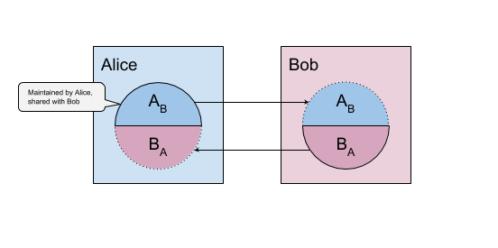

- Name: relationship-state-machine
- Author: Devin Fisher, Lovesh Harchandani, Jason Law
- Start Date: (fill me in with today's date, YYYY-MM-DD)
- PR: (leave this empty)
- Jira Issue: (leave this empty)

# Summary
[summary]: #summary
The objective of this feature is for an agent to know with very high certainity the DDO of the DID on the other end of 
relationship (An `n-way` relationship involves `n` DIDs). This feature introduces microledgers; Each DID has a 
microledger, which is an ordered log of events where each event indicates a change in the verification key. A DIDs 
microledger is indented to be replicated across all agents managing the DID

# Motivation
[motivation]: #motivation

Trusted peer interactions are the end goal of the Self-sovereign identity ecosystem. The technology that held and being build by the Indy project serve this goal. Each elements of the Indy project self-sovereign technology lives to serve this goal. For example, the anoncred technology allows a holding party to assert integrity of data, stated by an issuing party, to a verifying third party. This allows trust building interactions between two peers.

This HIPE continues this development and will answer:

`How can parties of a peer-to-peer network can share data (including cridical data like cryptographic keys) such that all parties can trust the data shared.`

The indy community, initially thought that many parts of the data that would need to be shared between entities in a between peers could be held on the public, global, immutable ledger. Without a better solutions, the original design begrudgingly put this data on the ledger even though they knew doing so cause two major downsides:

1. Personal data was put on the immutable ledger. 
    - Personal data, especially, is subject to correlation, especially endpoints. 
    - Personal data can and will leak eventually when current cryptographic algorithms break.
2. Load on the public ledger. Every peer to peer interaction required putting load onto a relatively small network of validator nodes (20-100).

This HIPE will layout a better approach to communicating information and state between parities in a peer-to-peer relationship without utilizing the public utility ledger.

# Glossary
* __Identity Owner__: The person, organization or thing the owns and controls their SSI domain. Identity Owners are the parties to the interactions discussed in this document.
* __Domain__: The collection of agents, devices and services that controlled (and often owned) by an Identity owner.
* __Agent__: Software that acts on in behalf of the Identity owner to manage their digital identity. Agents allow not digital entities to do digital tasks (encryption, signing, message transference, AI, etc). Agents are always controlled by the Identity Owner.
* __Edge Agents__: Is an agent that runs on a device (hardware) that is owned and in direct control of the Identity owner. Agents running on mobile phones, tablets, labtops or servers controlled by an organization are normally considered edge agents. Can also be known as Local agents.
* __Cloud Agents__: Is an agent that runs on a device (hardware) that is owned and controlled by another party. The Identity owner still owns and controls the agent but not the hardware it runs on. These agents often have a persistent endpoint that is used as the endpoint for the domain.
* __Relationship__: Is a connection between 2 or more Identity Owners.
* __DID__: Decentralized Identifiers. See DID spec.
* __DID Document__: Data that describes a DID. See DID spec.
* __Pairwise DID__: A DID used to identify a party in a relationship. A pairwise DID is unique to both the party and the relationship. If a Identity owner has 10 relationship, it would also have 10 unique pairwise DID to identify itself in those relationships.

# Design Goals
High level objectives for this design. Writers and reviewers of this HIPE must judge if this design meets all of these objectives.

* Allow one party to express how to communicate with their domain to all other parties in the relationship.
* Allow one party to express how to trust (verify) communications from their domain to all other parties in the relationship.
* Allow all parties to disclose verifiable and changeable information to other parties in the relationship.
* Allow all entities in a relationship to render an current DID doc from each party of the relationship.
* Each entity has sole control of their state/microledger
* 

# Design Concepts

## Relationship State
Identity Owners in a relationship are independent parties. Each member of the relationship has a domain of agents and other entities that they use and control. Trusted interactions between parties in the relationship require each party to know the public info (verkeys, endpoints, etc) of each other parties. This knowledge is the relationship state.
 
Each party of the relationship has a unique DID that is mapped to a single relationship state. For a two party relationship, there is two relationship states for each party. For n-party relationship there is n relationship states.
 
This relationship state is also source for resolving the DID Doc for the DIDs in the relationship. Therefore, the information contained in the relationship state __MUST__ but a super set of data contained by the supported DID method spec (initial Sovrin Method spec).

### State Independence
The relationship states __MUST__ be independent for each Identity Owners that is party to the relationship. Each party of the relationship controls and expresses an independent relationship state to the other parties in the relationship. 

For example, in a two party relationship of Alice and Bob, there are two independent relationship states. One is owned and controlled by Alice. This state is express (see microledger) to Bob. For Bob, this relationship state from Alice is read-only. Conversely, Bob owns and controls his own relationship state that is again expressed to Alice which is likewise read-only to Bob.

 

Additionally, each relationship state __MUST__ be built, used, and expressed for one and only one relationship. Each unique relationship __MUST__ have a unique and distinct relationship state. Identifiably elements __MUST__ be (ex. DID, verkeys, etc) unique for each relationship. Some elements (notably: endpoints) might have common value between relationship and their states but the usage of this value __MUST__ be distinct and not shared.

For example, Alice has two relationships. Both relationships have only two parties. One is with Bob and the other is with Carol. Alice will therefore have two distinct DID that identify her independently to Bob and Carol. Alice will also have two distinct relationship states that she controls. One she will express to Bob and the other will be expressed to Carol. These relationship states will be distinct from each other. Lastly, Alice will have two relationship states that she don't control that have been expressed to her by Bob and Coral. Pair of her relationship state for Bob and Bob's relationship state for Alice will for the complete info for the Alice-Bob relationship. Likewise for the Alice-Carol relationship.

### Expression Characteristics 
For trusted interaction between parties in the relationship these relationship states must be dynamic. Changes to state the expressed by the controlling parity securely and completely to each other party in the relationship. 

__Securely__: The following are the main characteristics that are considered for securely.
* __Confidentiality__ - Although the some of the data expressed in the relationship state is public in nature(ex. verkeys) not all is (endpoints). And even public data could have unintended correlation implications that should be protected by default. As such, relationship state information should be communicated confidentiality to the other parties of the relationship.
* __Integrity__ - State changes must be communicated with integrity. Unauthorized modifications must be detectable. State changes must only be possible by the Identity Owners who is described by the relationship state.
* __Source authentication__ - State changes must be communicated such that the sending entity can be authenticated and correlated with proper Identity owner.

The design in this HIPE will focus mostly on Integrity and Source authentication. Communication protocol will be leveraged to provide confidentiality. 

Agent to agent communication and its associated protocols care deeply about these characteristics. Their protocols implement algorithms that provide protections to help maintain these characteristics. But often the data needed for these algorithms is contained and protected in the relationship state. This creates a minor causality dilemma (chicken or the egg) that will be discussed in genesis state.

__Completely__: Eventual consistency will largely be inadequate. Trusted interactions between parties in the relationship will need to operate on exact and accurate relationship state. This is especially important when keys are changed in the state. All parties will need to constantly and accurately know what is the latest state.

### Microledger

Each relationship state is materialize using the [Event Sourcing pattern][event-source-descr]. Events being source for the state are held and maintained in a small merkle-based ledger. This approach is the same approach used by the Indy-Node ledger.

[event-source-descr]:https://docs.microsoft.com/en-us/azure/architecture/patterns/event-sourcing

## Anchoring

## Messaging 
 
## Interoperability vs Domains specific Implementation

# Tutorial
[tutorial]: #tutorial
## Glossary
1. ID Owner: the person or organization who is the subject of an interaction.
2. Agent: Code (perhaps in the form of an SDK) that is dedicated to one and only one ID Owner, and everything it does is in direct support of that one owner. An agent is one of two types: Edge and Cloud.
3. Edge Agent: an agent running on a device in direct control of the owner. Also known as Local Agents. Edge agents are often trusted more than cloud agents.
4. Cloud Agents: an agent running on hardware physically controlled by another party. Also known as Remote Agents. Cloud agents usually have public endpoints, which allows them to receive messages from other agents. Cloud agents usually have a mechanism by which they can communicate directly with Edge agents.
5. Relationship: a connection between 2 or more ID Owners
6. Pairwise DIDs: DIDs used by ID Owners in a specific relationship. So in a 2-way relationship between Alice and Bob, both Alice and Bob have **one** distinct pairwise DID.
7. Microledger: Ledger (ordered log) maintained by ID Owners for their pairwise DID. There is exactly one microledger for a pairwise DID, though this microledger is replicated among the agents managing that DID.
Each microledger has a merkle tree.
8. Event: The smallest unit of the microledger, eg. An Id Owner provisioning/de-provisioning a new agent for a DID (adding/removing a new verkey), changing the endpoint, etc are all events recorded in the microledger.
Events are identified by types, DID, Verkey, Endpoint are all event types.

## Relationships and state machines
Every participant in a relationship changes its state (DDO) by several events, a Verkey event, Endpoint event, etc. For other participants to know the 
exact state of that participant at any moment, they need know to know all state changes in the exact order. A state machine is a system that 
manages the transition between valid states. A Microledger is used to represent this state machine and record all state contributions by a specific 
participant of the relationship. A microledger has a merkle tree, the merkle root hash is used to efficiently communicate the state of the microledger 
to various entities. The microledger might have a merkle state trie to efficiently communicate the exact state.
Each participant tries to replicate its mircoledger to other participants. Also a participant might be using several agents to manage its 
state so its very important that each of the agents has the correct microledger. A consensus protocol is used among the agents of that DID to come to the correct microledger.

### A simple example
Consider a 2-party relationship between Alice and Bob. Here Alice and Bob are Identity Owners who might have several DIDs but only have one 
DID each for their mutual relationship, these DIDs are called pairwise DIDs. The DID Alice uses in this relationship is AB. We can also call this 
"Bob's Alice", since this DID references Alice, but is only ever shared with Bob. Another DID is Bob's, which he shares with Alice, BA, aka "Alice's Bob".
The Alice-Bob relationship has two halves. Alice's DID with her associated keys and endpoints, and Bob's with his associated keys and endpoints. 
Alice's half of the relationship can be independent, separate from Bob's.

**Alice-Bob relationship** 

 

Because events in Alice's half do not appear in Bob's half, and vice-versa, there is a one-way replication (in opposite directions) for each microledger. 
(This doesn't mean the states couldn't be cross-anchored in each others microledger. It's possible that a use case surfaces that makes cross-anchoring desirable. 
In that case, however, I think they would still maintain full independence (meaning only one entity ever appends), but the appended event could reference the other relationship's state.)
Alice has a unique DID for every relationship. Her relationship with Carol is completely independent from her relationship with Bob. She uses completely different identifiers and keys in each relationship.

**Alice-Bob and Alice-Carol relationships** 

 

In the above scenario Alice has 2 DIDs and 4 microledgers in total, 2 owned by itself (1 for Bob, 1 for Carol), 1 owned by Bob and which Bob replicated and 1 owned by Carol and which Carol replicated. 
Thus if an entity has n relationships it will have a total of 2*n microledgers.

### Mechanics of the state machine
**Initialization:** There must be an initial state set with at least one verification key. The new DID and verkey are the 'genesis' events of this state machine. Every event after the genesis events can be 
validated according to the rules of the state machine and verified against keys in the previous state. The first verkey should be fully authorized.

**Organization:** All the states are persisted in journal-like data-structure. A merkle tree is constructed from the events, added to the tree in order of their occurrence. 
The root hash of this merkle tree is used to communicate the current state of the state machine. Corollary state can go in a Patricia Trie.

**Storage:** Pairwise DIDs do not need to be public, i.e., stored on the Sovrin ledger. Therefore, the DID, its events (microledger), and its state (merkle+patricia trie) live in agents, secured in a wallet. 
As such, it can be backed up with the wallet.

**Order of events:** There might be times when a DID owner (ID Owner in a relationship) need to prove that some event in its microledger happened before or after certain time. 
It can be achieved by anchoring events to a public ledger like Sovrin (putting root hash of microledger on the public ledger), here the public ledger serves as a reference clock.

*Proof of Before* can be accomplished by anchoring the root hash of the events or the state to Sovrin. Proof of Before, or Proof of Existence, refers to proof that a local event happened before a specific public Sovrin state. 
Since Sovrin has timestamps, this becomes an irrefutable proof that an event happened before a certain point in time. The DID microledger is shared with the other party in pairwise relationship. If one party sees that the other 
has tampered with the tree, then it assumes a compromise and malicious attack and stops trusting that DID.

*Proof of After*, that is, proof that a local event happened after a certain event or point in time, can be accomplished by including the Sovrin root hash in the recorded events themselves.

**Events:** Each event has with it a signature (or array of signatures in the case of a recovery) which serve as proof that the new event is valid. 
The signature for each event is a signature over the root hash of the merkle tree of the microledger including the current event. This binds each event to the event before it.

The event types should mirror what is used in Sovrin transactions to get the same effect. (TODO: the following do not mirror Sovrin transactions; the following is exploratory.)
1. *DIDs:* DID events appear only once in a DID microledger, and they are always the first event, they never change. Adding a DID

    `NYM(DID)` where... `DID` is a DID as defined in the spec (e.g., did:sov:13579BDFHKMPRTVXZbdfhj) 
2. *Keys:* Keys can be added to a DID. The second event in a DID microledger (after the DID event) is always the first authorized key. 
    Adding a new Key

    `KEY(VERKEY, AUTHORIZATIONS)` where... 
    
    `VERKEY` is a 32-byte verification key (or 16-byte abbreviated verification key), and 
    
    `AUTHORIZATIONS` is an array of strings indicating authorizations (permissions)
 
    Updating a Key's authorizations
    
    `KEY_MOD(VERKEY, AUTHORIZATIONS)` where... 
    
    `VERKEY` references a previously authorized `VERKEY`, and 
    
    `AUTHORIZATIONS` is the new array of strings indicating authorizations (permissions)

    Removing an authorized Key
    
    `KEY_RM(VERKEY)` where... 
    
    `VERKEY` is a previously authorized `VERKEY`
    
    Example of authorizations:
    1. ALL = everything
    2. MSG = message store/forward
    3. RECOVER = part of recovery policy
    4. MONTHLY_SIGNING_LIMIT_USD(100)
    
3. *Endpoints:* Endpoints are attached to Keys. A Key can have zero, one, or many endpoints.
    Adding an Endpoint

    `ENDPOINT(VERKEY, ADDRESS, ORDER, SERVICES)` where...
    
    `VERKEY` is a previously authorized Key
    
    `ADDRESS` is a URL
    
    `ORDER` is an floating point number indicating the order this endpoint should be chosen for a particular service
    
    `SERVICES` is an optional array of strings indicating services; defaults to [ALL]
   
   Updating an Endpoint's order or services 
    `ENDPOINT_MOD(VERKEY, ADDRESS, ORDER, SERVICES)` where...
    
    `VERKEY` is a previously authorized Key
    
    `ADDRESS` is a previously added endpoint address
    
    `ORDER` is an optional integer indicating the order this endpoint should be chosen for a particular service; if ORDER is not supplied, then it remains unchanged
    
    `SERVICES` is optional array of strings indicating services; if SERVICES is not supplied, then it remains unchanged

    Removing an Endpoint
    `ENDPOINT_RM(VERKEY, ADDRESS)` where...
    
    `VERKEY` is a previously authorized Key
    
    `ADDRESS` is a previously added endpoint address
    
    Examples of services:
    1. ALL
    2. NOTICE

### Handling Multiple Agents
Any agent that is authorized to be used in a particular relationship needs to have a copy of that DID microledger. During authorization for a particular relationship, 
an agent needs to be given the genesis hash for the DID microledger (and some events to enable it to connect to more agents or it needs a way to discover other agents), 
it then connects to various agents and downloads their microledgers and concludes which is the most recent microledger. If that agent is also authorized to do so, it can 
also make changes to that microledger. There is a possibility of multiple agents making changes to the same microledger at the same time. Because the order of events is important, 
there must be a way to detect and respond to collisions. There must be consensus among agents; all must agree on the events and their order. 
In this event, an algorithm similar to a git fetch/rebase/push could be useful. If this doesn't work, then a deterministic conflict resolution algorithm could be employed to ensure consensus on ordering.

This idea of an edge consensus protocol has been around for a while and will be useful in other contexts. Byzantine Agreement works with a numbered set of nodes. When a conflict arises, 
it would be easily detected and a lightweight consensus protocol could be spun up to resolve the conflict. If one of your agents is rogue (compromised by a hacker), 
the other agents can come together to revoke the rogue, and amend the microledger accordingly.

### Recovery
If I have a collection of persons I trust to help me recover my identity, then they could also be helpful in notifying me of changes.

Take the case of a key compromise where an imposter, Mallory, has compromised Alice's keys and is adding events to the Alice-Bob DID-based microledgers and propagating those changes to Bob. 
Alice may not know about this change unless Bob tells her. So add to the protocol the fact that Bob sends a message to Alice letting her know the change happened. If the attacker also has a way to 
affect Bob's network or Alice's network such that Bob cannot reach Alice to tell her, then Bob should be suspicious of the change, and not commit to the new state yet.

The protocol could also include Bob gossiping to Alice's Recovery Friend, Carol, the new root hash. Carol could send a message to Alice letting her know of the state change and she could chose to respond 
if the change were malicious. Alternatively, Alice could gossip her state changes to Carol preemptively. 

If one of Alice's devices were compromised, a variation of this approach could have notifications going to several or all of Alice's devices. 

*TODO: Reconcile with Floating DIDs*

### An involved example
#### Alice connects to Bob with her iPhone
1. Alice meets Bob.
2. Alice creates a DID just for her relationship with Bob: ABDID
3. Bob creates his DID for his relationship with Alice: BADID
4. ABDID has an associated key pair, a signing key and a verification key: ABSK, ABVK
5. ABDID and ABVK are shared with Bob, ABSK is stored in a secure wallet on Alice's phone.

##### New events
1: NYM(ABDID)
2: KEY(A_1BVK, [ALL])

#### Alice adds a cloud agent
1. Alice signs up with Evernym agency.

##### New events
3: KEY(A_2BVK, [MSG]), sig: A_1BSK
#### Alice adds her iPad
##### New events
4: KEY( A_3BVK, [ALL]), sig: A_1BSK
#### Alice loses her iPhone
##### New events
5: KEY_MOD(A_1BVK, []), sig: A_3BSK
#### Alice invites her 'recovery friends'
Alice can ask her friends to help her ‘recover her identity’, this means that each of her recovery friends will create a keypair (or use an existing keypair), 
the public part of that keypair will be given to Alice to be added in Alice’s microledger. Later on the private part of that keypair will be used by the friend to perform authorised actions.
  
Alice asks a trusted friend, Carol, to help her 'recover her identity' in case something bad happens. Carol gives Alice C_2AVK and Alice adds it to its microledger.

Alice asks a trusted institution, Evernym, to help her 'recover her identity' in case something bad happens. Evernym gives Alice E_2AVK and Alice adds it to its microledger.

##### New events
6: KEY(C_2AVK, [RECOVER(1,2)]), sig: A_3BSK
7: KEY(E_2AVK, [RECOVER(2,2)]), sig: A_3BSK

#### Alice loses her iPad and recovers
Alice asks Carol to help her 'recover her identity'. Alice gives Carol a new verkey (out of band and authenticated) A_4BVK, which Carol signs using C_2ASK and gives back.
Alice asks Evernym to help her 'recover her identity'. Alice gives Evernym the same a new verkey (out of band and authenticated) A_4BVK, which Evernym signs using E_2ASK and gives back.
##### New events
8: KEY(A_4BVK, [ALL]), sig: [C_2ASK, E_2ASK ]

### Benefits of ledger-less DIDs
1. Minimize writes to the public Sovrin ledger. 
    1. This reduces cost for the users and reduced interaction time
    2. Reduces load dramatically, which reduces the need for implementing advanced scaling (sharding, pool-of-pools, etc.)
    3. Reduces risk of time-based correlation (without it, we would need to have a mix network with sophisticated delay algorithms, which would introduce arbitrary latency for changes)
    4. allows other ledgers to participate in a cross-ledger identity protocol (has potential implications for token sale)
2. Allows for more sensitive information to be written to a DDO, like service-based endpoints

# Reference
[reference]: #reference

*TODO* Add API doc

# Drawbacks
[drawbacks]: #drawbacks
1. Additional complexity.
2. Point-to-point chattiness, and a reliance on participants to be online for replication.

# Rationale and alternatives
[alternatives]: #alternatives

- Why is this design the best in the space of possible designs?
- What other designs have been considered and what is the rationale for not
choosing them?
- What is the impact of not doing this?

# Prior art
[prior-art]: #prior-art

Discuss prior art, both the good and the bad, in relation to this proposal.
A few examples of what this can include are:

- Does this feature exist in other SSI ecosystems and what experience have
their community had?
- For other teams: What lessons can we learn from other attempts?
- Papers: Are there any published papers or great posts that discuss this?
If you have some relevant papers to refer to, this can serve as a more detailed
theoretical background.

This section is intended to encourage you as an author to think about the
lessons from other implementers, provide readers of your proposal with a
fuller picture. If there is no prior art, that is fine - your ideas are
interesting to us whether they are brand new or if they are an adaptation
from other communities.

Note that while precedent set by other communities is some motivation, it
does not on its own motivate an enhancement proposal here. Please also take
into consideration that Indy sometimes intentionally diverges from common
identity features.

# Unresolved questions
[unresolved]: #unresolved-questions

- What parts of the design do you expect to resolve through the
enhancement proposal process before this gets merged?
- What parts of the design do you expect to resolve through the
implementation of this feature before stabilization?
- What related issues do you consider out of scope for this 
proposal that could be addressed in the future independently of the
solution that comes out of this doc?
