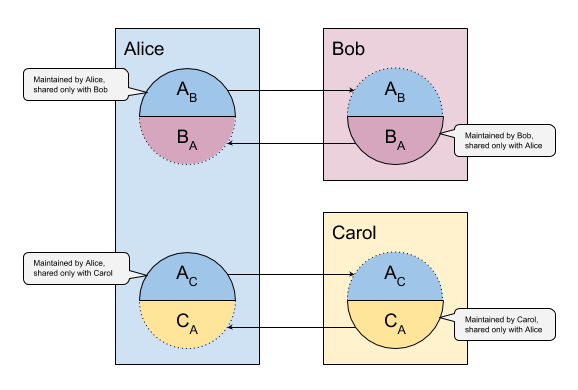

- Name: relationship-state-machine
- Author: Devin Fisher, Lovesh Harchandani, Jason Law
- Start Date: (fill me in with today's date, YYYY-MM-DD)
- PR: (leave this empty)
- Jira Issue: (leave this empty)

# Summary
[summary]: #summary
The objective of this feature is for an agent to know with very high certainty the DDO of the DID on the other end of a 
relationship (An `n-way` relationship involves `n` DIDs). This feature introduces microledgers; Each DID has a 
microledger, which is an ordered log of events where each event indicates a change in the verification key. A DIDs 
microledger is indented to be replicated to parties of relationship.

# Motivation
[motivation]: #motivation

Trusted peer interactions are the end goal of the Self-sovereign identity ecosystem. The technology that held and being build by the Indy project serve this goal. Each element of the Indy project self-sovereign technology lives to serve this goal. For example, the anoncred technology allows a holding party to assert the integrity of data, stated by an issuing party, to a verifying third party. This allows trust-building interactions between two peers.

This HIPE continues this development and will answer:

`How can the parties of a peer-to-peer network share data (including critical data like cryptographic keys) such that all parties can trust the data shared?`

The indy community, initially thought that many parts of the data that would need to be shared between entities in a between peers could be held on the public, global, immutable ledger. Without a better solution, the original design begrudgingly put this data on the ledger even though they knew doing so cause two major downsides:

1. Personal data was put on the immutable ledger. 
    - Personal data, especially, is subject to correlation, especially endpoints. 
    - Personal data can and will leak eventually when current cryptographic algorithms break.
2. Load on the public ledger. Every peer to peer interaction required putting an additional load onto a relatively small network of validator nodes (20-100).

This HIPE will layout a better approach to communicating information and state between parties in a peer-to-peer relationship without utilizing the public utility ledger.

# Glossary
* __Identity Owner__: The person, organization or thing the owns and controls their SSI domain. Identity Owners are the parties to the interactions discussed in this document.
* __Domain__: The collection of agents, devices, and services that controlled (and often owned) by an Identity owner.
* __Agent__: Software that acts on in behalf of the Identity owner to manage their digital identity. Agents allow not digital entities to do digital tasks (encryption, signing, message transference, AI, etc). Agents are always controlled by the Identity Owner.
* __Edge Agents__: Is an agent that runs on a device (hardware) that is owned and in direct control of the Identity owner. Agents running on mobile phones, tablets, laptops or servers controlled by an organization are normally considered edge agents. Can also be known as Local agents.
* __Cloud Agents__: Is an agent that runs on a device (hardware) that is owned and controlled by another party. The Identity owner still controls the agent but does not own the hardware it runs on. These agents often have a persistent endpoint that is used as the endpoint for the domain.
* __Relationship__: Is a connection between 2 or more Identity Owners.
* __DID__: Decentralized Identifiers. See DID spec.
* __DID Document__: Data that describes a DID. See DID spec.
* __Relationship DID__: A DID used to identify a party in a relationship. A relationship DID is unique for all parties of the relationship. If an Identity owner has 10 relationships, it would also have 10 unique relationship DID to identify itself in those relationships and at least 10 unique DID to identify other parties in these relationships.

# Design Goals
High-level objectives for this design. Writers and reviewers of this HIPE must judge if this design meets all of these objectives.

* Allow one party to express how to trust (verify) communications from their domain to all other parties in the relationship.
* Allow all parties to disclose verifiable and changeable information to other parties in the relationship.
* Allow all entities in a relationship to render a current DID doc from each party of the relationship.
* Each entity has sole control of their state/microledger
* 

# Design Concepts

## Relationship State
Identity Owners in a relationship are independent parties. Each member of the relationship has a domain of agents and other entities that they use and control. Trusted interactions between parties in the relationship require each party to know the public info (verkeys, endpoints, etc) of each other parties. This knowledge is the relationship state.
 
Each party of the relationship has a unique DID that is mapped to a single relationship state. For a two-party relationship, there are two relationship states for each party. For an _n_-party relationship, there are _n_ relationship states.
 
This relationship state is also the source for resolving the DID Doc for the DIDs in the relationship. Therefore, the information contained in the relationship state __MUST__ but a superset of data contained by the supported DID method spec (initial Sovrin Method spec).

### State Independence
The relationship states __MUST__ be independent for each Identity Owners that is party to the relationship. Each party of the relationship controls and expresses an independent relationship state to the other parties in the relationship. 

For example, in a two-party relationship between Alice and Bob, there are two independent relationship states. One is owned and controlled by Alice. This state is express (see microledger) to Bob. For Bob, this relationship state from Alice is read-only. Conversely, Bob owns and controls his own relationship state that is again expressed to Alice which is likewise read-only to Bob.

 

Additionally, each relationship state __MUST__ be built, used, and expressed for one and only one relationship. Each unique relationship __MUST__ have a unique and distinct relationship state. Identifiably elements __MUST__ be (ex. DID, verkeys, etc) unique for each relationship. Some elements (notably: endpoints) and their value might be in common in more than one relationship but their usage in the relationship state __MUST__ be distinct and not shared.

For example, Alice has two relationships. Both relationships have only two parties. One is with Bob and the other is with Carol. Alice will, therefore, have two distinct DID that identify her independently to Bob and Carol. Alice will also have two distinct relationship states that she controls. One she will express to Bob and the other will be expressed to Carol. These relationship states will be distinct from each other. Lastly, Alice will have two relationship states that she does not control and that have been expressed to her by Bob and Coral. Pair of her relationship state for Bob and Bob's relationship state for Alice will for the complete info for the Alice-Bob relationship. Likewise for the Alice-Carol relationship.

### Expression Characteristics 
For trusted interaction between parties in the relationship, these relationship states must be dynamic. Changes to state the expressed by the controlling parity securely and completely to each other party in the relationship. 

__Securely__: The following are the main characteristics that are considered for securely.
* __Confidentiality__ - Although the some of the data expressed in the relationship state is public in nature(ex. verkeys) not all is (endpoints). And even public data could have unintended correlation implications that should be protected by default. As such, relationship state information should be communicated confidentiality to the other parties of the relationship.
* __Integrity__ - State changes must be communicated with integrity. Unauthorized modifications must be detectable. State changes must only be possible by the Identity Owners who is described by the relationship state.
* __Source authentication__ - State changes must be communicated such that the sending entity can be authenticated and correlated with proper Identity owner.

The design in this HIPE will focus mostly on Integrity and Source authentication. Communication protocol will be leveraged to provide confidentiality. 

Agent to agent communication and its associated protocols care deeply about these characteristics. Their protocols implement algorithms that provide protections to help maintain these characteristics. But often the data needed for these algorithms is contained and protected in the relationship state. This creates a minor causality dilemma (chicken or the egg) that will be discussed in genesis state.

__Completely__: Eventual consistency will largely be inadequate. Trusted interactions between parties in the relationship will need to operate on exact and accurate relationship state. This is especially important when keys are changed in the state. All parties will need to constantly and accurately know what is the latest state.

### Microledger

Each relationship state is materialize using the [Event Sourcing pattern][event-source-descr]. Events being sourced for the state are held and maintained in a small [merkle-based][merkle-tree] ledger. This approach is the same approach used by the Indy-Node ledger. Each party in the relationship have independent microledgers and there is a one to one relationship state and microledger. 

The sequence of events contained in the microledger __MUST__ have an exact order. The owning party can only append events to the microledger and cannot reorder the events. All parties that have a copy of the microledger can verify the order of the events and verify the validity of the events(see permissions).

### Replication

Each party __MUST__ communicate to each party in the relationship the latest version of their microledger. This process of replication __MUST__ happen continually and completely with every event added to the microledger. Since each microledger is owned by one party and independent from each other, the replication is one way. This a allows for a simple pub-sub pattern between the owner of a microledger and interested parties. The merkle-based microledger also allows tamper-evident replication without additional data. Each party then receives an update message that can immediately be checked the validity of the update.

Trusted communication will be predicated on all parties being in sync. As such, the current state will need to be expressed in every message. This will be expressed via a tuple of information, (txn_seq_no, root_hash). This information will be called state context. The state context will require at least 36 bytes to be added to all messages.

For the purpose of this HIPE, all parties will be required to be exactly in sync. This requirement will require capabilities that all agents must meet:
0. Agents will need to be able to detect when they are not in sync.
0. Agents will need to be able to express to other agents that they are not in sync
0. Agents will need to be able to initiate a catchup process. 
0. Agents will need to be able to resend messages when after the catchup process.

Implementation proposed by this HIPE will support these capabilities but cannot implement them. They will need to be part of the agent protocol, tests will need to be added in the Agent Test Suite and agent implementation will need to support them. 

[event-source-descr]: https://docs.microsoft.com/en-us/azure/architecture/patterns/event-sourcing
[merkle-tree]: https://en.wikipedia.org/wiki/Merkle_tree

### Data
The following data is expressed in the Relationship State, by extension contained in the transactions of microledger.

0. DID -- The DID is immutable. Immutability is important because other layers of libindy and applications using libindy will depend on the immutability of the DID used by the party owning the DID. If a new DID is needed for a use-case, a new relationship state could be created with a new DID.
0. Domain Endpoint -- One and only one endpoint for the domain of the owning Identity Owner. This is mutable. 
0. Identified key -- Intended for agents but could be used for any identifiable object. Again the identifier is immutable (if a change is needed, creating a new agent is acceptable). The verkey is mutable.
0. Authorizations -- Authorizations are attached to identifiers. These are authorizations with regards to the Relationship state and NOT for larger concerns for the application of the relationship. For example, an identifier can be authorized to onboard a new agent in the relationship state. But the relationship state cannot express permission to transfer car ownership (assuming the relationship has the type of application.)

### Bootstrapping
The relationship state must exist from the very start of a relationship. This is because data contained in the relationship state is used for communication between parties of relationship. The genesis of the relationship state (the first transaction of the microledger) MUST be communicated during the bootstrapping of the relationship.

Every relationship state genesis transactions MUST ONLY consist of the following two transactions:

0. DID txn
0. Identified verkey txn
0. Domain Endpoint txn

This information will be communicated either out of band from the secure communication channel of the relationship or during the first communication over the secure communication channel. From there, the rest of the possible events can happen in whatever order each party requires.

### Authorizations
Authorizations define what changes a key can make to the relationship state. These authorizations and their corresponding rules have to be consistent between parties in the relationship. Both parties in the relationship must be able to apply the rules and always come the same conclusion. A small and simple set of authorizations and rules that govern verifiable modifications to the relationship state.

Authorizations are represented as a 32-bit bit mask. This should allow for expansion of the authorization options in the future.

__Permissions__:

|Permission             | bitmask |
| --------------------- |:---:|
|ALL |                  11111111111111111111111111111111|
|ADD_KEY |              10000000000000000000000000000000|
|REMOVE_KEY |           01000000000000000000000000000000|
|UPDATE_KEY |           00100000000000000000000000000000|
|UPDATE_AUTHORIZATION | 00010000000000000000000000000000|
|UPDATE_ENDPOINT |      00001000000000000000000000000000|

__Rules__:
* All keys can rotate its own key
* All keys can nullify its own key
* ALL permission can make any modification
* ADD_KEY permission can add a key with no authorization
* REMOVE_KEY permission can nullify any key
* UPDATE_AUTHORIZATION permission can modify the authorization for any key
* UPDATE_ENDPOINT permission can modify the domain endpoint

### Recovery
Relationship state recovery, as a core part of a decentralized system, is in a dichotomy of trying to allow the Identity Owner to recover from some form of key lost and not giving a malicious party a larger attack service. As such, no initial recovery particular strategy will be part of the initial implementation of the relationship state. Recovery will be left to the application implementation of an agent.

#### Use of DKMS scheme
Although no recovery mechanism will be provided, research into DKMS and published in the indy-sdk repo provides insights into how a recovery mechanism could be implemented that could work with the relationship state. Some high-level thoughts about a possible solution are included below.   

Create a recovery asymmetric key pair. The private element of the key should be placed in escrow using an acceptable technique (DKMS describes social recovery using a quorum of trustees and using a paper wallet). After the private element is in escrow, all entities of a domain would forget (permanently) the private element. The public element would be propagated to all agents of a domain. When a relationship state is bootstrapped, the public element of the recovery key would be inject into the relationship state and given an fully permissioned authorization. This key would not be available for use in the everyday maintenance of the relationship state. But if required in a recovery scenario, the key could be recovered from escrow and used to retain or regain control of the relationship state. 

## Implementation Strategy
Like most aspects of the Indy interoperability story, core elements of the relationship state will be implemented in libindy and libindy's implementation will serve as the de facto standard. This de facto standard will serve for both the interface surface between the parties of the relationship and entities (agents, devices, etc) of a single domain. The interoperability between parties of the relationship will be maintained by this de facto standard until a formal standard is published. The interoperability of entities in a single domain will be maintained by libindy as a matter of convenience and could deviate if and when vendors choose. But for this HIPE, libindy will be the main store of functionality to be used by software across the ecosystem. 

But libindy is a low-level utility library and as such there will be aspects of the relationship state that will be left to the application layer to implement. Mostly around message sending and receiving(See messaging).

This HIPE expresses the design and concepts of the relationship state but the libindy API for relationship state will express the formal contract. After the implementation of the relationship state is accepted and merged into libindy, major changes to the API will require future HIPEs and will likely amend or override this HIPE.

### Libindy Public API

#### Query APIs
Both the owner and reader of the Relationship State will have the need to query the Relationship State. The user of the API will mostly want to query the current state but there will be use cases when the user will want to query the state at a particular transaction. All types of data should be accessible.

*DID*: the owning DID

*state_context*: An optional parameter that points to a particular txn in the microledger and queries the state at the point. Always optional and when omitted the latest state is queried.

__Query APIs__:
* indy_rel_state_state_context(did, txn_seq_no (Optional)) -> state context for seq number (or latest if none is given)
* indy_rel_state_did_doc(did, state_context(optional)) -> full DID doc for the DID
* indy_rel_state_endpoint(did, state_context(optional)) -> query the endpoint for the relationship state
* indy_rel_state_identifiers(did, state_context(optional), authorizations_filter (Optional)) -> List of identifiers for the relationship state 
* indy_rel_state_identifier(did, state_context(optional), identifier) -> data for identifier (key and authorizations)
 
#### Update APIs
Only the owner of a relationship state can successfully use these APIs. Each of these APIs will cause a new transaction to be written to the microledger. This transaction will cause a change to the current resolved relationship state. Using these API will cause all other parties in the relationship to be out of date with the current relationship state. 

*DID*: the owning DID

__Update APIs__:
* indy_rel_state_create(initialization_data) -> create new relationship state that is owned by the calling domain with a starting endpoint.
* indy_rel_state_start(genesis_data) -> initialize an unowned relationship state from genesis_data 
* indy_rel_state_create_identifier(did, verkey(Optional), authorized_key) -> create a new identified key using a key authorized for this modification
* indy_rel_state_rotate_key(did, identifier, verkey(Optional), authorized_key) -> rotate a identified key to a new verkey
* indy_rel_state_update_authorization(did, identifier, update_authorization, authorized_key) -> change authorization bitmask to new value.
* indy_rel_state_update_endpoint(did, endpoint_data, authorized_key) ->  update endpoint for the domain

#### Message APIs
These APIs help to build and consume messages sent by different parties of the relationship. These APIs don't help send or receive the messages (see Messaging).

* indy_rel_state_build_catchup(did, begin_seq_no, end_seq_no(Optional)) -> a message that can be sent to other parties of the relationship.
* indy_rel_state_apply_catchup(did, catchup_message) -> apply catchup message by validating message and updating microledger and state.

### Messaging
Messaging is an important part of the relationship state design.  

Sending, receiving and other complexities around messages will not be part of the libindy implementation of the Relationship state. Additionally, this HIPE has no opinion on the form messages take, how they are routed or other concerns about how messages flow from one domain to another. There are other HIPE, either approved or not, that are exploring these concepts. Implementation of this HIPE will use the current agent to agent messaging conventions and will evolve as those protocols evolve. The messages needed for this HIPE will describe at a high level such that it could be adapted to any message protocol.

__State Context__
This message will express the current (as known by the responding agent) state context (seq_no and root hash). This message would normally be in response to a request for this information.

Elements:
* __DID__ -- identifier for the owning DID of the relationship state and microledger that is the subject of the message.
* __State Context__ -- a tuple of 

__Request State Context__
Ask a party of a relationship for the state context of their owning relationship state.

Elements:
* __DID__ -- identifier for the owning DID of the relationship state and microledger that is the subject of the message.

__State Update__

This message is sent from the owner of the relationship state to the other parties of the relationship. This message can be sent proactively when state changes or as a response to a request for update.

Elements:
* __DID__ -- identifier for the owning DID of the relationship state and microledger that is the subject of the message.
* __New root hash__: the root hash of the merkle-tree after applying the update
* __Transactions__: an ordered series of transactions that consist of the update. These transactions contain sequence numbers 

__Request State Update__
This message is sent by non-owning parties in the relationship to the owner to request missing transactions.

Elements:
* __DID__ -- identifier for the owning DID of the relationship state and microledger that is the subject of the message.
* __From Sequence Number__ -- The sequence number to start from.
* __To Sequence Number__ -- (Optional) The sequence number to end. If omitted, send all transactions.

### Storage

Storage of the microledger, merkle-tree and state cache will utilize the same storage mechanism that is used by the wallet. If that storage mechanism is found to be inadequate, future HIPEs can propose and implement improvements.

## Excluded Concepts
This section will capture and call out concepts that may or may not have value in future designs but are not part of the current HIPE and will not be part of an initial implementation.

### Anchoring
Anchoring the root has of the merkle-tree in other ledgers (ex. Sovrin Network, the other parties relationship state) could provide features that could be useful. Assuming that the ledger anchored into is trusted by both parties, proof around the timing of transactions in the microledger could be constructed. These areas could be explored in future HIPEs.

### Decry
In this HIPE there is no process proposed for one party to express to the other that the relationship state has been compromised (either by loss or attack). Decrying a relationship could theoretically allow the other parties know that trust in the relationship may have been compromised. This concept could be explored in future HIPEs.

**Events:** Each event has with it a signature (or array of signatures in the case of a recovery) which serve as proof that the new event is valid. 
The signature for each event is a signature over the root hash of the merkle tree of the microledger including the current event. This binds each event to the event before it.

The event types should mirror what is used in Sovrin transactions to get the same effect. (TODO: the following do not mirror Sovrin transactions; the following is exploratory.)
1. *DIDs:* DID events appear only once in a DID microledger, and they are always the first event, they never change. Adding a DID

    `NYM(DID)` where... `DID` is a DID as defined in the spec (e.g., did:sov:13579BDFHKMPRTVXZbdfhj) 
2. *Keys:* Keys can be added to a DID. The second event in a DID microledger (after the DID event) is always the first authorized key. 
    Adding a new Key

    `KEY(VERKEY, AUTHORIZATIONS)` where... 
    
    `VERKEY` is a 32-byte verification key (or 16-byte abbreviated verification key), and 
    
    `AUTHORIZATIONS` is an array of strings indicating authorizations (permissions)
 
    Updating a Key's authorizations
    
    `KEY_MOD(VERKEY, AUTHORIZATIONS)` where... 
    
    `VERKEY` references a previously authorized `VERKEY`, and 
    
    `AUTHORIZATIONS` is the new array of strings indicating authorizations (permissions)

    Removing an authorized Key
    
    `KEY_RM(VERKEY)` where... 
    
    `VERKEY` is a previously authorized `VERKEY`
    
    Example of authorizations:
    1. ALL = everything
    2. MSG = message store/forward
    3. RECOVER = part of recovery policy
    4. MONTHLY_SIGNING_LIMIT_USD(100)
    
3. *Endpoints:* Endpoints are attached to Keys. A Key can have zero, one, or many endpoints.
    Adding an Endpoint

    `ENDPOINT(VERKEY, ADDRESS, ORDER, SERVICES)` where...
    
    `VERKEY` is a previously authorized Key
    
    `ADDRESS` is a URL
    
    `ORDER` is an floating point number indicating the order this endpoint should be chosen for a particular service
    
    `SERVICES` is an optional array of strings indicating services; defaults to [ALL]
   
   Updating an Endpoint's order or services 
    `ENDPOINT_MOD(VERKEY, ADDRESS, ORDER, SERVICES)` where...
    
    `VERKEY` is a previously authorized Key
    
    `ADDRESS` is a previously added endpoint address
    
    `ORDER` is an optional integer indicating the order this endpoint should be chosen for a particular service; if ORDER is not supplied, then it remains unchanged
    
    `SERVICES` is optional array of strings indicating services; if SERVICES is not supplied, then it remains unchanged

    Removing an Endpoint
    `ENDPOINT_RM(VERKEY, ADDRESS)` where...
    
    `VERKEY` is a previously authorized Key
    
    `ADDRESS` is a previously added endpoint address
    
    Examples of services:
    1. ALL
    2. NOTICE

# Reference
[reference]: #reference

*TODO* Add API doc

# Drawbacks
[drawbacks]: #drawbacks
1. Additional complexity.
2. Point-to-point chattiness, and a reliance on participants to be online for replication.

# Alternatives
[alternatives]: #alternatives

- Why is this design the best in the space of possible designs?
- What other designs have been considered and what is the rationale for not
choosing them?
- What is the impact of not doing this?

# Prior art
[prior-art]: #prior-art

Discuss prior art, both the good and the bad, in relation to this proposal.
A few examples of what this can include are:

- Does this feature exist in other SSI ecosystems and what experience have
their community had?
- For other teams: What lessons can we learn from other attempts?
- Papers: Are there any published papers or great posts that discuss this?
If you have some relevant papers to refer to, this can serve as a more detailed
theoretical background.

This section is intended to encourage you as an author to think about the
lessons from other implementers, provide readers of your proposal with a
fuller picture. If there is no prior art, that is fine - your ideas are
interesting to us whether they are brand new or if they are an adaptation
from other communities.

Note that while precedent set by other communities is some motivation, it
does not on its own motivate an enhancement proposal here. Please also take
into consideration that Indy sometimes intentionally diverges from common
identity features.

# Unresolved questions
[unresolved]: #unresolved-questions

- What parts of the design do you expect to resolve through the
enhancement proposal process before this gets merged?
- What parts of the design do you expect to resolve through the
implementation of this feature before stabilization?
- What related issues do you consider out of scope for this 
proposal that could be addressed in the future independently of the
solution that comes out of this doc?
