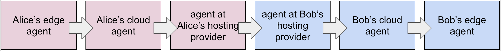
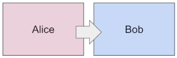
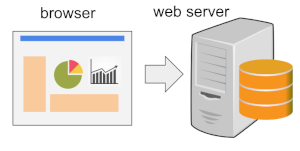

- Name: request-sync
- Author: Daniel Hardman
- Start Date: 2018-12-16
- PR: (leave this empty)

# Summary
[summary]: #summary

Discuss a way to request synchronous, request-reply style semantics over
an agent-to-agent channel that would otherwise be asynchronous.

# Motivation
[motivation]: #motivation

An extremely familiar paradigm in programming today is HTTP-based request-response.
This paradigm is so dominant that many developers who arrive in the A2A ecosystem
*assume* agents will talk this way. "Can you show me your RESTful API?" they ask.

But agent-to-agent communication is designed to be asynchronous, for very good
reasons. It is an inescapable fact that certain agents may not be connected/online at
all times. Mobile phones are a prime example. Also, agents may make decisions about a
remote request based on input from users, who themselves may not be available at the
instant a client wants to talk. In this respect, agents cannot be modeled the same
way as web servers.

It might be tempting to still approach agent comm with an HTTP lens, despite these
objections. For example, we could use HTTP in an async mode -- make a request and get a
`202 Accepted` response, then call back later when the real response is ready. However,
agent-to-agent communication is also transport-agnostic, for very good reasons.
We need agents that speak bluetooth. Or NFC. Or WebSockets. Or email. Or via message
queues. Or via push notification protocols from mobile device manufacturers. Or via
proprietary bus protocols on embedded hardware. And some of these transports are
inherently message- and async-oriented.

It is easy and efficient to build a request-response behavior out of async primitives,
and it is easy to adapt such primitives to HTTP as well as all the other transport
choices. The opposite is not true. Therefore, we had to model agent communication
with an async message-passing paradigm that assumes none of HTTP's convenience. Thinking
of agents as if they communicated by email is a more accurate mental model than thinking
of them as client and server.

Still, synchronous patterns of request-response are familiar and easy to
use--and with HTTP being so ubiquitous, it would be nice if agents could
take advantage of synchronous features when that is practical. How to do so is
the subject of this doc. (How to [adapt message-passing to the world of web services](
https://docs.google.com/presentation/d/10yKcg8-Ktd6SKoz-YvfMdFN-9czPDVHMXibFsUWVFP4/edit)
is a related but somewhat different subject. There is active work happening on this front,
but it won't be discussed here. In this doc, we focus just on the syncrhonous/asynchronous
impedance.)

# Tutorial
[tutorial]: #tutorial

### Prerequisites

##### Message Decorators

If you do not understand the concept of message decorators, please take a few minutes
and review [that HIPE](https://github.com/hyperledger/indy-hipe/blob/dc525a27d3b75d13d6f323e3f84785aa84094de9/text/decorators/README.md).
You will need a rough notion of how decorators work.

##### Message Routing

You will also need a general idea of how messages are routed. Again, deep details aren't
necessary. However, a review of the [cross-domain messaging HIPE](
https://github.com/hyperledger/indy-hipe/blob/master/text/0022-cross-domain-messaging/README.md)
is worthwhile. You may also want to be familiar with the concept of [mediators and
relays](https://github.com/dhh1128/indy-hipe/blob/mediators-and-relays/text/mediators-and-relays/README.md),
and with the way relays can change transports for one or more hops in a routing chain.

Now, routing is usually described in our community with the most general model possible,
because focus is on robust patterns for interoperability. This leads to much indirection.
We end up with long messages routes like: 



Getting a synchronous request-response interaction all the way through such a route, and
back again, feels pretty unrealistic.

What may not be obvious is that this is a complexity of logical *roles*, and their
associated keys, not necessarily a complexity of physically different participants. The
same device can play more than one role. If "Bob" is an institution, for example, the
role of Bob's cloud agent and Bob's edge agent are likely to be collapsed; many
institutions will not split agent roles between mobile devices and cloud services, but
will instead run a single agent on a server that's internet-accessible. Further, many
institutions will self-host or host on IaaS infrastructure that knows nothing about
agent-to-agent routing, so the "agent at Bob's hosting provider" also collapses. Bob's
side may actually be a single machine.

Further, Alice can short-circuit some of the complexity on her side, if she wishes. For
example, nothing is stopping her from sending a message directly from her edge agent
to the leftmost blue box at the edge of Bob's domain.

What this means is that often, the participants in the Alice-to-Bob route can be treated
__for connectivity purposes__ as if they looked like:



Does *that* remind you of *this*?



### Requesting Synchronous Mode

When Alice sends a message to Bob, she can decorate that message with a polite
request, noting that she would prefer to have a synchronous, request-response style
interaction. This is sort of like sending a courier to deliver a message, with
instructions to attempt to wait at the recipient's door while they draft a response.

If Bob's side of the route supports such behavior, then his agent(s) can choose whether or
not to honor the request. Of course, they cannot be compelled to do so. It may be a
request that's impossible to honor. Thus, this doesn't relieve Alice's software of the
burden of implementing logic to handle the asynchronous case.

However, if a syncrhonous mode is honored, then Alice may get certain advantages:

* A less chatty channel (no polling and no need for follow-up messages)
* Less firewall complications (if request arrived at Bob, no firewall path need be
open in the other direction to make bits flow back on the still-open channel)
* Possibly, a faster reaction to completed responses
* A better capacity to avoid errors, or to troubleshoot them rapidly when they happen

Suppose that the transport for a particular A2A conversation is HTTP or a synchronous
Bluetooth link, Bob's side is a single web server/bluetooth device, that Alice
expresses her preference for synchronous mode, and Bob's agent(s) choose to honor it.
What changes is that, instead of getting a `202 Accepted` status code with an empty
response body (or the Bluetooth parallel) as the response to her request, Alice now
gets a `200 OK` status code (or the Bluetooth parallel), and the body of the HTTP
response has a payload that is an A2A message.

##### The `@request_sync` Decorator

Alice's request for synchronous mode uses the `request_sync` decorator:

```JSON
"@request_sync": {
  "fallback_sec": 30,
  "if_not": "warn"
}
```
The `fallback_sec` field conveys to Bob a rough guess on Alice's part of what would
be a reasonable amount of time, from her perspective, for Bob's response. Alice is
hoping to get a response back in this amount of time. If Bob judges that this is
imprractical, he should fallback to asynchronous mode--preferably, quickly. Bob may look
at this number and say, "I can't [hold a port open|cache a session|tie up a database
cursor] that long", or "No way will I have a response ready that fast." Either decision
could lead him to reject the request immediately, rather than attempting to honor it,
only to have to fall back to async mode anyway.

If Bob *does* fall back to async mode, this means that he sends a "I'm working on it and
will get back to you" response (over HTTP, that's `202 Accepted`), and then follows it
up later with a true response.

The `if_not` field tells how important it is to Alice that Bob honor this request, and
its values map to the familiar log levels "info", "warn" and "error". When `if_not` is
`info`, Alice is saying, "I'll cope with async just fine. What you decide will not merit
anything more than an info note in my logs." When `if_not` is `warn`, Alice is saying that
async mode is suboptimal and may cause problems, but could still be okay for her. When
`if_not` is `error`, Alice is saying that she can't cope with async mode at all; if Bob
can't honor the preference, the interaction will fail.

The reason this matters so much is that Alice may have constraints on her side that Bob
doesn't know about. For example, maybe Alice's agent has sent this request while
interacting directly with Alice-the-person. So on Alice's side, a person is waiting for
a reaction. In such a case, having Bob's agent process it lazily, replying a few hours
later, would be suboptimal (though perfectly valid). Thus, Alice's agent could warn that
if more than 30 seconds elapse, there's a moderate chance that her human master will lose
patience and abandon the interaction. Her agent doesn't know this for sure; it's just
guessing. It's possible that Alice will lose patience in only 10 seconds, and close
open ports unilaterally. That doesn't cancel the request; it just means she went into
async mode from her side.

##### About Timing

If you've read the [message timing HIPE](https://github.com/hyperledger/indy-hipe/pull/68),
the previous few sentences might sound familiar. That HIPE introduces the notion of
*message expiration* through the `@timing.expires_time` decorator. Is that the same thing?

No. That decorator says, "If you can't respond by this timestamp, then forget it. I withdraw
my request." In contrast, `@request_sync.fallback_sec` says, "I'm hoping you'll get back
to me in a synchronous mode within X seconds; otherwise, you might as well fall back
to async mode right away."

Even when `"if_not"` equals `"error"`, the semantics are still different. Compare
`@timing.expires_time` to a bid to buy stock: it is withdrawn if not accepted by a
certain moment. There is no point in sending an acceptance hours late, so the response
should also be abandoned after the deadline. On the other hand, `@request_sync.fallback_sec`
with `if_not` equals `error` is like a romantic date: you better be there by 7, and if
you're not, it's going to be a problem. But if you are late, you still have to call and
apologize.

Another complication with timing is being able to measure it at all. 
Neither side knows how synchronized system clocks might be. Thus, `fallback_sec` is a
duration rather than a timestamp, and its granularity is low.

Even so, measuring elapsed time isn't easy easy or exact.

Alice doesn't know what Bob's half of the route looks like when she affixes the
`@request_sync` decorator--but she should have a rough notion of any latency on her
side. So if she thinks that layers of message handlers on her side impose an average
overhead of 2 seconds delay, and her true constraint is 32 seconds, she should subtract
2 seconds and tell Bob the limit is 30.

Bob can now worry about elapsed time purely from his own perspective, without regard to
Alice's side. Maybe he guesses that the various layers of software and hardware on his
side impose, on average, 5 seconds of overhead besides the raw message processing time.
So if he is given 30 seconds as a constraint, his core message handling routine should
assume it only has 25 seconds to work with.

### Layers of the Onion and Cooks in the Stew

It is possible for `request_sync` to be honored even if Bob's side does have some
complexity. Perhaps Bob's agent is hosted at an agency that is willing to keep a port
open as a passthrough to his cloud agent, and Bob's cloud agent in turn is willing to
keep open a channel between it and an edge device.

Alice doesn't need to know any of these details. She simply makes the request, and if
Bob honors it, great.

However, Alice *does* need to express her request to every mediator on Bob's side of
the chain. This means that if an agent message is wrapped in one or more
`forward` messages, each layer of the onion needs to see the `request_sync` decorator.
However, only the final destination needs to handle processing time; at other layers,
the decorator can be empty.

[TODO: This raises another point: what if Bob has an iphone and a laptop at his edge, and both
receive the message, yet they have different abilities to respond to `request_sync`?
The answer is: this is undefined territory. We may need a separate HIPE about how to
arbitrate responses among multiple agents. It is outside the scope of this HIPE.]

### Inheriting the `request_sync` decorator

Remember from the [decorator HIPE](https://github.com/hyperledger/indy-hipe/blob/dc525a27d3b75d13d6f323e3f84785aa84094de9/text/decorators/README.md)
that a decorator can be placed on a message, but also on a message type or even a
message family. When this happens, all messages of that type or family inherit the
`request_sync` settings. However, the decorator at a more narrow scope (e.g., an
individual message) overrides anything from a decorator at a broader scope.

But how can you override `request_sync` to say, "I know my message family is generally
synchronous, but I want this particular message to be handled *asynchronously*?"

To do this, use `@request_sync: { fallback_sec: 0 }`. This says, "I don't want sync
mode at all."

### Summary

To ask another agent for synchronous request-response behavior, including holding ports
and other resources open, Alice should affix a `@request_sync` decorator to her agent
request message and to any `forward` messages that will be seen by mediators outside her
sovereign domain. The decorators on `forward` message can omit the `async_sec` field.
Only messages that embody a request carry this annotation--not the responses to such
requests.

If Bob wants to honor this request, he should hold open the communication channel and
transmit his response in synchronous style. In HTTP, that means Bob's response would
have a `200 OK` status instead of `202 Accepted`, and the body of the response would
contain an A2A message from Bob. Other transports do a similar "Here's the actual response
instead of just a note that i'm working on it" adaptation.

Is all this complexity worth it? Alice's code still has to handle the asynchronous
case, and so does Bob's.

The short answer is: we don't know. The theory of this HIPE is that
unmediated institutional agents on web servers will be so common, and will be beneficial
enough in terms of their elimination of polling and firewall asymmetry problems to
make the mechanism attractive. Time will tell. In the meantime, the mechanism is
spec'ed out, and we can share it with people who have an interest in taking advantage
of a synchronous adaptation where it's practical.

# Drawbacks
[drawbacks]: #drawbacks

This mechanism introduces complexity. Even if a lot of agents request synchronous
mode, there is no guarantee that enough responding agents will support it to justify
the effort.

There is also an opposite risk--that every agent requests it everywhere, instead of
using it judiciously. Abuse in this way would be unfortunate. 

# Rationale and alternatives
[alternatives]: #alternatives

Wide adoption of WebSockets in web-oriented agent communication might make this
mechanism less useful, in that the maintenance of open ports is already solved.

On the other hand, it is expensive and imperfectly scalable for servers to maintain
many WebSockets ports. If this mechanism gains momentum, it may provide a way to
decide which requests are worthy of the expense, and which are not.

# Prior art
[prior-art]: #prior-art

This mechanism resembles the HTTP 1.1 keepalive mechanism. Keepalives are signals of
preference and intent, but not strong promises. They have proved very useful at
optimizing HTTP, to the point where modern web developers chafe at their absence if
they must support HTTP 1.0.

# Unresolved questions
[unresolved]: #unresolved-questions

- See the note above about how to deal with a sync request that flows out to multiple
  agents owned by Bob.
