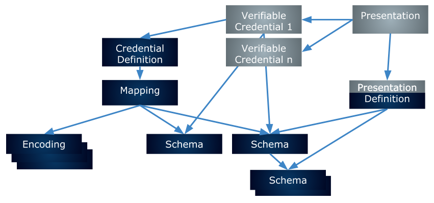
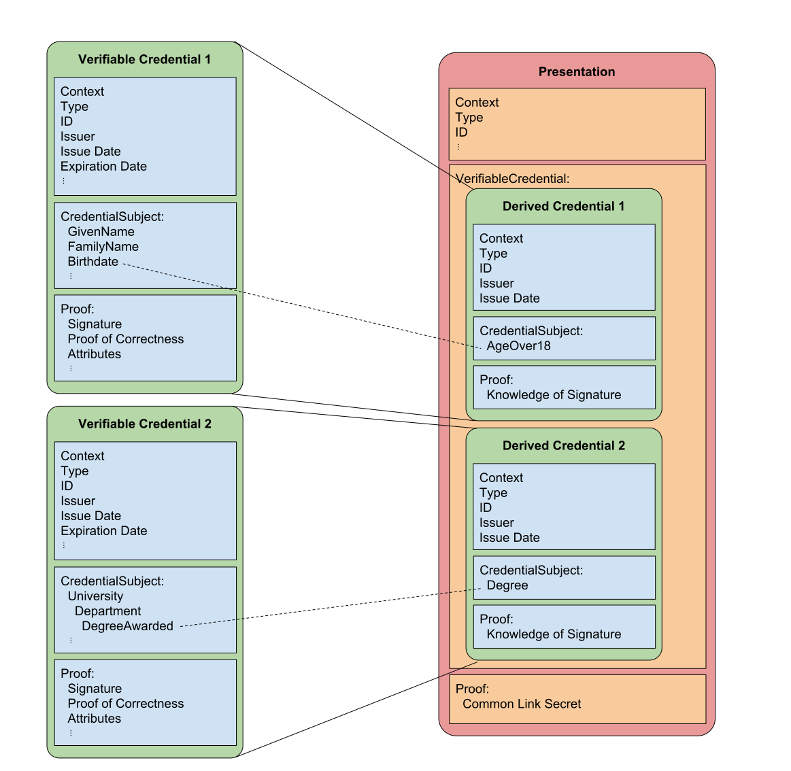

# Rich Schema Objects
- Name: rich-schemas
- Author: Ken Ebert ken@sovrin.org, Brent Zundel brent.zundel@evernym.com
- Start Date: 2019-03-19T15:39:48-06:00
- PR: 
- Jira Issue: 

## Summary
[summary]: #summary

A high-level description of the components of an anonymous credential
ecosystem that supports rich schemas, W3C Verifiable Credentials and
Presentations, and correspondingly rich presentation requests. Rich
schemas are hierarchically composable graph-based representations of
complex data. For these rich schemas to be incorporated into the indy
anonymous credential ecosystem, we also introduce such objects as
mappings, encodings, presentation definitions and their associated
contexts.

This HIPE provides a brief description of each rich schema object.
Future HIPEs will provide greater detail for each individual object and
will be linked to from this document.

## Motivation
[motivation]: #motivation

### Standards Compliance
The W3C Verifiable Claims Working Group (VCWG) will soon be releasing a
verifiable credential data model. This proposal brings the format of
Indy's anonymous credentials and presentations into compliance with that
standard.

## Interoperability
Compliance with the VCWG data model introduces the possibility of
interoperability with other credentials that also comply with the
standard.

Additionally, the new rich schemas are compatible with or the same as
existing schemas defined by industry standards bodies and communities of
interest. This means that the rich schemas should be interoperable with
those found on schema.org, for example. Schemas can also be readily
defined for those organizations that have standards for data
representation, but who do not have an existing formal schema
representation.

## Shared Semantic Meaning
The current format for schemas requires an implicit understanding of the
semantic meaning of the schema by issuers, holders, and verifiers. There
is currently no explicit typing or possible composability.

The rich schemas and associated constructs are linked data objects that
have an explicitly shared context. This allows for all entities in the
ecosystem to operate with a shared vocabulary.

Because rich schemas are composable, the potential data types that may
be used for field values are themselves specified in schemas that are
linked to in the property definitions. The shared semantic meaning gives
greater assurance that the meaning of a presentation matches the
intention of the issuer.

## Improved Predicate Proofs
The current encoding of properties for signatures supports only integer
and string data types. Introducing standard encoding methods for other
data types will enable predicate proof support for floating point
numbers, dates and times, and other assorted measurements. We also
introduce a mapping object that ties intended encoding methods to each
schema property that may be signed so that an issuer will have the
ability to canonically specify how the data they wish to sign maps to
the signature they provide.

## Tutorial
[tutorial]: #tutorial
The object ecosystem for verifiable credentials that make use of rich
schemas has a lot of familiar items: credentials, credential definitions,
schemas, and presentations. Each of these objects has been changed, some
slightly, some more significantly, in order to take advantage of the
benefits of contextually rich linked schemas and W3C verifiable
credentials. More information on each of these objects can be found
below.

In addition to the familiar objects, we introduce some new objects:
contexts, mappings, encodings, and presentation definitions. These serve
to bridge between our current powerful signatures and the rich schemas,
as well as to take advantage of some of the new capabilities that are
introduced.

### Verifiable Credentials
The Verifiable Claims Working Group of the W3C is working to publish a
Verifiable Credentials data model specification. Put simply, the goal
of the new data format for anonymous credentials is to comply with the W3C
specification.

The data model introduces some standard properties and a shared
vocabulary so that different producers of credentials can better
inter-operate.

### Rich Schemas
The current format for Indy schemas is very straightforward. It is a
JSON array of strings, each of which will be the name of a property in
the issued credential. There is no way to specify the expected type of
each property, nor is it explicit how the property values will be
encoded for signing.

The verifier, holder, and issuer of the credential
must make assumptions, and rely on a common library, in order to have
confidence that the data as understood by the verifier is the same as
the data as issued by the issuer. There is an implicit semantic context
for the signed and verified data, which will inevitably lead to
misunderstandings and difficulty.

The proposed rich schemas are JSON-LD objects. This allows credentials
issued according to them to have a clear semantic meaning, so that the
verifier can know what the issuer intended. They also support explicitly
typed properties and inheritance. A schema may include other schemas
as property types, or extend another schema with additional properties.

### Contexts
"When two people communicate with one another, the conversation takes place in a
shared environment, typically called "the context of the conversation". This
shared context allows the individuals to use shortcut terms, like the first name
of a mutual friend, to communicate more quickly but without losing accuracy. A
context in JSON-LD works in the same way. It allows two applications to use
shortcut terms to communicate with one another more efficiently, but without
losing accuracy.

"Simply speaking, a context is used to map terms to IRIs. Terms are case
sensitive and any valid string that is not a reserved JSON-LD keyword can be
used as a term." - From the
[JSON-LD Specification](https://www.w3.org/TR/json-ld/#the-context)

Contexts are JSON objects. They are the standard mechanism for defining shared
semantic meaning among rich schema objects. Contexts allow schemas, mappings,
presentations, etc. to use a common vocabulary when referring to common
attributes, i.e. they provide an explicit shared semantic meaning.

Schemas serialized as JSON-LD, which are in common use today, currently use
contexts to describe shared vocabulary; we wish to do the same.

An additional benefit of using contexts are the introduction of simpler terms
that may be used instead of complex URIs in the rich schema objects. This allows
for rich schema objects to be much more human-readable. Contexts also allow for
namespacing. For example, an issuer wishes to create a schema S that is based on
schemas A and B, but A and B each have a property called foo. Context allows for
A.foo and B.foo to be disambiguated in schema S.

### Mappings
Rich schemas are complex, hierarchical, and possibly nested objects. The
[Camenisch-Lysyanskaya signature][CL-signatures] scheme used by Indy requires
the attributes to be represented by an array of 256-bit integers. Converting
data specified by a rich schema into a flat array of integers requires a mapping
object.

Mappings are specified in JSON-LD. They serve as a bridge between rich schemas
and the flat array of signed integers. A mapping specifies the order in which
attributes are transformed and signed. It consists of a set of graph paths and
the encoding used for the attribute values specified by those graph paths.

Mappings are written to the ledger so they can be shared by multiple credential
definitions. They need to be discoverable. When a mapping has been created or
selected by an issuer, it is made part of the credential definition.

The mappings serve as a vital part of the verification process. The verifier,
upon receipt of a presentation must not only check that the array of integers
signed by the issuer is valid, but that the attribute values were transformed
and ordered according to the mapping referenced in the credential definition.

### Encodings
All attribute values to be signed in a verifiable credential must be transformed
into 256-bit integers in order to support the current
[Camenisch-Lysyanskaya signature][CL-signatures] scheme.

The current method for encoding attributes as integers only supports two
attribute types: numbers and strings. No configuration method exists at this
time to specify which encoding method will be applied to a particular attribute.
If the attribute value at the time it is passed into the SDK is a number, it
will be encoded as a 256-bit integer. If the attribute value is a string, the
value will be hashed using SHA-256, thereby encoding it as a 256-bit integer.
The resulting 256-but integers may then be signed.

The introduction of rich schemas and their associated greater range of possible
attribute value data types require correspondingly rich encoding algorithms.
The purpose of the new encoding object is to specify the algorithm used to
perform transformations for each attribute value data type. The new encoding
algorithms will allow for broader use of predicate proofs, and avoid hashed
values where they are not needed, as they do not support predicate proofs.

Encoding objects are expressed using JSON-LD and written to the ledger. The
introduction of encoding objects also allows for a means of extending the
standard set of encodings. All encoding methods result in an integer
representation of an attribute value according to a the encoding algorithm
selected by the issuer.

### Credential Definitions
The current format for Indy credential definitions provides a method for
issuers to specify a schema and provide public key data for credentials they
issue. This ties the schema and public key data values to the issuer's DID. The
verifier uses the credential definition to check the validity of each signed
credential attribute presented to the verifier.

The new credential definition object that uses rich schemas is a minor
modification of the current Indy credential definition. The new format is
expressed using JSON-LD, but has the same public key data. Instead of
referencing a schema, the new credential definition references a mapping object.

### Presentation Definitions
An Indy proof request is the current means whereby a verifier asks for data
from a holder. A proof request contains a set of named desired proof attributes
with corresponding restrictions that limit the potential sources for the
attribute data according to the desired source schema, issuer DID, credential
definition, etc. A proof request also contains a similar set of requested
predicate proofs, with named attributes and restrictions.

A presentation definition provides similar functionality for rich schema
objects. It may be helpful to think of a presentation definition as the mirror
image of a mapping object. Where a mapping object specifies the graph paths of
the attributes to be signed, a presentation definition specifies the graph query
that may be fulfilled by such graph paths. What introduces some additional
complexity to the presentation definition is the possibility that multiple graph
paths might satisfy the query. The query may also restrict the acceptable set of
issuers and credential definitions and specify the desired predicates.

A presentation definition is expressed using JSON-LD. One significant difference
from proof requests is that a presentation definition may be stored on the
ledger. This supports re-use, interoperability, and a much richer set of
communication options. Multiple verifiers can use the same presentation
definitions. A community may specify acceptable presentation definitions for its
verifiers, and this acceptable set may be adopted by other communities.
Credential offers may now include the presentation definition the issuer would
like fulfilled by the holder before issuing them a credential. Presentation
requests may now be more simply negotiated by pointing to different acceptable
presentation definitions. Writing a presentation definition to the ledger also
allows it to be publicly reviewed for privacy and security considerations and
gain or lose reputation.

### Presentations
The presentation object that makes use of rich schemas fills the same role that
proofs currently fill. The new object is defined by the W3C Verifiable
Credentials Data Model, and is known in the specification as a verifiable
presentation. The verifiable presentation is defined as a way to present
multiple credentials to a verifier in a single package.

The claims that make up a presentation are specified by the presentation
definition. The credentials from which these claims originate are used to
create new derived credentials that only contain the specified claims and the
cryptographic material necessary for proofs. The type of claims in derived
credentials is also specified by the presentation definition. These types
include revealed and predicate proof claims. The presentation also contains the
cryptographic material which supports a proof that source credentials are held
by the same entity. This is accomplished the same way it is currently
accomplished, by proving knowledge of the link secret.

A presentation is serialized as JSON-LD. It refers to the credential definitions
on the ledger associated with the source credentials. It also refers to the
presentation definition. A presentation is not stored on the ledger.

The following image illustrates the relationship between credentials and
presentations:

## Reference
[reference]: #reference
This document draws on a number of other documents, most notably the
[W3C verifiable credentials and presentation data model.](https://w3c.github.io/vc-data-model/)

The signature types used here are the same as those currently used.
Here is the paper that defines [Camenisch-Lysyanskaya signatures.][CL-signatures]
They are the source for [Indy's AnonCreds protocol](HIPE PR awaiting merge).

The intent of rich schemas is to work alongside the current credential scheme.

[CL-signatures]: (https://groups.csail.mit.edu/cis/pubs/lysyanskaya/cl02b.pdf)

## Drawbacks
[drawbacks]: #drawbacks

- The credential object formats introduced here will not be backwards compatible
with the current set of credential objects.

- Rich schemas introduce greater complexity.

- The new formats rely largely on JSON-LD serialization and may be dependent on
full or limited JSON-LD processing.

- Limited increased use of the ledger.

## Rationale and alternatives
[alternatives]: #alternatives
This design has the following benefits:
  - It complies with the upcoming Verifiable Credentials standard.
  - It allows for interoperability with existing schemas, such as those found
  on [Schema.org](www.schema.org).
  - It add greater security guarantees by providing means for validation of
  attribute encodings.
  - It allows for a broader range of value types to be used in predicate proofs.
  - It introduces presentation definitions that allow for proof negotiation,
  richer presentation specification, and a greater assurance that the presentation
  requested complies with security and privacy concerns.
  - It supports discoverability of schemas, mappings, encodings, presentation
  definitions, etc.

## Unresolved questions
[unresolved]: #unresolved-questions

Encodings will define an algorithm for transforming a value type into an
integer. It is an open question whether this may be improved in the future to
allow for remote calculation of encodings by the ledger.

This technology is intended for implementation at the SDK API level. It does not
address UI tools for the creation or editing of these objects.

Variable length attribute lists are only partially addressed using mappings.
Variable lists of attributes may be specified by a rich schema, but the maximum
number of attributes that may be signed as part of the list must be determined
at the time of mapping creation.

