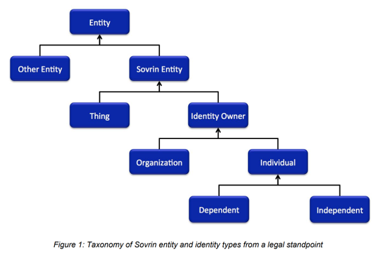

- ssi_notation
- Daniel Hardman
- 2018-05-03
- RFC PR: (leave this empty)
- Jira Issue: (leave this empty)

# Summary
[summary]: #summary

This RFC describes a simple, standard notation for various SSI-related concepts.
The notation could be used in design docs, other RFCs, and miscellaneous technical
materials throughout the Indy ecosystem. We hope it is also used in the larger
SSI community.

This RFC is complementary to the [Sovrin Glossary](https://sovrin.org/library/glossary/),
which carefully curates terms and their meanings. We start from the concepts and verbiage
defined there.

# Motivation
[motivation]: #motivation

All technical materials in our ecosystem hinge on fundamental concepts of self-sovereign
identity such as keys, DIDs, and agents. We need a standard, documented notation to
refer to such things, such that we can incorporate the notation by reference and
be consistent in its usage.

# Guide-level explanation
[guide-level-explanation]: #guide-level-explanation

## Requirements
This notation aims to be:

* Precise
* Consistent
* Terse
* Easy to learn, understand, guess, and remember
* Representable in 7-bit ASCII plain text

The final requirement deserves special comment. Cryptographers have
many notational conventions, some more standardized than others.
Generally, they derive from the advanced math they use, and the
use obscure symbols, specialized fonts, and so forth. They also tend
to intersect strongly with academic circles, where LaTeX and similar
rendering technologies are common.

Although SSI intersects with crypto and academia, it is a less
specialized domain, and its builders are coders, not mathematicians.
Developers regularly write docs in markdown and html. They interact with
one another on chat. They write emails. They create UML diagrams.
They paste code into slide decks and word processors. All of these
behaviors militate against a notation that requires complex markup.
Instead, we want something simple and clean. Hence the 7-bit ASCII
requirement.

## Solution

### Identity Owners

In a self-sovereign worldview, the conceptual center of gravity is
__identity owners__. These are people and institutions--the type of
entity that can (at least theoretically) be held legally accountable
for its actions. Identity owners control a __sovereign domain__ that
encompasses all their agents, data, and devices.
The notation's first goal is therefore an efficient and unambiguous way to anchor
derivative concepts to owners and their domain. 

Identity owners are notated with a single
capital ASCII letter, often corresponding to their first initial. For
example, Alice might be represented as `A`. By preference, the first
half of the alphabet is used (because "x", "y", and "z" tend to have
other ad-hoc meanings). When reading aloud, the spoken form of
a symbol like this is the name of the letter.

  ```ABNF
  ucase_alpha    = %x41-5A            ; A-Z
  lcase_alpha    = %x61-7A            ; a-z
  digit          = %30-39             ; 0-9
  
  identity_owner = ucase_alpha
  ```
   
### Other Entities

Identity owners are not the only participants in an SSI ecosystem.
Other participants include IoT things, hardware and software that
an identity owner uses, and so forth. These __entities__ may have
a high degree of autonomy (e.g., an AI in a self-driving car), but
they are owned or controlled in at least a legal sense by some
other party.



IoT things are represented with two or more lower-case ASCII alphanumerics or
underscore characters, where the first char cannot be a digit: `bobs_car`, `drone4`.

  ```ABNF
  name_start_char = lcase_alpha / "_"            ; a-z or underscore
  name_other_char = digit / lcase_alpha / "_"    ; 0-9 or a-z or underscore
  iot_thing = name_start_char 1*name_other_char
  ```

Agents are numbered and are represented by up to three digits. In
simple discussions, one digit is plenty, but three digits are allowed
so agents can be conveniently grouped by prefix (e.g., all items in
Alice's domain might begin with `1`, and all Bob's might
begin with `2`). 
   
  ```ABNF
  agent = 1*3digit
  ```
Devices are often used as a casual substitute for an agent; we say things like
"Alice's iPhone" when we more precisely mean "the agent on Alice's iPhone."
There may be zero, one, or more than one agents running on a particular device.
For this reason, devices are distinguished from agents in the notation. A
device is represented in the same way as an IoT thing: `alices_iphone9`.

  ```ABNF
  device = name_start_char 1*name_other_char
  ```

### Relationships

#### Short Form

Alice’s pairwise relationship with Bob is represented with colon
notation: `A:B`. This is read aloud as “A to B” (preferred because
it’s short; alternatives such as “the A B relationship” or “A colon B”
or “A with respect to B” are also valid). When written in the other order,
it represents the same relationship as seen from Bob’s point of view.
Note that IoT things may also participate in relationships: `A:bobs_car`.

N-way relationships (e.g., doctor, hospital, patient) are written with
a single colon, followed by all other letters in the relationship, in
alphabetical order, separated by `+`: `A:B+C`, `B:A+C`. This is read
aloud as in "A to B plus C."
   
  ```ABNF
  party = identity_owner / iot_thing
  next_party = "+" party
  short_relationship = party ":" party *next_party
  ```

#### Long Form

Short form is convenient and brief, but it is inconsistent. With N-way
relationships, the same relationship goes by many different names. Sometimes
this may be undesirable, so a long and consistent form is also supported.
The long form of both pairwise and N-way relationships lists all
participants to the right of the colon, in alphabetical order. Thus
the long forms of the Alice to Bob relationship might be `A:A+B` (for Alice's
view of this relationship) and `B:A+B` (for Bob's view).
For a doctor, hospital, patient relationship, we
might have `D:D+H+P`, `H:D+H+P`, and `P:D+H+P`.

Long form and short form are allowed to freely vary; any tools that parse
this notation should treat them as synonyms and stylistic choices only.

The ABNF for long form is identical to short form, except that we are
guaranteed at least two parties and one `+` on the right:

  ```ABNF
  long_relationship = party ":" party 1*next_party
  ```
  
#### Relationship to Any

The concept of "public DIDs" suggests that someone may think about a
relationship as unbounded, or as not varying no matter who the other
party is. For example, a company may create a public
DID and advertise it to the world, intending for this connection point
to begin relationships with customers, partners, and vendors alike.
While best practice suggests that such relationships be used with care,
and that they should primarily serve to bootstrap pairwise relationships,
the notation still needs to represent the possibility.

The keyword `any` is reserved for these semantics. If Acme Corp is
represented as `A`, then Acme's unbounded public "face" could be
notated as `A:any`. When `any` is used, it is never the party whose
perspective is captured; it is always a faceless "other". This means
that `any` appears only on the right side of a colon in a relationship,
and it probably doesn't makes sense to combine it with other participants since
it would subsume them all. Hence, we add one more relationship ABNF:

  ```ABNF
  any_relationship = party ":" "any"
  ```

### Association

Entities associated with a sovereign domain may be named in a way that
makes that association clear, using a `name@context` pattern familiar
from email addresses: `1@A` (“one at A”) is agent 1 in A’s sovereign domain.
This fully qualified form of an entity reference is useful for clarification
but is often not necessary.

This same notation may be applied to relationships in addition to sovereign
domains, because sometimes the association is to the relationship rather than
to a participant. See the DID example in the next section.

### Inert Items

In contrast to entities, which may be capable of independent action
and which may have identities in the SSI sense, inert or passive constituents
of a sovereign domain that are owned (for example, data, money, keys) use
dot notation: `A.ls`, (A’s link secret), `A.policy`, (A’s authZ policy), etc.

Notation for inert things uses the same rules as agents and devices.

Alice’s DID for her relationship with Bob is inert and therefore owned, but
it is properly associated with the relationship rather than just Alice. It is
thus represented with `A.did@A:B`. (The sequence `did` is reserved for DIDs).
This is read as “A’s DID at A to B”. Bob’s complementary DID would be `B.did@B:A`.

  ```ABNF
  inert = name_start_char 1*name_other_char
  nested = "." inert
  owned_inert = party 1*nested
  
  associated_to = identity_owner / short_relationship / long_relationship / any_relationship
  associated = party 0*nested "@" associated_to
  ```
   
If `A` has a cloud agent `2`, then the verkey and signing key used by
`2` in `A:B` would be: `2.vk@A:B` and `2.sk@A:B`. This is read as “2
dot V K at A to B” and “2 dot S K at A to B”. Here, `2` is known to
belong to `A` because it takes `A`’s perspective on `A:B`--it would
be equivalent but unnecessary to write `A.2.vk@A:B`.

### Counting and Iteration

Sometimes, a concept or value evolves over time. For example, a given discussion
might need to describe a DID Doc or an endpoint or a key across multiple
state changes. In mathematical notation, this would typically be modeled with
subscripts. In our notation, we use square brackets, and we number beginning
from zero. `A.vk[0]@A:B` would be the first verkey used by A in the A:B relationship;
`A.vk[1]@A:B` would be the second verkey, and so on.

### Encryption

Encryption deserves special consideration in the SSI world. It often figures
prominently in discussions about security and privacy, and our notation needs
to be able to represent it carefully.

The following crypto operations are recognized by the notation, without
making a strong claim about how the operations are implemented. (For
example, inline Diffie Helman and an ephemeral symmetric key might be
used for the asymmetric algorithms. What is interesting to the notation
isn't the low-level details, but the general semantics achieved.)

* `anon_crypt(msg, recipient_pubkey)` -- Asymmetrically encrypt
only for recipient, achieving confidentiality. Sender is anonymous.
Parties may have had no prior contact, though sender must discover
recipient's pubkey. The message is tamper evident.
* `auth_crypt(msg, recipient_pubkey, sender_privkey)` -- Asymmetrically
encrypt only for recipient, achieving confidentiality. Recipient
learns sender’s pubkey but can’t prove to anybody else who the sender
is (making the message repudiable). Parties may have had no prior contact,
though sender must discover recipient's pubkey.
The message is tamper evident.
* `sign(msg, sender_privkey)` -- Associate a signature with a
message, making the message [non-repudiable](
https://github.com/sovrin-foundation/protocol/blob/master/janus/repudiation.md).
This also makes the message tamper-evident. A signature does NOT
automatically encrypt and therefore is not a way to achieve
confidentiality.
* `sym_crypt(msg, sym_key)` -- Symmetrically encrypt for anyone
who has the symmetric key, achieving a limited form of confidentiality.
Key must be shared in advance to both parties. Likely tamper
evident. If multiple parties know the symmetric key, the sender is
not knowable to the recipient.

The notation for these crypto primitives uses curly braces around the
message, with suffixes to clarify semantics. Generally,
it identifies a recipient as an identity owner, without clarifying
the key that's used--the pairwise key for their DID is assumed.

```ABNF
asymmetric   = "~"                                   ; suffix
symmetric    = "="                                   ; suffix
sign         = "#"                                   ; suffix
multiplex    = "*"                                   ; suffix

anon_crypt   = "{" msg "}" asymmetric party          ; e.g., {"hello"}~B

                ; sender is first party in relationship, receiver is second
auth_crypt   = "{" msg asymmetric short_relationship ; e.g., {"hello"}~A:B 
             
sym_crypt    = "{" msg "}" symmetric party           ; e.g., {"hello"}=B
``` 

The relative order of suffixes should reflect whether encryption or
signing takes place first: `{"hello"}=B#` implies that the signature
encompasses the symmetrically encrypted version of "hello", whereas
`{"hello"#}=B` implies that the plaintext is signed, and then both
the plaintext and the signature were encrypted (`{"hello"}#=B`
is nonsensical because it splits the encryption notation in half).
 
All suffixes can be further decorated with a parenthesized algorithm
name, if precision is required: `{"hello"}=(aes256)B` or
`{"hello"}~(rsa1024)A:B` or `{"hello"#(ecdsa)}~B`.

Multiplexed asymmetric encryption is noted above, but has not yet been
described. This is a technique whereby a message body is encrypted with
an ephemeral symmetric key, and then the ephemeral key is encrypted
asymmetrically for multiple potential recipients (each of which has a unique
but tiny payload [the key] to decrypt, which unlocks the main payload). The
notation for this looks like `{msg}*BCDE` for multiplexed anon_crypt (sender
is anonymous), and like `{msg}*A:BCDE` for multiplexed auth_crypt (sender
is authenticated by their private key). 


### Other punctuation

Parentheses have traditional meaning (casual usage in written language, plus
grouping and precedence). Angle braces `<` and `>` are for placeholders; any
reasonable explanatory text may appear inside the angle braces, so to
represent Alice's relationship with a not-yet-known party, the notation
might show something like `A:<TBD>`.

# Reference-level explanation
[reference-level-explanation]: #reference-level-explanation

This is the technical portion of the RFC. Explain the design in sufficient detail that:

- Its interaction with other features is clear.
- It is reasonably clear how the feature would be implemented.
- Corner cases are dissected by example.

The section should return to the examples given in the previous section, and explain more fully how the detailed proposal makes those examples work.

# Drawbacks
[drawbacks]: #drawbacks

Why should we *not* do this?

# Rationale and alternatives
[alternatives]: #alternatives

- Why is this design the best in the space of possible designs?
- What other designs have been considered and what is the rationale for not choosing them?
- What is the impact of not doing this?

# Prior art
[prior-art]: #prior-art

Discuss prior art, both the good and the bad, in relation to this proposal.
A few examples of what this can include are:

- For language, library, cargo, tools, and compiler proposals: Does this feature exist in other programming languages and what experience have their community had?
- For community proposals: Is this done by some other community and what were their experiences with it?
- For other teams: What lessons can we learn from what other communities have done here?
- Papers: Are there any published papers or great posts that discuss this? If you have some relevant papers to refer to, this can serve as a more detailed theoretical background.

This section is intended to encourage you as an author to think about the lessons from other languages, provide readers of your RFC with a fuller picture.
If there is no prior art, that is fine - your ideas are interesting to us whether they are brand new or if it is an adaptation from other languages.

Note that while precedent set by other languages is some motivation, it does not on its own motivate an RFC.
Please also take into consideration that rust sometimes intentionally diverges from common language features.

# Unresolved questions
[unresolved]: #unresolved-questions

- What parts of the design do you expect to resolve through the RFC process before this gets merged?
- What parts of the design do you expect to resolve through the implementation of this feature before stabilization?
- What related issues do you consider out of scope for this RFC that could be addressed in the future independently of the solution that comes out of this RFC?
