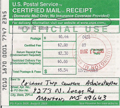

- Name: thread-tracing
- Author: Daniel Hardman
- Start date: 2018-10-24
- HIPE PR: 

# thread-tracing
[summary]: #summary

Define a mechanism to track what happens in a complex agent-to-agent (A2A)
interactions, to make troubleshooting and auditing easier.

# Motivation
[motivation]: #motivation

Anyone who has searched trash and spam folders for a missing email knows that
when messages don't elicit the expected reaction, troubleshooting can be tricky.
Indy-style agent-to-agent communication is likely to manifest many of the same
challenges as email, in that it may be routed to multiple places, by multiple parties,
with incomplete visibility into the meaning or state associated with individual
messages. Indy's communication is even more opaque than ordinary email, in that it
is transport agnostic and encrypted...

In a future world where Indy technology is ubiquitous, people may send
messages from one agent to another, and wonder why nothing happened, or why a
particular error is reported. They will need answers.

Also, developers and testers who are working with A2A-based protocols need a way
to debug. 

# Tutorial
[tutorial]: #tutorial

Many systems that deliver physical packages offer a "cerified delivery" or
"return receipt requested" feature. To activate the feature, a sender affixes
a special label to the package, announcing who should be notified, and how.
Handlers of the package then cooperate to satisfy the request.

 

__A2A thread tracing__ works on a similar principle. When tracing is
desired, a sender adds to the normal message metadata a special decorator that
the message handler can see. If the handler notices the decorator
and chooses to honor the request, it emits a notification to provide tracing.

The only complication is that A2A message routing uses nested layers of
encryption. What is visible to one message handler may not be visible to
another. Therefore, the decorator must be repeated in every layer of nesting
where tracing is required. Although this makes tracing somewhat verbose, it
also provides precision; troubleshooting can focus only on one problematic
section of an overall route, and can degrade privacy selectively.

Tracing is requested by decorating the JSON plaintext of an A2A message (which will
 often be a __forward__message, but could also be the terminal message unpacked
 and handled at its final destination) with the
`@trace` attribute. Here is the simplest possible example:

```JSON
{
   "@type": "did:sov:BzCbsNYhMrjHiqZDTUASHg;spec/routing/1.0/forward",
   "@id": "98fd8d72-80f6-4419-abc2-c65ea39d0f38",
       ((( other parts of the message, before or after )))
   "@trace": {
     "send_to": "http://example.com/tracer"
   }
}
```

This example asks the handler of the message to perform an HTTP POST of a __trace report__
about the message to the URI `http://example.com/tracer`. 

The service listening for trace reports doesn't have to have any special characteristics,
other than support for HTTP 1.1 or SMTP (for mailto: URIs) and the ability to receive small
plaintext payloads rapidly. It may use TLS, but it is not required to. If TLS is used, the
parties that submit reports should accept the certificate without strong checking, even if it
is expired or invalid. The rationale for this choice is:

1. It is the *sender*'s trust in the tracing service, not the *handler*'s trust, that matters.
2. Tracing is inherently unsafe and non-privacy-preserving, in that it introduces
   an eavesdropper and a channel with uncertain security guarantees. Trying to secure the
   eavesdropper is a waste of effort.
3. Introducing a strong dependency on PKI-based trust into a protocol that exists to improve
   PKI feels wrong-headed.
4. When tracing is needed, the last thing we should do is create another fragility to
   troubleshoot.

The body of the HTTP request (the _trace report_) is a JSON document that looks like this:

```JSON
{
   "@type": "did:sov:BzCbsNYhMrjHiqZDTUASHg;spec/tracing/1.0/trace_report",
   "@id": "80f64419-98fd-8d72-abc2-0f38c65ea39d",
   "to:": "did:sov:1234abcd#4",
   "@thread": {
     "thid": "98fd8d72-80f6-4419-abc2-c65ea39d0f38"
   },
   "handler": "did:sov:1234abcd#3",
   "traced_type": "did:sov:BzCbsNYhMrjHiqZDTUASHg;spec/routing/1.0/forward",
   "timestamp": "2018-05-27 18:23:16.123Z",
   "outcome": "OK (forwarded to did:sov:1234abcd#4)"
}
```


Evernym has learned that this sort of tracing would be invaluable in troubleshooting; even when Evernym agents comprise both halves of an interaction, and even when the interaction is relatively straightforward, there are still ways that the protocol can get stalled, and sometimes it can be very hard to debug them. When all elements of the software stack for both parties are not owned by the same software vendor, it gets vastly more complex... Besides troubleshooting, there may also be some auditing use cases.

Of course, this feature subverts privacy, so it would have to be totally voluntary. I imagine a sender registers a desire for an interaction to be traced by external monitor/sink X, and then every participant in the interaction decides whether they are willing to honor the request by reporting the progress of the interaction to that monitor when it touches them. I could imagine a tech support person some day trying to help someone figure out why Alice is not able to complete an interaction, and asking her to turn on interaction tracing and doing an experimental, non-privacy-dependent experiment so they can observe where something is stalling.

# Reference


# Drawbacks
[drawbacks]: #drawbacks


# Rationale and alternatives
[alternatives]: #alternatives


# Prior art
[prior-art]: #prior-art


# Unresolved questions
[unresolved]: #unresolved-questions

