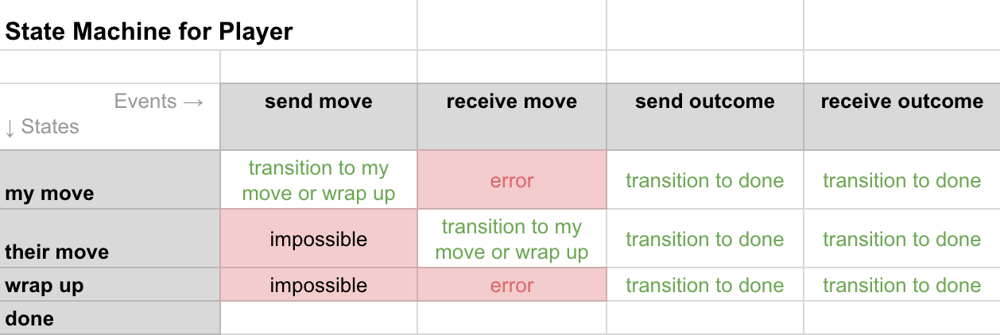

- Name: tictactoe-protocol
- Authors: Daniel Hardman <daniel.hardman@gmail.com>
- Start Date: 2018-12-11
- PR:

# Tic-Tac-Toe Protocol
[summary]: #summary

Describes a simple protocol, already familiar to most
developers, as a way to demonstrate how all protocols should
be documented.

    Note: Read the document below as a prototype and a good example
    of how to go about documenting a protocol in a HIPE. The format
    doesn't have to be slavishly followed, but considering the issues
    covered in this example should be helpful.

# Motivation
[motivation]: #motivation

Playing tic-tac-toe is a good way to test whether agents are
working properly, since it requires two parties to take turns
and to communicate reliably about state. However, it is also
pretty simple, and it has a low bar for trust (it's not dangerous
to play tic-tac-toe with a malicious stranger). Thus, we expect
agent tic-tac-toe to be a good way to test basic plumbing and to
identify functional gaps. The game also provides a way of testing
interactions with the human owners of agents, or of hooking up
an agent AI.

# Tutorial
[tutorial]: #tutorial

[Tic-tac-toe is a simple game](https://en.wikipedia.org/wiki/Tic-tac-toe)
where players take turns placing Xs and Os in a 3x3 grid, attempting to
capture 3 cells of the grid in a straight line.


### Interaction

A tic-tac-toe `game` is an interaction where 2 parties take turns to
make up to 9 moves. It starts when either party proposes the game, and
ends when one of the parties wins, or when all all cells in the grid
are occupied but nobody has won (a draw).

Illegal moves and moving out of turn are errors that trigger a complaint
from the other player. However, they do not scuttle the interaction.
A game can also be abandoned in an unfinished state by either player,
for any reason. Games can last any amount of time.

    About the INTERACTION section: Here we describe the flow at a very
    high level. We identify preconditions, ways the protocol can start
    and end, and what can go wrong. We also talk about timing
    constraints and other assumptions.

### Roles

There are two parties in a tic-tac-toe game. One of them becomes
`player_x` for the duration of the protocol; the other is `player_o`.
These names correspond to the marks they place. There are no special
requirements about who can be a player. The parties do not need to be
trusted or even known to one another, either at the outset or as the
game proceeds. No prior setup is required, other than an ability to
communicate.

    About the ROLES section: Here we name the roles in the protocol,
    say who and how many can play each role, and describe constraints.
    We also explore the issue of trust among the roles.

### Messages

All messages in this protocol are part of the "Tic Tac Toe 1.0" message
family uniquely identified by this DID reference:

    did:sov:BzCbsNYhMrjHiqZDTUASHg;spec/tictactoe/1.0

The protocol begins when one party sends a `move` message
to the other. It looks like this:

```JSON
{
  "@type": "did:sov:BzCbsNYhMrjHiqZDTUASHg;spec/tictactoe/1.0/move",
  "@id": "518be002-de8e-456e-b3d5-8fe472477a86",
  "ill_be": "X",
  "moves": ["X:B2"],
  "comment_ltxt": "Let's play tic-tac-to. I'll be X. I pick cell B2."
}
```

`@id` is required here, as it establishes a [message thread](https://github.com/hyperledger/indy-hipe/pull/30)
that will govern the rest of the game.

`ill_be` ("I'll be") tells which mark (X or O) the sender is placing.
It is required.

`moves` is optional in the first message of the interaction. If missing
or empty, the sender of the first message is inviting the recipient to
make the first move. If it contains a move, the sender is moving first.

Moves are strings like "X:B2" that match the regular expression `(?i)[XO]:[A-C][1-3]`.
They identify a mark to be placed ("X" or "O") and a position in the 3x3
grid. The grid's columns and rows are numbered like familiar spreadsheets,
with columns A, B, and C, and rows 1, 2, and 3.

`comment_ltxt` is optional and probably not used much, but could be a way
for players to razz one another or chat as they play. It follows the
conventions of [localized messages](
https://github.com/hyperledger/indy-hipe/pull/64)

Other decorators could be placed on tic-tac-toe messages, such as those
to enable [message timing](https://github.com/hyperledger/indy-hipe/blob/2167762c31dec10777a36d14c5038130b1a06670/text/message-timing/README.md#decorators)
to force players to make a move within a certain period of time.

Once the initial `move` message has been sent, game play continues
by each player taking turns sending responses, which are also `move`
messages. With each new message the `move` array inside the message
grows by one, ensuring that the players agree on the current accumulated
state of the game. The `ill_be` field is not required after the initial
message, but if present, it must accurately reflect the role of the
message sender, and would thus alternate values between `X` and `O`.

Subsequent messages in the game use the [message threading](
https://github.com/hyperledger/indy-hipe/pull/30) mechanism where the
`@id` of the first `move` becomes the `@thread.thid` for the duration
of the game.

An evolving sequence of `move` messages might thus look like this,
suppressing all fields except what's required:

##### Message/Move 2

```JSON
{
  "@type": "did:sov:BzCbsNYhMrjHiqZDTUASHg;spec/tictactoe/1.0/move",
  "@thread": { "thid": "518be002-de8e-456e-b3d5-8fe472477a86", "seqnum": 0 },
  "moves": ["X:B2", "O:A1"]
}
```

This is the first message in the thread that's sent by `player_o'; hence
it has `seqnum` = 0.

##### Message/Move 3

```JSON
{
  "@type": "did:sov:BzCbsNYhMrjHiqZDTUASHg;spec/tictactoe/1.0/move",
  "@thread": { "thid": "518be002-de8e-456e-b3d5-8fe472477a86", "seqnum": 1 },
  "moves": ["X:B2", "O:A1", "X:A2"]
}
```

This is the second message in the thread by `player_x`.

##### Message/Move 4
```JSON
{
  "@type": "did:sov:BzCbsNYhMrjHiqZDTUASHg;spec/tictactoe/1.0/move",
  "@thread": { "thid": "518be002-de8e-456e-b3d5-8fe472477a86", "seqnum": 1 },
  "moves": ["X:B2", "O:A1", "X:A2", "O:B1"]
}
```

...and so forth.

Note that the order of the items in the `moves` array is NOT significant.
The state of the game at any given point of time is fully captured by
the moves, regardless of the order in which they were made.

If a player makes an illegal move or another error occurs, the other
player can complain using a [problem-report](
https://github.com/hyperledger/indy-hipe/blob/6a5e4fe2d7e14953cd8e3aed07d886176332e696/text/error-handling/README.md#the-problem-report-message-type)
message, with `explain_l10n.code` set to one of the following values:

* `not-your-turn`: Offending player took a turn when the other player
   expected to do so instead.
* `already-occupied`: Player's move places a marker in a place
   where a marker already exists.
* `bad-move`: Player has made a move that makes no sense no matter what
  game state applies. For example, attempting to place a mark on row
  7 or column X.
* `move-timed-out`: Player didn't move in time. (Note that this `problem-report`
  could be sent in response to a move that arrives to slowly--but could
  also be sent proactively, when no move message arrives at all.)

Game play ends when one player sends a `move` message that manages to
mark 3 cells in a row. Thereupon, it is best practice, but not strictly
required, for the other player to send an acknowledgement in the form
of an `outcome` message.

```JSON
{
  "@type": "did:sov:BzCbsNYhMrjHiqZDTUASHg;spec/tictactoe/1.0/outcome",
  "@thread": { "thid": "518be002-de8e-456e-b3d5-8fe472477a86", "seqnum": 3 },
  "winner": "X",
  "comment_ltxt": "You won!"
}
```

The `moves` and `ill_be` fields from a `move` message can also, optionally,
be included to further document state. The `winner` field is required.
Its value may be "X", "O", or--in the case of a draw--"none".

This `outcome` message can also be used to document an abandoned game,
in which case `winner` is `null`, and `comment_ltxt` can be used to
explain why (e.g., timeout, loss of interest).

    About the MESSAGES section: Here we explain the message types, but
    also which roles send which messages, what sequencing rules apply,
    and how errors may occur during the flow. The message begins with
    an announcement of the identifier and version of the message
    family, and also enumerates error codes to be used with problem
    reports.

### States

The states of each player in the protocol evolve according to the
following state machine:



When a player is in the `my move` state, possible valid events include
`send move` (the normal case), `send outcome` (if the player decides
to abandon the game), and `receive outcome` (if the other player
decides to abandon). A `receive move` event could conceivably occur, too--
but it would be an error on the part of the other player, and would
trigger a `problem-report` message as described above, leaving the
state unchanged.

In the `receive move` state, `send move` is an impossible event for a
properly behaving player. All 3 of the other events could occur, causing
a state transition.

In the `wrap up` state, the game is over, but communication with the
outcome message has not yet occurred. The logical flow is `send outcome`,
whereupon the player transitions to the `done` state.

    About the STATES section: Here we explain which states exist for
    each participant. We also enumerate the events that can occur,
    including errors, and what should happen to state as a result.
    In this particular protocol, we only have one state--but in many
    protocols, different participants may have different state machines.
    This section has been neglected in many early efforts at protocol
    definition, and its omission is a big miss. Analyzing all possible
    states and events for all participants leads to robustness; skipping
    the analysis leads to fragility.

### Trust and Constraints

Players do not have to trust one another. Messages do not have to be
authcrypted, although anoncrypted messages still have to have a
path back to the sender to be useful.

    About the TRUST AND CONSTRAINTS section: Many protocols have rules
    or mechanisms that help parties build trust. For example, in buying
    a house, the protocol includes such things as commission paid to
    realtors to guarantee their incentives, title insurance, earnest
    money, and a phase of the process where a home inspection takes
    place. If you are documenting a protocol that has attributes like
    these, explain them here.

# Reference

A reference implementation of the logic of a game is provided with this
HIPE as python 3.x code. See game.py. There is also a simple hand-coded
AI that can play the game when plugged into an agent, and a set of
unit tests that prove correctness.

    About the REFERENCE section: If the MESSAGES section suppresses
    details, here is where to exhaustively describe each field. This
    is also the place for multiple examples.
