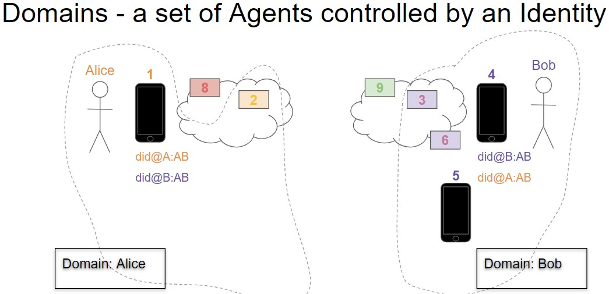

- Name: transport-layer-messaging
- Author: Stephen Curran (swcurran@gmail.com)
- Start Date: 2018-07-09
- PR: 
- Jira Issue: 

# Summary
[summary]: #summary

There are (at least) two layers of messages that combine to enable self-sovereign identity Agent-to-Agent communications. At the highest level (that we are considering) are Application messages - messages sent between Identities to accomplish some shared goal. For example, establishing a connection between identities, issuing a Verifiable Credential from an Issuer to a Holder or even the simple delivery of a text Instant Message from one person to another.

Application Layer Messages are delivered via the second, lower layer of messaging - Transport. Transport messages are wrappers (envelopes) around Application Layer messages that are used to route an encrypted version of the App message through an arbitrarily complex web of Agents from the Sender to the Receiver for processing.

This HIPE focuses on Transport Layer Messaging - routing messages. The goal is to define the rules that domains must adhere to enable to have Application Layer messages delivered from a Sending Agent to a Receiver Agent in a secure and privacy-preserving manner.

# Motivation
[motivation]: #motivation

The purpose of this HIPE is to define the Transport Layer Messaging such that we can ignore the transport of messages as we discuss the much richer Application Layer Messaging types and interactions. That is, we can assume that there is no need to include in an Application Layer message anything about how to route the message to the Receiver - it just magically happens. Alice (via her App Agent) sends a message to Bob, and (because of implementations based on this HIPE) we can ignore how the actual message got to Bob's App Agent.

Put another way - this HIPE is about envelopes. It defines a way to put a message - any message - into an envelope, put it into an outbound mailbox and have it magically appear in the Receiver's inbound mailbox in a secure and privacy-preserving manner. Once we have that, we can focus on letters and not how letters are sent.

Most importantly for Agent to Agent interoperability, this HIPE clearly defines the assumptions necessary to deliver a message from one domain to another - e.g. what exactly does Alice have to know about Bob's domain to send Bob a message? Fewer constraints are put on messages moving within a domain, allowing for more elaborate capabilities that are implementation specific - and yet still interoperable.

# Tutorial
[tutorial]: #tutorial

## Core Messaging Goals

These are vital design goals for this HIPE:

1. **Sender Encapsulation**: We must minimize what the receiver has to know about the routing tree or agent infrastructure of the sender in order for them to communicate.
2. **Receiver Encapsulation**: We must minimize what the sender has to know about the routing tree or agent infrastructure of the receiver in order for them to communicate.
3. **Independent Keys**: Private signing keys should not be shared between agents; each agent should be separately identifiable for accounting and authorization/revocation purposes.
4. ~~**Granular privileges for agents**: It must be possible for an identity owner to assign different privileges to the various agents that work on his/her behalf. Without this feature, an agent can impersonate its owner because all entities within an sovereign domain are indistinguishable. Note that this goal follows naturally from #3, and creates a tension with goals 1 and 2.~~
5. ~~**Decentralization**: We should avoid having a single agent hold all the keys or data. The loss of any one agent should be recoverable by the other agents (assuming the identity has multiple agents).~~
6. **Extensibility**: New types of messages can be added without changing the protocol defined here.
7. **Internet Transport independence**: The same rules should apply, and the same guarantees should obtain, no matter what internet transport is used to move messages - e.g. HTTPS, ZeroMQ, etc.
8. ~~**Repudiability**: It must be possible to [communicate off the record](https://github.com/sovrin-foundation/protocol/blob/master/janus/repudiation.md); Alice can talk to Bob, and Bob can know it is Alice, without Alice worrying that Bob can turn around and prove Alice's communications to an uninvolved party.~~

Editor's Note: I struck out some of the goals as not (IMHO) being relevant to this particular HIPE. They may be relevant to the broader Agent Messaging Protocol topic, but not at the level we are trying to define here. On the other hand, I left them in the document for now as I may be wrong.

## Assumptions

The following are assumptions upon which this HIPE is based, with (as necessary) the rationale behind each assumption.

### Terminology in this HIPE

The following terms are used in this HIPE with the following meanings:

- Domain - a set of Agents collaborating on behalf of an Identity
  - It's assumed that the Agents of a domain were developed by a single vendor and so know more about each other than about Agents in another domain.
  - An example of two Domains is provided in the image below.
- App Agent - any Agent that receives and processes App Layer Messages
  - Could be a device, software in the cloud, part of an enterprise, etc.
  - An App Agent could also perform other roles within a Domain - e.g. a Routing Agent
  - ***ASIDE**: We may want a use a different term for this.*
- Sender - the App Agent sending the Application Layer Message
- Receiver - the App Agent receiving the Application Layer Message
  - The message may pass through many Agents between the Sender and Receiver
- Routing Agents:
  - Any agent involved in the routing of App Layer Messages from Sender to Receiver, including:
    - Domain Endpoint - shared physical endpoint for messages into domains
      - Shared by many identities (e.g. https://endpoint.agentsRus.com)
    - Agency - the handler for messages sent to the Domain Endpoint.
      - E.g. the "domain endpoint" is passive,  "agency" is active.
    - Cloud Routing Agent - identity-controlled entry point for a domain
- Messaging Layers
  - App Layer - end-to-end messaging from the message creator to its consumer
  - Routing - end-to-end delivery - the “Forward” message (others?) with encrypted payload
  - Wire - direct from one Agent to another - the “Send” and “EncryptSend” messages
  - DID - reference to the literal DID text
    - e.g. did:sov:1234abcd
  - DID#key - reference to the DID with "#" and an identified key from the DIDDoc appended
    - e.g. did:sov:1234abcd#domain
    - NOTE: The #key is NOT the actual Public Key - it's a reference to an entry in the DIDDoc that contains the Public Key.

#### DIDDocs

The term "DIDDoc" is used in this HIPE to indicate:

- a collection of public keys and endpoints,
- controlled by an identity,
- associated with a DID, and
- used for a relationship.

A DID can be resolved to get its corresponding DIDDoc by any Agent that needs access to the DIDDoc contents. This is true whether we are talking about DIDs on the public ledger, or DIDs persisted to a microledger. In the case of a microledger, it's the (implementation specific) domain's responsibility to ensure such resolution is possible for all Agents that need it.

### Messages are Private

App Level Messages sent from one Agent to another are required to be private. That is, the Agent will encrypt the message with a public key for the Receiver. At most, any agent in between the Sender and Receiver will know only to whom the message is intended (by DID and possibly key within the DID), not anything about the message.

### The Sender Knows The Receiver

This HIPE assumes that the App Layer Message Sending Agent knows the Receiver's DID and, within the DIDDoc for that DID, the key to use for the Receiver's Agent.

How the Sending Agent knows the DID and key to send the message is not defined within this HIPE - that is an App Messaging Layer concern.

The DID may be a public or pairwise DID, and may be on a Public Ledger or a microledger.

## Example: Domain and DIDDoc

The following is an example of an arbitrary pair of domains that will be helpful in defining the requirements in this HIPE.



In the diagram above:

- Alice has
  - 1 App Agent - "1"
  - 1 Cloud Routing Agent - "2"
  - 1 Domain Endpoint - "8"
- Bob has
  - 3 App Agents - "4", "5" and "6"
    - "6" is an App Agent in the cloud, "4" and "5" are physical devices.
  - 1 Cloud Routing Agent - "3"
  - 1 Domain Endpoint

#### Bob's DID for his Relationship with Alice

Bob’s domain has 3 devices he uses for processing messages - two phones (4 and 5) and a cloud-based agent (6). However, in Bob's relationship with Alice, he ONLY uses one phone (4) and the cloud-based agent. Thus the key for device 5 is left out of the DIDDoc (see below).

Note that the keys for 9 (Domain Endpoint) is called "domain" and 3 (Cloud Routing Agent) is called "routing". Those are proposed conventions to allow the Sender's agents to know the Public Keys for those Agents.

> I'm investigating other, better conventions for knowing the domain and routing related data.

```json
{
  "@context": "https://w3id.org/did/v1",
  "id": "did:sov:1234abcd",
  "publicKey": [
    {"id": "did:sov:1234abcd#domain", "type": "RsaVerificationKey2018",  "owner": "did:sov:1234abcd","publicKeyPem": "-----BEGIN PUBLIC B…”}",
    {"id": "did:sov:1234abcd#routing", "type": "RsaVerificationKey2018",  "owner": "did:sov:1234abcd","publicKeyPem": "-----BEGIN PUBLIC X…”}",
    {"id": "did:sov:1234abcd#4", "type": "RsaVerificationKey2018",  "owner": "did:sov:1234abcd","publicKeyPem": "-----BEGIN PUBLIC 9…”}",
    {"id": "did:sov:1234abcd#6", "type": "RsaVerificationKey2018",  "owner": "did:sov:1234abcd","publicKeyPem": "-----BEGIN PUBLIC A…”}
  ],
  "authentication": [
    {"type": "RsaSignatureAuthentication2018", "publicKey": "did:sov:1234abcd#4"}
  ],
  "service": [
    {"type": "Agency", "serviceEndpoint": "https://example.com/endpoint/8377464" }
    // or "serviceEndpoint": "did:sov:fghi8377464" and remove key #domain (above)
  ]
}
```

## Just Enough Domain Knowledge

The key goal for interoperability is that we want other domains to know just enough about the configuration of a domain to which they are delivering a message. The following walks through those minimum requirements.

### Required: The DID and DIDDoc

As noted in the assumptions, the Sender has the DID of the Receiver, and knows the key from the DIDDoc to use for the Receiver.

> Example: Alice wants to send a message from her phone (1) to Bob's phone (4). She has Bob's B:did@A:B, the DID/DIDDoc Bob created and gave to Alice to use for their relationship. Alice created A:did@A:B and gave that to Bob, but we don't need to use that in this example. The contents of the DIDDoc for B:did@A:B is presented above.

### Required: End-to-End encryption of the App Layer Message

The App Layer Message must be completely hidden from all Agents other than the Receiver. Thus, it must be encrypted with the Public Key of the Receiver. Based on our assumptions, the Sender can get the Public Key of the Receiver because they know the DID#key string, can resolve the DID to the DIDDoc and find the public key associated with DID#key. In our example above, that is the key associated with "did:sov:1234abcd#4".

To route the message to the Receiver, the Sender sends a "Forward" message with the "To" address being the DID#key of the Receiver.

```json
{
  "type": "Forward"
  "to" : "B:did@A:B#key"
  "msg" : "<Encrypt(B:did@A:B#key, AppLayerMessage)>"
}
```

> NOTE: The particular encryption method and encoding will be discussed later in this HIPE.

### Required: Minimize Receiver information available to Agents

We want to minimize the knowledge about the Receiver of the App Layer message for minimally trusted agents. In this case, "minimally trusted" are all agents except the designated "Cloud Routing Agent" for the Receiver. The "Cloud Routing Agent" must know the exact destination (B:did@A:B#key) of the Receiver, but Agents handling the message prior to the Cloud Routing Agent do not - they just need the B:did@A:B of the Receiver.

> Question: Is it necessary to hide the #key part of the "To" address from intervening Agents?  It adds the complexity outlined in this section.

To mask the extra "#key" information from the minimally trusted agents, the Sender wraps the "Forward" message in a second forward message, this time for the Cloud Routing Agent of the Receiver (3 in our example). The Sender must be able to get the public key of the Cloud Routing Agent from the DIDDoc. The Sender does not need to know the endpoint of that Agent as it will not send the message directly to that Agent.

The sender prepares the following message:

```json
{
  "type": "Forward"
  "to" : "B:did@A:B"
  "msg" : "<Encrypt(B:did@A:B#routing, ForwardMessage)>"
}
```

The Sender can now send the message on its way. In our example, it sends the message to 2, who in turn sends it to 8. That of course, is arbitrary - the sender could have any configuration of Agents.

> Aside: Whether the Sender encrypts the messages to send them between Agents within the domain is implementation specific. Depending on the setup of the Domain, messages might be internally routed within a single application, sent across an internal network, or sent over the Internet between data centres. The need for re-encrypting the message for each hop will depend on the relative location of the two Agents.

### Required: Cross Domain Encryption

While within a domain the Agents may choose to use encryption or not when sending the message from Agent to Agent, encryption **must** be used when sending a message into the Receiver's domain. The Agent sending that message must:

- Resolve the "To" DID, and find the endpoint and endpoint public key for the Domain Endpoint
- Encrypt the "Forward" message it received using the public key.
- Send only the encrypted/encoded text - no other data.

Once the Domain Endpoint (Agency) receives the encrypted/encoded text, it decrypts and based on the "To" field value (the DID), sends the message to the Agent to handle that DID. How the Domain Endpoint knows where to send the message is implementation specific - likely some sort of DID-to-Agent routing table. Typically the message will be sent directly to the Cloud Routing Agent, although it doesn't have to be. The message must eventually get to the Cloud Routing Agent (3 in our example).

### Required: The Cloud Routing Agent Decrypts the Outer Forward

When the Cloud Routing Agent (eventually) receives the message, it decrypts the outer wrapper that was added by the Sender to reveal the inner "Forward" message, this time with the full "DID#key" necessary to route the message to the intended Receiver agent. The Cloud Routing Agent uses its (implementation specific) knowledge to map from the DID#key to the Receiver agent, possibly via intermediary agents.

### Required: The Receiver App Agent Decrypts/Processes the App Layer Message

When the intended Receiver App Agent receives the message, it decrypts the payload and processes the message.

### Exposed Data

The following summarizes the information needed by the sender's agents:

- The DID to use for the relationship, and it's related DIDDoc
- Within the DIDDoc:
  - The Domain Endpoint's physical endpoint and public key, including how to identify that key within the DIDDoc
  - The Routing Cloud Agent's public key, including how to identify that key within the DIDDoc
  - The Receiver of the Application Layer Message's public key

Thus, every Messaging DIDDoc is assumed to have at least one endpoint and 3 keys:

- The endpoint for the Domain Endpoint
- The public key for the Domain Endpoint
- The public key for the Cloud Routing Agent
- The public key for the Message Receiver App Agent

The DIDDoc will have an additional key for each additional App Layer Message Receiver.

#### Degenerate Cases

The sequence above requires there are at least three Agents within every domain, and there could be many more. However, what if there are only 2 or even 1 Agent in a domain?

The HIPE requirement in those degenerate cases is that the DIDDoc still contain the same data (one endpoint, three public keys), and the domain implementation handles "Agents with multiple roles" use case. The DIDDoc could reuse the same key for different purposes, or could have an Agent with different keys for different purposes to mask the simplified Agent structure.

### Data Not Exposed

Given the sequence specified above, following data is **NOT** exposed to the sender's agents:

- Routing-only Agents within the receiver's domain
- App Agents the receiver has that it chooses not to include in the DIDDoc
- The physical endpoints of Agents within the receiver's domain (other than the Domain Endpoint)
  - The physical endpoints and, as required, associated public keys, are shared as needed within the receiver's domain.

## Using a DID as the Domain Endpoint Endpoint

Recall that a DID used for App Layer Messaging must have accessible through it's DIDDoc the endpoint address and public key for the Domain Endpoint. A recommended best practice is that rather than putting both of those pieces of information into the DIDDoc, the Agency provide the users of the Agency (identities) with a publicly resolvable DID for the shared Domain Endpoint that the Agency controls.

That approach allows the Agency to rotate the keys for the endpoint as necessary without requiring updates be made to the DIDDocs created by the Agency users. If the DIDDocs of every Agency user contain the actual endpoint and public key of the Domain Endpoint, every DIDDoc created in the Agency would have to be updated when the Domain Endpoint public key is rotated (or the endpoint is changed). 

By referencing a DID as the endpoint, the DIDDocs of DIDs owned by users of the Agency would only need to be updated when changing the Domain Endpoint for a relationship - such as when changing Agencies. Such events are likely to be far rarer than rotating the key of the Domain Endpoint.

This best practice **requires** that Agents know that when an endpoint in a DIDDoc is a DID, they **must** resolve that DID to retrieve the actual endpoint and public key.

## Encryption Primitives - AnonCrypt/AuthCrypt or JWE et. al.

This HIPE deliberately does not go into the choice of what encryption and encoding primitives should be available from Indy-SDK. Those issues are addressed in another HIPE. This HIPE assumes there will be encryption primitives provided and that those primitives will be used.

However, even with that assumptions, there are three concepts to be discussed within this HIPE about the primitives.

### Anon vs. Auth Encrypting

Anon encryption uses only the Public Key of the recipient, and the recipient does not know who sent the message.  Auth encryption uses the Public Keys of the sender and receiver to both encrypt and sign the message. This HIPE proposes the following rules:

- During routing (when a message is going directly from one agent directly to another) if encryption is needed, always use Anon encryption.
  - For example, when a message is sent from one domain to the Domain Endpoint of another domain, use Anon encryption.
- When sending to a Public DID, where the Receiver does not know the Sender, use Anon encryption.
- For end-to-end encryption of App Layer Messages, if both sides know one another's Public Key, use Auth encryption, otherwise use Anon encryption.

> **ASIDE: Auth encryption cannot be used unless a "From" : "DID#key" is included in the Forward message. Without that, the Receiver will only know the "DID" of the sender, but not the "DID#key" of the sending Agent. This detail needs to be resolved.**

### Encoding

It is assumed that the Encryption primitives will embed or include encoding of the messages such that the encrypted messages are text ready for delivery.

### Which Encryption Method?

To be determined in a separate HIPE is the exact primitives to be used for encryption and encoding - the current Indy-SDK schemes of AnonCrypt, AuthCrypt and base64 encoding or other standard methods - JWE, JWM, etc.

## Network Protocol

The lower level network protocol (https, zmq, etc.) used for sending message must be known, presumably by the protocol implied by the Agent endpoints. Still needed in this HIPE (or perhaps a separate HIPE) is how an essentially anonymous blob of text is to be delivered for each supported protocol.

### Response

The following are the possible responses to the message:

- OK
- Invalid Message
  - The message could not be decrypted
- Not Found
  - The message could not be processed.

#### Response Issues

Should the message response be synchronous or asynchronous?  If the wire protocol fails, how is that failure passed back to those involved in the transmission?

If it is an asynchronous response, the message format must add a nonce and callback address, which seems onerous. If synchronous and the message decryption and determination if the message can be processed will take too long for a synchronous response, perhaps just an OK/Error response is acceptable based on the receipt of the wire message.

If the wire protocol fails, notifying the Application Layer message sender might be needed.

A reason for using a synchronous response to at least checking the ability to decrypt the message is cache handling. Agents might cache DID information for performance (fewer trips to the ledger) and so messages might be invalid due to undetected key rotations. If the "Invalid Message" response was synchronously returned to the Sender, the Sender could resolve the TDID it was using and retry without breaking the higher level protocol.

#### Transport Message: Multiplex

A possible second type of transport message is a Multiplex, where the Sender sends the message to multiple Receivers identified within a DID. There is a lot of complexity with that on all sorts of levels, and so a Multiplex mechanism will be deferred for now. A later Pull Request might update this HIPE with the details.

Worst case, the Sender could send out multiple versions of an Application Layer Message using a Forward message to each intended Receiver.

### Application Layer Error Handling

If the Transport Messages fail at any point, there is no way as specified to notify the original Sender. None of the Agents involved in the Transport know who sent the message, only who is supposed to receive it. To notify the Sender of an error, a ID for the Sender is needed - perhaps a resolvable DID or some other ephemeral ID that would work across domains.  Without that, only a timeout is possible for a User to be informed of a Transport-level error.

**Question**: Should this HIPE include this level of error notification?

# Reference
[reference]: #reference

The current summary of AuthCrypt and AnonCrypt are documented [here](https://github.com/hyperledger/indy-hipe/pull/9) - see May 29th comment from vimmerru.

# Drawbacks
[drawbacks]: #drawbacks

* The assumptions need to be reviewed to see if they are too onerous. The intention is that the assumptions are implementation specific - as long as they are met, the mechanisms will work. However, a reference implementation description of how to meet the assumptions is likely necessary.
* **Others to be added as we discuss this HIPE.**

# Rationale and alternatives
[alternatives]: #alternatives

**These will be added to the HIPE as discussions occur about it.**

# Prior art
[prior-art]: #prior-art

**This will be added to the HIPE as discussions occur about it.**

Discuss prior art, both the good and the bad, in relation to this proposal.
A few examples of what this can include are:

- Does this feature exist in other SSI ecosystems and what experience have
their community had?
- For other teams: What lessons can we learn from other attempts?
- Papers: Are there any published papers or great posts that discuss this?
If you have some relevant papers to refer to, this can serve as a more detailed
theoretical background.

This section is intended to encourage you as an author to think about the
lessons from other implementers, provide readers of your proposal with a
fuller picture. If there is no prior art, that is fine - your ideas are
interesting to us whether they are brand new or if they are an adaptation
from other communities.

Note that while precedent set by other communities is some motivation, it
does not on its own motivate an enhancement proposal here. Please also take
into consideration that Indy sometimes intentionally diverges from common
identity features.

# Unresolved questions
[unresolved]: #unresolved-questions

**These will be added to the HIPE as discussions occur about it.**

- What parts of the design do you expect to resolve through the
enhancement proposal process before this gets merged?
- What parts of the design do you expect to resolve through the
implementation of this feature before stabilization?
- What related issues do you consider out of scope for this 
proposal that could be addressed in the future independently of the
solution that comes out of this doc?
