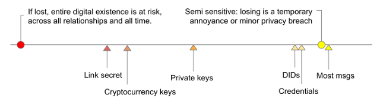
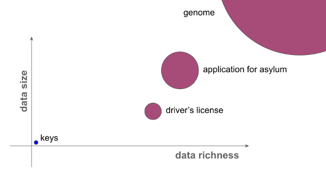
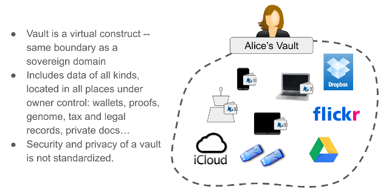
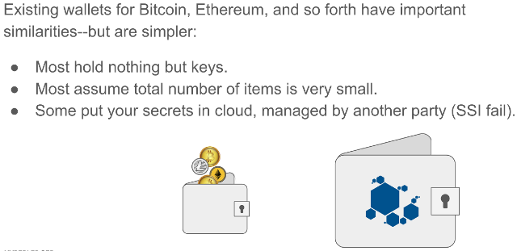
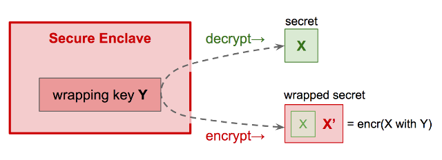

- Name: wallets
- Author: Daniel Hardman, Darko Kulic, Vyacheslav Gudkov
- Start Date: 2018-05-22
- PR: (leave this empty)
- Jira Issue: (leave this empty)

# Summary
[summary]: #summary

Specify the external interfaces of identity wallets in the Indy ecosystem, as well
as some background concepts, theory, tradeoffs, and internal implementation guidelines.


# Motivation
[motivation]: #motivation

Wallets are a familiar component metaphor that SSI has adopted from the world of
cryptocurrencies. The translation isn't perfect, though; crypto wallets have only a
subset of the features that an identity wallet needs. This causes problems, as
coders may approach wallets in Indy with assumptions that are more narrow than
our actual design target.

Since wallets are a major vector for hacking and cybersecurity issues, casual or
fuzzy wallet requirements are a recipe for frustration or disaster. Divergent
and substandard implementations could undermine security more broadly. This
argues for as much design guidance as possible. 

Wallets are also a unit of identity portability--if an identity owner doesn't
like how her software is working, she should be able to exercise her self-
sovereignty by taking the contents of her wallet to a new service. This implies
that wallets need certain types of interoperability in the ecosystem, if they
are to avoid vendor lock-in.

All of these reasons--to clarify design scope, to provide uniform high security, and
to guarantee interop--suggest that we need a formal HIIP to document wallet
architecture. 

# Tutorial
[tutorial]: #tutorial

### What Is an Identity Wallet?

Informally, an __identity wallet__ (not just "wallet") is a digital container
for data that's needed _to control a self-sovereign identity_. We borrow this
metaphor from physical wallets:


Notice that we do not carry around in a physical wallet every document, key, card,
photo, piece of currency, or credential that we possess. A wallet is a mechanism
of _convenient control_, not an exhaustive repository. A wallet is _portable_.
A wallet is _worth safeguarding_. Good wallets are _organized so we can find
things easily_. A wallet has a _physical location_.

What does suggest about _identity wallets_?

### Types of Sovereign Data

Before we give a definitive answer to that question, let's take a detour for a
moment to consider digital data. Actors in a self-sovereign identity ecosystem
may own or control many different types of data:

* encryption and signing keys
* payment keys
* link secrets
* PII about themselves or others
* credentials
* personal documents (e.g., last year's tax filing, journal, love letters)
* digital breadcrumbs (e.g., purchase history)
* photos and videos
* receipts
* health records

...and much more. Different subsets of data may be worthy of different protection efforts:

 

The data can also show huge variety in its size and in its richness:



Because of the sensitivity difference, the size and richness difference, joint
ownership, and different needs for access in different circumstances, we may
store digital data in many different locations, with different backup regimes,
different levels of security, and different cost profiles.

### What An Identity Wallet is NOT

##### Not a Vault
This variety suggests that an __identity wallet__ as a loose grab-bag of all our
digital "stuff" will give us a poor design. We won't be able to make good
tradeoffs that satisfy everybody; some will want rigorous, optimized search;
others will want to minimize storage footprint; others will be concerned about
maximizing security.

We reserve the term __vault__ to refer to this complex collection of all an
identity owner's data:



Note that a vault can _contain_ an identity wallet. A vault is an important
construct, and we may want to formalize its interface. But that is not the
subject of this spec.

##### Not A Cryptocurrency Wallet

The cryptocurrency community has popularized the term "wallet"--and because
identity wallets share both high-tech crypto and a need to store secrets with
crypto wallets, it is tempting to equate these two concepts. However, an
identity wallet can hold more than just cryptocurrency keys, just as a physical
wallet can hold more than paper currency. Also, identity wallets may need to
manage hundreds of millions of relationships (in the case of large organizations),
whereas most crypto wallets manage a small number of keys:



##### Not a GUI

As used in this spec, an identity wallet is not a visible application, but
rather a data store. Although user interfaces (superb ones!) can and should
be layered on top of wallets, the wallet itself consists of a container and
its data; its friendly face is a separate construct. We may casually refer
to an application as a "wallet", but what we really mean is that the
application provides an interface to the underlying wallet.

### Personas

### One Owner, Multiple Wallets

An identity owner (person, org) controls a sovereign domain--typically including
multiple devices. Each device (agent) has its own wallet--so there will be
multiple wallets in most domains. These wallets will not hold identical things,
since most keys are agent-specific.

This is not to say that the user experience of an individual or institution
with multiple wallets must expose such complexity. Alice may think of herself
as having only one wallet, and all details about replication or different wallet
content on different devices may be hidden from her. This would create a _virtual
wallet_ construct, perhaps. But underneath, different
identity wallets exist on each device; the wallet interface defined here
has a _location_.


### Requirements
* Scaling
* Performance
* Query
* Backup and Recovery
* Extensibility

### Managing Secrets

Certain sensitive things require special handling. We would never expect to casually
lay an _ebola zaire_ sample on the counter in our bio lab; rather, it must never
leave a special controlled isolation chamber.


Cybersecurity in wallets can be greatly enhanced if we take a similar tack with
high-value secrets. We prefer to generate such secrets in their final resting place,
possibly using a seed if we need determinism. We only use such secrets in their safe
place, instead of passing them out to untrusted parties.

TPMs, HSMs, and so forth follow these rules. Indy’s current wallet interface does,
too. You can’t get private keys out.

### Wallet Encryption

Encryption schema is the following:


### Tags

Explain searchability model -- what's possible, what's not. How
this is affected by encryption. Risks of unencrypted data. Conventions.
Data types.

### Wallet Query Language

API endpoints that allows listing of domain objects (for example Credentials) will support
tags-based filtering with a formal language called Wallet Query Language (WQL).

Formal definition of WQL language is the following:

```Rust
query = {subquery}
subquery = {subquery, ..., subquery} // means subquery AND ... AND subquery
subquery = $or: [{subquery},..., {subquery}] // means subquery OR ... OR subquery
subquery = $not: {subquery} // means NOT (subquery)
subquery = "tagName": tagValue // means tagName == tagValue
subquery = "tagName": {$neq: tagValue} // means tagName != tagValue
subquery = "tagName": {$gt: tagValue} // means tagName > tagValue
subquery = "tagName": {$gte: tagValue} // means tagName >= tagValue
subquery = "tagName": {$lt: tagValue} // means tagName < tagValue
subquery = "tagName": {$lte: tagValue} // means tagName <= tagValue
subquery = "tagName": {$like: tagValue} // means tagName LIKE tagValue
subquery = "tagName": {$in: [tagValue, ..., tagValue]} // means tagName IN (tagValue, ..., tagValue)
```

Note that for encrypted tags only exact comparison will be supported. Also initially only sub-set of query
can be implemented and some details can be changed during implementation.

### Pluggable Storage

Although Indy infrastructure will provide the only one wallet implementation it will allow
to plug different storages for covering of different use cases. Default storage shipped
with libindy will be sqlite based and well suited for agents executed on edge-devices.
API endpoint ```register_wallet_storage``` will allow Indy Developers to register custom storage
implementation as set of handlers.

### Secure Enclaves

What is a secure enclave (TPM, HSM, TEE)? How do they work? How should wallets
use them? (Get content from Mike)
 
### Enclave Wrapping

Suppose I have a secret, X, that needs maximum protection. However, I can’t
store X in my secure enclave because I need to use it for operations that
the enclave can’t do for me; I need direct access. So how to I extend
enclave protections to encompass my secret?

I ask the secure enclave to generate a key, Y, that will be used to protect X.
Y is called a __wrapping key__. I give X to the secure enclave and ask that it be
encrypted with wrapping key Y. The enclave returns X’ (ciphertext of X, now
called a __wrapped secret__), which I can leave on disk with confidence; it
cannot be decrypted to X without involving the secure enclave. Later, when
I want to decrypt, I give wrapped secret X’ to the secure enclave and ask it
to give me back X by decrypting with wrapping key Y.



You could ask whether this really increases security. If you can get into the
enclave, you can wrap or unwrap at will.

The answer is that an unwrapped secret is protected by only one thing--whatever
ACLs exist on the filesystem or storage where it resides. A wrapped secret is
protected by two things--the ACLs and the enclave. OS access may breach either
one, but pulling a hard drive out of a device will not breach the enclave.

### Paper Wallets

### Backup and Recovery

### Relationship to Microledgers

# Reference
[reference]: #reference

- [Wallet Design](https://github.com/hyperledger/indy-sdk/tree/master/doc/design/003-wallet-storage)

# Drawbacks
[drawbacks]: #drawbacks

Why should we *not* do this?

# Rationale and alternatives
[alternatives]: #alternatives

- Why is this design the best in the space of possible designs?
- What other designs have been considered and what is the rationale for not choosing them?
- What is the impact of not doing this?

# Prior art
[prior-art]: #prior-art

Discuss prior art, both the good and the bad, in relation to this proposal.
A few examples of what this can include are:

- Does this feature exist in other SSI ecosystems and what experience have their community had?
- For other teams: What lessons can we learn from other attempts?
- Papers: Are there any published papers or great posts that discuss this? If you have some relevant papers to refer to, this can serve as a more detailed theoretical background.

This section is intended to encourage you as an author to think about the lessons from other 
implementers, provide readers of your RFC with a fuller picture.
If there is no prior art, that is fine - your ideas are interesting to us whether they are brand new or if it is an adaptation from other languages.

Note that while precedent set by other ecosystems is some motivation, it does not on its own motivate an RFC.
Please also take into consideration that Indy sometimes intentionally diverges from common identity features.

# Unresolved questions
[unresolved]: #unresolved-questions

- Multithreading libindy
- What parts of the design do you expect to resolve through the RFC process before this gets merged?
- What parts of the design do you expect to resolve through the implementation of this feature before stabilization?
- What related issues do you consider out of scope for this RFC that could be addressed in the future independently of the solution that comes out of this RFC?
